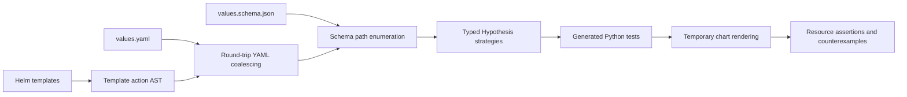

# Hypothesis


Hypothesis turns Helm chart schemas and template references into executable Python
property tests, which can then be validated against the control plane's API. 
It discovers undocumented values, generates inputs from their types
and constraints, and renders the chart to expose configuration failures and reduce
them to reproducible examples. Run the suite directly through Helm, with optional
manifest streaming for Kubernetes schema and security validation.

**Table of contents**

- [Hypothesis](#hypothesis)
  - [Install](#install)
  - [Quick Start](#quick-start)
  - [Architecture](#architecture)
    - [Worked example: `$.replicas` to validated Deployments](#worked-example-replicas-to-validated-deployments)
  - [Parallel execution](#parallel-execution)
    - [Runtime estimates](#runtime-estimates)
  - [Distributed sharding](#distributed-sharding)
  - [CI and GitHub Action](#ci-and-github-action)
    - [CircleCI inline orb](#circleci-inline-orb)
    - [GitLab CI job](#gitlab-ci-job)
  - [Repository map](#repository-map)
  - [Development](#development)
  - [Documentation](#documentation)
  - [License](#license)
  - [Benchmarking](#benchmarking)
  - [Progressive dry runs](#progressive-dry-runs)
  - [CLI reference](#cli-reference)

## Install

Requires Helm 3 and Python 3.13+. The plugin installs its Python dependencies,
including the test runner, automatically.

```sh
PYTHON=python3.13 helm plugin install https://github.com/astrivant/hypothesis-helm
```

To install from a local checkout:

```sh
PYTHON=python3.13 helm plugin install .
```

## Quick Start

Test a chart using its values schema and template references:

```sh
helm hypothesis test ./path/to/chart
```

Audit values, configure test generation, or rerun a saved suite:

```sh
helm hypothesis audit ./path/to/chart
helm hypothesis test ./path/to/chart --strict
helm hypothesis test ./path/to/chart --paths --max-examples 50 --seed 42
helm hypothesis test ./path/to/chart --permutations 2
helm hypothesis test ./path/to/chart --exhaustive-group ingress,service
helm hypothesis test ./path/to/chart --dry-run
helm hypothesis test ./path/to/chart --match replicas
helm hypothesis generate ./path/to/chart --output generated-tests
helm hypothesis run generated-tests
```

`test` automatically enumerates supported finite configuration spaces with fewer
than 10,000 candidate assignments when they fit the case budget. Larger finite spaces use
pairwise coverage plus affordable exhaustive groups inferred from constraints and
templates. Unbounded or unsupported schemas fall back to per-path properties with
a logged reason. `--paths` explicitly selects generated per-path testing.

The per-path workflow generates a Python property per values path, executes the suite
inside the plugin environment, and returns its exit status. Generated source, values,
schemas, JUnit results and a run report stay in `reports/hypothesis-helm` by default.
Use `--artifact-dir` to choose a different location. Tests default to `--jobs auto`,
which adjusts concurrency using PID throughput feedback. Set `--jobs N` for a fixed
worker count or `--jobs 1` to run serially.

Add `--output json` (or `-o json`) to `test` or `run` to stream rendered
manifests as JSON Lines, with progress and test reports on stderr. See
[streaming to Kubeconform and Kubesec](docs/usage.md#stream-rendered-manifests)
for a pipeline that validates each resource as it arrives.

`--strict` requires all schema-declared and template-referenced configurable fields
to exist in the original `values.yaml`, including optional fields and values with
template fallbacks. Missing fields fail preflight; coalesced defaults and cached
passes do not satisfy it. See [strict source values](docs/usage.md#strict-source-values).

Each generated suite includes Python tests, coalesced YAML, an inferred schema,
and a path/strategy inventory. Source charts remain unchanged. Inferred contracts
and unresolved template constructs need review; sampled tests do not prove
complete template branch coverage or totality.

Use `--permutations N` to cover every valid interaction among any `N` finite
schema factors: `2` covers pairs, `3` covers triples. Small spaces still receive
full enumeration; `--exhaustive-threshold 0` disables that promotion. Repeat
`--exhaustive-group ingress,service` to require selected groups. Logs and reports
show planned, completed and remaining iterations, timing estimates, and the count
change from the previous run in the same artifact directory. Finite runs test each
distinct normalized configuration once, including defaults; equivalent overrides
are deduplicated before rendering. Array order remains significant. This mode requires
enumerable domains (such as booleans,
enums and bounded integers) and refuses incomplete coverage when planning limits
are exceeded. See [interaction coverage](docs/usage.md#interaction-coverage)
for factor definitions, limits and reports.

## Architecture



### Worked example: `$.replicas` to validated Deployments

Start with [`examples/workload/values.yaml`](examples/workload/values.yaml):
`replicas: 1`. Its [schema](examples/workload/values.schema.json) declares an
integer between `0` and `5`, inclusive. The [template](examples/workload/templates/resource.yaml)
reads that lever directly:

```yaml
spec:
  replicas: {{ .Values.replicas }}
```

Discovery resolves `.Values.replicas` to `$.replicas`. Coalescing keeps the existing
value `1` and its documented constraints; nothing needs to be inferred for this
path. The integer bounds select `st.integers(min_value=0, max_value=5)`.

From this repository, with Helm, the plugin, Git, and
[kubeconform](https://github.com/yannh/kubeconform) installed, run:

```sh
mkdir -p reports
helm hypothesis test examples/workload \
  --match replicas --max-examples 6 --seed 0 --shard none --rerun all \
  --kubeconform --schema-version 1.35.0 \
  --schema-cache-dir .cache/hypothesis-helm/schemas \
  --artifact-dir reports/replicas --output json > reports/replicas.jsonl
```

The command prepares the cached Kubernetes schemas and writes
`reports/replicas/test_chart_values.py`. Its replica property contains the following
code (imports, fixture, and docstring omitted):

```python
@pytest.mark.hypothesis_helm_path(('replicas',))
@settings(max_examples=6, deadline=None, suppress_health_check=[HealthCheck.too_slow])
@given(value=st.integers(min_value=0, max_value=5), data=st.data())
def test_replicas_fc55c2d623(chart: Chart, value: object, data: DataObject) -> None:
    check_path(chart, ('replicas',), value, data, options=OPTIONS)
```

For a draw of `3`, `check_path` replaces `replicas` in a copy of the coalesced
values, leaving `image.repository: nginx` and `image.tag: stable`. It checks that
this complete input satisfies the values schema, then runs `helm template` against
a temporary chart. The resulting Deployment has `spec.replicas: 3` and image
`nginx:stable`. The resource is emitted as one JSON line and validated against the
cached Kubernetes 1.35.0 Deployment schema. A rendering or validation error fails
the property; Hypothesis then tries to reduce the failing input.

The amount of work is concrete:

| Stage | Work generated | Why |
| --- | --- | --- |
| Generate the suite | **4 Python property tests** | Paths are `$.replicas`, `$.image`, `$.image.repository`, and `$.image.tag`; object containers also receive a property. |
| Select tests | **1 property** | `--match replicas` filters execution after generation; it does not reduce the generated suite. |
| Execute this example | **6 successful inputs, 6 Helm renders, 6 kubeconform invocations** | The verified run exercised each integer from `0` through `5`, with a six-example budget and valid unchanged sibling values. |
| Produce results | **6 Deployment JSON lines; 1 passing JUnit test case** | This chart emits one Deployment per render. JUnit counts the property, not its individual Hypothesis examples. |

`--rerun all` makes the command execute even if the path passed previously. Six
renders is the observed successful result for this example, not a general promise
of `--max-examples 6`: rejected inputs, failure replay, and shrinking can change the
work. Removing `--match` runs all four properties, each with its own example budget;
it does not enumerate the `6 × 2 × 2 = 24` whole-chart configurations. Progress and
ETA count completed properties, so this selected run finishes at **1/1**, not **6/6**.

## Parallel execution

The unit of parallel work is a generated property for a values path. Each property
can render and validate its own inputs without depending on another property's
results, allowing the suite to execute properties concurrently.

1. **Collect and dispatch:** Pytest identifies the selected properties. A thread
   pool dispatches each queued property into a separate pytest process, isolating
   fixtures, Hypothesis state, and temporary chart files. Input generation and
   counterexample shrinking remain sequential within each property.
2. **Measure and adjust:** With `--jobs auto`, each completion feeds a throughput
   measurement. A PID controller uses measured changes in throughput to adjust
   active concurrency, starting at the available CPU count and probing up to four
   times that count, bounded by the number of selected tests. Measurement windows
   smooth timing noise; reducing concurrency lets active tests finish.
3. **Aggregate results:** The parent merges JUnit results and exit statuses, while
   synchronized manifest writes keep each JSON record intact. Completion order
   can vary without changing how individual properties are evaluated.

Custom tests must preserve this independence: shared mutable files or external
resources can introduce interference. Process and fixture startup add overhead,
so small suites may benefit less from parallelism. Automatic tuning seeks higher
throughput within its bounds; it does not guarantee a global optimum. Use
`--jobs N` for fixed concurrency or `--jobs 1` for serial execution. The explicit
whole-chart and exhaustive modes remain serial.

### Runtime estimates

**Expect the first execution to take substantially longer than a cached local
rerun.** The tool traverses the complete schema and discovered values-path tree to
generate properties, then executes every selected property because no successful
results are cached yet. Without filters or sharding, that means the full generated
suite, with repeated Helm renders and optional kubeconform validation for each
property's examples. A cold schema cache also requires the initial Git fetch and
sparse checkout.

Later `test` invocations still discover paths and generate the suite; the main
saving comes from skipping compatible cached successes. CI defaults, `--rerun all`,
and changes that invalidate the cache execute the full selection again. Traversing
all paths does not mean exhaustively testing every distinct configuration.

Use `--dry-run` to estimate work from the current cache before executing tests:

```sh
helm hypothesis test examples/workload --match replicas --max-examples 6 \
  --seed 0 --shard none --dry-run
```

Example output for a local run with a cold cache (paths and explanatory notes
omitted):

```json
{
  "status": "dry-run",
  "cache_hit": false,
  "rerun": "failed",
  "selected_properties": 1,
  "scheduled_properties": 1,
  "reused_properties": 0,
  "successful_example_budget": 6,
  "worker_limit": 1,
  "properties": [
    {
      "test": "test_chart_values.py::test_replicas_fc55c2d623",
      "cached_outcome": null,
      "action": "run",
      "max_examples": 6
    }
  ],
  "estimated_seconds": null
}
```

`estimated_seconds: null` means there is no reliable duration estimate before
execution. After a compatible passing run, the local plan instead reports
`cache_hit: true`, `scheduled_properties: 0`, `reused_properties: 1`, and
`successful_example_budget: 0`; the property's action becomes `reuse`.

Each cached run also records a base64-encoded values structure, retaining keys and
array positions while replacing scalar leaves with `null`. Reports and `--dry-run`
expose `values_structure` with the comparison status and added or removed paths.
Scalar changes still invalidate cached test results independently of this marker.

For PR/MR comparisons, restore the main branch's path cache and pass
`--disable-schema-caching --cache-dir .cache/hypothesis-helm/results`. This reads
its structure baseline without replacing it; only main-branch jobs should publish
updates to that shared baseline. The GitHub Action exposes the same option as
`disable-schema-caching: 'true'`. This flag controls the values structure marker;
kubeconform's downloaded Kubernetes schemas retain their existing cache behavior.
See [structure baselines](docs/usage.md#values-structure-baselines) for cache layout
and CI requirements.

Result caches are grouped under `<cache-dir>/<sha256(seed)>/`, with a separate
suite fingerprint per entry. `--dry-run` looks up the same seed-specific entries
as execution.

The JSON plan lists selected, scheduled, and reused properties, plus the total
successful-example budget. With a cold cache, this selection schedules one
property with a budget of six. With a compatible cached success, a local rerun
schedules zero; `--rerun all` or CI defaults schedule it again. Match the original
run's artifact directory, validation options, seed, and budget when inspecting its
cache. `--kubeconform` also reports schema-cache availability without fetching
schemas; an online refresh may change the predicted result-cache hit. See
[cache-aware dry runs](docs/usage.md#cache-aware-dry-runs) for details.


`helm hypothesis test ./chart --progress` explicitly enables a live progress bar
on stderr, including when output is redirected. It also works with
`helm hypothesis run`; JSON manifests remain on stdout.

The progress bar shows a live ETA based on completed properties. It starts unknown
and updates as measurements arrive; JUnit reports record each property's duration.
Schema types alone cannot predict runtime: Helm branches and resource counts,
Hypothesis input rejection and shrinking, and runner contention all affect cost.
`--max-examples` is a sampling budget, not an exact render count. Treat the ETA as a
rough estimate, particularly while automatic worker concurrency changes or a failing
property is shrinking. No reliable time estimate is claimed before tests execute.

## Distributed sharding

Use `--shard INDEX/TOTAL` to split a suite across independent instances. Each
shard retains its own `--jobs auto` controller and worker pool, providing
parallelism both across runners and within each runner. For example, launch
these commands on three separate runners:

```sh
helm hypothesis test ./chart --shard 1/3 --jobs auto
helm hypothesis test ./chart --shard 2/3 --jobs auto
helm hypothesis test ./chart --shard 3/3 --jobs auto
```

Shards use a stable hash of each property identifier, after `--match` filtering.
Running every shard against the same suite and selection covers each property
exactly once. Reports and generated files are isolated under
`reports/hypothesis-helm/shards/INDEX-of-TOTAL/`. Saved suites also support
`helm hypothesis run generated-tests --shard 1/3`.

Each runner reports its own status; CI must require all shards to succeed.
Worker limits apply per instance, so use fixed `--jobs N` budgets when several
instances share a host. See [sharding](docs/usage.md#distributed-sharding) for
artifact handling, empty partitions, and reproducibility requirements.

## CI and GitHub Action

`--shard auto` is the default. CircleCI and GitLab parallel jobs are detected
from their node environment variables; local and single-job runs use the full
suite. Use `--shard INDEX/TOTAL` to override detection or `--shard none` to
disable it.

The repository includes a [GitHub Action](action.yml) that installs the tool and
kubeconform, validates against cached Kubernetes schemas by default, and uploads
per-shard reports and manifests. `schema-version` defaults to `latest`, and
`schema-cache-dir` defaults to `.cache/hypothesis-helm/schemas`, outside `reports/`.
The action restores schemas before testing and saves updates even when tests fail;
set `schema-cache: 'false'` to disable remote cache persistence or
`kubeconform: 'false'` to disable API validation. A supplied `kubeconform-binary`
path uses that executable instead of installing one. For a GitHub
matrix, pass `strategy.job-index` and `strategy.job-total` through the action's
`job-index` and `job-total` inputs; GitHub does not export these automatically
as environment variables.

See [CI integration](docs/ci.md) for provider examples, action inputs and outputs,
and publishing steps. The [local action workflow](.github/workflows/action.yml)
can verify the action before it is released.

### CircleCI inline orb

[`.circleci/config.yml`](.circleci/config.yml) defines the reference-only
`hypothesis-helm` inline orb. Its `test` command runs the installed plugin;
its `test-chart` job checks out the repository, installs Helm, kubeconform and the
local plugin, restores and refreshes the schema cache, runs the command, and uploads
JUnit results and JSON manifests. It saves schemas before testing so failed tests
do not prevent the next run from reusing them. The repository's
workflows do not invoke this job.

After copying the orb's `orbs:` definition into your configuration, you could
invoke it with this workflow fragment:

```yaml
# Example only; the inline orb definition must also be present in this config.
workflows:
  chart-properties:
    jobs:
      - hypothesis-helm/test-chart:
          chart: examples/workload
          plugin-path: .
          parallelism: 3
          jobs: auto
          max-examples: 50
          seed: 0
          artifact-dir: reports/hypothesis-helm
          schema-version: latest
          schema-cache-dir: .cache/hypothesis-helm/schemas
```

`plugin-path` points to a checkout of this plugin. The job defaults to Python 3.13,
Helm 3.19.0, one CircleCI node, automatic worker concurrency, and 100 examples per
property. With `parallelism: 3`, the tool reads `CIRCLE_NODE_INDEX` and
`CIRCLE_NODE_TOTAL` to assign shards. The command uses `--rerun all` so every
assigned path runs in CI. To reuse only the command in an existing job, call
`hypothesis-helm/test` after installing Helm and the plugin; it accepts the same
chart, worker, example, seed, artifact, and schema parameters. It requires kubeconform
as well. `schema-version` defaults to `latest`; use an exact version such as `1.35.0`
to select another Kubernetes release. The sparse checkout and immutable snapshots
live in `schema-cache-dir`, separate from reports.

### GitLab CI job

Add this job to `.gitlab-ci.yml` for a Linux amd64 Docker runner. Adjust
`HELM_CHART` to the chart in your repository. GitLab's [`parallel` jobs](https://docs.gitlab.com/ci/yaml/#parallel)
provide `CI_NODE_INDEX` and `CI_NODE_TOTAL`, which the tool detects automatically.

```yaml
helm-properties:
  image: python:3.13-slim
  stage: test
  parallel: 3
  variables:
    HELM_VERSION: v3.19.0
    HELM_CHART: ./chart
    KUBECONFORM_VERSION: v0.7.0
    K8S_VERSION: latest
    SCHEMA_CACHE_DIR: .cache/hypothesis-helm/schemas
  cache:
    key: "helm-schemas-v1-linux-amd64-${K8S_VERSION}-${CI_NODE_INDEX}"
    paths:
      - .cache/hypothesis-helm/schemas/
    policy: pull-push
    when: always
  before_script:
    - apt-get update
    - apt-get install -y --no-install-recommends ca-certificates curl git
    - |
      curl -fsSL "https://get.helm.sh/helm-${HELM_VERSION}-linux-amd64.tar.gz" \
        -o /tmp/helm.tar.gz
      tar -xzf /tmp/helm.tar.gz -C /tmp
      install /tmp/linux-amd64/helm /usr/local/bin/helm
      curl -fsSL "https://github.com/yannh/kubeconform/releases/download/${KUBECONFORM_VERSION}/kubeconform-linux-amd64.tar.gz" \
        -o /tmp/kubeconform.tar.gz
      tar -xzf /tmp/kubeconform.tar.gz -C /tmp kubeconform
      install /tmp/kubeconform /usr/local/bin/kubeconform
    - PYTHON=python3.13 helm plugin install https://github.com/astrivant/hypothesis-helm
  script:
    - mkdir -p reports/hypothesis-helm
    - |
      helm hypothesis test "$HELM_CHART" \
        --shard auto --jobs auto --max-examples 50 --seed 0 --rerun all \
        --kubeconform --schema-version "$K8S_VERSION" \
        --schema-cache-dir "$SCHEMA_CACHE_DIR" \
        --artifact-dir reports/hypothesis-helm --output json \
        > "reports/hypothesis-helm/manifests-${CI_NODE_INDEX}.jsonl"
  artifacts:
    when: always
    name: "helm-properties-${CI_NODE_INDEX}"
    paths:
      - reports/hypothesis-helm/
    reports:
      junit: reports/hypothesis-helm/shards/*/junit.xml
```

Set `K8S_VERSION` to an exact release or leave it at `latest`. If changing
`SCHEMA_CACHE_DIR`, change `cache.paths` to match. The example restores and saves
schemas on both successful and failed runs, with independent cache keys per shard.
A cache miss downloads the selected schemas from GitHub through sparse checkout;
a hit still refreshes the catalog so `latest` can advance.

Each node runs its own adaptive worker pool and reports its own exit status.
JUnit reports live under `shards/INDEX-of-TOTAL/`; the example also preserves
manifests and diagnostics when tests fail. Pin the plugin installation with
`--version <git-tag-or-commit>` when adopting the example in a release pipeline.

## Repository map

| Location | Responsibility |
| --- | --- |
| [`pkg/hypothesis_helm/`](pkg/hypothesis_helm/) | CLI and public API; implementation grouped under charts, schemas, execution, reporting, and integrations. |
| [`pkg/hypothesis_helm/tests/`](pkg/hypothesis_helm/tests/) | Unit tests and real Helm integration tests. |
| [`examples/`](examples/) | Small charts and a checked-in generated workload suite. |
| [`scripts/`](scripts/) | Project interpreter, validation command and Helm plugin hooks. |
| [`action.yml`](action.yml) | GitHub Action with automatic CI sharding and artifact uploads. |
| [`plugin.yaml`](plugin.yaml) | Installable Helm plugin manifest. |
| [`.circleci/`](.circleci/) | Python checks, Helm integration and package build verification. |
| [`.github/settings.yml`](.github/settings.yml) | Declarative repository settings. |
| [`docs/`](docs/) | Development setup, CLI behavior and testing limitations. |

## Development

The project follows Astrivant's Python tooling: a Poetry-managed local virtualenv,
strict mypy, Ruff with a 100-column Google-docstring convention, pydocstyle,
pydoclint, pre-commit and CircleCI. Tests live beside the package and use pytest
for Hypothesis integration and generated suites.

Contributor setup and repository checks are documented in
[Development](docs/development.md). End users only need the Helm commands above.
CircleCI exercises the same chart-testing workflow and builds the package.

## Documentation

- [CI integration and GitHub Action](docs/ci.md): provider detection, matrix jobs, artifacts, and publishing.
- [Helm command reference](docs/usage.md): chart testing, saved suites, coalescing,
  strategy selection, rendering contracts and Astrivant integration.
- [Development](docs/development.md): contributor setup and repository tooling.
- [Generated workload suite](examples/generated-workload/test_chart_values.py):
  a concrete example of emitted Python properties.
- [Astrivant observation](examples/astrivant-observation.md): a previously found
  mismatch between an open JSON Schema and Helm's accepted inputs.

## License

[GNU General Public License v3.0 only](LICENSE).

Local reruns reuse successful path results and retry failures by default. CI runs
continue to test the full selection. Use `--rerun all` for a fresh run,
`--cache-dir .cache/hypothesis-helm` to choose a persistent cache, or `--no-cache`
to disable it. See [persistent path results](docs/usage.md#persistent-path-results)
and [CI cache setup](docs/ci.md#persisting-path-outcomes).

Enable optional Kubernetes API schema validation using
[kubeconform](https://github.com/yannh/kubeconform) with
`helm hypothesis test ./chart --kubeconform --schema-version 1.35.0`.
The version defaults to the latest published stable schemas; strict schemas are
cached through a sparse Git checkout for offline and parallel reuse.
See [API conformity setup](docs/usage.md#kubernetes-api-conformity).

Rendered bundles also use an in-memory SHA-256 index to reuse successful standard
manifest validation for identical output. Helm and custom assertions still run
for each input. Reports expose duplicate-output and validation-reuse counts;
indexes are local to a whole-chart run or pytest worker, not shared across CI jobs.
See [rendered-output comparison](docs/usage.md#in-memory-rendered-output-comparison).

Permutation planning uses a shared [typed values model](docs/usage.md#shared-typed-values-model):
dynamic attrs classes mirror declared values, cattrs preserves their mapping shape,
and factors and inferred groups reference the same schema-derived field identities.

Use `--prune-equivalent` for conservative pre-render pruning against successfully
rendered representatives. Unknown behavior still renders, and custom assertions
run for every input. The [proof compiler contract](docs/safe-pruning.md) describes
its supported subset, exact-equivalence bounds and per-candidate certificates.

## Benchmarking

Run saved suites with 1–4 local GNU Parallel shards:

~~~sh
brew bundle # macOS; Debian/Ubuntu: sudo apt-get install parallel
for shards in 1 2 3 4; do
  bash scripts/benchmark-shards.sh --shards "$shards" examples/generated-workload
done
~~~

The [wrapper](scripts/benchmark-shards.sh) launches `helm hypothesis run` with one
worker per shard and caching disabled. Logs and reports go to
`reports/local-shards/`. Pass additional run options after `--`.

Generate a chart with predictable, rounded normal-distribution outputs:

~~~sh
bash scripts/project-python.sh -m scripts.generate_benchmark_chart \
  --output .cache/benchmark-chart \
  --input-complexity 100 --mean 0 --stddev 1 --output-bins 256
~~~

Run the [plotting benchmark](scripts/benchmark_helm.py):

~~~sh
bash scripts/project-python.sh -m scripts.benchmark_helm \
  --chart .cache/benchmark-chart --step 50 --time-limit 3m \
  --shards 1,2,3,4 --shard none --output reports/benchmark
~~~

Checkpoints increase by **50, 100, 150, …** inputs. Each trajectory or scaling run
has a three-minute execution budget; the complete study takes longer. Outputs are
checked against an independent oracle, and exact-equivalent renders are skipped.
Use each script's `--help` for options.

The figures below use local Python workers and the [standard chart](examples/benchmark).
In one recorded run, pruning completed **49,733 checks with 256 renders**, compared
with **3,535 checks** without pruning. [Raw measurements](docs/benchmarks/results.json)
and [CSV](docs/benchmarks/results.csv) include the host and run details.

Progressive checkpoints share one execution. Dashed tails mark unfinished targets
at the deadline.


**Strong scaling** keeps total work fixed. **Weak scaling** keeps work per worker fixed.


## Progressive dry runs

Run `helm hypothesis test examples/workload --dry-run --prune-equivalent`
to plot increasing strengths through the finite factor count, additional and cumulative inputs, and
potential render savings. The plot goes to stderr; stdout remains JSON.
The configured run retains automatic exhaustive enumeration for small domains.
Affordable full totals are exact; larger totals show bounds and an explicitly
heuristic filtering extrapolation. Stages need not be nested, so incremental
work is calculated using input-set unions.

Dry runs never invoke Helm, run assertions, write history, or authorize pruning.
Filtering forecasts assume successful representatives and a fixed renderer and
chart; unsupported templates require rendering. Runtime estimates use compatible
measured renderer and check costs from prior runs in the artifact directory.
Without those measurements, time is unknown. Per-path dry runs instead plot
selected, scheduled and cached properties with their existing filters.

Whole-chart execution has a default three-minute budget. Set another limit with
`helm hypothesis test examples/workload --time-limit 30s` (bare numbers mean seconds;
`m` and `h` suffixes are also accepted). Planning and dry-run calculation are excluded
from this execution budget. Generated per-path suites do not use this option.

At the deadline, the CLI stops the active iteration and returns `status: time-limit`
with exit code 124. Completed, attempted and remaining iteration counts, elapsed
time, render hashes, pruning statistics and measured history are retained, along
with an incomplete JUnit result. A budget stop does not create a chart
counterexample or claim complete coverage. Starting another run currently starts
its planned inputs again; retained statistics are not a resume checkpoint.

The dry-run plot recommends the highest completed strength whose predicted
execution time fits the budget. It evaluates higher strengths where the planning
limits allow; unavailable stages are reported. Timing remains advisory and an
unknown estimate never claims to fit. Explicit coverage settings remain unchanged,
and actual runs enforce the execution limit regardless of the forecast.

CLI execution interrupts active renders and assertions using a temporary timer.
Library calls from a non-main thread, or applications that already own an alarm,
instead stop between operations and cap Helm's timeout to the remaining budget;
an in-flight custom callback in those cases must return before execution can stop.

## CLI reference

Generated from the argument parser with cogapp. After changing CLI arguments, run
`bash scripts/project-python.sh -m cogapp -r README.md`.
Checks enforce that this reference stays current.

<!-- [[[cog
import argparse
import os
import cog
from hypothesis_helm.cli import argument_parser

os.environ["COLUMNS"] = "88"
parser = argument_parser(prog="helm hypothesis")
parsers = [("helm hypothesis", parser)]
for action in parser._actions:
    if isinstance(action, argparse._SubParsersAction):
        parsers.extend((f"helm hypothesis {name}", child) for name, child in action.choices.items())
for title, command in parsers:
    cog.outl(f"<details>\n<summary>{title}</summary>\n")
    cog.outl("~~~text")
    cog.out(command.format_help())
    cog.outl("~~~\n\n</details>\n")
]]] -->
<details>
<summary>helm hypothesis</summary>

~~~text
usage: helm hypothesis [-h] {generate,audit,run,test,schemas} ...

Audit and property-test Helm chart values.

positional arguments:
  {generate,audit,run,test,schemas}
    generate            generate one typed Python property test per values path
    audit               discover value references and schema gaps
    run                 run a saved generated Python suite
    test                select finite coverage or generate per-path tests
    schemas             prepare the sparse Kubernetes schema cache

options:
  -h, --help            show this help message and exit
~~~

</details>

<details>
<summary>helm hypothesis generate</summary>

~~~text
usage: helm hypothesis generate [-h] [--output OUTPUT] [--max-examples MAX_EXAMPLES]
                                [--strict]
                                chart

positional arguments:
  chart

options:
  -h, --help            show this help message and exit
  --output OUTPUT
  --max-examples MAX_EXAMPLES
  --strict              require all configurable fields in source values.yaml and a
                        clean audit
~~~

</details>

<details>
<summary>helm hypothesis audit</summary>

~~~text
usage: helm hypothesis audit [-h] [--strict] chart

positional arguments:
  chart

options:
  -h, --help  show this help message and exit
  --strict    fail on any finding or unresolved access
~~~

</details>

<details>
<summary>helm hypothesis run</summary>

~~~text
usage: helm hypothesis run [-h] [--seed SEED] [--match MATCH] [--collect-only]
                           [--artifact-dir ARTIFACT_DIR] [--dry-run] [--kubeconform]
                           [--schema-version SCHEMA_VERSION]
                           [--schema-cache-dir SCHEMA_CACHE_DIR] [--schema-offline]
                           [--kubeconform-binary KUBECONFORM_BINARY]
                           [--cache-dir CACHE_DIR] [--disable-schema-caching]
                           [--progress] [--no-cache] [--rerun {auto,all,failed}]
                           [--shard SHARD] [--jobs JOBS] [--output {json}] [--strict]
                           suite

positional arguments:
  suite

options:
  -h, --help            show this help message and exit
  --seed SEED
  --match MATCH         select tests by value-path keyword
  --collect-only
  --artifact-dir ARTIFACT_DIR
                        report directory for a saved suite
  --dry-run             plot coverage and forecast filtering or cached property work
                        without execution
  --kubeconform         validate Kubernetes API schemas
  --schema-version SCHEMA_VERSION
                        Kubernetes schema version: latest or X.Y.Z
  --schema-cache-dir SCHEMA_CACHE_DIR
  --schema-offline      reuse cached schemas without network access
  --kubeconform-binary KUBECONFORM_BINARY
  --cache-dir CACHE_DIR
                        persistent path-result cache directory
  --disable-schema-caching
                        compare values structure against the cached baseline without
                        updating it
  --progress            force a live progress bar on stderr, including redirected
                        output
  --no-cache            disable path-result caching
  --rerun {auto,all,failed}
                        auto: rerun failures locally; run all paths in CI
  --shard SHARD         auto (default): detect CI node; INDEX/TOTAL: explicit shard;
                        none: disable
  --jobs, -j JOBS       auto (default): PID throughput tuning; N: fixed worker count;
                        1: serial
  --output, -o {json}   stream one rendered manifest per JSON line on stdout; reports
                        go to stderr
  --strict              require all configurable fields in source values.yaml and a
                        clean audit
~~~

</details>

<details>
<summary>helm hypothesis test</summary>

~~~text
usage: helm hypothesis test [-h] [--max-examples MAX_EXAMPLES] [--time-limit DURATION]
                            [--paths | --exhaustive | --whole-chart |
                            --permutations N] [--prune-equivalent] [--match MATCH]
                            [--collect-only] [--max-cases MAX_CASES]
                            [--max-candidates MAX_CANDIDATES]
                            [--exhaustive-threshold EXHAUSTIVE_THRESHOLD]
                            [--exhaustive-group PATH,PATH] [--no-infer-groups]
                            [--max-group-cases MAX_GROUP_CASES] [--seed SEED]
                            [--timeout TIMEOUT] [--helm HELM] [--release RELEASE]
                            [--namespace NAMESPACE] [--kube-version KUBE_VERSION]
                            [--allow-empty] [--artifact-dir ARTIFACT_DIR] [--dry-run]
                            [--kubeconform] [--schema-version SCHEMA_VERSION]
                            [--schema-cache-dir SCHEMA_CACHE_DIR] [--schema-offline]
                            [--kubeconform-binary KUBECONFORM_BINARY]
                            [--cache-dir CACHE_DIR] [--disable-schema-caching]
                            [--progress] [--no-cache] [--rerun {auto,all,failed}]
                            [--shard SHARD] [--jobs JOBS] [--output {json}] [--strict]
                            [chart]

positional arguments:
  chart                 chart directory (defaults to the current directory)

options:
  -h, --help            show this help message and exit
  --max-examples MAX_EXAMPLES
  --time-limit DURATION
                        whole-chart execution budget, e.g. 30s or 3m (default: 3m);
                        excludes planning
  --paths               force generated per-path testing
  --exhaustive          enumerate finite whole-chart inputs
  --whole-chart         sample whole-chart inputs
  --permutations N      cover every valid N-way finite interaction
  --prune-equivalent    skip Helm only for proved output equivalence to a successful
                        render
  --match MATCH         select generated tests by value-path keyword
  --collect-only        generate and list tests
  --max-cases MAX_CASES
                        bound exhaustive domains or permutation suites and factor
                        domains
  --max-candidates MAX_CANDIDATES
                        bound permutation planning work
  --exhaustive-threshold EXHAUSTIVE_THRESHOLD
                        enumerate finite spaces smaller than this count; 0 disables
                        promotion
  --exhaustive-group PATH,PATH
                        require exhaustive coverage of a group of value paths or
                        containers; repeatable
  --no-infer-groups     disable inferred exhaustive groups
  --max-group-cases MAX_GROUP_CASES
                        bound automatically inferred group domains
  --seed SEED
  --timeout TIMEOUT
  --helm HELM
  --release RELEASE
  --namespace NAMESPACE
  --kube-version KUBE_VERSION
  --allow-empty
  --artifact-dir ARTIFACT_DIR
  --dry-run             plot coverage and forecast filtering or cached property work
                        without execution
  --kubeconform         validate Kubernetes API schemas
  --schema-version SCHEMA_VERSION
                        Kubernetes schema version: latest or X.Y.Z
  --schema-cache-dir SCHEMA_CACHE_DIR
  --schema-offline      reuse cached schemas without network access
  --kubeconform-binary KUBECONFORM_BINARY
  --cache-dir CACHE_DIR
                        persistent path-result cache directory
  --disable-schema-caching
                        compare values structure against the cached baseline without
                        updating it
  --progress            force a live progress bar on stderr, including redirected
                        output
  --no-cache            disable path-result caching
  --rerun {auto,all,failed}
                        auto: rerun failures locally; run all paths in CI
  --shard SHARD         auto (default): detect CI node; INDEX/TOTAL: explicit shard;
                        none: disable
  --jobs, -j JOBS       auto (default): PID throughput tuning; N: fixed worker count;
                        1: serial
  --output, -o {json}   stream one rendered manifest per JSON line on stdout; reports
                        go to stderr
  --strict              require all configurable fields in source values.yaml and a
                        clean audit
~~~

</details>

<details>
<summary>helm hypothesis schemas</summary>

~~~text
usage: helm hypothesis schemas [-h] [--schema-version SCHEMA_VERSION]
                               [--schema-cache-dir SCHEMA_CACHE_DIR]
                               [--schema-offline]
                               [--kubeconform-binary KUBECONFORM_BINARY]

options:
  -h, --help            show this help message and exit
  --schema-version SCHEMA_VERSION
  --schema-cache-dir SCHEMA_CACHE_DIR
  --schema-offline
  --kubeconform-binary KUBECONFORM_BINARY
~~~

</details>

<!-- [[[end]]] -->
