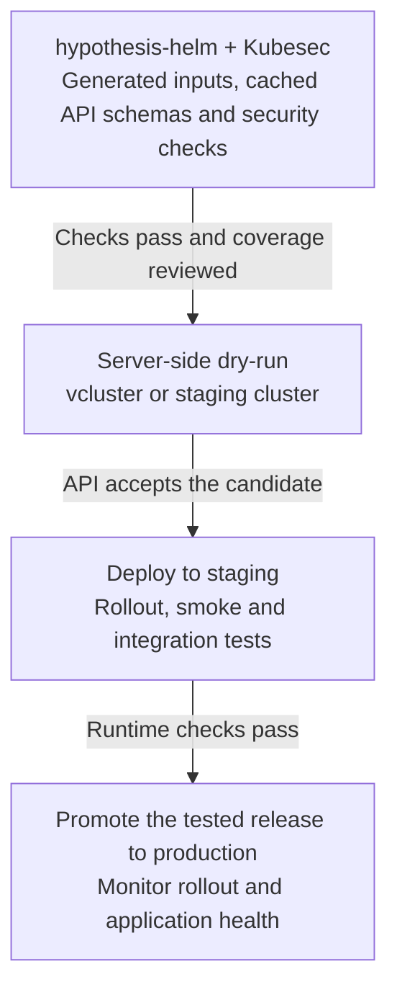

# Hypothesis

<!-- toc:start -->
**Table of contents**

- [Install](#install)
- [Examples: failures hidden by defaults](#examples-failures-hidden-by-defaults)
- [Audit, test, or scan?](#audit-test-or-scan)
  - [Quick start](#quick-start)
- [Production validation](#production-validation)
- [Guides](#guides)
- [Case study: Bitnami charts](#case-study-bitnami-charts)
- [Development](#development)
- [CLI help](#cli-help)
- [Upstream schema shims](#upstream-schema-shims)
- [License](#license)
- [Citation](#citation)
<!-- toc:end -->

Test Helm charts with automatically generated `values.yaml` inputs. Built on Python's
Hypothesis<sup>[\[1\]](https://github.com/HypothesisWorks/hypothesis/)</sup> testing framework, this tool
generates inputs from declared or inferred types<sup>[\[2\]](docs/inputs/README.md#declared-and-inferred-types)</sup>,
renders your charts with Helm, and
checks for failures. When a property-based test fails, Hypothesis simplifies the input
to a small example you can reproduce. Filtering skips redundant renders, while optional
sampling techniques reduce the number of inputs tested so you can cover more charts within your
time budget.

[](<studies/error-surface/README.md>)

Find failing inputs without rendering the same output over and over. With `--prune-equivalent`, every input still gets checked;
equivalent configurations reuse a rendered manifest. [See the synthetic error study and its exploratory timings](<studies/error-surface/README.md>).

- Audit templates, values schemas, and missing defaults.
- Generate a minimal values schema.
- Choose permutation coverage, with exhaustive testing for small finite spaces.
- Traverse unique value paths randomly with a reproducible seed, or choose linear, root-first, or leaf-first order.
- Skip provably equivalent renders or opt into [calibrated sampling](docs/adaptive-filtering/README.md) to reduce test volume.
- Recognize explicit configuration requirements with `--filter`, test dependent settings together, and report rejections separately.
- Discover dependency activation controls and exercise child settings with their subchart enabled, including aliases and nested dependencies.
- Show changed values and manifest fields in failure reports, with verified JSON replay of saved changes.
- Preview coverage and runtime estimates; set execution budgets and shard tests across workers.
- Test local chart trees or scan remote Git and authenticated Helm repositories; build dependencies and export Markdown/PDF reports.
- Validate Kubernetes API schemas from a versioned local cache, with optional
  [Kubesec](https://github.com/controlplaneio/kubesec) security checks in CI.

## Install

Requires Helm 4 and Python 3.13+.

Install the Helm plugin and verify that it is available:

```sh
PYTHON=python3.13 helm plugin install https://github.com/astrivant/hypothesis-helm
helm hypothesis --help
```

To install from a local checkout instead, run these commands from the project root:

```sh
PYTHON=python3.13 helm plugin install .
helm hypothesis --help
```

Then, if you want the optional benchmark tools, install them with pip:

```sh
pip install "hypothesis-helm[benchmarking]"
hypothesis-helm-benchmark --help
```

See [Benchmarking](docs/benchmarking/README.md) for chart generation and plot commands.
Browse the [flame graphs](<studies/flamegraphs/README.md>) to see time spent in Python calls during a scaling smoke test.
The [configurable stress chart](pkg/hypothesis_helm_benchmarking/assets/chart) combines known defects and topology
controls in one fixture; its [guide](docs/benchmarking/fixture.md) explains how to reduce them one step at a time.
See [random sampling results](<studies/sampling/README.md>) for the measured
tradeoff between sample size and known defect discovery.
To rerun all project checks, benchmarks, plots, and repository reports, see the
[full refresh command](docs/benchmarking/README.md#reproduce-the-full-project-run).

## Examples: failures hidden by defaults

A ConfigMap template containing `banner: {{ .Values.banner }}` works with the default
`banner: Ready`. But `banner: "Release: ready"` produces `banner: Release: ready`,
which is invalid YAML. Hypothesis can find this by generating inputs and rendering
the chart locally. Fix it with `banner: {{ .Values.banner | quote }}`.

The same idea applies beyond quoting:

- **Optional branches:** A feature is disabled by default. Enabling it reaches a template
  branch that reads a missing nested value and fails. Disabled subcharts can hide failures this way too.
- **Boundary values:** The schema allows an empty list, but the template always reads its
  first item. The populated default works; an empty list causes rendering to fail.
- **Interacting settings:** Two switches each work on their own. Enabling both reaches a
  shared branch that passes the wrong type to a template function. Testing each switch
  separately misses it.

## Audit, test, or scan?

| Command | Use it for | What it does |
| --- | --- | --- |
| `audit ./chart` | Understanding one chart's input contract. | Statically compares values, schema, and template references. Reports missing defaults, undocumented fields, unresolved access, and potential output complexity as JSON. Renders only when an export option requests verification or output observation. |
| `test PATH` | Testing a local chart or directory of charts. | Discovers local charts recursively, generates inputs, renders them with Helm, and records failures. `--report` writes combined Markdown/PDF results. |
| `scan SOURCE` | Testing charts fetched from remote repositories. | Fetches a Git repository, Helm repository/chart, public Helm index, or OCI chart, then discovers and tests its charts. Local paths use `test`. |

`test` and `scan` infer input-generation strategies when a chart has no values schema.
Recursive testing builds dependencies in isolated copies; single-chart suite controls
use dependencies already available in the chart. `audit` also works without a schema. `--filter` restricts
generation before traversal. Skipped charts and incomplete coverage remain explicit.

The audit's [complexity score](docs/inputs/README.md#potential-output-complexity) describes the largest
manifest tree across the allowed values, including resources disabled by defaults. Unsupported or oversized
input spaces have an unknown maximum, with any supported evidence reported separately.

Use `--export-minimal-values` to save example values with validation status, or
`--export-topological-graph` to inspect the input-to-output map. See
[verification and field inventory](docs/inputs/README.md).

### Quick start

```sh
helm hypothesis test ./chart
```

Audit values, choose interaction coverage, or preview a run:

```sh
helm hypothesis audit ./chart
helm hypothesis test ./chart --permutations 2
helm hypothesis test ./chart --dry-run
```

Small supported finite spaces are enumerated automatically. Larger finite spaces
use pairwise coverage; unsupported domains use per-path property tests. Reports
are written under `docs/reports/` when `--report` is supplied; generated test artifacts stay in `.cache/hypothesis-helm/runs/`.

See [Getting started](docs/getting-started/README.md) for ten practical testing options and how to read the results.

Test local charts or fetch remote charts, with Markdown/PDF summaries:

```sh
helm hypothesis test ./charts --report
helm hypothesis scan https://github.com/bitnami/charts.git --filter --report
```

<!--
```sh
helm hypothesis scan prometheus-community/prometheus --filter --report
helm hypothesis scan prometheus-community --filter --report
```
-->

See [Repository scanning](docs/scanning/README.md) for authentication, public indexes, version selection, and dependency handling.

## Production validation

For large production deployments, catch inexpensive failures before committing cluster resources.
Use hypothesis-helm's built-in schema validation and enable Kubesec for security checks.
Build confidence through successive checks, then promote the tested release:



Cost and operational impact increase down the graph. Any failed gate blocks promotion.
Test generated values broadly, then use the intended release configuration for the cluster stages.
Each gate adds evidence about the release configuration and its behavior in the target environment.
See the [production promotion guide](docs/ci/README.md#production-promotion) for what each gate establishes.

## Guides

- [Input domains](docs/input-domains/README.md): constrain generated values using destination schemas or chart-specific policies.

Disable selected checks with [stable rule codes and an ignore file](docs/rules/README.md).
The [root configuration](.hypothesis-helm.yaml) lists every code and ignores opaque-object warnings (`HH2006`).
Generate the same template with `helm hypothesis --generate-config > .hypothesis-helm.yaml`.

| Guide | Contents |
| --- | --- |
| [Architecture](docs/architecture/README.md) | Input discovery, test generation, rendering, and validation. |
| [Compiler](docs/compiler/README.md) | Pass flow, syntax trees, and illustrated compiler decisions. |
| [Execution](docs/execution/README.md) | Parallel workers, sharding, estimates, and time limits. |
| [Choosing test coverage](docs/coverage.md) | Filtering modes, worker counts, and release checks. |
| [CI examples](docs/ci/README.md) | GitHub Action, CircleCI, and GitLab setup. |
| [Benchmarking](docs/benchmarking/README.md) | Local shard commands, chart generation, and measured plots. |
| [CLI reference](docs/cli/README.md) | Generated command and option reference. |
| [Development](docs/development.md) | Contributor setup, checks, and repository map. |

[All documentation](docs/README.md) includes detailed behavior and the
[exact-equivalence pruning contract](docs/safe-pruning.md).

## Case study: Bitnami charts

<!-- refresh:bitnami:start -->
We scanned **115 Bitnami charts**, recording **336,009 test attempts**
with `--filter`, **6 path workers per chart**, and a **5-minute budget per chart**.
The reports distinguish test failures, blocked checks and incomplete coverage; chart bugs require triage.

Read the [scan results](docs/reports/bitnami.md), download the
[combined PDF](docs/reports/bitnami.pdf).
<!-- refresh:bitnami:end -->
The [chart topology catalog](<studies/chart-topologies/README.md>) includes
directed dependency graphs and their mathematical measurements.

<!--
## Case study: Prometheus Community charts
-->

<!-- refresh:prometheus:start -->
<!--
We scanned **46 Prometheus Community charts**, recording **56,756 test attempts**
with `--filter`, **6 path workers per chart**, and a **5-minute budget per chart**.
The reports distinguish test failures, blocked checks and incomplete coverage; chart bugs require triage.

Read the [scan results](docs/reports/prometheus.md), download the
[combined PDF](docs/reports/prometheus.pdf).
-->
<!-- refresh:prometheus:end -->
<!--
Its dependency graphs are also in the [topology catalog](<studies/chart-topologies/README.md>).
-->

## Development

[CI pipeline](https://github.com/astrivant/hypothesis-helm/actions/workflows/ci.yml): checks, chart validation, packaging,
manual benchmark refreshes and tag-only PyPI releases in one run. See [CI controls](docs/development.md#github-ci).

See [dependency maintenance](docs/dependencies.md) for version pins, nested Go modules, source catalogs and upgrade checks.

```sh
env -u VIRTUAL_ENV -u PYENV_VERSION -u PYENV_VIRTUAL_ENV poetry install
bash scripts/check.sh
```

The check command runs pytest in parallel, automatically choosing the worker count from
the runner's CPU count. CI and the full benchmark refresh use the same command.
Set `PYTEST_WORKERS=2` to choose a fixed count, or use
`bash scripts/check.sh -n 0` for serial execution. To run only tests in parallel:

```sh
bash scripts/project-run.sh pytest -n auto --dist worksteal
```

Shell scripts use four-space indentation, including scripts embedded in CI YAML.
Pre-commit and `scripts/check.sh` enforce shfmt formatting and ShellCheck;
see [shell checks](docs/development.md#shell-checks) for the local commands.

## CLI help

Full command help, generated from the current CLI with cogapp. For field-level settings, see the
[complete configuration example](docs/input-domains/README.md#complete-configuration-example).
Use `--log-color auto` for colored severity labels in a terminal, or `--log-color` to force color.
Logs remain plain by default. Rendered manifests streamed with `-o json` or `-o yaml` remain uncolored.

<!-- [[[cog
import cog
from hypothesis_helm.reporting.documentation.cli_reference import help_markdown
cog.out(help_markdown(headings=False))
]]] -->
<details>
<summary>helm hypothesis</summary>

~~~text
usage: helm hypothesis [-h] [--generate-config]
                       {rules,replay-changes,aggregate,export-minimal-values,scan,generate,audit,run,test,schemas} ...

Audit and property-test Helm chart values.

positional arguments:
  {rules,replay-changes,aggregate,export-minimal-values,scan,generate,audit,run,test,schemas}
    rules               list classified chart findings and diagnostics
    replay-changes      verify and replay saved values or manifest changes
    aggregate           verify piped shard reports and write one final report
    export-minimal-values
                        write example values beside each discovered chart
    scan                fetch and test charts from remote Git or Helm repositories
    generate            generate one typed Python property test per values path
    audit               discover value references and schema gaps
    run                 run a saved generated Python suite
    test                discover and test local charts recursively
    schemas             prepare the sparse Kubernetes schema cache

options:
  -h, --help            show this help message and exit
  --generate-config     print the default .hypothesis-helm.yaml template to stdout and
                        exit
~~~

</details>

<details>
<summary>helm hypothesis rules</summary>

~~~text
usage: helm hypothesis rules [-h] [--format {text,json,config,markdown}]

List the finding codes used to report chart defects, schema gaps, and testing
limitations. Use these codes to configure which findings to ignore.

options:
  -h, --help            show this help message and exit
  --format {text,json,config,markdown}
                        catalog output format
~~~

</details>

<details>
<summary>helm hypothesis replay-changes</summary>

~~~text
usage: helm hypothesis replay-changes [-h] [--section {overrides,values,manifests}]
                                      [--baseline BASELINE] [--output OUTPUT]
                                      record

Reconstruct the overrides, values, or manifests saved with a failing test case. Verify
the baseline and replay the recorded changes to produce JSON.

positional arguments:
  record                changes.json from a failing case

options:
  -h, --help            show this help message and exit
  --section {overrides,values,manifests}
  --baseline BASELINE   baseline JSON file; overrides default to an empty map
  --output OUTPUT       write reconstructed JSON to this file; default: stdout
~~~

</details>

<details>
<summary>helm hypothesis aggregate</summary>

~~~text
usage: helm hypothesis aggregate [-h] --shards SHARDS --run-id RUN_ID
                                 [--output-dir OUTPUT_DIR]
                                 [reports ...]

Combine reports from parallel CI shards into one Markdown and PDF report. Check that
the inputs belong to the requested run and account for the expected shards.

positional arguments:
  reports               JSON files or artifact roots; default: stdin

options:
  -h, --help            show this help message and exit
  --shards SHARDS
  --run-id RUN_ID       identifier shared by this run's shards
  --output-dir OUTPUT_DIR
                        new report directory; default: docs/reports/aggregate
~~~

</details>

<details>
<summary>helm hypothesis export-minimal-values</summary>

~~~text
usage: helm hypothesis export-minimal-values [-h] [--filename FILENAME] [--helm HELM]
                                             [--timeout TIMEOUT]
                                             [--minimal-values-timeout MINIMAL_VALUES_TIMEOUT]
                                             [--files-list FILES_LIST]
                                             [--validate-schemas]
                                             [--schema-version SCHEMA_VERSION]
                                             [--schema-cache-dir SCHEMA_CACHE_DIR]
                                             [--schema-offline]
                                             [--log-color [{auto,always,never}]]
                                             [--log-file PATH] [--config CONFIG]
                                             [--character-sets {ascii,unicode}]
                                             [--renderer-policy {auto,native,strict}]
                                             [--yaml-parser {ruamel,ruamel-safe,pyyaml}]
                                             [--ignore CODE]
                                             [--disable-codes CODE[,CODE...]]
                                             source

Create an example minimal values file beside each chart found in a local directory.
Also save a verification record describing what was checked and any remaining
limitations.

positional arguments:
  source

options:
  -h, --help            show this help message and exit
  --filename FILENAME   YAML basename only
  --helm HELM
  --timeout TIMEOUT
  --minimal-values-timeout MINIMAL_VALUES_TIMEOUT
  --files-list FILES_LIST
                        write NUL-delimited exported YAML and proof paths
  --validate-schemas    validate rendered resources against the local Kubernetes
                        schema cache
  --schema-version SCHEMA_VERSION
                        Kubernetes schema version: latest or X.Y.Z
  --schema-cache-dir SCHEMA_CACHE_DIR
  --schema-offline      reuse cached schemas without network access
  --log-color [{auto,always,never}]
                        color log severity labels; bare flag: always; auto: terminals
                        unless NO_COLOR is set; default: never
  --log-file PATH       append logs to PATH; default: stdout (-), or stderr when
                        streaming manifests
  --config CONFIG       finding and input-domain policy YAML; default: .hypothesis-
                        helm.yaml in the working directory
  --character-sets {ascii,unicode}
                        generated text alphabet; overrides config; default: ascii
  --renderer-policy {auto,native,strict}
                        auto controls supported random inputs with visible native
                        fallback (default); native uses Helm; strict requires replay
  --yaml-parser {ruamel,ruamel-safe,pyyaml}
                        manifest parser backend; overrides yaml_parser in config;
                        default: ruamel, or the saved suite's parser
  --ignore CODE         disable one built-in check; repeat to add codes
  --disable-codes CODE[,CODE...]
                        disable comma-delimited finding codes; adds to --ignore and
                        the config file; repeatable
~~~

</details>

<details>
<summary>helm hypothesis scan</summary>

~~~text
usage: helm hypothesis scan [-h] [--helm-repository] [--chart-version CHART_VERSION]
                            [--clone-timeout CLONE_TIMEOUT] [--report [PATH]]
                            [--artifact-dir ARTIFACT_DIR] [--helm HELM]
                            [--values VALUES] [--timeout TIMEOUT]
                            [--chart-timeout CHART_TIMEOUT]
                            [--scan-timeout SCAN_TIMEOUT]
                            [--max-examples MAX_EXAMPLES] [--cache-dir CACHE_DIR]
                            [--no-cache] [--jobs JOBS] [--permutations PERMUTATIONS]
                            [--filter] [--fail [{info,warning,error}]] [--seed SEED]
                            [--build-dependencies | --no-build-dependencies]
                            [--pca-samples N] [--pca-timeout PCA_TIMEOUT]
                            [--max-mutations N]
                            [--sensitivity-timeout SENSITIVITY_TIMEOUT]
                            [--filter-adaptive]
                            [--sampling-calibration SAMPLING_CALIBRATION]
                            [--sensitivity-order N] [--sample-random PERCENT]
                            [--sample-min-cases N]
                            [--traversal-strategy {random,linear,root-first,leaf-first,sensitivity-first}]
                            [--strict | --no-strict] [--validate-schemas]
                            [--schema-version SCHEMA_VERSION]
                            [--schema-cache-dir SCHEMA_CACHE_DIR] [--schema-offline]
                            [--base-ref BASE_REF] [--output-format {json,yaml}]
                            [--export-suppressions]
                            [--export-topological-graph [FILENAME]]
                            [--minimal-values-timeout MINIMAL_VALUES_TIMEOUT]
                            [--export-minimal-values [FILENAME]]
                            [--log-color [{auto,always,never}]] [--log-file PATH]
                            [--config CONFIG] [--character-sets {ascii,unicode}]
                            [--renderer-policy {auto,native,strict}]
                            [--yaml-parser {ruamel,ruamel-safe,pyyaml}]
                            [--ignore CODE] [--disable-codes CODE[,CODE...]]
                            SOURCE

Fetch charts from a remote Git repository, Helm repository, or OCI chart reference,
then test generated values and report findings for each chart. Use test for charts
already on disk.

positional arguments:
  SOURCE                Git URL, Helm repo[/chart], public index.yaml URL, or OCI
                        chart; local paths use test

options:
  -h, --help            show this help message and exit
  --helm-repository     interpret SOURCE as a Helm repository name or HTTP(S) base URL
  --chart-version CHART_VERSION
                        Helm chart version or constraint; default: latest stable
                        release per chart
  --clone-timeout, --source-timeout CLONE_TIMEOUT
                        Git checkout or Helm source preparation budget, also bounded
                        by --scan-timeout (default: 3m)
  --report [PATH]       write Markdown and PDF; default:
                        docs/reports/<dir>_<epoch>_report
  --artifact-dir ARTIFACT_DIR
  --helm HELM
  --values VALUES       baseline file relative to each chart, or an absolute path
  --timeout TIMEOUT     seconds per Helm lint, render, or dependency build
  --chart-timeout, --time-limit CHART_TIMEOUT
                        property-test execution budget per chart (default: 3m)
  --scan-timeout SCAN_TIMEOUT
                        scan budget excluding dependency preparation; default:
                        unlimited
  --max-examples MAX_EXAMPLES
  --cache-dir CACHE_DIR
                        completed chart-result cache; default: .cache/hypothesis-
                        helm/charts
  --no-cache            disable completed chart-result caching
  --jobs, -j JOBS       path workers per chart; auto: available CPUs
  --permutations PERMUTATIONS
                        finite interaction strength; non-finite charts fall back to
                        path sampling
  --filter              filter finite charts with failure expansion; otherwise filter
                        generated inputs before path traversal
  --fail [{info,warning,error}]
                        stop at this severity or higher and exit 1; bare flag: any
                        finding; lower findings remain reported
  --seed SEED
  --build-dependencies, --no-build-dependencies
                        build locked dependencies in temporary chart copies
  --pca-samples N       with --report, measure up to N reference configurations per
                        chart for output PCA; 0 disables it (default: 64)
  --pca-timeout PCA_TIMEOUT
                        additional output-PCA measurement budget per chart with
                        --report (default: 1m)
  --max-mutations N     with --report, measure sensitivity for up to N fields per
                        chart and all their pairs (opt-in)
  --sensitivity-timeout SENSITIVITY_TIMEOUT
                        additional sensitivity measurement budget per chart with
                        --max-mutations (default: 3m)
  --filter-adaptive     enable --filter and retain 70% subject to measured topology
                        sample floors; unmatched charts keep all filtered cases
  --sampling-calibration SAMPLING_CALIBRATION
                        override the packaged adaptive-sampling calibration JSON
  --sensitivity-order N
                        maximum measured interaction order for sensitivity-first;
                        1..permutations, default: min(2, permutations)
  --sample-random PERCENT
                        retain this percentage after filtering; default: 100
                        (disabled); recall depends on selected inputs
  --sample-min-cases N  retain at least N eligible cases, or all when fewer exist
                        (default: 128)
  --traversal-strategy {random,linear,root-first,leaf-first,sensitivity-first}
                        seeded random (default), linear, root-first, leaf-first, or
                        sensitivity-first (finite coverage defaults to pairs)
  --strict, --no-strict
                        require schemas for custom resources; otherwise skip schema
                        validation when their schema is missing
  --validate-schemas    validate rendered resources against the local Kubernetes
                        schema cache
  --schema-version SCHEMA_VERSION
                        Kubernetes schema version: latest or X.Y.Z
  --schema-cache-dir SCHEMA_CACHE_DIR
  --schema-offline      reuse cached schemas without network access
  --base-ref BASE_REF   Git comparison ref for repository tests; overrides CI target
                        or previous trunk commit
  --output-format, -o {json,yaml}
                        stream rendered manifests as JSON lines or YAML documents on
                        stdout; logs and reports go to stderr
  --export-suppressions
                        write categorized suppressions.yaml in each chart's artifacts
                        after testing; review before applying
  --export-topological-graph [FILENAME]
                        export input references, control flow and observed manifests
                        as JSON and DOT
  --minimal-values-timeout MINIMAL_VALUES_TIMEOUT
                        verification and minimization budget for values export
                        (default: 30s)
  --export-minimal-values [FILENAME]
                        export example values with validation status and missing
                        fields; default: values-minimal-<checksum>-<epoch>.yaml (scan:
                        separate files per chart)
  --log-color [{auto,always,never}]
                        color log severity labels; bare flag: always; auto: terminals
                        unless NO_COLOR is set; default: never
  --log-file PATH       append logs to PATH; default: stdout (-), or stderr when
                        streaming manifests
  --config CONFIG       finding and input-domain policy YAML; default: .hypothesis-
                        helm.yaml in the working directory
  --character-sets {ascii,unicode}
                        generated text alphabet; overrides config; default: ascii
  --renderer-policy {auto,native,strict}
                        auto controls supported random inputs with visible native
                        fallback (default); native uses Helm; strict requires replay
  --yaml-parser {ruamel,ruamel-safe,pyyaml}
                        manifest parser backend; overrides yaml_parser in config;
                        default: ruamel, or the saved suite's parser
  --ignore CODE         disable one built-in check; repeat to add codes
  --disable-codes CODE[,CODE...]
                        disable comma-delimited finding codes; adds to --ignore and
                        the config file; repeatable
~~~

</details>

<details>
<summary>helm hypothesis generate</summary>

~~~text
usage: helm hypothesis generate [-h] [--output OUTPUT] [--max-examples MAX_EXAMPLES]
                                [--strict | --no-strict]
                                [--fail [{info,warning,error}]]
                                [--export-topological-graph [FILENAME]]
                                [--minimal-values-timeout MINIMAL_VALUES_TIMEOUT]
                                [--export-minimal-values [FILENAME]]
                                [--log-color [{auto,always,never}]] [--log-file PATH]
                                [--config CONFIG] [--character-sets {ascii,unicode}]
                                [--renderer-policy {auto,native,strict}]
                                [--yaml-parser {ruamel,ruamel-safe,pyyaml}]
                                [--ignore CODE] [--disable-codes CODE[,CODE...]]
                                chart

Create a reusable Python property-test suite for a local chart, with one test per
values path. Input types come from the chart schema or are inferred from its values;
execute the saved suite with run.

positional arguments:
  chart

options:
  -h, --help            show this help message and exit
  --output OUTPUT
  --max-examples MAX_EXAMPLES
  --strict, --no-strict
                        require schemas for custom resources; otherwise skip schema
                        validation when their schema is missing
  --fail [{info,warning,error}]
                        stop at this severity or higher and exit 1; bare flag: any
                        finding; lower findings remain reported
  --export-topological-graph [FILENAME]
                        export input references, control flow and observed manifests
                        as JSON and DOT
  --minimal-values-timeout MINIMAL_VALUES_TIMEOUT
                        verification and minimization budget for values export
                        (default: 30s)
  --export-minimal-values [FILENAME]
                        export example values with validation status and missing
                        fields; default: values-minimal-<checksum>-<epoch>.yaml (scan:
                        separate files per chart)
  --log-color [{auto,always,never}]
                        color log severity labels; bare flag: always; auto: terminals
                        unless NO_COLOR is set; default: never
  --log-file PATH       append logs to PATH; default: stdout (-), or stderr when
                        streaming manifests
  --config CONFIG       finding and input-domain policy YAML; default: .hypothesis-
                        helm.yaml in the working directory
  --character-sets {ascii,unicode}
                        generated text alphabet; overrides config; default: ascii
  --renderer-policy {auto,native,strict}
                        auto controls supported random inputs with visible native
                        fallback (default); native uses Helm; strict requires replay
  --yaml-parser {ruamel,ruamel-safe,pyyaml}
                        manifest parser backend; overrides yaml_parser in config;
                        default: ruamel, or the saved suite's parser
  --ignore CODE         disable one built-in check; repeat to add codes
  --disable-codes CODE[,CODE...]
                        disable comma-delimited finding codes; adds to --ignore and
                        the config file; repeatable
~~~

</details>

<details>
<summary>helm hypothesis audit</summary>

~~~text
usage: helm hypothesis audit [-h] [--fail [{info,warning,error}]]
                             [--artifact-dir ARTIFACT_DIR] [--export-suppressions]
                             [--export-topological-graph [FILENAME]]
                             [--minimal-values-timeout MINIMAL_VALUES_TIMEOUT]
                             [--export-minimal-values [FILENAME]]
                             [--log-color [{auto,always,never}]] [--log-file PATH]
                             [--config CONFIG] [--character-sets {ascii,unicode}]
                             [--renderer-policy {auto,native,strict}]
                             [--yaml-parser {ruamel,ruamel-safe,pyyaml}]
                             [--ignore CODE] [--disable-codes CODE[,CODE...]]
                             chart

Inspect a local chart's values, schema, and template references to identify missing
types, undocumented paths, and limits on what can be analyzed. Use this to understand
the input space before testing.

positional arguments:
  chart

options:
  -h, --help            show this help message and exit
  --fail [{info,warning,error}]
                        fail on audit findings at this severity or higher; bare flag:
                        any finding
  --artifact-dir ARTIFACT_DIR
                        audit export directory
  --export-suppressions
                        write categorized suppressions.yaml in each chart's artifacts
                        after testing; review before applying
  --export-topological-graph [FILENAME]
                        export input references, control flow and observed manifests
                        as JSON and DOT
  --minimal-values-timeout MINIMAL_VALUES_TIMEOUT
                        verification and minimization budget for values export
                        (default: 30s)
  --export-minimal-values [FILENAME]
                        export example values with validation status and missing
                        fields; default: values-minimal-<checksum>-<epoch>.yaml (scan:
                        separate files per chart)
  --log-color [{auto,always,never}]
                        color log severity labels; bare flag: always; auto: terminals
                        unless NO_COLOR is set; default: never
  --log-file PATH       append logs to PATH; default: stdout (-), or stderr when
                        streaming manifests
  --config CONFIG       finding and input-domain policy YAML; default: .hypothesis-
                        helm.yaml in the working directory
  --character-sets {ascii,unicode}
                        generated text alphabet; overrides config; default: ascii
  --renderer-policy {auto,native,strict}
                        auto controls supported random inputs with visible native
                        fallback (default); native uses Helm; strict requires replay
  --yaml-parser {ruamel,ruamel-safe,pyyaml}
                        manifest parser backend; overrides yaml_parser in config;
                        default: ruamel, or the saved suite's parser
  --ignore CODE         disable one built-in check; repeat to add codes
  --disable-codes CODE[,CODE...]
                        disable comma-delimited finding codes; adds to --ignore and
                        the config file; repeatable
~~~

</details>

<details>
<summary>helm hypothesis run</summary>

~~~text
usage: helm hypothesis run [-h] [--seed SEED] [--match MATCH] [--collect-only]
                           [--artifact-dir ARTIFACT_DIR] [--sample-random PERCENT]
                           [--sample-min-cases N]
                           [--traversal-strategy {random,linear,root-first,leaf-first,sensitivity-first}]
                           [--strict | --no-strict] [--validate-schemas]
                           [--schema-version SCHEMA_VERSION]
                           [--schema-cache-dir SCHEMA_CACHE_DIR] [--schema-offline]
                           [--dry-run] [--cache-dir CACHE_DIR]
                           [--disable-schema-caching] [--progress] [--run-id RUN_ID]
                           [--no-cache] [--rerun {auto,all,failed}] [--shard SHARD]
                           [--jobs JOBS] [--output-format {json,yaml}]
                           [--export-suppressions] [--fail [{info,warning,error}]]
                           [--log-color [{auto,always,never}]] [--log-file PATH]
                           [--config CONFIG] [--character-sets {ascii,unicode}]
                           [--renderer-policy {auto,native,strict}]
                           [--yaml-parser {ruamel,ruamel-safe,pyyaml}] [--ignore CODE]
                           [--disable-codes CODE[,CODE...]]
                           suite

Execute a property-test suite previously created by generate. Generate values for its
selected paths, render the chart, and record any findings.

positional arguments:
  suite

options:
  -h, --help            show this help message and exit
  --seed SEED
  --match MATCH         select tests by value-path keyword
  --collect-only
  --artifact-dir ARTIFACT_DIR
                        report directory for a saved suite
  --sample-random PERCENT
                        retain this percentage after filtering; default: 100
                        (disabled); recall depends on selected inputs
  --sample-min-cases N  retain at least N eligible cases, or all when fewer exist
                        (default: 128)
  --traversal-strategy {random,linear,root-first,leaf-first,sensitivity-first}
                        seeded random (default), linear, root-first, leaf-first, or
                        sensitivity-first (finite coverage defaults to pairs)
  --strict, --no-strict
                        require schemas for custom resources; otherwise skip schema
                        validation when their schema is missing
  --validate-schemas    validate rendered resources against the local Kubernetes
                        schema cache
  --schema-version SCHEMA_VERSION
                        Kubernetes schema version: latest or X.Y.Z
  --schema-cache-dir SCHEMA_CACHE_DIR
  --schema-offline      reuse cached schemas without network access
  --dry-run             plot coverage and forecast filtering or cached property work
                        without execution
  --cache-dir CACHE_DIR
                        persistent path-result cache directory
  --disable-schema-caching
                        compare values structure against the cached baseline without
                        updating it
  --progress            force a live progress bar on stderr, including redirected
                        output
  --run-id RUN_ID       common identifier for shards merged into one report
  --no-cache            disable path-result caching
  --rerun {auto,all,failed}
                        auto: rerun failures locally; run all paths in CI
  --shard SHARD         auto (default): detect CI node; INDEX/TOTAL: explicit shard;
                        none: disable
  --jobs, -j JOBS       workers per chart; auto: CPU count for repository/exhaustive
                        tests, PID tuning for suites; 1: serial
  --output-format, -o {json,yaml}
                        stream rendered manifests as JSON lines or YAML documents on
                        stdout; logs and reports go to stderr
  --export-suppressions
                        write categorized suppressions.yaml in each chart's artifacts
                        after testing; review before applying
  --fail [{info,warning,error}]
                        stop at this severity or higher and exit 1; bare flag: any
                        finding; lower findings remain reported
  --log-color [{auto,always,never}]
                        color log severity labels; bare flag: always; auto: terminals
                        unless NO_COLOR is set; default: never
  --log-file PATH       append logs to PATH; default: stdout (-), or stderr when
                        streaming manifests
  --config CONFIG       finding and input-domain policy YAML; default: .hypothesis-
                        helm.yaml in the working directory
  --character-sets {ascii,unicode}
                        generated text alphabet; overrides config; default: ascii
  --renderer-policy {auto,native,strict}
                        auto controls supported random inputs with visible native
                        fallback (default); native uses Helm; strict requires replay
  --yaml-parser {ruamel,ruamel-safe,pyyaml}
                        manifest parser backend; overrides yaml_parser in config;
                        default: ruamel, or the saved suite's parser
  --ignore CODE         disable one built-in check; repeat to add codes
  --disable-codes CODE[,CODE...]
                        disable comma-delimited finding codes; adds to --ignore and
                        the config file; repeatable
~~~

</details>

<details>
<summary>helm hypothesis test</summary>

~~~text
usage: helm hypothesis test [-h] [--report [PATH]] [--pca-samples N]
                            [--pca-timeout PCA_TIMEOUT] [--max-mutations N]
                            [--sensitivity-timeout SENSITIVITY_TIMEOUT]
                            [--values VALUES] [--chart-timeout CHART_TIMEOUT]
                            [--scan-timeout SCAN_TIMEOUT]
                            [--build-dependencies | --no-build-dependencies]
                            [--fail [{info,warning,error}]]
                            [--max-examples MAX_EXAMPLES] [--time-limit DURATION]
                            [--paths | --exhaustive | --whole-chart |
                            --permutations N] [--filter] [--filter-random N]
                            [--filter-topology N] [--expand-failures]
                            [--prune-equivalent] [--match MATCH] [--collect-only]
                            [--max-cases MAX_CASES] [--max-candidates MAX_CANDIDATES]
                            [--exhaustive-threshold EXHAUSTIVE_THRESHOLD]
                            [--exhaustive-group PATH,PATH] [--no-infer-groups]
                            [--max-group-cases MAX_GROUP_CASES] [--seed SEED]
                            [--filter-adaptive]
                            [--sampling-calibration SAMPLING_CALIBRATION]
                            [--sensitivity-order N] [--sample-random PERCENT]
                            [--sample-min-cases N]
                            [--traversal-strategy {random,linear,root-first,leaf-first,sensitivity-first}]
                            [--timeout TIMEOUT] [--helm HELM] [--release RELEASE]
                            [--namespace NAMESPACE] [--kube-version KUBE_VERSION]
                            [--allow-empty] [--artifact-dir ARTIFACT_DIR]
                            [--strict | --no-strict] [--validate-schemas]
                            [--schema-version SCHEMA_VERSION]
                            [--schema-cache-dir SCHEMA_CACHE_DIR] [--schema-offline]
                            [--base-ref BASE_REF] [--dry-run] [--cache-dir CACHE_DIR]
                            [--disable-schema-caching] [--progress] [--run-id RUN_ID]
                            [--no-cache] [--rerun {auto,all,failed}] [--shard SHARD]
                            [--jobs JOBS] [--output-format {json,yaml}]
                            [--export-suppressions]
                            [--export-topological-graph [FILENAME]]
                            [--minimal-values-timeout MINIMAL_VALUES_TIMEOUT]
                            [--export-minimal-values [FILENAME]]
                            [--log-color [{auto,always,never}]] [--log-file PATH]
                            [--config CONFIG] [--character-sets {ascii,unicode}]
                            [--renderer-policy {auto,native,strict}]
                            [--yaml-parser {ruamel,ruamel-safe,pyyaml}]
                            [--ignore CODE] [--disable-codes CODE[,CODE...]]
                            [chart]

Test a local chart or recursively discover charts in a local directory. Generate
values, render the charts, and report findings with the inputs that triggered them.

positional arguments:
  chart                 local chart or directory containing charts (default: current
                        directory)

options:
  -h, --help            show this help message and exit
  --report [PATH]       write combined Markdown/PDF; default:
                        docs/reports/<dir>_<epoch>_report
  --pca-samples N       with --report, measure up to N reference configurations per
                        chart for output PCA; 0 disables it (default: 64)
  --pca-timeout PCA_TIMEOUT
                        additional output-PCA measurement budget per chart with
                        --report (default: 1m)
  --max-mutations N     with --report, measure sensitivity for up to N fields per
                        chart and all their pairs (opt-in)
  --sensitivity-timeout SENSITIVITY_TIMEOUT
                        additional sensitivity measurement budget per chart with
                        --max-mutations (default: 3m)
  --values VALUES       baseline file relative to each chart, or an absolute path
  --chart-timeout CHART_TIMEOUT
                        property-test budget per discovered chart (default: 3m)
  --scan-timeout SCAN_TIMEOUT
                        total local discovery/testing budget, excluding dependency
                        preparation
  --build-dependencies, --no-build-dependencies
                        build dependencies in isolated copies
  --fail [{info,warning,error}]
                        stop at this severity or higher and exit 1; bare flag: any
                        finding; lower findings remain reported
  --max-examples MAX_EXAMPLES
  --time-limit DURATION
                        whole-chart execution budget, e.g. 30s or 3m (default: 3m);
                        excludes planning
  --paths               force generated per-path testing
  --exhaustive          enumerate finite whole-chart inputs
  --whole-chart         sample whole-chart inputs
  --permutations N      cover valid N-way finite interactions; non-finite charts fall
                        back to path sampling
  --filter-random N     retain a seeded quarter of finite permutation cases per step;
                        default: 0
  --prune-equivalent    skip Helm only for proved output equivalence to a successful
                        render
  --match MATCH         select generated tests by value-path keyword
  --collect-only        generate and list tests
  --max-cases MAX_CASES
                        bound exhaustive domains or permutation suites and factor
                        domains
  --max-candidates MAX_CANDIDATES
                        bound permutation planning work
  --exhaustive-threshold EXHAUSTIVE_THRESHOLD
                        enumerate finite spaces smaller than this count; 0 disables
                        promotion
  --exhaustive-group PATH,PATH
                        require exhaustive coverage of a group of value paths or
                        containers; repeatable
  --no-infer-groups     disable inferred exhaustive groups
  --max-group-cases MAX_GROUP_CASES
                        bound automatically inferred group domains
  --seed SEED
  --filter-adaptive     enable --filter and retain 70% subject to measured topology
                        sample floors; unmatched charts keep all filtered cases
  --sampling-calibration SAMPLING_CALIBRATION
                        override the packaged adaptive-sampling calibration JSON
  --sensitivity-order N
                        maximum measured interaction order for sensitivity-first;
                        1..permutations, default: min(2, permutations)
  --sample-random PERCENT
                        retain this percentage after filtering; default: 100
                        (disabled); recall depends on selected inputs
  --sample-min-cases N  retain at least N eligible cases, or all when fewer exist
                        (default: 128)
  --traversal-strategy {random,linear,root-first,leaf-first,sensitivity-first}
                        seeded random (default), linear, root-first, leaf-first, or
                        sensitivity-first (finite coverage defaults to pairs)
  --timeout TIMEOUT
  --helm HELM
  --release RELEASE
  --namespace NAMESPACE
  --kube-version KUBE_VERSION
  --allow-empty
  --artifact-dir ARTIFACT_DIR
  --strict, --no-strict
                        require schemas for custom resources; otherwise skip schema
                        validation when their schema is missing
  --validate-schemas    validate rendered resources against the local Kubernetes
                        schema cache
  --schema-version SCHEMA_VERSION
                        Kubernetes schema version: latest or X.Y.Z
  --schema-cache-dir SCHEMA_CACHE_DIR
  --schema-offline      reuse cached schemas without network access
  --base-ref BASE_REF   Git comparison ref for repository tests; overrides CI target
                        or previous trunk commit
  --dry-run             plot coverage and forecast filtering or cached property work
                        without execution
  --cache-dir CACHE_DIR
                        persistent path-result cache directory
  --disable-schema-caching
                        compare values structure against the cached baseline without
                        updating it
  --progress            force a live progress bar on stderr, including redirected
                        output
  --run-id RUN_ID       common identifier for shards merged into one report
  --no-cache            disable path-result caching
  --rerun {auto,all,failed}
                        auto: rerun failures locally; run all paths in CI
  --shard SHARD         auto (default): detect CI node; INDEX/TOTAL: explicit shard;
                        none: disable
  --jobs, -j JOBS       workers per chart; auto: CPU count for repository/exhaustive
                        tests, PID tuning for suites; 1: serial
  --output-format, -o {json,yaml}
                        stream rendered manifests as JSON lines or YAML documents on
                        stdout; logs and reports go to stderr
  --export-suppressions
                        write categorized suppressions.yaml in each chart's artifacts
                        after testing; review before applying
  --export-topological-graph [FILENAME]
                        export input references, control flow and observed manifests
                        as JSON and DOT
  --minimal-values-timeout MINIMAL_VALUES_TIMEOUT
                        verification and minimization budget for values export
                        (default: 30s)
  --export-minimal-values [FILENAME]
                        export example values with validation status and missing
                        fields; default: values-minimal-<checksum>-<epoch>.yaml (scan:
                        separate files per chart)
  --log-color [{auto,always,never}]
                        color log severity labels; bare flag: always; auto: terminals
                        unless NO_COLOR is set; default: never
  --log-file PATH       append logs to PATH; default: stdout (-), or stderr when
                        streaming manifests
  --config CONFIG       finding and input-domain policy YAML; default: .hypothesis-
                        helm.yaml in the working directory
  --character-sets {ascii,unicode}
                        generated text alphabet; overrides config; default: ascii
  --renderer-policy {auto,native,strict}
                        auto controls supported random inputs with visible native
                        fallback (default); native uses Helm; strict requires replay
  --yaml-parser {ruamel,ruamel-safe,pyyaml}
                        manifest parser backend; overrides yaml_parser in config;
                        default: ruamel, or the saved suite's parser
  --ignore CODE         disable one built-in check; repeat to add codes
  --disable-codes CODE[,CODE...]
                        disable comma-delimited finding codes; adds to --ignore and
                        the config file; repeatable

filtering:
  Use --filter or the individual methods below; random filtering is independent.

  --filter              enable --filter-topology 2 and --expand-failures
  --filter-topology N   thin symbolic output/branch regions; retain representatives
                        and unknowns; combines with --filter-random
  --expand-failures     test omitted members of failed symbolic regions within the
                        execution budget
~~~

</details>

<details>
<summary>helm hypothesis schemas</summary>

~~~text
usage: helm hypothesis schemas [-h] [--schema-version SCHEMA_VERSION]
                               [--schema-cache-dir SCHEMA_CACHE_DIR]
                               [--schema-offline]

Prepare a local cache of Kubernetes API schemas for built-in manifest validation.
Select a Kubernetes version to download, or use --schema-offline to reuse schemas
already cached.

options:
  -h, --help            show this help message and exit
  --schema-version SCHEMA_VERSION
  --schema-cache-dir SCHEMA_CACHE_DIR
  --schema-offline
~~~

</details>
<!-- [[[end]]] -->

## Upstream schema shims

Some Kubernetes rules are enforced by Go validators or described in prose but are missing from the published JSON schemas.
Catalog rebuilds apply these [reviewed supplements](pkg/hypothesis_helm_catalog/data/reviewed-domains.json) to exact API fields:

| API field | Supplement |
| --- | --- |
| `ServiceSpec.type`, `ServiceSpec.sessionAffinity` | Allowed enums; empty and null values retain Kubernetes defaulting. |
| `ServicePort.protocol`, `PodSpec.restartPolicy` | Documented enum values. |
| `ContainerPort.containerPort` | Port range, 1-65535. |
| `DeploymentSpec.replicas` | Nonnegative replica count. |
| `SecretVolumeSource.secretName`, `SecretKeySelector.name` | Secret-name syntax and length. |
| `VolumeMount.mountPath` | Nonempty path, preserving Windows and Unix forms. |

These are API schema shims, not chart-name exceptions. Each records its upstream reference and description;
rebuilds require review if that description changes. The Service enum shims also record the upstream defaulting
reference and when they can be retired. Remove a shim once the upstream schema supplies the equivalent constraint.
Other fields remain unconstrained where neither upstream data nor a reviewed supplement establishes their domain.
`HTTPGetAction.port` and `TCPSocketAction.port` also need bounds absent from the JSON schemas. Catalog rebuilds derive
their numeric range and port-name rules from Kubernetes' `IsValidPortNum` and `IsValidPortName` validators, then check
boundary cases against the compiled Go functions. These rules apply to probes and lifecycle handlers across charts;
they validate port syntax, not whether a named port exists in the target container.
See [catalog rebuilding](docs/input-domains/README.md#rebuilding-the-catalog-before-release) for source verification and limits.

## License

[GNU General Public License v3.0 only](LICENSE).

## Citation

This project builds on [Hypothesis](https://github.com/HypothesisWorks/hypothesis/),
the property-based testing framework for Python. Its authors recommend the following
paper in their [citation guidance](https://github.com/HypothesisWorks/hypothesis/blob/master/CITATION.cff):

MacIver et al. (2019). [Hypothesis: A new approach to property-based testing](https://doi.org/10.21105/joss.01891).
*Journal of Open Source Software*, 4(43), 1891.
