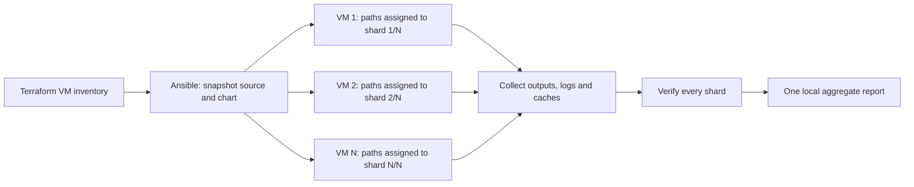

# Run computations on remote shards

<!-- toc:start -->
**Table of contents**

- [Roles and execution](#roles-and-execution)
- [Start a run](#start-a-run)
- [Results, errors and recovery](#results-errors-and-recovery)
- [Other computations](#other-computations)
- [Checks](#checks)
<!-- toc:end -->

The [Terraform compute module](../terraform/README.md) supplies a non-secret VM inventory. Ansible snapshots the required local
application source and selected chart, connects through OS Login/IAP, runs one application shard on each VM, then fetches data
for local aggregation. This follows the connection strategy in the neighboring Astrivant project.

## Roles and execution

| Role | Responsibility |
| --- | --- |
| `compute_worker` | Create the unprivileged `hypothesis` account; install Python, checksum-verified Helm and locked project dependencies; transfer source and start the worker. |
| `collect_artifacts` | Wait for the entire process group, retain failures/timeouts, archive results and optional caches, and fetch each VM into its own local directory. |



All VMs test their partitions of the **same chart**, using the same seed and run ID. Each VM's `worker_jobs` processes work
within that partition. Empty partitions still produce shard evidence; they must be collected too. These are generated-suite
path shards, not distributed exhaustive enumeration or a distributed sensitivity study. Shard ownership is fixed for a run;
failed work is not silently reassigned.

## Start a run

On the controller, use Python 3.12+, gcloud, Terraform, Ansible, and this project's installed dependencies. The local
`hypothesis-helm` command is needed for aggregation; `.venv/bin` is added to its PATH when present.

```bash
pip install -r ansible/requirements.txt
ansible-galaxy collection install -r ansible/requirements.yml
cp ansible/run.yml.example ansible/run.yml
# Set outputs_file, expected_project and a fresh run_id.
bash ansible/run.sh ansible/run.yml
```

`outputs_file` is the absolute path to `terraform output -json`. Ansible verifies the project, every shard index, and each live
VM's immutable instance ID. It resolves your OS Login POSIX user and establishes known hosts using `gcloud compute ssh`.
Host-key checking stays enabled for the [google.cloud.iap connection](https://docs.ansible.com/projects/ansible/latest/collections/google/cloud/iap_connection.html).
The instance-ID host key recorded by gcloud is bound to the instance-name alias used by the Ansible IAP plugin.
Your current gcloud identity needs the operator permissions installed by Terraform. The computation account has no SSH login or sudo rights.

The source archive contains `pkg`, `scripts`, `pyproject.toml`, `poetry.lock`, `README.md`, `LICENSE`, and `plugin.yaml`.
It includes your current local edits. It excludes Git history, local environments, reports and benchmark runs. A separate
archive contains `chart_source` (default `examples/configmap`) and its local dependencies. Include any required chart files
there; do not depend on paths outside that chart. Pin dependencies with `Chart.lock` or vendor them before the run.

Per-run virtual environments install from the copied Poetry lock, including the benchmarking extra. Helm releases are cached
by version on each VM and checked against the release checksum. The default Debian 13/x86-64 image is checked before setup.
Each worker writes source/chart/script SHA-256 hashes alongside its outputs.

The default `jobs/chart-tests.sh` generates ten examples per property and invokes `hypothesis-helm run` with explicit shard,
seed, worker, cache and report settings. Literal Bash commands stay visible in the job files. Dependency preparation and
installation precede the application tests. `job_timeout_seconds` (default 3600) bounds the complete job script, including
its dependency preparation; it is a VM safety limit, not the application's per-chart test budget.

## Results, errors and recovery

Results are fetched under `.cache/remote/<run_id>/results/`:

```text
results/
  shards/
    hypothesis-shards-001.tar.gz
    hypothesis-shards-001/
      results/                 # logs, status, input checksums, application artifacts
      cache/shard-1-of-3/       # optional persistent cache snapshot
    hypothesis-shards-002/...
  final/                       # verified combined JSON, JUnit, Markdown and PDF
```

All shards start before collection waits on completion. Failing tests do not prevent fetching the other VMs. The final
aggregation checks run identity, suite/configuration compatibility, disjoint ownership, complete inventory and checksums.
Its failure exit code is returned **after** artifacts are collected. Missing or unreachable VMs block final aggregation.
A successful SSH connection or an empty directory does not count as a successful computation.

Recover results without reinstalling or rerunning work:

```bash
bash ansible/run.sh ansible/run.yml -e remote_action=collect
```

Keep the same config, run ID and Terraform output. Recovery checks the original saved fleet. A new execution needs a new
run ID; existing source snapshots and worker directories are never overwritten. Computations survive a controller disconnect.
They run in bounded systemd services with `ExitType=cgroup`, `KillMode=control-group`, and a 30-second termination grace period.
The collector waits for all processes, including descendants, before archiving. A timeout retains available logs and partial
outputs; it does not become a passing report. See [systemd service lifecycle](https://www.freedesktop.org/software/systemd/man/latest/systemd.service.html).

Caches are local to a VM and partitioned by shard index **and total**. An exclusive file lock prevents overlapping runs from
writing the same cache. Collection takes that lock too. `collect_cache: false` omits caches from transfer. Returned caches
remain separate; they are not merged or automatically copied into another worker's cache. VM teardown deletes remote caches.

## Other computations

Use the supplied performance example in `ansible/run.yml`:

```yaml
job_script: /absolute/path/to/hypothesis-helm/ansible/jobs/performance.sh
aggregate_script: ""
```

It partitions global benchmark input IDs with `--shard`, and uses `--replicas` for local workers. Collected JSON/CSV/plots
remain per shard; the chart-test report aggregator does not accept benchmark measurements. Supply your own local
`aggregate_script` to combine a different result format. Do not sum concurrent shard runtimes and label them wall-clock time.

A custom job script receives `SHARD_INDEX`, `SHARD_TOTAL`, `JOBS`, `SEED`, `HH_RUN_ID`, `HH_CHART`, `RUN_ROOT`, `RESULTS_DIR`,
and `CACHE_DIR`. Write all returned data under `RESULTS_DIR`; stdout/stderr are already captured there. Commands must implement
shard ownership explicitly: adding a shard environment variable alone cannot partition an arbitrary program. The local
aggregation script receives `LOCAL_RESULTS`, `HH_RUN_ID`, and `SHARD_TOTAL`. Its nonzero exit status is reported after collection.

## Checks

```bash
ANSIBLE_LOCAL_TEMP="$PWD/.cache/ansible/tmp" ANSIBLE_CONFIG="$PWD/ansible/ansible.cfg" \
  ansible-playbook -i localhost, ansible/site.yml --syntax-check
bash scripts/project-run.sh shfmt -d ansible/run.sh ansible/jobs
ANSIBLE_LOCAL_TEMP="$PWD/.cache/ansible/tmp" ANSIBLE_CONFIG="$PWD/ansible/ansible.cfg" \
  ansible-playbook -i localhost, ansible/tests/collection.yml
bash scripts/project-run.sh pytest pkg/hypothesis_helm/tests/test_remote_shards.py
```

The collection test uses temporary local files and a fake systemd status; it verifies failed/interrupted collection and recovery.
It requires `flock` on the controller (`brew install flock` on macOS). Production collection runs `flock` on Debian workers.
The Python integration test exercises actual Helm/application shard reports, including an idle shard and a missing report.

Use `--forks N` on `ansible/run.sh` to change Ansible's setup/collection concurrency. It does not change VM shard count or
local computation workers. Set `workers.replicas` in Terraform and `worker_jobs` in the run definition for those.
