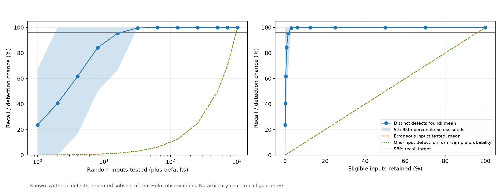
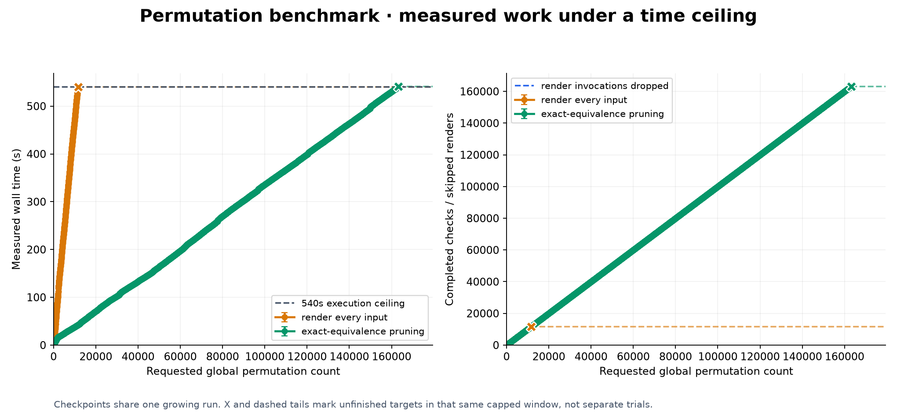
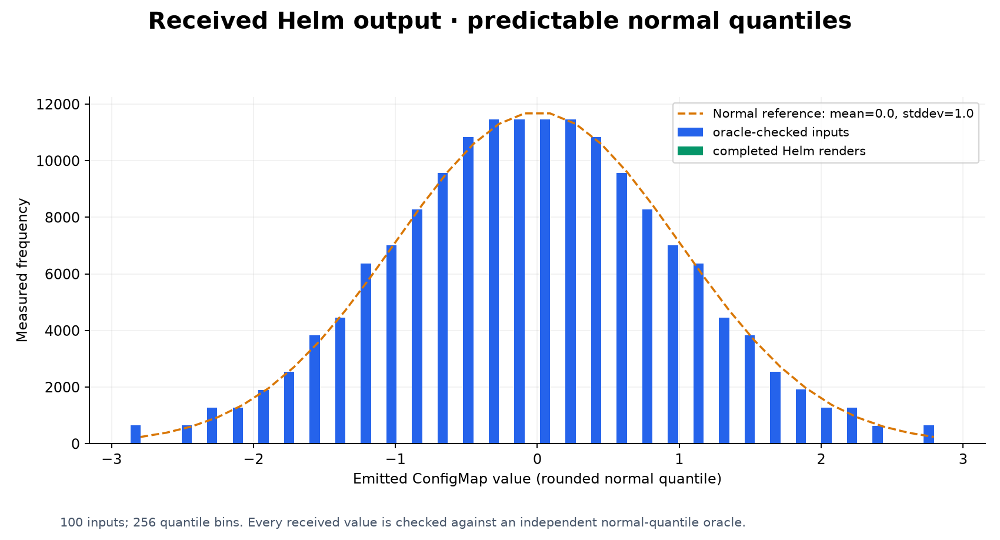
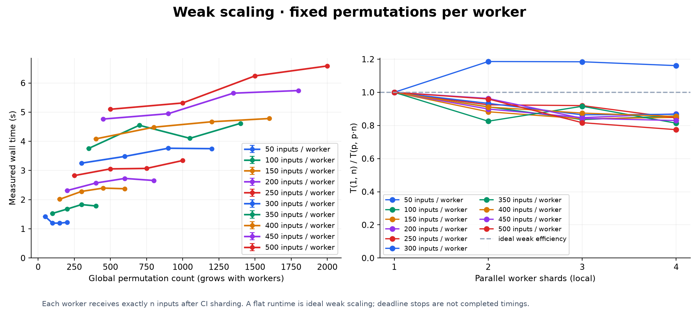
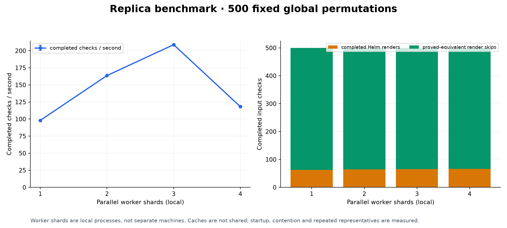
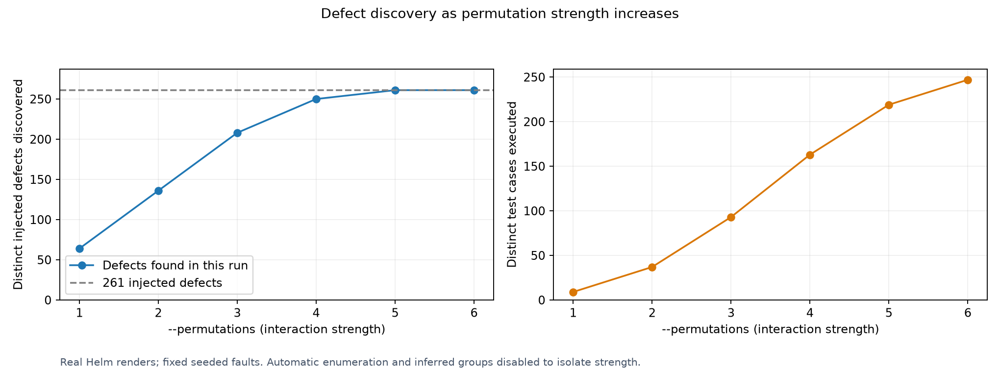
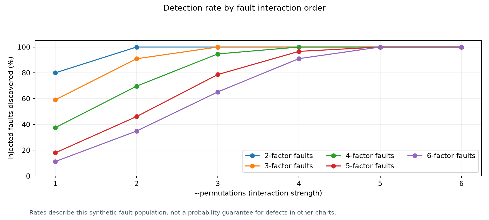

# Benchmarking

[Documentation](../docs/README.md) · [Project](../README.md)

Benchmark assets live together here:

| Location | Contents |
| --- | --- |
| `chart/` | The shared, configurable Helm chart. |
| `fixture/` | Parameter recipes and the chart guide. |
| Study directories, such as `sampling/` and `pca/` | Published plots, tables, and recorded measurements. |
| `refresh/` | Refresh automation and recorded provenance. |
| `runs/` | New local outputs and refresh workspaces, excluded from Git. |

Run `bash benchmarks/smoke.sh` for a short integration check, or
`poetry run bash benchmarks/refresh.sh` for the complete refresh.
Use `bash benchmarks/shards.sh --help` for local shard execution.
The installable Python implementation remains in `pkg/hypothesis_helm/benchmarking/`.

## Install and run

```sh
pip install "hypothesis-helm[benchmarking]"
hypothesis-helm-benchmark generate --output benchmarks/runs/chart --input-complexity 10
hypothesis-helm-benchmark run --chart benchmarks/runs/chart --time-limit 9m
```

The extra installs NumPy and Matplotlib. Helm 4 must be available on `PATH` for
rendering. All benchmark commands run from the installed package; no checkout is
needed. Results default to `benchmarks/runs/` under the working directory.

Use `hypothesis-helm-benchmark --help` to list studies, or append `--help` to a
study such as `hypothesis-helm-benchmark nesting --help`.

### One configurable chart

All synthetic studies use the same chart generator. Each command reuses one temporary
chart and retains YAML parameter records for its cases. Separate invocations have
separate workspaces, including concurrent CI jobs.

The [combined stress chart](chart) includes gates, shared outputs,
interactions, equivalent inputs, boundary changes, coupled inputs, and six known defect
families. The [fixture guide](fixture/README.md) explains its controls and fixed progression.

```sh
hypothesis-helm-benchmark stress --time-limit 9m --output benchmarks/runs/stress
```

This measures 22 settings with five filtering strategies, decreasing one control by
one per step. The nine-minute ceiling applies separately to each strategy at each
step. Use `--steps 3` for a shorter study or `--generate-only` to inspect the recipes.
Results include Matplotlib PNG/SVG plots, CSV/JSON measurements, and a Markdown table.

Existing published measurements retain their original chart snapshots. New runs save
parameter records; exporting one recreates that case using the installed generator:

```sh
hypothesis-helm-benchmark generate \
  --parameters benchmarks/runs/stress/cases/00-worst-case.yaml --output benchmarks/runs/chart
```

### Complexity-informed sampling

The [calibration study](calibration-variation/README.md) compares 30 generated chart variants across 100 seeds each.
Its [matrix and graphs](calibration-variation/MATRIX.md) show retained cases, known-bug discovery and nearby-profile fallback.
The [test matrix](../docs/aggressive-filtering/TESTS.md) separates deterministic selector properties from empirical results.

```sh
hypothesis-helm-benchmark calibration --output benchmarks/runs/calibration --time-limit 9m
```

### Filtering runtime

The [filtering load test](filtering/README.md) compares an unfiltered baseline, 70% random sampling, ordinary filtering and aggressive filtering.
It varies the finite input-space size and gate depth, using paired seeds and real Helm execution. Graphs separate planning from test execution;
time-limited observations retain their unfinished counts. The [theoretical comparison](../docs/aggressive-filtering/README.md#conditions-behind-the-comparison)
states the conditions under which each bound and expected saving applies.

```sh
hypothesis-helm-benchmark filtering --output benchmarks/runs/filtering --time-limit 9m
```

### Random sampling and defect discovery

The [sample-size study](sampling/README.md) renders the shared chart's complete
population, then measures distinct defect recall across 500 reproducible seeds.
It distinguishes repeated defect patterns from erroneous input assignments.



```sh
hypothesis-helm-benchmark sampling --time-limit 9m --output benchmarks/runs/sampling
```

For the current fixture, 32 random inputs plus defaults found all six defects in
99% of seeds. This does not establish a safe sampling rate for other charts;
a defect exposed by one input has only a 70% detection chance when 70% are tested.

### Flame graphs across worker cores

Place `--profile DIRECTORY` before the study name to capture Python call stacks
and generate Matplotlib flame graphs:

```sh
hypothesis-helm-benchmark --profile benchmarks/runs/profiles run --chart benchmarks/runs/chart \
  --suite scaling --scaling-counts 50,100,150 --replicas 1,2,3,4 \
  --time-limit 30s --shard none --output benchmarks/runs/profiled
```

Each invocation prints a fresh `profile-*` directory containing raw JSON captures
and a `flamegraphs/` directory with per-process PNG/SVG plots, a combined worker
plot, and `index.json`. Each worker profiles its executing Python thread on its
own core and writes a unique file. The coordinator is plotted separately.
Independent CI shards can upload their capture files into one directory for plotting.

Widths show time spent in a function and its children. The combined worker view
sums time across overlapping workers, so its width can exceed elapsed runtime.
Native functions and Helm subprocess waits are charged to their Python caller;
these graphs do not expose Helm's internal Go calls or other Python threads.

Capture uses Python's [standard profiling hook](https://docs.python.org/3/library/sys.html#sys.setprofile)
to preserve actual caller paths, including recursion. Profiling adds overhead,
and the measurement metadata marks instrumented runs. Use ordinary runs for
performance comparisons. Capture retains up to 25,000 call-context nodes and
128 levels per invocation; beyond those limits, time is charged to the nearest
retained ancestor and the capture is marked. Interrupted hooks are reported as partial.

Redraw or combine saved captures without rerunning the benchmark:

```sh
hypothesis-helm-benchmark flamegraph benchmarks/runs/profiles/profile-EXAMPLE \
  --output benchmarks/runs/flamegraphs --max-depth 40 --min-percent 0.05
```

Display limits hide small or deep frames in the drawing while preserving the raw
captures. Only fully written capture files are read; a forcibly killed process
may leave no capture.

### Reproduce the full project run

From a checkout with Helm 4 and GNU Parallel on `PATH`:

```sh
poetry install --extras benchmarking && poetry run bash benchmarks/refresh.sh
```

This runs lint, type checks, documentation checks, and the full pytest suite with the
worker count selected from the runner's CPUs (`PYTEST_WORKERS` overrides it), then all fourteen synthetic studies,
their plots and tables, and the synthetic/Bitnami/Prometheus
topology catalog. It tests both pinned chart submodules with four workers,
`--filter`, seeded random traversal, and five minutes per chart, then verifies and
publishes the combined Markdown/PDF reports. Dependency preparation is outside
each chart's testing budget. External kubeconform/kubesec checks are not enabled.

Timed synthetic studies run sequentially to avoid CPU contention between measurements.
The scaling study varies workers within each measurement to compare parallel execution.

Each benchmark run has a nine-minute ceiling; the complete refresh takes hours.
The command initializes missing submodules (Prometheus uses GitHub SSH), records
source snapshots, and prints the fresh run directory containing progress and logs.
Results are published under `benchmarks/` and `docs/reports/`. It refuses to
start while an earlier refresh is active or unfinished. Chart findings are retained
in reports; incomplete workers or failed verification stop publication.

GitHub Actions and CircleCI run `bash benchmarks/smoke.sh` on changes. It
generates all 22 parameter recipes, measures the first three steps with one-second
ceilings, and checks chart replay and topology plots. These short runs verify the
automation; their timings are not performance comparisons.

For the complete hosted run, open **Actions > Benchmarks > Run workflow** and enable
**full-refresh**. It runs the same refresh command and uploads measurements, plots,
reports, and diagnostic logs for 30 days. It uses HTTPS for public submodules and
leaves committing regenerated files to the reviewer. The workflow has a six-hour
job limit; interrupted runs retain available artifacts without claiming completion.

Render an exported compiler dependency graph with Matplotlib:

```sh
hypothesis-helm-benchmark topology --graph topology.json --output benchmarks/runs/topology
```

The PNG/SVG plots retain all vertices and directed edges. See
[what the graph and its layout represent](../docs/inputs/README.md#render-the-mathematical-graph).
Browse the [synthetic and real-chart topology catalog](chart-topologies/README.md)
for complete graphs, per-chart measurements, and downloadable graph data.

## Local shard wrapper

Run saved suites with 1–4 local GNU Parallel shards:

~~~sh
brew bundle # macOS; Debian/Ubuntu: sudo apt-get install parallel
helm hypothesis generate benchmarks/chart --output benchmarks/runs/shard-suite --max-examples 10
for shards in 1 2 3 4; do
  bash benchmarks/shards.sh --shards "$shards" benchmarks/runs/shard-suite
done
~~~

The [wrapper](shards.sh) launches `helm hypothesis run` with one
worker per shard and caching disabled. Logs and reports go to
`benchmarks/runs/local-shards/`. Pass additional run options after `--`.

Generate a chart with predictable, rounded normal-distribution outputs:

~~~sh
hypothesis-helm-benchmark generate \
  --output benchmarks/runs/chart \
  --input-complexity 100 --mean 0 --stddev 1 --output-bins 256
~~~

Run the [plotting benchmark](../pkg/hypothesis_helm/benchmarking/benchmark_helm.py):

~~~sh
hypothesis-helm-benchmark run \
  --chart benchmarks/runs/chart --step 50 --time-limit 9m --max-permutations 600000 \
  --shards 1,2,3,4 --shard none --output benchmarks/runs/benchmark
~~~

Measurements are recorded after **50, 100, 150, …** inputs. Each progressive or scaling
run has a nine-minute execution budget; the complete study takes longer. Rendered
outputs are checked against expected values calculated independently of Helm.
Renders are skipped when the compiler proves they match an already validated output.
Use each script's `--help` for options.

The figures below use local Python workers and the [standard chart](standard-chart).
In this Helm 4 run, pruning completed **163,122 checks with 256 renders**, compared
with **11,583 checks** without pruning, within each nine-minute budget.
[Raw measurements](results.json), [CSV](results.csv), and
[refresh provenance](refresh/README.md) include the host and run details.
These are single-run measurements; they do not establish timing variability.

The progressive plot follows one continuous run, recording progress at each input
count. Dashed lines show targets the run did not finish before its time limit.





**Strong scaling** keeps total work fixed. **Weak scaling** keeps work per worker fixed.






## Bug discovery by permutation strength

Compare pairs, triples, and higher-order coverage against known chart faults:

~~~sh
hypothesis-helm-benchmark generate \
  --output benchmarks/runs/faulty-chart --input-complexity 8 \
  --bug-percent 5 --bug-orders 2,3,4,5,6 --bug-seed 2026
hypothesis-helm-benchmark discovery \
  --chart benchmarks/runs/faulty-chart --max-strength 6 --output benchmarks/runs/discovery
~~~

`--bug-orders` sets how many fields must have particular values to trigger each
injected fault. At each order, `--bug-percent` selects a percentage of those possible
triggers, rounded down to a whole number. The seed determines which triggers are
selected, and `benchmark.json` records the exact counts. A complete input can trigger
several faults, so 5% of triggers does not mean 5% of complete inputs fail.
`--max-bugs` limits the number of injected faults.

The x-axis is `--permutations` interaction strength. The chart, its 256 possible
configurations, and its injected faults stay fixed. Runs use the application's
planner and real Helm renders, with automatic enumeration and inferred groups
disabled to isolate strength. [Raw results](bug-density/results.json) retain the
first failing case for each fault. These discovery rates describe the seeded fixture.

The recorded 5% fixture contains 261 faults: pairs found 136, triples found 208,
and strength five found all 261.





The separate [Sparsity and Stochasticity study](sparsity/README.md) measures distribution
coverage as the number of cases falls.

## Topology fixture

Generate a chart whose inputs also control resource creation and shared fields:

```sh
hypothesis-helm-benchmark generate \
  --output benchmarks/runs/topology-chart --input-complexity 100 --topology
```

`--topology` adds six Boolean inputs that control resource creation, shared Service
and Ingress ports, replica thresholds, and a branch reached only by a specific
input pattern. `--topology-opaque` adds a loop the compiler cannot analyze, testing
whether it keeps those inputs for rendering. Both keep the chart's rounded
normal-distribution output. The benchmark independently calculates expected outputs
for the added behavior and checks the rendered manifests against them.
Fault injection (`--bug-percent`, `--bug-orders`, `--bug-seed`) remains available.

The [topology preset](fixture/topology.yaml) has 1,024 possible inputs for
complete comparisons. See [sampling controls and complexity](../docs/execution/README.md#optional-trimming).

```sh
hypothesis-helm-benchmark --parameters benchmarks/fixture/topology.yaml sparsity \
  --count 1024 --levels 5 \
  --output benchmarks/runs/topology-sparsity
```

Raw results include `topology_counts` and `topology_quality` (categorical outcome
coverage and total variation), alongside scalar-distribution statistics. No CDF
error is assigned to unordered topology outcomes.

## Strategy matrix

[Compare strategies across six structural cases](matrix/README.md).
The matrix uses fully enumerable fixtures to measure exact outcome coverage,
with a nine-minute execution ceiling for each independent run.

```sh
hypothesis-helm-benchmark matrix \
  --input-complexity 10 --trim-level 2 --seed 2026 --time-limit 9m \
  --output benchmarks/runs/strategy-matrix
```

Use `--structure constraints|control-flow|dependencies|interactions|equivalence|boundaries`
with the chart generator to create an individual case. Boundary profiles include
an integer input; the matrix harness enumerates their declared domains rather
than assuming every parameter is Boolean.

## Output-space PCA

[Before and after trimming, with 5% seeded errors](pca/README.md).
Compare random trimming, topology trimming, and both across the six structural
cases. Each category keeps fixed PCA axes and reports exact error recall and
output coverage alongside the projection.

```sh
hypothesis-helm-benchmark pca \
  --input-complexity 10 --error-percent 5 --trim-level 2 \
  --time-limit 9m --output benchmarks/runs/pca
```

## Failure expansion

[Compare each strategy with and without `--expand-failures`](expansion/README.md).
The paired matrix separates distinct erroneous outputs from erroneous inputs
exercised, and records the additional physical renders.

```sh
hypothesis-helm-benchmark expansion \
  --input-complexity 10 --error-percent 5 --trim-level 2 \
  --time-limit 9m --output benchmarks/runs/expansion
```

## Topology distributions and trim depth

[Generate mixed topology fixtures](topology-mixtures/README.md) with seeded category
weights and shared input wiring. [Compare trim depths 0–5](topology-depth/README.md)
with random trimming disabled and failure expansion enabled.

## Chart nesting at permutation strength eight

[Matrix and shared-frame PCA](nesting/README.md) compare shallow (1), deep (5),
and seeded random nesting depths (1–5). `--permutations 8` stays fixed; each
chart retains 12 topology components. Shared PCA axes make depth profiles
comparable within each topology family.
