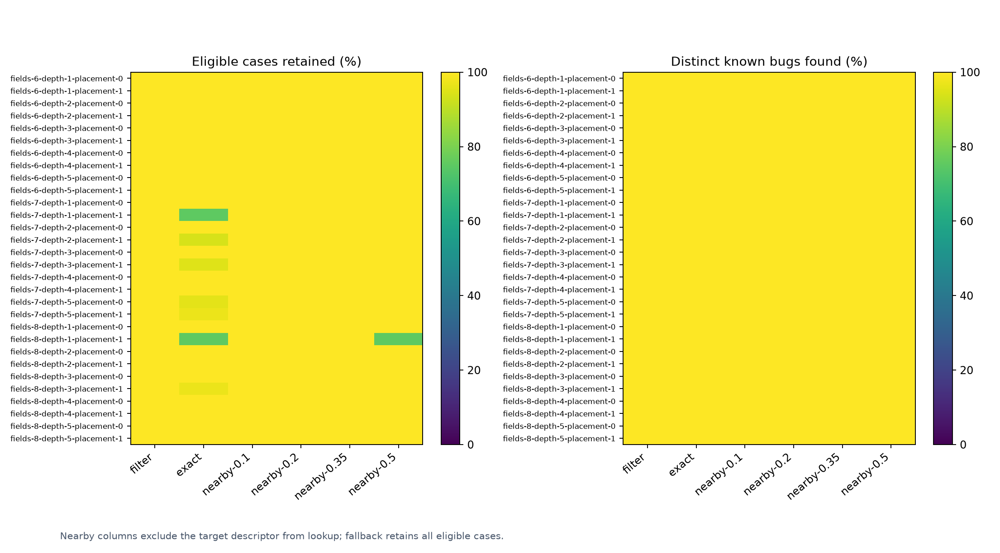
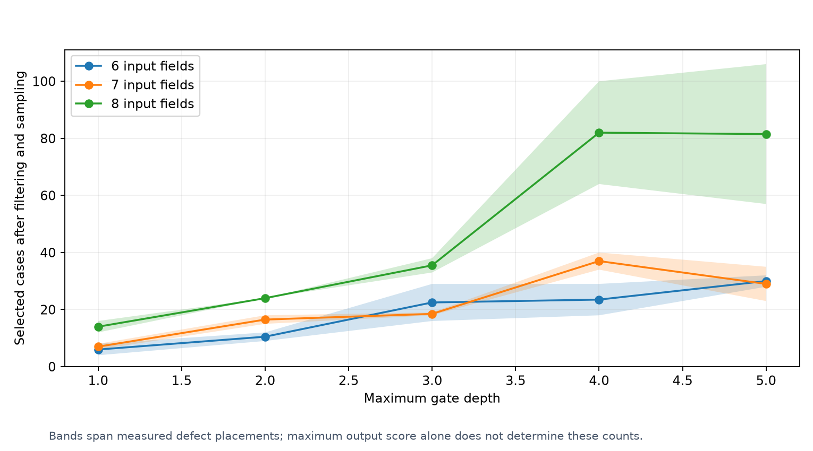

# Sampling evidence matrix

[Calibration](README.md)

Nearby matching enabled: **False**; selected maximum relative coordinate change: **0**.
The threshold is chosen from the same calibration study, not independent validation.

Each nearby check removes every exact match for the target profile. Unknown or out-of-range targets keep ordinary filtering.
Protected output regions are preserved. These results do not establish bug recall for random sampling alone.

| Case | Strategy | Match | Selected / eligible | Mean known bugs found | Seeds meeting bug and field targets |
| --- | --- | --- | ---: | ---: | ---: |
| fields-6-depth-1-placement-0 | filter | ordinary | 8.0 / 8 | 3.0 / 3 (100.0%) | 100 / 100 |
| fields-6-depth-1-placement-0 | exact | exact | 8.0 / 8 | 3.0 / 3 (100.0%) | 100 / 100 |
| fields-6-depth-1-placement-0 | nearby-0.1 | outside measured matching radius | 8.0 / 8 | 3.0 / 3 (100.0%) | 100 / 100 |
| fields-6-depth-1-placement-0 | nearby-0.2 | nearby | 8.0 / 8 | 3.0 / 3 (100.0%) | 100 / 100 |
| fields-6-depth-1-placement-0 | nearby-0.35 | nearby | 8.0 / 8 | 3.0 / 3 (100.0%) | 100 / 100 |
| fields-6-depth-1-placement-0 | nearby-0.5 | nearby | 8.0 / 8 | 3.0 / 3 (100.0%) | 100 / 100 |
| fields-6-depth-1-placement-1 | filter | ordinary | 4.0 / 4 | 3.0 / 3 (100.0%) | 100 / 100 |
| fields-6-depth-1-placement-1 | exact | exact | 4.0 / 4 | 3.0 / 3 (100.0%) | 100 / 100 |
| fields-6-depth-1-placement-1 | nearby-0.1 | outside measured range | 4.0 / 4 | 3.0 / 3 (100.0%) | 100 / 100 |
| fields-6-depth-1-placement-1 | nearby-0.2 | outside measured range | 4.0 / 4 | 3.0 / 3 (100.0%) | 100 / 100 |
| fields-6-depth-1-placement-1 | nearby-0.35 | outside measured range | 4.0 / 4 | 3.0 / 3 (100.0%) | 100 / 100 |
| fields-6-depth-1-placement-1 | nearby-0.5 | outside measured range | 4.0 / 4 | 3.0 / 3 (100.0%) | 100 / 100 |
| fields-6-depth-2-placement-0 | filter | ordinary | 12.0 / 12 | 3.0 / 3 (100.0%) | 100 / 100 |
| fields-6-depth-2-placement-0 | exact | exact | 12.0 / 12 | 3.0 / 3 (100.0%) | 100 / 100 |
| fields-6-depth-2-placement-0 | nearby-0.1 | outside measured matching radius | 12.0 / 12 | 3.0 / 3 (100.0%) | 100 / 100 |
| fields-6-depth-2-placement-0 | nearby-0.2 | outside measured matching radius | 12.0 / 12 | 3.0 / 3 (100.0%) | 100 / 100 |
| fields-6-depth-2-placement-0 | nearby-0.35 | nearby | 12.0 / 12 | 3.0 / 3 (100.0%) | 100 / 100 |
| fields-6-depth-2-placement-0 | nearby-0.5 | nearby | 12.0 / 12 | 3.0 / 3 (100.0%) | 100 / 100 |
| fields-6-depth-2-placement-1 | filter | ordinary | 9.0 / 9 | 3.0 / 3 (100.0%) | 100 / 100 |
| fields-6-depth-2-placement-1 | exact | exact | 9.0 / 9 | 3.0 / 3 (100.0%) | 100 / 100 |
| fields-6-depth-2-placement-1 | nearby-0.1 | outside measured matching radius | 9.0 / 9 | 3.0 / 3 (100.0%) | 100 / 100 |
| fields-6-depth-2-placement-1 | nearby-0.2 | outside measured matching radius | 9.0 / 9 | 3.0 / 3 (100.0%) | 100 / 100 |
| fields-6-depth-2-placement-1 | nearby-0.35 | nearby | 9.0 / 9 | 3.0 / 3 (100.0%) | 100 / 100 |
| fields-6-depth-2-placement-1 | nearby-0.5 | nearby | 9.0 / 9 | 3.0 / 3 (100.0%) | 100 / 100 |
| fields-6-depth-3-placement-0 | filter | ordinary | 29.0 / 29 | 3.0 / 3 (100.0%) | 100 / 100 |
| fields-6-depth-3-placement-0 | exact | exact | 29.0 / 29 | 3.0 / 3 (100.0%) | 100 / 100 |
| fields-6-depth-3-placement-0 | nearby-0.1 | outside measured matching radius | 29.0 / 29 | 3.0 / 3 (100.0%) | 100 / 100 |
| fields-6-depth-3-placement-0 | nearby-0.2 | outside measured matching radius | 29.0 / 29 | 3.0 / 3 (100.0%) | 100 / 100 |
| fields-6-depth-3-placement-0 | nearby-0.35 | nearby | 29.0 / 29 | 3.0 / 3 (100.0%) | 100 / 100 |
| fields-6-depth-3-placement-0 | nearby-0.5 | nearby | 29.0 / 29 | 3.0 / 3 (100.0%) | 100 / 100 |
| fields-6-depth-3-placement-1 | filter | ordinary | 16.0 / 16 | 3.0 / 3 (100.0%) | 100 / 100 |
| fields-6-depth-3-placement-1 | exact | exact | 16.0 / 16 | 3.0 / 3 (100.0%) | 100 / 100 |
| fields-6-depth-3-placement-1 | nearby-0.1 | outside measured matching radius | 16.0 / 16 | 3.0 / 3 (100.0%) | 100 / 100 |
| fields-6-depth-3-placement-1 | nearby-0.2 | nearby | 16.0 / 16 | 3.0 / 3 (100.0%) | 100 / 100 |
| fields-6-depth-3-placement-1 | nearby-0.35 | nearby | 16.0 / 16 | 3.0 / 3 (100.0%) | 100 / 100 |
| fields-6-depth-3-placement-1 | nearby-0.5 | nearby | 16.0 / 16 | 3.0 / 3 (100.0%) | 100 / 100 |
| fields-6-depth-4-placement-0 | filter | ordinary | 18.0 / 18 | 3.0 / 3 (100.0%) | 100 / 100 |
| fields-6-depth-4-placement-0 | exact | exact | 18.0 / 18 | 3.0 / 3 (100.0%) | 100 / 100 |
| fields-6-depth-4-placement-0 | nearby-0.1 | outside measured matching radius | 18.0 / 18 | 3.0 / 3 (100.0%) | 100 / 100 |
| fields-6-depth-4-placement-0 | nearby-0.2 | outside measured matching radius | 18.0 / 18 | 3.0 / 3 (100.0%) | 100 / 100 |
| fields-6-depth-4-placement-0 | nearby-0.35 | nearby | 18.0 / 18 | 3.0 / 3 (100.0%) | 100 / 100 |
| fields-6-depth-4-placement-0 | nearby-0.5 | nearby | 18.0 / 18 | 3.0 / 3 (100.0%) | 100 / 100 |
| fields-6-depth-4-placement-1 | filter | ordinary | 29.0 / 29 | 3.0 / 3 (100.0%) | 100 / 100 |
| fields-6-depth-4-placement-1 | exact | exact | 29.0 / 29 | 3.0 / 3 (100.0%) | 100 / 100 |
| fields-6-depth-4-placement-1 | nearby-0.1 | outside measured matching radius | 29.0 / 29 | 3.0 / 3 (100.0%) | 100 / 100 |
| fields-6-depth-4-placement-1 | nearby-0.2 | nearby | 29.0 / 29 | 3.0 / 3 (100.0%) | 100 / 100 |
| fields-6-depth-4-placement-1 | nearby-0.35 | nearby | 29.0 / 29 | 3.0 / 3 (100.0%) | 100 / 100 |
| fields-6-depth-4-placement-1 | nearby-0.5 | nearby | 29.0 / 29 | 3.0 / 3 (100.0%) | 100 / 100 |
| fields-6-depth-5-placement-0 | filter | ordinary | 32.0 / 32 | 3.0 / 3 (100.0%) | 100 / 100 |
| fields-6-depth-5-placement-0 | exact | exact | 32.0 / 32 | 3.0 / 3 (100.0%) | 100 / 100 |
| fields-6-depth-5-placement-0 | nearby-0.1 | outside measured matching radius | 32.0 / 32 | 3.0 / 3 (100.0%) | 100 / 100 |
| fields-6-depth-5-placement-0 | nearby-0.2 | nearby | 32.0 / 32 | 3.0 / 3 (100.0%) | 100 / 100 |
| fields-6-depth-5-placement-0 | nearby-0.35 | nearby | 32.0 / 32 | 3.0 / 3 (100.0%) | 100 / 100 |
| fields-6-depth-5-placement-0 | nearby-0.5 | nearby | 32.0 / 32 | 3.0 / 3 (100.0%) | 100 / 100 |
| fields-6-depth-5-placement-1 | filter | ordinary | 28.0 / 28 | 3.0 / 3 (100.0%) | 100 / 100 |
| fields-6-depth-5-placement-1 | exact | exact | 28.0 / 28 | 3.0 / 3 (100.0%) | 100 / 100 |
| fields-6-depth-5-placement-1 | nearby-0.1 | outside measured matching radius | 28.0 / 28 | 3.0 / 3 (100.0%) | 100 / 100 |
| fields-6-depth-5-placement-1 | nearby-0.2 | nearby | 28.0 / 28 | 3.0 / 3 (100.0%) | 100 / 100 |
| fields-6-depth-5-placement-1 | nearby-0.35 | nearby | 28.0 / 28 | 3.0 / 3 (100.0%) | 100 / 100 |
| fields-6-depth-5-placement-1 | nearby-0.5 | nearby | 28.0 / 28 | 3.0 / 3 (100.0%) | 100 / 100 |
| fields-7-depth-1-placement-0 | filter | ordinary | 8.0 / 8 | 3.0 / 3 (100.0%) | 100 / 100 |
| fields-7-depth-1-placement-0 | exact | exact | 8.0 / 8 | 3.0 / 3 (100.0%) | 100 / 100 |
| fields-7-depth-1-placement-0 | nearby-0.1 | outside measured matching radius | 8.0 / 8 | 3.0 / 3 (100.0%) | 100 / 100 |
| fields-7-depth-1-placement-0 | nearby-0.2 | nearby | 8.0 / 8 | 3.0 / 3 (100.0%) | 100 / 100 |
| fields-7-depth-1-placement-0 | nearby-0.35 | nearby | 8.0 / 8 | 3.0 / 3 (100.0%) | 100 / 100 |
| fields-7-depth-1-placement-0 | nearby-0.5 | nearby | 8.0 / 8 | 3.0 / 3 (100.0%) | 100 / 100 |
| fields-7-depth-1-placement-1 | filter | ordinary | 8.0 / 8 | 3.0 / 3 (100.0%) | 100 / 100 |
| fields-7-depth-1-placement-1 | exact | exact | 6.0 / 8 | 3.0 / 3 (100.0%) | 100 / 100 |
| fields-7-depth-1-placement-1 | nearby-0.1 | outside measured range | 8.0 / 8 | 3.0 / 3 (100.0%) | 100 / 100 |
| fields-7-depth-1-placement-1 | nearby-0.2 | outside measured range | 8.0 / 8 | 3.0 / 3 (100.0%) | 100 / 100 |
| fields-7-depth-1-placement-1 | nearby-0.35 | outside measured range | 8.0 / 8 | 3.0 / 3 (100.0%) | 100 / 100 |
| fields-7-depth-1-placement-1 | nearby-0.5 | outside measured range | 8.0 / 8 | 3.0 / 3 (100.0%) | 100 / 100 |
| fields-7-depth-2-placement-0 | filter | ordinary | 18.0 / 18 | 3.0 / 3 (100.0%) | 100 / 100 |
| fields-7-depth-2-placement-0 | exact | exact | 18.0 / 18 | 3.0 / 3 (100.0%) | 100 / 100 |
| fields-7-depth-2-placement-0 | nearby-0.1 | outside measured matching radius | 18.0 / 18 | 3.0 / 3 (100.0%) | 100 / 100 |
| fields-7-depth-2-placement-0 | nearby-0.2 | nearby | 18.0 / 18 | 3.0 / 3 (100.0%) | 100 / 100 |
| fields-7-depth-2-placement-0 | nearby-0.35 | nearby | 18.0 / 18 | 3.0 / 3 (100.0%) | 100 / 100 |
| fields-7-depth-2-placement-0 | nearby-0.5 | nearby | 18.0 / 18 | 3.0 / 3 (100.0%) | 100 / 100 |
| fields-7-depth-2-placement-1 | filter | ordinary | 16.0 / 16 | 3.0 / 3 (100.0%) | 100 / 100 |
| fields-7-depth-2-placement-1 | exact | exact | 15.0 / 16 | 3.0 / 3 (100.0%) | 100 / 100 |
| fields-7-depth-2-placement-1 | nearby-0.1 | outside measured matching radius | 16.0 / 16 | 3.0 / 3 (100.0%) | 100 / 100 |
| fields-7-depth-2-placement-1 | nearby-0.2 | nearby | 16.0 / 16 | 3.0 / 3 (100.0%) | 100 / 100 |
| fields-7-depth-2-placement-1 | nearby-0.35 | nearby | 16.0 / 16 | 3.0 / 3 (100.0%) | 100 / 100 |
| fields-7-depth-2-placement-1 | nearby-0.5 | nearby | 16.0 / 16 | 3.0 / 3 (100.0%) | 100 / 100 |
| fields-7-depth-3-placement-0 | filter | ordinary | 18.0 / 18 | 3.0 / 3 (100.0%) | 100 / 100 |
| fields-7-depth-3-placement-0 | exact | exact | 18.0 / 18 | 3.0 / 3 (100.0%) | 100 / 100 |
| fields-7-depth-3-placement-0 | nearby-0.1 | outside measured matching radius | 18.0 / 18 | 3.0 / 3 (100.0%) | 100 / 100 |
| fields-7-depth-3-placement-0 | nearby-0.2 | nearby | 18.0 / 18 | 3.0 / 3 (100.0%) | 100 / 100 |
| fields-7-depth-3-placement-0 | nearby-0.35 | nearby | 18.0 / 18 | 3.0 / 3 (100.0%) | 100 / 100 |
| fields-7-depth-3-placement-0 | nearby-0.5 | nearby | 18.0 / 18 | 3.0 / 3 (100.0%) | 100 / 100 |
| fields-7-depth-3-placement-1 | filter | ordinary | 20.0 / 20 | 3.0 / 3 (100.0%) | 100 / 100 |
| fields-7-depth-3-placement-1 | exact | exact | 19.0 / 20 | 3.0 / 3 (100.0%) | 100 / 100 |
| fields-7-depth-3-placement-1 | nearby-0.1 | outside measured matching radius | 20.0 / 20 | 3.0 / 3 (100.0%) | 100 / 100 |
| fields-7-depth-3-placement-1 | nearby-0.2 | outside measured matching radius | 20.0 / 20 | 3.0 / 3 (100.0%) | 100 / 100 |
| fields-7-depth-3-placement-1 | nearby-0.35 | nearby | 20.0 / 20 | 3.0 / 3 (100.0%) | 100 / 100 |
| fields-7-depth-3-placement-1 | nearby-0.5 | nearby | 20.0 / 20 | 3.0 / 3 (100.0%) | 100 / 100 |
| fields-7-depth-4-placement-0 | filter | ordinary | 40.0 / 40 | 3.0 / 3 (100.0%) | 100 / 100 |
| fields-7-depth-4-placement-0 | exact | exact | 40.0 / 40 | 3.0 / 3 (100.0%) | 100 / 100 |
| fields-7-depth-4-placement-0 | nearby-0.1 | outside measured matching radius | 40.0 / 40 | 3.0 / 3 (100.0%) | 100 / 100 |
| fields-7-depth-4-placement-0 | nearby-0.2 | nearby | 40.0 / 40 | 3.0 / 3 (100.0%) | 100 / 100 |
| fields-7-depth-4-placement-0 | nearby-0.35 | nearby | 40.0 / 40 | 3.0 / 3 (100.0%) | 100 / 100 |
| fields-7-depth-4-placement-0 | nearby-0.5 | nearby | 40.0 / 40 | 3.0 / 3 (100.0%) | 100 / 100 |
| fields-7-depth-4-placement-1 | filter | ordinary | 34.0 / 34 | 3.0 / 3 (100.0%) | 100 / 100 |
| fields-7-depth-4-placement-1 | exact | exact | 34.0 / 34 | 3.0 / 3 (100.0%) | 100 / 100 |
| fields-7-depth-4-placement-1 | nearby-0.1 | outside measured matching radius | 34.0 / 34 | 3.0 / 3 (100.0%) | 100 / 100 |
| fields-7-depth-4-placement-1 | nearby-0.2 | nearby | 34.0 / 34 | 3.0 / 3 (100.0%) | 100 / 100 |
| fields-7-depth-4-placement-1 | nearby-0.35 | nearby | 34.0 / 34 | 3.0 / 3 (100.0%) | 100 / 100 |
| fields-7-depth-4-placement-1 | nearby-0.5 | nearby | 34.0 / 34 | 3.0 / 3 (100.0%) | 100 / 100 |
| fields-7-depth-5-placement-0 | filter | ordinary | 24.0 / 24 | 3.0 / 3 (100.0%) | 100 / 100 |
| fields-7-depth-5-placement-0 | exact | exact | 23.0 / 24 | 3.0 / 3 (100.0%) | 100 / 100 |
| fields-7-depth-5-placement-0 | nearby-0.1 | outside measured matching radius | 24.0 / 24 | 3.0 / 3 (100.0%) | 100 / 100 |
| fields-7-depth-5-placement-0 | nearby-0.2 | nearby | 24.0 / 24 | 3.0 / 3 (100.0%) | 100 / 100 |
| fields-7-depth-5-placement-0 | nearby-0.35 | nearby | 24.0 / 24 | 3.0 / 3 (100.0%) | 100 / 100 |
| fields-7-depth-5-placement-0 | nearby-0.5 | nearby | 24.0 / 24 | 3.0 / 3 (100.0%) | 100 / 100 |
| fields-7-depth-5-placement-1 | filter | ordinary | 36.0 / 36 | 3.0 / 3 (100.0%) | 100 / 100 |
| fields-7-depth-5-placement-1 | exact | exact | 35.0 / 36 | 3.0 / 3 (100.0%) | 100 / 100 |
| fields-7-depth-5-placement-1 | nearby-0.1 | outside measured matching radius | 36.0 / 36 | 3.0 / 3 (100.0%) | 100 / 100 |
| fields-7-depth-5-placement-1 | nearby-0.2 | nearby | 36.0 / 36 | 3.0 / 3 (100.0%) | 100 / 100 |
| fields-7-depth-5-placement-1 | nearby-0.35 | nearby | 36.0 / 36 | 3.0 / 3 (100.0%) | 100 / 100 |
| fields-7-depth-5-placement-1 | nearby-0.5 | nearby | 36.0 / 36 | 3.0 / 3 (100.0%) | 100 / 100 |
| fields-8-depth-1-placement-0 | filter | ordinary | 16.0 / 16 | 4.0 / 4 (100.0%) | 100 / 100 |
| fields-8-depth-1-placement-0 | exact | exact | 16.0 / 16 | 4.0 / 4 (100.0%) | 100 / 100 |
| fields-8-depth-1-placement-0 | nearby-0.1 | outside measured matching radius | 16.0 / 16 | 4.0 / 4 (100.0%) | 100 / 100 |
| fields-8-depth-1-placement-0 | nearby-0.2 | outside measured matching radius | 16.0 / 16 | 4.0 / 4 (100.0%) | 100 / 100 |
| fields-8-depth-1-placement-0 | nearby-0.35 | outside measured matching radius | 16.0 / 16 | 4.0 / 4 (100.0%) | 100 / 100 |
| fields-8-depth-1-placement-0 | nearby-0.5 | nearby | 16.0 / 16 | 4.0 / 4 (100.0%) | 100 / 100 |
| fields-8-depth-1-placement-1 | filter | ordinary | 16.0 / 16 | 4.0 / 4 (100.0%) | 100 / 100 |
| fields-8-depth-1-placement-1 | exact | exact | 12.0 / 16 | 4.0 / 4 (100.0%) | 100 / 100 |
| fields-8-depth-1-placement-1 | nearby-0.1 | outside measured matching radius | 16.0 / 16 | 4.0 / 4 (100.0%) | 100 / 100 |
| fields-8-depth-1-placement-1 | nearby-0.2 | outside measured matching radius | 16.0 / 16 | 4.0 / 4 (100.0%) | 100 / 100 |
| fields-8-depth-1-placement-1 | nearby-0.35 | outside measured matching radius | 16.0 / 16 | 4.0 / 4 (100.0%) | 100 / 100 |
| fields-8-depth-1-placement-1 | nearby-0.5 | nearby | 12.0 / 16 | 4.0 / 4 (100.0%) | 100 / 100 |
| fields-8-depth-2-placement-0 | filter | ordinary | 24.0 / 24 | 4.0 / 4 (100.0%) | 100 / 100 |
| fields-8-depth-2-placement-0 | exact | exact | 24.0 / 24 | 4.0 / 4 (100.0%) | 100 / 100 |
| fields-8-depth-2-placement-0 | nearby-0.1 | outside measured matching radius | 24.0 / 24 | 4.0 / 4 (100.0%) | 100 / 100 |
| fields-8-depth-2-placement-0 | nearby-0.2 | nearby | 24.0 / 24 | 4.0 / 4 (100.0%) | 100 / 100 |
| fields-8-depth-2-placement-0 | nearby-0.35 | nearby | 24.0 / 24 | 4.0 / 4 (100.0%) | 100 / 100 |
| fields-8-depth-2-placement-0 | nearby-0.5 | nearby | 24.0 / 24 | 4.0 / 4 (100.0%) | 100 / 100 |
| fields-8-depth-2-placement-1 | filter | ordinary | 24.0 / 24 | 4.0 / 4 (100.0%) | 100 / 100 |
| fields-8-depth-2-placement-1 | exact | exact | 24.0 / 24 | 4.0 / 4 (100.0%) | 100 / 100 |
| fields-8-depth-2-placement-1 | nearby-0.1 | outside measured matching radius | 24.0 / 24 | 4.0 / 4 (100.0%) | 100 / 100 |
| fields-8-depth-2-placement-1 | nearby-0.2 | nearby | 24.0 / 24 | 4.0 / 4 (100.0%) | 100 / 100 |
| fields-8-depth-2-placement-1 | nearby-0.35 | nearby | 24.0 / 24 | 4.0 / 4 (100.0%) | 100 / 100 |
| fields-8-depth-2-placement-1 | nearby-0.5 | nearby | 24.0 / 24 | 4.0 / 4 (100.0%) | 100 / 100 |
| fields-8-depth-3-placement-0 | filter | ordinary | 38.0 / 38 | 4.0 / 4 (100.0%) | 100 / 100 |
| fields-8-depth-3-placement-0 | exact | exact | 38.0 / 38 | 4.0 / 4 (100.0%) | 100 / 100 |
| fields-8-depth-3-placement-0 | nearby-0.1 | outside measured matching radius | 38.0 / 38 | 4.0 / 4 (100.0%) | 100 / 100 |
| fields-8-depth-3-placement-0 | nearby-0.2 | nearby | 38.0 / 38 | 4.0 / 4 (100.0%) | 100 / 100 |
| fields-8-depth-3-placement-0 | nearby-0.35 | nearby | 38.0 / 38 | 4.0 / 4 (100.0%) | 100 / 100 |
| fields-8-depth-3-placement-0 | nearby-0.5 | nearby | 38.0 / 38 | 4.0 / 4 (100.0%) | 100 / 100 |
| fields-8-depth-3-placement-1 | filter | ordinary | 34.0 / 34 | 4.0 / 4 (100.0%) | 100 / 100 |
| fields-8-depth-3-placement-1 | exact | exact | 33.0 / 34 | 4.0 / 4 (100.0%) | 100 / 100 |
| fields-8-depth-3-placement-1 | nearby-0.1 | outside measured matching radius | 34.0 / 34 | 4.0 / 4 (100.0%) | 100 / 100 |
| fields-8-depth-3-placement-1 | nearby-0.2 | nearby | 34.0 / 34 | 4.0 / 4 (100.0%) | 100 / 100 |
| fields-8-depth-3-placement-1 | nearby-0.35 | nearby | 34.0 / 34 | 4.0 / 4 (100.0%) | 100 / 100 |
| fields-8-depth-3-placement-1 | nearby-0.5 | nearby | 34.0 / 34 | 4.0 / 4 (100.0%) | 100 / 100 |
| fields-8-depth-4-placement-0 | filter | ordinary | 64.0 / 64 | 4.0 / 4 (100.0%) | 100 / 100 |
| fields-8-depth-4-placement-0 | exact | exact | 64.0 / 64 | 4.0 / 4 (100.0%) | 100 / 100 |
| fields-8-depth-4-placement-0 | nearby-0.1 | outside measured matching radius | 64.0 / 64 | 4.0 / 4 (100.0%) | 100 / 100 |
| fields-8-depth-4-placement-0 | nearby-0.2 | nearby | 64.0 / 64 | 4.0 / 4 (100.0%) | 100 / 100 |
| fields-8-depth-4-placement-0 | nearby-0.35 | nearby | 64.0 / 64 | 4.0 / 4 (100.0%) | 100 / 100 |
| fields-8-depth-4-placement-0 | nearby-0.5 | nearby | 64.0 / 64 | 4.0 / 4 (100.0%) | 100 / 100 |
| fields-8-depth-4-placement-1 | filter | ordinary | 100.0 / 100 | 4.0 / 4 (100.0%) | 100 / 100 |
| fields-8-depth-4-placement-1 | exact | exact | 100.0 / 100 | 4.0 / 4 (100.0%) | 100 / 100 |
| fields-8-depth-4-placement-1 | nearby-0.1 | outside measured matching radius | 100.0 / 100 | 4.0 / 4 (100.0%) | 100 / 100 |
| fields-8-depth-4-placement-1 | nearby-0.2 | nearby | 100.0 / 100 | 4.0 / 4 (100.0%) | 100 / 100 |
| fields-8-depth-4-placement-1 | nearby-0.35 | nearby | 100.0 / 100 | 4.0 / 4 (100.0%) | 100 / 100 |
| fields-8-depth-4-placement-1 | nearby-0.5 | nearby | 100.0 / 100 | 4.0 / 4 (100.0%) | 100 / 100 |
| fields-8-depth-5-placement-0 | filter | ordinary | 106.0 / 106 | 4.0 / 4 (100.0%) | 100 / 100 |
| fields-8-depth-5-placement-0 | exact | exact | 106.0 / 106 | 4.0 / 4 (100.0%) | 100 / 100 |
| fields-8-depth-5-placement-0 | nearby-0.1 | outside measured range | 106.0 / 106 | 4.0 / 4 (100.0%) | 100 / 100 |
| fields-8-depth-5-placement-0 | nearby-0.2 | outside measured range | 106.0 / 106 | 4.0 / 4 (100.0%) | 100 / 100 |
| fields-8-depth-5-placement-0 | nearby-0.35 | outside measured range | 106.0 / 106 | 4.0 / 4 (100.0%) | 100 / 100 |
| fields-8-depth-5-placement-0 | nearby-0.5 | outside measured range | 106.0 / 106 | 4.0 / 4 (100.0%) | 100 / 100 |
| fields-8-depth-5-placement-1 | filter | ordinary | 57.0 / 57 | 4.0 / 4 (100.0%) | 100 / 100 |
| fields-8-depth-5-placement-1 | exact | exact | 57.0 / 57 | 4.0 / 4 (100.0%) | 100 / 100 |
| fields-8-depth-5-placement-1 | nearby-0.1 | outside measured matching radius | 57.0 / 57 | 4.0 / 4 (100.0%) | 100 / 100 |
| fields-8-depth-5-placement-1 | nearby-0.2 | nearby | 57.0 / 57 | 4.0 / 4 (100.0%) | 100 / 100 |
| fields-8-depth-5-placement-1 | nearby-0.35 | nearby | 57.0 / 57 | 4.0 / 4 (100.0%) | 100 / 100 |
| fields-8-depth-5-placement-1 | nearby-0.5 | nearby | 57.0 / 57 | 4.0 / 4 (100.0%) | 100 / 100 |

[CSV](matrix.csv) · [JSON and matching decision](matrix.json)
