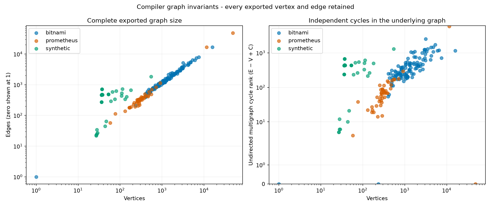

# Chart topology graphs

[Benchmarking](../README.md)

197 charts: 191 graphs with rendered baselines, 5 static-only graphs, and 1 chart without a values file. The [verification record](verification.json) accounts for every exported vertex and edge.

These are directed multigraphs G = (V, E) from the compiler, rendered with Matplotlib. Every exported vertex and edge is retained, including parallel references; overlapping marks are not removed.

Vertices represent values, control flow, templates, manifests, and manifest fields. Edges retain the compiler’s potential-reference, condition, control-flow, observed-render, and containment relations. PNG/SVG drawings and per-vertex coordinate tables accompany the full JSON/DOT graphs.

The horizontal rank is the longest directed dependency path from a source; vertical placement orders parents deterministically. Geometry is a drawing layout, not output distance or PCA. Dependency-chain length is not template nesting depth.

C is the number of weak components. The cycle rank E − V + C is the first Betti number of the one-dimensional underlying undirected multigraph. Parallel reference edges count separately. These invariants do not measure bug count or prove runtime influence. Opaque template access remains unresolved.

A rendered baseline is one observation. Static-only graphs could not obtain that baseline; missing-values and incomplete jobs are explicit. No unknown edges are invented.

[CSV table](results.csv) · [JSON inventory](results.json) · [Vector overview](graph-invariants.svg)

| Repository | Chart | Baseline / export | V | E | C | Cycle rank |
| --- | --- | --- | ---: | ---: | ---: | ---: |
| bitnami | [bitnami/airflow](bitnami/airflow/README.md) | rendered | 4790 | 5316 | 547 | 1073 |
| bitnami | [bitnami/apache](bitnami/apache/README.md) | rendered | 613 | 735 | 102 | 224 |
| bitnami | [bitnami/apisix](bitnami/apisix/README.md) | rendered | 3006 | 3353 | 367 | 714 |
| bitnami | [bitnami/appsmith](bitnami/appsmith/README.md) | rendered | 2712 | 2898 | 275 | 461 |
| bitnami | [bitnami/argo-cd](bitnami/argo-cd/README.md) | rendered | 3522 | 4332 | 490 | 1300 |
| bitnami | [bitnami/argo-workflows](bitnami/argo-workflows/README.md) | rendered | 2076 | 2289 | 212 | 425 |
| bitnami | [bitnami/aspnet-core](bitnami/aspnet-core/README.md) | rendered | 526 | 607 | 87 | 168 |
| bitnami | [bitnami/cadvisor](bitnami/cadvisor/README.md) | rendered | 487 | 550 | 75 | 138 |
| bitnami | [bitnami/cassandra](bitnami/cassandra/README.md) | rendered | 763 | 892 | 125 | 254 |
| bitnami | [bitnami/cert-manager](bitnami/cert-manager/README.md) | rendered | 2367 | 2596 | 180 | 409 |
| bitnami | [bitnami/chainloop](bitnami/chainloop/README.md) | rendered | 3130 | 3464 | 269 | 603 |
| bitnami | [bitnami/cilium](bitnami/cilium/README.md) | rendered | 3080 | 3417 | 585 | 922 |
| bitnami | [bitnami/clickhouse](bitnami/clickhouse/README.md) | rendered | 1651 | 1959 | 207 | 515 |
| bitnami | [bitnami/clickhouse-operator](bitnami/clickhouse-operator/README.md) | rendered | 1110 | 1244 | 129 | 263 |
| bitnami | [bitnami/cloudnative-pg](bitnami/cloudnative-pg/README.md) | rendered | 1987 | 2290 | 155 | 458 |
| bitnami | [bitnami/common](bitnami/common/README.md) | static-only | 235 | 213 | 22 | 0 |
| bitnami | [bitnami/concourse](bitnami/concourse/README.md) | rendered | 1333 | 1663 | 185 | 515 |
| bitnami | [bitnami/consul](bitnami/consul/README.md) | rendered | 743 | 890 | 106 | 253 |
| bitnami | [bitnami/contour](bitnami/contour/README.md) | rendered | 7520 | 7955 | 279 | 714 |
| bitnami | [bitnami/deepspeed](bitnami/deepspeed/README.md) | rendered | 1188 | 1186 | 202 | 200 |
| bitnami | [bitnami/discourse](bitnami/discourse/README.md) | rendered | 1504 | 1527 | 174 | 197 |
| bitnami | [bitnami/dremio](bitnami/dremio/README.md) | rendered | 4303 | 4612 | 515 | 824 |
| bitnami | [bitnami/drupal](bitnami/drupal/README.md) | rendered | 1133 | 1209 | 139 | 215 |
| bitnami | [bitnami/ejbca](bitnami/ejbca/README.md) | rendered | 1044 | 1112 | 108 | 176 |
| bitnami | [bitnami/elasticsearch](bitnami/elasticsearch/README.md) | rendered | 2607 | 3255 | 349 | 997 |
| bitnami | [bitnami/envoy-gateway](bitnami/envoy-gateway/README.md) | rendered | 1383 | 1541 | 135 | 293 |
| bitnami | [bitnami/etcd](bitnami/etcd/README.md) | rendered | 1053 | 1351 | 162 | 460 |
| bitnami | [bitnami/external-dns](bitnami/external-dns/README.md) | rendered | 840 | 1063 | 128 | 351 |
| bitnami | [bitnami/flink](bitnami/flink/README.md) | rendered | 1002 | 1123 | 123 | 244 |
| bitnami | [bitnami/fluent-bit](bitnami/fluent-bit/README.md) | rendered | 612 | 798 | 93 | 279 |
| bitnami | [bitnami/fluentd](bitnami/fluentd/README.md) | rendered | 1316 | 1578 | 171 | 433 |
| bitnami | [bitnami/flux](bitnami/flux/README.md) | rendered | 15926 | 16645 | 441 | 1160 |
| bitnami | [bitnami/ghost](bitnami/ghost/README.md) | rendered | 865 | 989 | 111 | 235 |
| bitnami | [bitnami/gitea](bitnami/gitea/README.md) | rendered | 1016 | 1128 | 102 | 214 |
| bitnami | [bitnami/gitlab-runner](bitnami/gitlab-runner/README.md) | rendered | 530 | 663 | 96 | 229 |
| bitnami | [bitnami/grafana](bitnami/grafana/README.md) | rendered | 727 | 862 | 115 | 250 |
| bitnami | [bitnami/grafana-alloy](bitnami/grafana-alloy/README.md) | rendered | 813 | 906 | 129 | 222 |
| bitnami | [bitnami/grafana-k6-operator](bitnami/grafana-k6-operator/README.md) | rendered | 739 | 829 | 82 | 172 |
| bitnami | [bitnami/grafana-loki](bitnami/grafana-loki/README.md) | rendered | 4225 | 5037 | 629 | 1441 |
| bitnami | [bitnami/grafana-mimir](bitnami/grafana-mimir/README.md) | rendered | 5350 | 6345 | 740 | 1735 |
| bitnami | [bitnami/grafana-operator](bitnami/grafana-operator/README.md) | rendered | 850 | 906 | 129 | 185 |
| bitnami | [bitnami/grafana-tempo](bitnami/grafana-tempo/README.md) | rendered | 3298 | 3937 | 456 | 1095 |
| bitnami | [bitnami/haproxy](bitnami/haproxy/README.md) | rendered | 501 | 584 | 76 | 159 |
| bitnami | [bitnami/harbor](bitnami/harbor/README.md) | rendered | 4786 | 5527 | 727 | 1468 |
| bitnami | [bitnami/influxdb](bitnami/influxdb/README.md) | rendered | 693 | 965 | 145 | 417 |
| bitnami | [bitnami/jaeger](bitnami/jaeger/README.md) | rendered | 1644 | 1672 | 217 | 245 |
| bitnami | [bitnami/janusgraph](bitnami/janusgraph/README.md) | rendered | 1173 | 1217 | 162 | 206 |
| bitnami | [bitnami/jenkins](bitnami/jenkins/README.md) | rendered | 855 | 1120 | 115 | 380 |
| bitnami | [bitnami/jupyterhub](bitnami/jupyterhub/README.md) | rendered | 1923 | 2104 | 249 | 430 |
| bitnami | [bitnami/kafka](bitnami/kafka/README.md) | rendered | 1683 | 2107 | 341 | 765 |
| bitnami | [bitnami/keycloak](bitnami/keycloak/README.md) | rendered | 1402 | 1718 | 172 | 488 |
| bitnami | [bitnami/keydb](bitnami/keydb/README.md) | rendered | 1300 | 1541 | 231 | 472 |
| bitnami | [bitnami/kibana](bitnami/kibana/README.md) | rendered | 488 | 703 | 95 | 310 |
| bitnami | [bitnami/kong](bitnami/kong/README.md) | rendered | 1912 | 2110 | 163 | 361 |
| bitnami | [bitnami/kube-arangodb](bitnami/kube-arangodb/README.md) | rendered | 1782 | 1993 | 138 | 349 |
| bitnami | [bitnami/kube-prometheus](bitnami/kube-prometheus/README.md) | rendered | 6575 | 7383 | 393 | 1201 |
| bitnami | [bitnami/kube-prometheus/charts/kube-prometheus-crds](bitnami/kube-prometheus/charts/kube-prometheus-crds/README.md) | rendered | 1 | 0 | 1 | 0 |
| bitnami | [bitnami/kube-state-metrics](bitnami/kube-state-metrics/README.md) | rendered | 783 | 903 | 75 | 195 |
| bitnami | [bitnami/kuberay](bitnami/kuberay/README.md) | rendered | 1985 | 2307 | 204 | 526 |
| bitnami | [bitnami/kubernetes-event-exporter](bitnami/kubernetes-event-exporter/README.md) | rendered | 485 | 509 | 97 | 121 |
| bitnami | [bitnami/logstash](bitnami/logstash/README.md) | rendered | 597 | 723 | 80 | 206 |
| bitnami | [bitnami/mariadb](bitnami/mariadb/README.md) | rendered | 1151 | 1418 | 281 | 548 |
| bitnami | [bitnami/mariadb-galera](bitnami/mariadb-galera/README.md) | rendered | 802 | 907 | 125 | 230 |
| bitnami | [bitnami/mastodon](bitnami/mastodon/README.md) | rendered | 4122 | 4350 | 401 | 629 |
| bitnami | [bitnami/matomo](bitnami/matomo/README.md) | rendered | 1394 | 1595 | 169 | 370 |
| bitnami | [bitnami/memcached](bitnami/memcached/README.md) | rendered | 589 | 757 | 128 | 296 |
| bitnami | [bitnami/metallb](bitnami/metallb/README.md) | rendered | 2702 | 2864 | 173 | 335 |
| bitnami | [bitnami/metrics-server](bitnami/metrics-server/README.md) | rendered | 529 | 568 | 73 | 112 |
| bitnami | [bitnami/milvus](bitnami/milvus/README.md) | rendered | 6047 | 6321 | 886 | 1160 |
| bitnami | [bitnami/mlflow](bitnami/mlflow/README.md) | rendered | 2314 | 2281 | 339 | 306 |
| bitnami | [bitnami/mongodb](bitnami/mongodb/README.md) | rendered | 1421 | 2139 | 347 | 1065 |
| bitnami | [bitnami/mongodb-sharded](bitnami/mongodb-sharded/README.md) | rendered | 2241 | 2695 | 256 | 710 |
| bitnami | [bitnami/moodle](bitnami/moodle/README.md) | rendered | 1039 | 1103 | 134 | 198 |
| bitnami | [bitnami/multus-cni](bitnami/multus-cni/README.md) | rendered | 425 | 416 | 71 | 62 |
| bitnami | [bitnami/mysql](bitnami/mysql/README.md) | rendered | 1039 | 1350 | 213 | 524 |
| bitnami | [bitnami/nats](bitnami/nats/README.md) | rendered | 691 | 790 | 142 | 241 |
| bitnami | [bitnami/neo4j](bitnami/neo4j/README.md) | rendered | 453 | 611 | 89 | 247 |
| bitnami | [bitnami/nessie](bitnami/nessie/README.md) | rendered | 1097 | 1175 | 145 | 223 |
| bitnami | [bitnami/nginx](bitnami/nginx/README.md) | rendered | 810 | 1062 | 125 | 377 |
| bitnami | [bitnami/node-exporter](bitnami/node-exporter/README.md) | rendered | 432 | 541 | 78 | 187 |
| bitnami | [bitnami/oauth2-proxy](bitnami/oauth2-proxy/README.md) | rendered | 944 | 985 | 110 | 151 |
| bitnami | [bitnami/odoo](bitnami/odoo/README.md) | rendered | 1021 | 1156 | 104 | 239 |
| bitnami | [bitnami/opensearch](bitnami/opensearch/README.md) | rendered | 3040 | 3817 | 472 | 1249 |
| bitnami | [bitnami/parse](bitnami/parse/README.md) | rendered | 1287 | 1459 | 155 | 327 |
| bitnami | [bitnami/phpmyadmin](bitnami/phpmyadmin/README.md) | rendered | 599 | 691 | 94 | 186 |
| bitnami | [bitnami/pinniped](bitnami/pinniped/README.md) | rendered | 2140 | 2418 | 132 | 410 |
| bitnami | [bitnami/postgresql](bitnami/postgresql/README.md) | rendered | 1193 | 1586 | 299 | 692 |
| bitnami | [bitnami/postgresql-ha](bitnami/postgresql-ha/README.md) | rendered | 1824 | 2286 | 290 | 752 |
| bitnami | [bitnami/prometheus](bitnami/prometheus/README.md) | rendered | 1303 | 1501 | 265 | 463 |
| bitnami | [bitnami/pytorch](bitnami/pytorch/README.md) | rendered | 504 | 603 | 93 | 192 |
| bitnami | [bitnami/rabbitmq](bitnami/rabbitmq/README.md) | rendered | 1046 | 1245 | 164 | 363 |
| bitnami | [bitnami/rabbitmq-cluster-operator](bitnami/rabbitmq-cluster-operator/README.md) | rendered | 2382 | 2717 | 152 | 487 |
| bitnami | [bitnami/redis](bitnami/redis/README.md) | rendered | 1739 | 2429 | 397 | 1087 |
| bitnami | [bitnami/redis-cluster](bitnami/redis-cluster/README.md) | rendered | 822 | 995 | 151 | 324 |
| bitnami | [bitnami/redmine](bitnami/redmine/README.md) | rendered | 1479 | 1567 | 159 | 247 |
| bitnami | [bitnami/schema-registry](bitnami/schema-registry/README.md) | rendered | 1135 | 1216 | 103 | 184 |
| bitnami | [bitnami/scylladb](bitnami/scylladb/README.md) | rendered | 927 | 1077 | 166 | 316 |
| bitnami | [bitnami/sealed-secrets](bitnami/sealed-secrets/README.md) | rendered | 688 | 883 | 78 | 273 |
| bitnami | [bitnami/seaweedfs](bitnami/seaweedfs/README.md) | rendered | 2952 | 3683 | 527 | 1258 |
| bitnami | [bitnami/solr](bitnami/solr/README.md) | rendered | 1278 | 1438 | 163 | 323 |
| bitnami | [bitnami/sonarqube](bitnami/sonarqube/README.md) | rendered | 1277 | 1394 | 205 | 322 |
| bitnami | [bitnami/spark](bitnami/spark/README.md) | rendered | 1056 | 1371 | 137 | 452 |
| bitnami | [bitnami/superset](bitnami/superset/README.md) | rendered | 2735 | 3029 | 342 | 636 |
| bitnami | [bitnami/tensorflow-resnet](bitnami/tensorflow-resnet/README.md) | rendered | 491 | 523 | 79 | 111 |
| bitnami | [bitnami/thanos](bitnami/thanos/README.md) | rendered | 3175 | 5176 | 543 | 2544 |
| bitnami | [bitnami/tomcat](bitnami/tomcat/README.md) | rendered | 667 | 710 | 130 | 173 |
| bitnami | [bitnami/valkey](bitnami/valkey/README.md) | rendered | 1582 | 2302 | 298 | 1018 |
| bitnami | [bitnami/valkey-cluster](bitnami/valkey-cluster/README.md) | rendered | 803 | 945 | 147 | 289 |
| bitnami | [bitnami/vault](bitnami/vault/README.md) | rendered | 1658 | 1881 | 250 | 473 |
| bitnami | [bitnami/victoriametrics](bitnami/victoriametrics/README.md) | rendered | 2958 | 3688 | 395 | 1125 |
| bitnami | [bitnami/whereabouts](bitnami/whereabouts/README.md) | rendered | 405 | 392 | 67 | 54 |
| bitnami | [bitnami/wildfly](bitnami/wildfly/README.md) | rendered | 646 | 780 | 90 | 224 |
| bitnami | [bitnami/wordpress](bitnami/wordpress/README.md) | rendered | 1267 | 1371 | 189 | 293 |
| bitnami | [bitnami/zipkin](bitnami/zipkin/README.md) | static-only | 409 | 511 | 147 | 249 |
| bitnami | [bitnami/zookeeper](bitnami/zookeeper/README.md) | rendered | 910 | 1188 | 109 | 387 |
| prometheus | [charts/alertmanager](prometheus/alertmanager/README.md) | static-only | 406 | 427 | 120 | 141 |
| prometheus | [charts/alertmanager-snmp-notifier](prometheus/alertmanager-snmp-notifier/README.md) | rendered | 306 | 336 | 53 | 83 |
| prometheus | [charts/jiralert](prometheus/jiralert/README.md) | rendered | 331 | 323 | 60 | 52 |
| prometheus | [charts/kube-prometheus-stack](prometheus/kube-prometheus-stack/README.md) | rendered | 11561 | 16788 | 651 | 5878 |
| prometheus | [charts/kube-prometheus-stack/charts/crds](prometheus/kube-prometheus-stack/charts/crds/README.md) | rendered | 77 | 113 | 2 | 38 |
| prometheus | [charts/kube-state-metrics](prometheus/kube-state-metrics/README.md) | rendered | 908 | 1134 | 66 | 292 |
| prometheus | [charts/prom-label-proxy](prometheus/prom-label-proxy/README.md) | rendered | 323 | 346 | 53 | 76 |
| prometheus | [charts/prometheus](prometheus/prometheus/README.md) | static-only | 556 | 485 | 243 | 172 |
| prometheus | [charts/prometheus-adapter](prometheus/prometheus-adapter/README.md) | rendered | 569 | 696 | 42 | 169 |
| prometheus | [charts/prometheus-blackbox-exporter](prometheus/prometheus-blackbox-exporter/README.md) | rendered | 462 | 411 | 143 | 92 |
| prometheus | [charts/prometheus-cloudwatch-exporter](prometheus/prometheus-cloudwatch-exporter/README.md) | rendered | 338 | 381 | 26 | 69 |
| prometheus | [charts/prometheus-conntrack-stats-exporter](prometheus/prometheus-conntrack-stats-exporter/README.md) | rendered | 132 | 137 | 17 | 22 |
| prometheus | [charts/prometheus-consul-exporter](prometheus/prometheus-consul-exporter/README.md) | rendered | 210 | 227 | 12 | 29 |
| prometheus | [charts/prometheus-couchdb-exporter](prometheus/prometheus-couchdb-exporter/README.md) | rendered | 182 | 190 | 11 | 19 |
| prometheus | [charts/prometheus-druid-exporter](prometheus/prometheus-druid-exporter/README.md) | rendered | 165 | 179 | 5 | 19 |
| prometheus | [charts/prometheus-elasticsearch-exporter](prometheus/prometheus-elasticsearch-exporter/README.md) | rendered | 354 | 386 | 47 | 79 |
| prometheus | [charts/prometheus-fastly-exporter](prometheus/prometheus-fastly-exporter/README.md) | rendered | 247 | 259 | 27 | 39 |
| prometheus | [charts/prometheus-ipmi-exporter](prometheus/prometheus-ipmi-exporter/README.md) | rendered | 266 | 205 | 91 | 30 |
| prometheus | [charts/prometheus-json-exporter](prometheus/prometheus-json-exporter/README.md) | rendered | 293 | 302 | 40 | 49 |
| prometheus | [charts/prometheus-kafka-exporter](prometheus/prometheus-kafka-exporter/README.md) | rendered | 295 | 346 | 34 | 85 |
| prometheus | [charts/prometheus-memcached-exporter](prometheus/prometheus-memcached-exporter/README.md) | rendered | 218 | 258 | 12 | 52 |
| prometheus | [charts/prometheus-modbus-exporter](prometheus/prometheus-modbus-exporter/README.md) | rendered | 227 | 192 | 49 | 14 |
| prometheus | [charts/prometheus-mongodb-exporter](prometheus/prometheus-mongodb-exporter/README.md) | rendered | 274 | 287 | 28 | 41 |
| prometheus | [charts/prometheus-mysql-exporter](prometheus/prometheus-mysql-exporter/README.md) | rendered | 293 | 345 | 38 | 90 |
| prometheus | [charts/prometheus-nats-exporter](prometheus/prometheus-nats-exporter/README.md) | rendered | 165 | 180 | 12 | 27 |
| prometheus | [charts/prometheus-nginx-exporter](prometheus/prometheus-nginx-exporter/README.md) | rendered | 256 | 281 | 20 | 45 |
| prometheus | [charts/prometheus-node-exporter](prometheus/prometheus-node-exporter/README.md) | rendered | 494 | 585 | 66 | 157 |
| prometheus | [charts/prometheus-operator-admission-webhook](prometheus/prometheus-operator-admission-webhook/README.md) | rendered | 717 | 826 | 69 | 178 |
| prometheus | [charts/prometheus-operator-crds](prometheus/prometheus-operator-crds/README.md) | rendered | 48596 | 48564 | 32 | 0 |
| prometheus | [charts/prometheus-operator-crds/charts/crds](prometheus/prometheus-operator-crds/charts/crds/README.md) | missing-values | N/A | N/A | N/A | N/A |
| prometheus | [charts/prometheus-pgbouncer-exporter](prometheus/prometheus-pgbouncer-exporter/README.md) | rendered | 322 | 357 | 35 | 70 |
| prometheus | [charts/prometheus-pingdom-exporter](prometheus/prometheus-pingdom-exporter/README.md) | rendered | 170 | 181 | 11 | 22 |
| prometheus | [charts/prometheus-pingmesh-exporter](prometheus/prometheus-pingmesh-exporter/README.md) | rendered | 471 | 451 | 138 | 118 |
| prometheus | [charts/prometheus-postgres-exporter](prometheus/prometheus-postgres-exporter/README.md) | static-only | 255 | 321 | 49 | 115 |
| prometheus | [charts/prometheus-pushgateway](prometheus/prometheus-pushgateway/README.md) | rendered | 372 | 364 | 77 | 69 |
| prometheus | [charts/prometheus-rabbitmq-exporter](prometheus/prometheus-rabbitmq-exporter/README.md) | rendered | 268 | 302 | 21 | 55 |
| prometheus | [charts/prometheus-redis-exporter](prometheus/prometheus-redis-exporter/README.md) | rendered | 320 | 400 | 33 | 113 |
| prometheus | [charts/prometheus-smartctl-exporter](prometheus/prometheus-smartctl-exporter/README.md) | rendered | 289 | 220 | 84 | 15 |
| prometheus | [charts/prometheus-snmp-exporter](prometheus/prometheus-snmp-exporter/README.md) | rendered | 390 | 493 | 49 | 152 |
| prometheus | [charts/prometheus-sql-exporter](prometheus/prometheus-sql-exporter/README.md) | rendered | 287 | 304 | 46 | 63 |
| prometheus | [charts/prometheus-stackdriver-exporter](prometheus/prometheus-stackdriver-exporter/README.md) | rendered | 268 | 326 | 27 | 85 |
| prometheus | [charts/prometheus-statsd-exporter](prometheus/prometheus-statsd-exporter/README.md) | rendered | 277 | 321 | 24 | 68 |
| prometheus | [charts/prometheus-systemd-exporter](prometheus/prometheus-systemd-exporter/README.md) | rendered | 284 | 249 | 71 | 36 |
| prometheus | [charts/prometheus-to-sd](prometheus/prometheus-to-sd/README.md) | rendered | 58 | 57 | 5 | 4 |
| prometheus | [charts/prometheus-windows-exporter](prometheus/prometheus-windows-exporter/README.md) | rendered | 392 | 413 | 47 | 68 |
| prometheus | [charts/prometheus-yet-another-cloudwatch-exporter](prometheus/prometheus-yet-another-cloudwatch-exporter/README.md) | rendered | 281 | 329 | 23 | 71 |
| synthetic | [bug-density/chart](synthetic/bug-density/chart/README.md) | rendered | 546 | 1848 | 1 | 1303 |
| synthetic | [discovery/chart](synthetic/discovery/chart/README.md) | rendered | 144 | 407 | 1 | 264 |
| synthetic | [expansion/charts/boundaries](synthetic/expansion/charts/boundaries/README.md) | rendered | 37 | 710 | 1 | 674 |
| synthetic | [expansion/charts/constraints](synthetic/expansion/charts/constraints/README.md) | rendered | 36 | 271 | 2 | 237 |
| synthetic | [expansion/charts/control-flow](synthetic/expansion/charts/control-flow/README.md) | rendered | 38 | 472 | 1 | 435 |
| synthetic | [expansion/charts/dependencies](synthetic/expansion/charts/dependencies/README.md) | rendered | 53 | 490 | 1 | 438 |
| synthetic | [expansion/charts/equivalence](synthetic/expansion/charts/equivalence/README.md) | rendered | 36 | 467 | 2 | 433 |
| synthetic | [expansion/charts/interactions](synthetic/expansion/charts/interactions/README.md) | rendered | 37 | 479 | 1 | 443 |
| synthetic | [matrix/charts/boundaries](synthetic/matrix/charts/boundaries/README.md) | rendered | 28 | 25 | 9 | 6 |
| synthetic | [matrix/charts/constraints](synthetic/matrix/charts/constraints/README.md) | rendered | 27 | 23 | 9 | 5 |
| synthetic | [matrix/charts/control-flow](synthetic/matrix/charts/control-flow/README.md) | rendered | 29 | 27 | 8 | 6 |
| synthetic | [matrix/charts/dependencies](synthetic/matrix/charts/dependencies/README.md) | rendered | 44 | 45 | 9 | 10 |
| synthetic | [matrix/charts/equivalence](synthetic/matrix/charts/equivalence/README.md) | rendered | 27 | 22 | 10 | 5 |
| synthetic | [matrix/charts/interactions](synthetic/matrix/charts/interactions/README.md) | rendered | 28 | 34 | 6 | 12 |
| synthetic | [nesting/charts/supported-deep](synthetic/nesting/charts/supported-deep/README.md) | rendered | 114 | 727 | 1 | 614 |
| synthetic | [nesting/charts/supported-random](synthetic/nesting/charts/supported-random/README.md) | rendered | 81 | 628 | 1 | 548 |
| synthetic | [nesting/charts/supported-shallow](synthetic/nesting/charts/supported-shallow/README.md) | rendered | 66 | 583 | 1 | 518 |
| synthetic | [nesting/charts/uniform-deep](synthetic/nesting/charts/uniform-deep/README.md) | rendered | 108 | 436 | 1 | 329 |
| synthetic | [nesting/charts/uniform-random](synthetic/nesting/charts/uniform-random/README.md) | rendered | 75 | 337 | 1 | 263 |
| synthetic | [nesting/charts/uniform-shallow](synthetic/nesting/charts/uniform-shallow/README.md) | rendered | 60 | 292 | 1 | 233 |
| synthetic | [pca/charts/boundaries](synthetic/pca/charts/boundaries/README.md) | rendered | 37 | 710 | 1 | 674 |
| synthetic | [pca/charts/constraints](synthetic/pca/charts/constraints/README.md) | rendered | 36 | 271 | 2 | 237 |
| synthetic | [pca/charts/control-flow](synthetic/pca/charts/control-flow/README.md) | rendered | 38 | 472 | 1 | 435 |
| synthetic | [pca/charts/dependencies](synthetic/pca/charts/dependencies/README.md) | rendered | 53 | 490 | 1 | 438 |
| synthetic | [pca/charts/equivalence](synthetic/pca/charts/equivalence/README.md) | rendered | 36 | 467 | 2 | 433 |
| synthetic | [pca/charts/interactions](synthetic/pca/charts/interactions/README.md) | rendered | 37 | 479 | 1 | 443 |
| synthetic | [topology-depth/charts/boundaries](synthetic/topology-depth/charts/boundaries/README.md) | rendered | 37 | 710 | 1 | 674 |
| synthetic | [topology-depth/charts/constraints](synthetic/topology-depth/charts/constraints/README.md) | rendered | 36 | 271 | 2 | 237 |
| synthetic | [topology-depth/charts/control-flow](synthetic/topology-depth/charts/control-flow/README.md) | rendered | 38 | 472 | 1 | 435 |
| synthetic | [topology-depth/charts/dependencies](synthetic/topology-depth/charts/dependencies/README.md) | rendered | 53 | 490 | 1 | 438 |
| synthetic | [topology-depth/charts/equivalence](synthetic/topology-depth/charts/equivalence/README.md) | rendered | 36 | 467 | 2 | 433 |
| synthetic | [topology-depth/charts/interactions](synthetic/topology-depth/charts/interactions/README.md) | rendered | 37 | 479 | 1 | 443 |
| synthetic | [topology-depth/charts/mixed-supported](synthetic/topology-depth/charts/mixed-supported/README.md) | rendered | 180 | 673 | 5 | 498 |
| synthetic | [topology-depth/charts/mixed-uniform](synthetic/topology-depth/charts/mixed-uniform/README.md) | rendered | 132 | 340 | 5 | 213 |
| synthetic | [normal-quantile](synthetic/normal-quantile/README.md) | rendered | 109 | 525 | 93 | 509 |
| synthetic | [topology-quantile](synthetic/topology-quantile/README.md) | rendered | 47 | 64 | 4 | 21 |

Source revisions:

- bitnami: `6a8cccf3c29a1faabf0c34c8276a09ed14f3c5b3`
- prometheus: `732bf3642c931946f1962fbd2e1b694ce8827e77`

Graph JSON, DOT and coordinate tables are losslessly gzip-compressed. Decode with `gzip -dc FILE.gz`; the plotting CLI accepts the decoded JSON. Dependency preparation uses isolated chart copies. Baseline rendering is not Kubernetes API schema validation.
