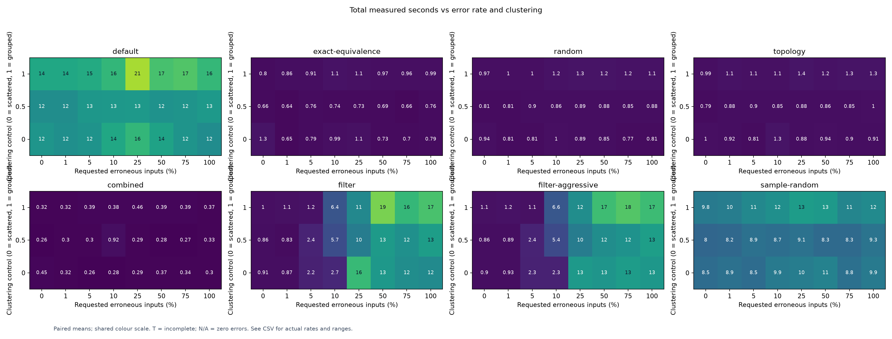
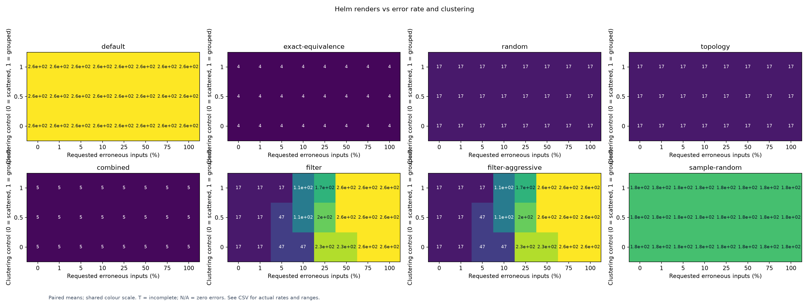
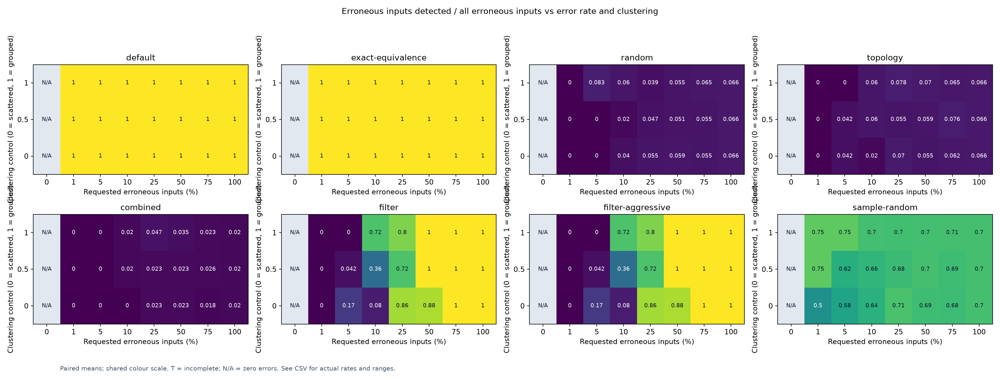
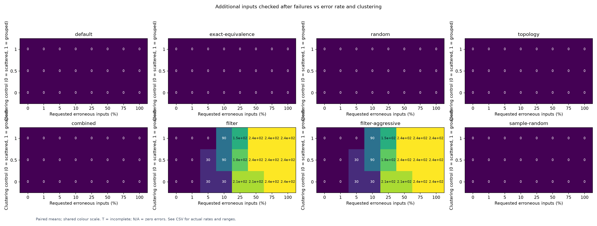

# Error rate and filtering

[Benchmarking](../../README.md)

Each surface changes error rate and one other parameter. Every method receives the same chart, assertion, and traversal seed.
Errors are seeded, input-aware assertions checked against actual Helm output. Templates stay fixed across error rates and seeds.
A failing assignment expects a corrected quantile value. This measures semantic property failures, not YAML parse failures.
Equal rendered manifests may pass for one input and fail for another; cached manifests still undergo the input-aware assertion.

**Depth:** vary nested conditions around one resource, keeping two quantile selector fields.
**Redundancy:** vary unused fields with no nested conditions; every unused Boolean doubles equivalent-input multiplicity.
**Clustering:** keep the chart fixed with two quantile selectors and no nested conditions, and vary failure placement.
Clustering zero orders assignments uniformly at random; one orders them by the number of switches differing from a seeded centre.
Intermediate controls blend random priority with this distance. They are placement controls, not measured correlation coefficients.
The ledger records the fraction of single-switch neighbours of failing inputs that also fail.

Error counts round down to whole assignments. Higher rates add failures to the same seeded ordering; actual rates are recorded.
The oracle is independent of selection: a failure enters the scheduler only after its input is evaluated.

Fixed settings: 8 Boolean fields, strength 2, 1 worker, 2 paired seeds, and 540 seconds per method's execution.
Small domains are fully enumerated before filtering. Each method starts with fresh compiler and render caches; OS caches can be warm.
Method order is shuffled within every paired comparison. Total time includes planning and execution; chart generation is excluded.
`filter` and `filter-aggressive` expand failed symbolic regions. The other methods retain their usual expansion-disabled behavior.
`sample-random` uses 70% with its 128-case floor. Aggressive sampling falls back when calibration cannot support it; the CSV records why.

Colours share a scale across methods within each figure. Cells show means across completed paired runs.
T = an incomplete execution; N/A = no erroneous inputs; blank = no measurement. No partial timing is shown as a completed runtime.
The CSV includes observed ranges, not confidence intervals. These synthetic assertions do not establish recall for arbitrary charts.

[Individual measurements](results.csv) · [Means and ranges](summary.csv) · [Oracle populations and provenance](results.json)

