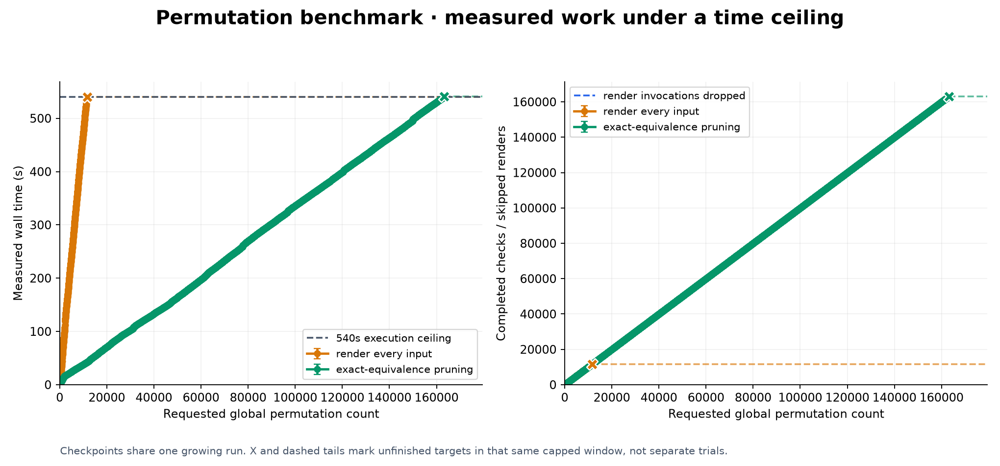
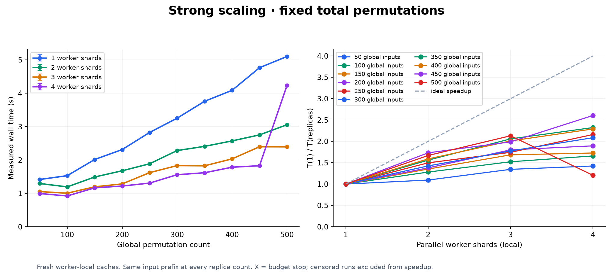
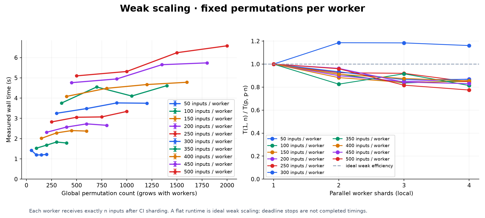

# Performance and scaling

[Benchmarking](../../README.md#performance-and-scaling)

Recorded permutation throughput and worker scaling for the retained [standard chart](standard-chart/).
See the [raw measurements](results.json), [CSV](results.csv) and [run log](run.log).

