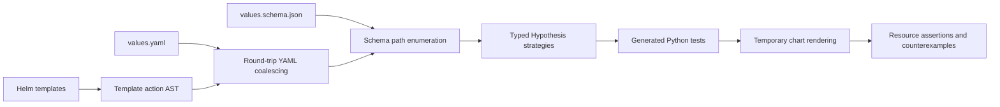

# Architecture

[Documentation](../README.md) · [Project](../../README.md)

## Input discovery and test generation

The compiler resolves template references to values paths and combines those
references with supplied values and schema constraints. Each supported path gets
a typed input-generation strategy. Generated Python properties use those strategies
to construct complete inputs that satisfy the values schema.

## Execution and validation

Each property tests generated values against an isolated copy of the chart. Helm
renders the templates, then resource assertions and optional Kubernetes schema
validation check the output. When a check fails, Hypothesis attempts to simplify
the failing input while preserving the failure.

A property can test multiple inputs and render multiple manifests. JUnit records
the property's result; execution reports retain the input and render counts.
Selection, caching, traversal, and sharding determine which properties execute.

## Finite permutation planning

When fields have finite value choices, the planner can select complete input
configurations for the requested interaction coverage or enumerate a small space.
Optional trimming reduces the planned cases. Exact-equivalence pruning skips a
render only when the compiler establishes that its output matches an input that
has already passed validation.

See [execution and coverage](../execution/README.md), the
[pruning contract](../safe-pruning.md), and the
[introductory example](../../README.md#example-catch-a-failure-hidden-by-defaults).
