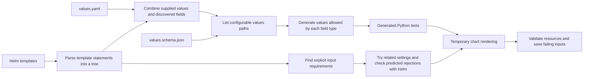

# Architecture

<!-- toc:start -->
**Table of contents**

- [Input discovery and test generation](#input-discovery-and-test-generation)
  - [Schema dialect handling](#schema-dialect-handling)
- [Execution and validation](#execution-and-validation)
- [Chart package layout](#chart-package-layout)
- [Execution package layout](#execution-package-layout)
- [Schema package layout](#schema-package-layout)
- [Reporting package layout](#reporting-package-layout)
- [Shared exceptions](#shared-exceptions)
- [Syntax trees and compiler passes](#syntax-trees-and-compiler-passes)
- [Finite permutation planning](#finite-permutation-planning)
- [Cooperative workload balancing](#cooperative-workload-balancing)
<!-- toc:end -->

[Documentation](../README.md) · [Project](../../README.md)

The compiler reads the chart to identify configurable fields and template
conditions. It uses that information to generate inputs and choose tests. Helm
then renders the selected inputs, and validators check the output. Analysis that
cannot interpret part of a template records that uncertainty instead of treating
it as evidence that a test can be skipped.[\[1\]](../safe-pruning.md#contract-and-distance)

## Input discovery and test generation

The compiler resolves template references to values paths and combines those
references with supplied values and schema constraints. Each supported path gets
rules for generating values of its declared or inferred type. A generated
**property** is a test that tries multiple inputs against the same checks. Those
inputs are assembled into complete values documents and checked against the
values schema.[\[2\]](../getting-started/README.md#quick-start)

If changing one path requires other values to change, the generator builds a valid surrounding configuration while keeping
the selected value at that path. Extracted fields retain the schema version that gives their constraints meaning.
The generator receives a separate Draft 7 representation; each generated configuration must still pass the full validation
contract and the selected path constraint. See [schema dialect handling](#schema-dialect-handling) for supported conversions.

### Schema dialect handling

The `$schema` declaration selects how to interpret keywords. We recognize Drafts 4, 6, 7, 2019-09 and 2020-12, including
their HTTP/HTTPS aliases. An absent declaration or the unversioned `json-schema.org/schema#` alias uses 2020-12.
Unknown explicit declarations are rejected. These are input-schema versions, independent of the Kubernetes version.
[JSON Schema's declaration reference](https://json-schema.org/understanding-json-schema/reference/schema) explains this distinction.

| Construct | Handling |
| --- | --- |
| Tuple arrays | Older positional `items` and `additionalItems` correspond to modern `prefixItems` and tail `items`. Path generation and finite enumeration preserve both regions. |
| Exclusive numeric bounds | Draft 4's Boolean switches are converted to numeric bounds for generation. Extracted fields retain their original interpretation. |
| `$ref` siblings | Sibling constraints are ignored through Draft 7 and enforced from 2019-09 onward. Local JSON Pointers support escaped names and array indices. |
| Dependencies | `dependentRequired` and `dependentSchemas` become equivalent Draft 7 dependency constraints for generation. |
| Compiler and configuration rules | Legacy contracts are upgraded equivalently before adding modern guards. Conversion fails explicitly if equivalence cannot be preserved. |
| Literal data | Objects inside `const`, `enum`, `default` and `examples` are data; schema-looking keys inside them are not rewritten or resolved. |

The generator cannot express every modern constraint. For `minContains`, `maxContains` and unevaluated-field rules, it may
generate a broader candidate set and then reject candidates using the full validator. Negation, exclusive alternatives and
conditional selectors also account for that broadening. This can cost extra attempts; the broader generation schema is
never evidence for pruning or a claim of exhaustive coverage.

Recursive references, dynamic references, named anchors and references requiring nested-resource resolution remain outside
the generation contract and fail explicitly. Supporting a dialect does not mean every construct can be generated or
enumerated. The official [array reference](https://json-schema.org/understanding-json-schema/reference/array) and
[2020-12 migration notes](https://json-schema.org/draft/2020-12/release-notes) describe the relevant differences.

## Execution and validation

Each property tests generated values against an isolated copy of the chart. Helm
renders the templates, then resource assertions and optional Kubernetes schema
validation check the output. When a check fails, Hypothesis attempts to simplify
the failing input while preserving the failure.

Each rendered YAML bundle is parsed once. Resource checks and Kubernetes schema
validation reuse those parsed documents, including when parallel workers prefetch Helm output.

A property can test multiple inputs and render multiple manifests. JUnit records
the property's result; execution reports retain the input and render counts.
Selection, caching, traversal, and sharding determine which properties execute.

The chart runner coordinates case planning, candidate checks and Helm rendering.
The shared chart model holds the loaded values and schema; inspection assembles audit findings.

`execution/runtime/processes.py` owns external commands and worker process groups until descendants have stopped
and direct children have been joined. Git, Helm, schema validators, collection, and benchmark commands use
the same owner. Communication errors and timeouts trigger cleanup; a failed cleanup retains the unresolved
ownership record while other children are still joined. Execution and cleanup failures are reported together.
The test scheduler stops children and joins worker threads even when scheduling or cleanup raises an error.
Outer pytest and CI owners allow longer interruption grace periods so inner command owners can finish cleanup.
The benchmark process pool also waits for its replicas to exit when a result raises
an exception.[\[3\]](../execution/README.md#shutdown-and-partial-results)
Benchmark commands pass arguments and chart workspace owners
explicitly, without changing the process command line or selecting a workspace through ambient context.

## Chart package layout

[`charts/`](../../pkg/hypothesis_helm/charts) groups code by its role in working with a chart:

| Package | Responsibility |
| --- | --- |
| [`inspection/`](../../pkg/hypothesis_helm/charts/inspection) | Audit inputs, discover template references and inspect available `tpl` source. |
| [`testing/`](../../pkg/hypothesis_helm/charts/testing) | Plan cases, render and validate manifests, and execute path properties or exhaustive tests. |
| [`repositories/`](../../pkg/hypothesis_helm/charts/repositories) | Acquire Git and registry sources, discover charts recursively, compare revisions and reuse cached results. |
| [`suites/`](../../pkg/hypothesis_helm/charts/suites) | Generate editable Python suites and provide their runtime helpers. |
| [`values/`](../../pkg/hypothesis_helm/charts/values) | Read and write YAML values and check whether input paths are present. |

[`model.py`](../../pkg/hypothesis_helm/charts/model.py) remains at the package root because
each group uses the same `Chart` representation. The public `from hypothesis_helm import Chart`
import and CLI commands retain their existing names. New generated suites import runtime
helpers from `hypothesis_helm.charts.suites.runtime`. Update that import in existing saved
suites, or regenerate them if they contain no custom edits.

`charts/testing` coordinates chart-specific work. The separate
[`execution/`](../../pkg/hypothesis_helm/execution) package owns worker processes, queues,
signals and scheduling shared by those operations.

## Execution package layout

[`execution/suite.py`](../../pkg/hypothesis_helm/execution/suite.py) coordinates saved-suite runs.
Its supporting modules are grouped by responsibility:

| Package | Responsibility |
| --- | --- |
| [`planning/`](../../pkg/hypothesis_helm/execution/planning) | Select and order inputs, apply measured sampling policies, and estimate work. Calibration evidence lives in `planning/data/`. |
| [`workers/`](../../pkg/hypothesis_helm/execution/workers) | Dispatch properties and chart paths, manage their queues, and adjust concurrency from measured throughput. |
| [`runtime/`](../../pkg/hypothesis_helm/execution/runtime) | Own subprocesses and shutdown signals, and interpret CI environment settings. |
| [`state/`](../../pkg/hypothesis_helm/execution/state) | Store outcomes and manifest streams, compare render hashes, and track YAML structure changes for cache reuse. |

The worker CLI and pytest cache plugin use these module paths. Reinstall the project after updating an editable checkout
so its installed worker entry point follows the new layout. Helm commands and saved-suite runtime imports are unchanged.

## Schema package layout

[`schemas/`](../../pkg/hypothesis_helm/schemas) separates the rules supplied by users, the inputs generated for testing,
and the Kubernetes schemas used to validate output:

| Package | Responsibility |
| --- | --- |
| [`configuration/`](../../pkg/hypothesis_helm/schemas/configuration) | Load input constraints, select charts, and resolve inherited Hypothesis settings and character policies. |
| [`generation/`](../../pkg/hypothesis_helm/schemas/generation) | Build input domains and Hypothesis strategies, prioritize known fields, and construct replayable finite permutation plans. |
| [`kubernetes/`](../../pkg/hypothesis_helm/schemas/kubernetes) | Resolve built-in and custom resource schemas, manage the schema cache, and validate rendered manifests. |

The shared `ValuesModel`, path traversal, opaque-object inspection, and JSON conversion remain in
`model.py`, `paths.py`, `opaque.py`, and `contracts.py` at the package root. These describe values without choosing a testing
policy. Hypothesis strategy construction lives in `generation/strategies.py`.

CLI commands and configuration keys are unchanged. Existing saved suites that import `schema_strategy` or
`supported_generated_text` from `schemas.contracts` should import them from
`hypothesis_helm.schemas.generation.strategies`, or be regenerated if they contain no custom edits.

## Reporting package layout

[`reporting/`](../../pkg/hypothesis_helm/reporting) groups output code by what it produces:

| Package | Responsibility |
| --- | --- |
| [`console/`](../../pkg/hypothesis_helm/reporting/console) | Live finding logs, pytest progress, terminal displays, and rendered manifest streams. |
| [`reports/`](../../pkg/hypothesis_helm/reporting/reports) | Repository and shard summaries, Kubesec reports, Markdown/PDF layout, overview plots, links, and finding appendices. |
| [`evidence/`](../../pkg/hypothesis_helm/reporting/evidence) | Failing inputs, diagnostic grouping, value changes, atomic checkpoints, and run provenance. |
| [`coverage/`](../../pkg/hypothesis_helm/reporting/coverage) | Permutation statistics and progressive coverage estimates and plots. |
| [`documentation/`](../../pkg/hypothesis_helm/reporting/documentation) | Generated CLI help and linked tables of contents. |

Shared report images stay in `reporting/assets/`. Execution deadlines belong to
[`execution/runtime/budget.py`](../../pkg/hypothesis_helm/execution/runtime/budget.py), alongside process and signal handling.

Command names and report formats are unchanged. The documentation CLI now targets
`hypothesis_helm.reporting.documentation.contents`, and the pytest progress plugin lives at
`hypothesis_helm.reporting.console.progress`. Reinstall an editable checkout after this update so the documentation
entry point uses its new location.

## Shared exceptions

Package-owned exceptions are defined in [`exceptions/`](../../pkg/hypothesis_helm/exceptions)
and imported directly from the module for their concern:

| Module | Exceptions |
| --- | --- |
| `hypothesis_helm.exceptions.compiler` | Unsupported analysis (`Unknown`, `Unavailable`, `UnsupportedTransformation`), explicit chart rejection (`Rejection`), and loop control (`LoopControl`). |
| `hypothesis_helm.exceptions.rendering` | `RenderFailure`, with its finding code and evidence. |
| `hypothesis_helm.exceptions.schemas` | `NonFiniteSchema`, when exhaustive enumeration cannot be established. |
| `hypothesis_helm.exceptions.execution` | `TimeLimitReached`, a cancellation signal outside ordinary `Exception` handlers. |

Benchmarking imports these shared definitions. The catalog and pipeline currently define no custom
exceptions. New package-specific exceptions belong in that package's own `exceptions/` directory;
built-in and third-party exceptions retain their original definitions.

## Syntax trees and compiler passes

The [compiler guide](../compiler/README.md) describes the flow from template
parsing and typed values to input discovery, output analysis, selection, and
exports. It includes a pass reference and
[panel-by-panel decision diagrams](../compiler/decisions.md).

## Finite permutation planning

When fields have finite value choices, the planner can select complete input
configurations for the requested interaction coverage or enumerate a small space.
Optional filtering reduces the planned cases. Exact-equivalence pruning skips a
render only when the compiler establishes that its output matches an input that
has already passed validation.

See [execution and coverage](../execution/README.md), the
[pruning contract](../safe-pruning.md), and the
[introductory examples](../../README.md#examples-failures-hidden-by-defaults).

## Cooperative workload balancing

[The preserved local scheduler](../../pkg/pipeline/README.md) builds on workload contracts to update runtime estimates,
reorder ready work, and request checkpoint/resume at safe boundaries. It logs graph mutations and scheduling decisions and
can export Mermaid snapshots. Existing subprocess operations remain non-preemptible unless adapted to the cooperative contract.

The separate [Reflow project](https://github.com/astrivant/reflow) evolves independently; refresh still uses the local scheduler.
