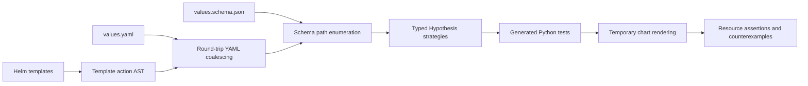

# Architecture

[Documentation](../README.md) · [Project](../../README.md)



### Worked example: `$.replicas` to validated Deployments

Start with [`examples/workload/values.yaml`](../../examples/workload/values.yaml):
`replicas: 1`. Its [schema](../../examples/workload/values.schema.json) declares an
integer between `0` and `5`, inclusive. The [template](../../examples/workload/templates/resource.yaml)
reads that lever directly:

```yaml
spec:
  replicas: {{ .Values.replicas }}
```

Discovery resolves `.Values.replicas` to `$.replicas`. Coalescing keeps the existing
value `1` and its documented constraints; nothing needs to be inferred for this
path. The integer bounds select `st.integers(min_value=0, max_value=5)`.

From this repository, with Helm, the plugin, Git, and
[kubeconform](https://github.com/yannh/kubeconform) installed, run:

```sh
mkdir -p reports
helm hypothesis test examples/workload \
  --match replicas --max-examples 6 --seed 0 --shard none --rerun all \
  --kubeconform --schema-version 1.35.0 \
  --schema-cache-dir .cache/hypothesis-helm/schemas \
  --artifact-dir reports/replicas --output json > reports/replicas.jsonl
```

The command prepares the cached Kubernetes schemas and writes
`reports/replicas/test_chart_values.py`. Its replica property contains the following
code (imports, fixture, and docstring omitted):

```python
@pytest.mark.hypothesis_helm_path(('replicas',))
@settings(max_examples=6, deadline=None, suppress_health_check=[HealthCheck.too_slow])
@given(value=st.integers(min_value=0, max_value=5), data=st.data())
def test_replicas_fc55c2d623(chart: Chart, value: object, data: DataObject) -> None:
    check_path(chart, ('replicas',), value, data, options=OPTIONS)
```

For a draw of `3`, `check_path` replaces `replicas` in a copy of the coalesced
values, leaving `image.repository: nginx` and `image.tag: stable`. It checks that
this complete input satisfies the values schema, then runs `helm template` against
a temporary chart. The resulting Deployment has `spec.replicas: 3` and image
`nginx:stable`. The resource is emitted as one JSON line and validated against the
cached Kubernetes 1.35.0 Deployment schema. A rendering or validation error fails
the property; Hypothesis then tries to reduce the failing input.

The amount of work is concrete:

| Stage | Work generated | Why |
| --- | --- | --- |
| Generate the suite | **4 Python property tests** | Paths are `$.replicas`, `$.image`, `$.image.repository`, and `$.image.tag`; object containers also receive a property. |
| Select tests | **1 property** | `--match replicas` filters execution after generation; it does not reduce the generated suite. |
| Execute this example | **6 successful inputs, 6 Helm renders, 6 kubeconform invocations** | The verified run exercised each integer from `0` through `5`, with a six-example budget and valid unchanged sibling values. |
| Produce results | **6 Deployment JSON lines; 1 passing JUnit test case** | This chart emits one Deployment per render. JUnit counts the property, not its individual Hypothesis examples. |

`--rerun all` makes the command execute even if the path passed previously. Six
renders is the observed successful result for this example, not a general promise
of `--max-examples 6`: rejected inputs, failure replay, and shrinking can change the
work. Removing `--match` runs all four properties, each with its own example budget;
it does not enumerate the `6 × 2 × 2 = 24` whole-chart configurations. Progress and
ETA count completed properties, so this selected run finishes at **1/1**, not **6/6**.
