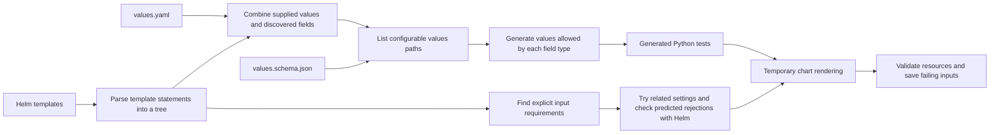

# Architecture

<!-- toc:start -->
**Table of contents**

- [Input discovery and test generation](#input-discovery-and-test-generation)
- [Execution and validation](#execution-and-validation)
- [Syntax trees and compiler passes](#syntax-trees-and-compiler-passes)
- [Finite permutation planning](#finite-permutation-planning)
- [Cooperative workload balancing](#cooperative-workload-balancing)
<!-- toc:end -->

[Documentation](../README.md) · [Project](../../README.md)

The compiler reads the chart to identify configurable fields and template
conditions. It uses that information to generate inputs and choose tests. Helm
then renders the selected inputs, and validators check the output. Analysis that
cannot interpret part of a template records that uncertainty instead of treating
it as evidence that a test can be skipped.[\[1\]](../safe-pruning.md#contract-and-distance)

## Input discovery and test generation

The compiler resolves template references to values paths and combines those
references with supplied values and schema constraints. Each supported path gets
rules for generating values of its declared or inferred type. A generated
**property** is a test that tries multiple inputs against the same checks. Those
inputs are assembled into complete values documents and checked against the
values schema.[\[2\]](../getting-started/README.md#quick-start)

## Execution and validation

Each property tests generated values against an isolated copy of the chart. Helm
renders the templates, then resource assertions and optional Kubernetes schema
validation check the output. When a check fails, Hypothesis attempts to simplify
the failing input while preserving the failure.

A property can test multiple inputs and render multiple manifests. JUnit records
the property's result; execution reports retain the input and render counts.
Selection, caching, traversal, and sharding determine which properties execute.

The chart runner coordinates separate modules: `charts/model.py` owns loaded contracts,
`charts/planning.py` builds finite plans and estimates, `charts/candidates.py` evaluates one candidate,
`charts/rendering.py` owns Helm rendering, and `charts/audit.py` assembles audit findings.

`execution/processes.py` owns external commands and worker process groups until descendants have stopped
and direct children have been joined. Git, Helm, schema validators, collection, and benchmark commands use
the same owner. Communication errors and timeouts trigger cleanup; a failed cleanup retains the unresolved
ownership record while other children are still joined. Execution and cleanup failures are reported together.
The test scheduler stops children and joins worker threads even when scheduling or cleanup raises an error.
Outer pytest and CI owners allow longer interruption grace periods so inner command owners can finish cleanup.
The benchmark process pool also waits for its replicas to exit when a result raises
an exception.[\[3\]](../execution/README.md#shutdown-and-partial-results)
Benchmark commands pass arguments and chart workspace owners
explicitly, without changing the process command line or selecting a workspace through ambient context.

## Syntax trees and compiler passes

The [compiler guide](../compiler/README.md) describes the flow from template
parsing and typed values to input discovery, output analysis, selection, and
exports. It includes a pass reference and
[panel-by-panel decision diagrams](../compiler/decisions.md).

## Finite permutation planning

When fields have finite value choices, the planner can select complete input
configurations for the requested interaction coverage or enumerate a small space.
Optional trimming reduces the planned cases. Exact-equivalence pruning skips a
render only when the compiler establishes that its output matches an input that
has already passed validation.

See [execution and coverage](../execution/README.md), the
[pruning contract](../safe-pruning.md), and the
[introductory examples](../../README.md#examples-failures-hidden-by-defaults).

## Cooperative workload balancing

[The preserved local scheduler](../../pkg/workbalance/README.md) builds on workload contracts to update runtime estimates,
reorder ready work, and request checkpoint/resume at safe boundaries. It logs graph mutations and scheduling decisions and
can export Mermaid snapshots. Existing subprocess operations remain non-preemptible unless adapted to the cooperative contract.

The separate [Reflow project](https://github.com/astrivant/reflow) evolves independently; refresh still uses the local scheduler.
