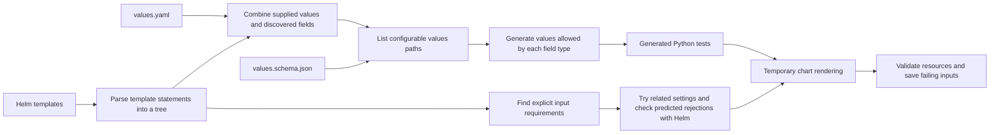

# Architecture

[Documentation](../README.md) · [Project](../../README.md)

The compiler reads the chart to identify configurable fields and template
conditions. It uses that information to generate inputs and choose tests. Helm
then renders the selected inputs, and validators check the output. Analysis that
cannot interpret part of a template records that uncertainty instead of treating
it as evidence that a test can be skipped.[\[1\]](../safe-pruning.md#contract-and-distance)

## Input discovery and test generation

The compiler resolves template references to values paths and combines those
references with supplied values and schema constraints. Each supported path gets
rules for generating values of its declared or inferred type. A generated
**property** is a test that tries multiple inputs against the same checks. Those
inputs are assembled into complete values documents and checked against the
values schema.[\[2\]](../getting-started/README.md#quick-start)

## Execution and validation

Each property tests generated values against an isolated copy of the chart. Helm
renders the templates, then resource assertions and optional Kubernetes schema
validation check the output. When a check fails, Hypothesis attempts to simplify
the failing input while preserving the failure.

A property can test multiple inputs and render multiple manifests. JUnit records
the property's result; execution reports retain the input and render counts.
Selection, caching, traversal, and sharding determine which properties execute.

The chart runner coordinates separate modules: `charts/model.py` owns loaded contracts,
`charts/planning.py` builds finite plans and estimates, `charts/candidates.py` evaluates one candidate,
`charts/rendering.py` owns Helm rendering, and `charts/audit.py` assembles audit findings.

`execution/processes.py` owns external commands and worker process groups until descendants have stopped
and direct children have been joined. Git, Helm, schema validators, collection, and benchmark commands use
the same owner. Communication errors and timeouts trigger cleanup; a failed cleanup retains the unresolved
ownership record while other children are still joined. Execution and cleanup failures are reported together.
The test scheduler stops children and joins worker threads even when scheduling or cleanup raises an error.
Outer pytest and CI owners allow longer interruption grace periods so inner command owners can finish cleanup.
The benchmark process pool also waits for its replicas to exit when a result raises
an exception.[\[3\]](../execution/README.md#shutdown-and-partial-results)
Benchmark commands pass arguments and chart workspace owners
explicitly, without changing the process command line or selecting a workspace through ambient context.

## Syntax trees and compiler passes

`pkg/hypothesis_helm/compiler/asts/` holds template nodes, expression trees, helper
definitions, and evaluators for the supported template operations. An **abstract
syntax tree (AST)** represents the structure of parsed template statements.
Discovery and output prediction share the code that splits template text into
tokens. Template syntax forms a tree; named
helper calls connect those trees into a graph. Source filenames and line numbers
connect analysis results back to chart code.

`pkg/hypothesis_helm/compiler/passes/` holds input discovery, topology analysis,
equivalence pruning, rejection-guided generation, and export passes. Constants
remain at the compiler root. Rejection analysis navigates parsed nodes rather than searching
comments or message strings for words such as `fail`.

Dependency records live in `compiler/asts/dependencies.py`; their discovery and
generation pass lives in `compiler/passes/dependencies.py`. The pass reads installed
child directories and archives, qualifies child inputs by alias, and records ordered
Boolean conditions and shared tag controls. It discovers these controls even when
they appear only in chart metadata. A nested dependency records both its own
enablement conditions and those of its parent dependencies.

Path generation proposes an enabled context for child settings while preserving
the selected value and original parent-schema constraints. The original context
remains eligible because parent templates may read child values independently of
activation. When allowed values can be enumerated, planning proposes testing a
child field together with the settings needed to enable that child. Existing
group-size budgets still apply.[\[4\]](../scanning/README.md#discovery-and-testing)

Graph exports connect controls to dependency instances and child templates.
Activation states are predictions, and every scheduled candidate is rendered by
Helm. Missing or ambiguous sources, unresolved imports, and unsupported forwarding
remain explicit limitations. Dependency activation never authorizes skipping a
render: exact-equivalence and topology proofs still exclude charts with dependencies.

With `--filter`, local tests and repository scans evaluate supported branches
leading to explicit `fail` and `required` calls, including statically named helper
calls. The first two distinct rejected inputs for each requirement are checked
against Helm; charts with dependencies require native confirmation for every
predicted rejection because coalescing and imports may alter the input context.
A different native outcome disables that requirement's filtering;
an unexpected rendering failure remains a failure.

Automatic exclusions apply to inferred input domains. When an authored
`values.schema.json` admits an input that a template rejects, the tool retains the
failure and reports the requirement as a schema/validation conflict. Template
guards do not silently narrow the declared contract.

Sampled path tests try at most 32 single-field adjustments using supplied defaults,
Boolean alternatives, and adjacent integers. They preserve the selected path and
the original schema, then render and test any replacement. Finite permutation
assignments are preserved; rejected assignments are counted separately. Supplied
defaults always receive normal validation.

Unknown expressions, dynamic helper contexts, unsupported scope mutation, and
recursive helper calls beyond the bounded evaluator remain ordinary test inputs.
These contracts describe chart-authored validation, not proof that its rules are
correct. This generation policy is separate from proved output equivalence.

## Finite permutation planning

When fields have finite value choices, the planner can select complete input
configurations for the requested interaction coverage or enumerate a small space.
Optional trimming reduces the planned cases. Exact-equivalence pruning skips a
render only when the compiler establishes that its output matches an input that
has already passed validation.

See [execution and coverage](../execution/README.md), the
[pruning contract](../safe-pruning.md), and the
[introductory example](../../README.md#example-catch-a-failure-hidden-by-defaults).
