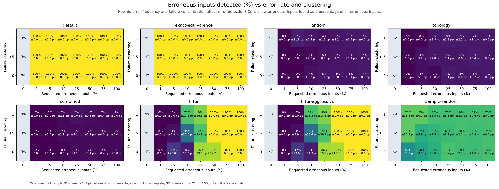
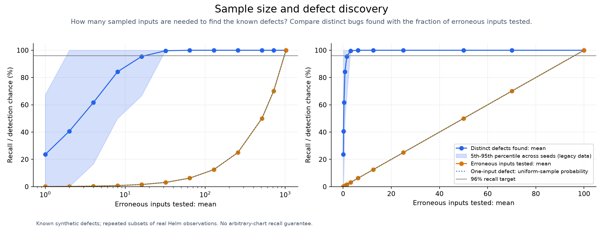
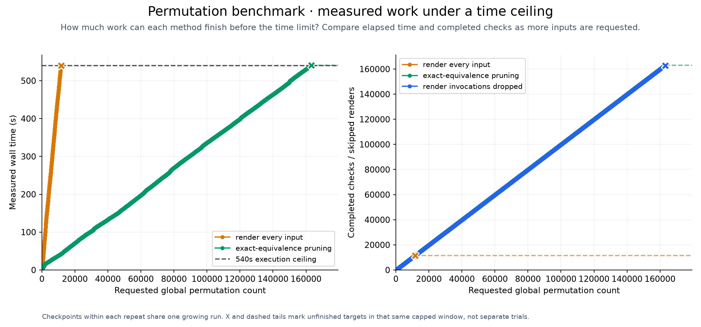
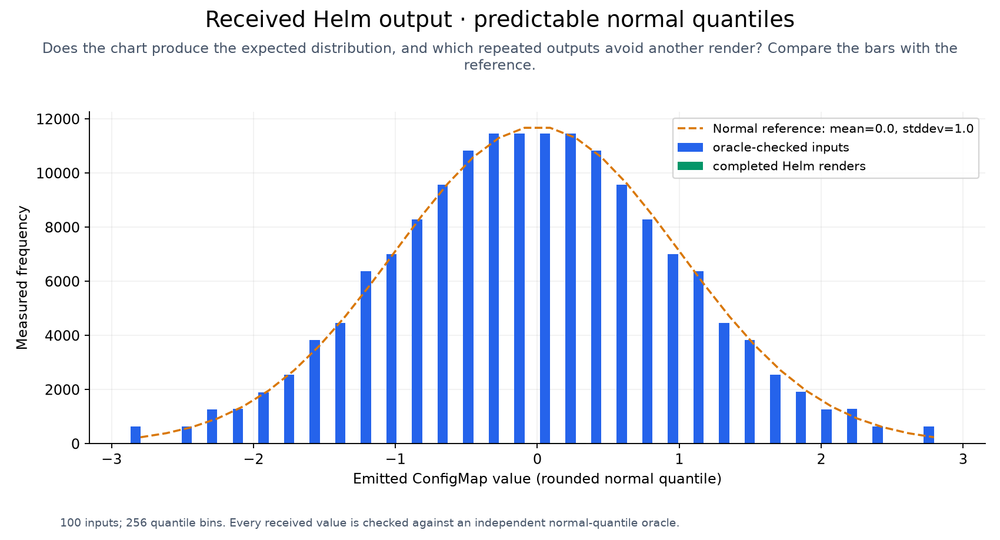
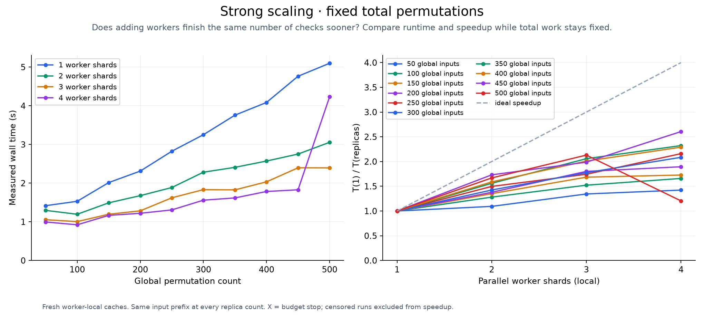
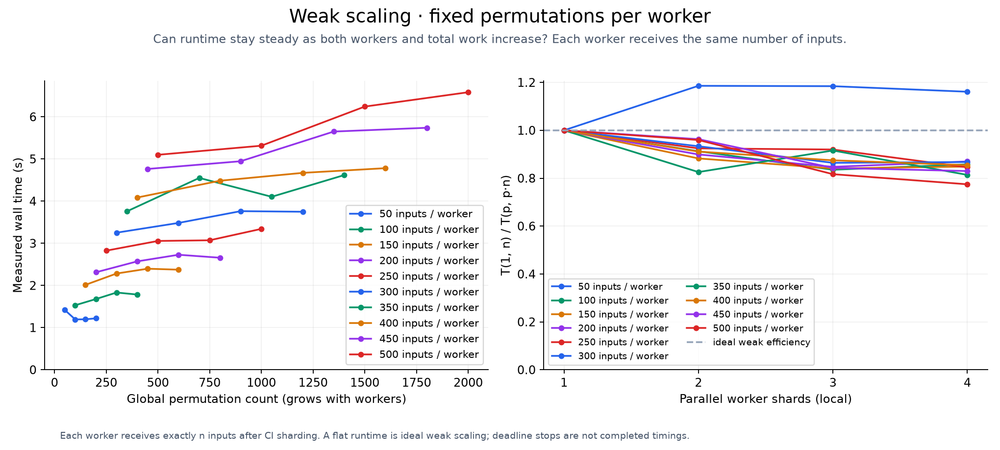
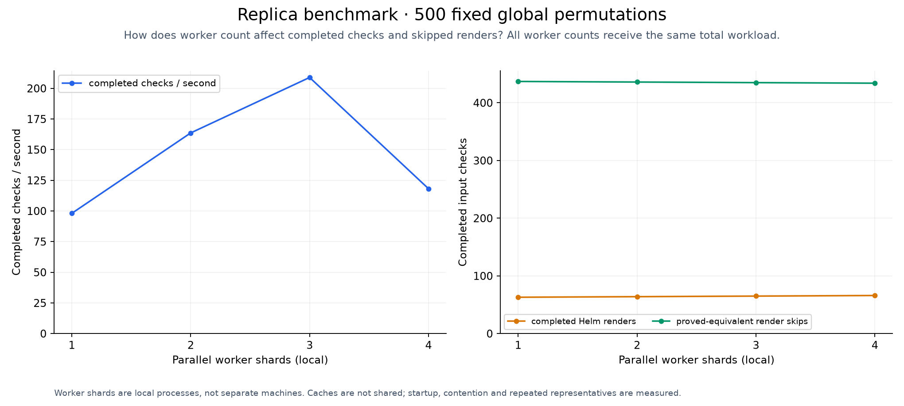

# Benchmarking

<!-- toc:start -->
**Table of contents**

- [Install and run](#install-and-run)
  - [Reading variation bands](#reading-variation-bands)
  - [One configurable chart](#one-configurable-chart)
  - [Complexity-informed sampling](#complexity-informed-sampling)
  - [Filtering runtime](#filtering-runtime)
  - [Error rates and failure placement](#error-rates-and-failure-placement)
  - [Random sampling and defect discovery](#random-sampling-and-defect-discovery)
  - [Flame graphs across worker cores](#flame-graphs-across-worker-cores)
  - [Reproduce the full project run](#reproduce-the-full-project-run)
- [Local shard wrapper](#local-shard-wrapper)
  - [Performance and scaling](#performance-and-scaling)
- [Bug discovery by permutation strength](#bug-discovery-by-permutation-strength)
- [Topology fixture](#topology-fixture)
- [Strategy matrix](#strategy-matrix)
- [Output-space PCA](#output-space-pca)
- [Failure expansion](#failure-expansion)
- [Topology distributions and trim depth](#topology-distributions-and-trim-depth)
- [Chart nesting at permutation strength eight](#chart-nesting-at-permutation-strength-eight)
- [Sweep chart breadth and depth](#sweep-chart-breadth-and-depth)
<!-- toc:end -->

[Documentation](../README.md) · [Project](../../README.md)

Benchmark code, shell helpers, refresh recipes and chart assets ship together in
[`hypothesis_helm.benchmarking`](../../pkg/hypothesis_helm/benchmarking/).

| Location in the package | Contents |
| --- | --- |
| `assets/chart/` | The shared, configurable Helm chart. |
| `assets/fixture/` | Parameter recipes; see the [fixture guide](fixture.md). |
| `refresh/recipes/` | Bash and Python recipes copied into each refresh's source snapshot. |
| `scripts/` | Shell implementations of the `smoke` and `shards` commands. |

Published [studies](../../studies/README.md) stay at the repository root. New local measurements default to
`.cache/benchmarks/`; refresh workspaces use `.cache/refresh/`. Existing legacy run directories are left intact.

Run `hypothesis-helm-benchmark smoke` for a short integration check, or
`hypothesis-helm-refresh` from the checkout root for the complete refresh.
Use `hypothesis-helm-benchmark shards --help` for local shard execution.

Its modules are grouped by responsibility:

| Subpackage | Responsibility |
| --- | --- |
| `charts/` | Generate fixtures, defects, topology structures and input workloads. |
| `studies/` | Run the individual benchmark commands. |
| `analysis/` | Compare output populations, calibration profiles and filtering selections. |
| `execution/` | Own workers, profiler captures and source fingerprints. |
| `reporting/` | Draw plots and tables, flame graphs and terminal progress. |

`cli.py` dispatches the existing `hypothesis-helm-benchmark` commands.
Saved measurements retain their recorded source fingerprints; reorganizing source files changes the fingerprint for new runs.

## Install and run

```sh
pip install "hypothesis-helm[benchmarking]"
hypothesis-helm-benchmark generate --output .cache/benchmarks/chart --input-complexity 10
hypothesis-helm-benchmark run --chart .cache/benchmarks/chart --time-limit 9m
```

The extra installs NumPy and Matplotlib. Helm 4 must be available on `PATH` for
rendering. All benchmark commands run from the installed package; no checkout is
needed. Results default to `.cache/benchmarks/` under the working directory.

Use `hypothesis-helm-benchmark --help` to list studies, or append `--help` to a
study such as `hypothesis-helm-benchmark nesting --help`.

Interactive local runs show progress bars with completion counts, elapsed time and an estimated remaining time.
CI disables all progress bars, including forced chart-test progress. CI and redirected benchmark output use plain-text
status updates instead. Failure expansion can increase the remaining count as it schedules more checks.

Each plot starts with the question it answers and a short guide to reading it.
Method notes and uncertainty definitions remain below the axes.

### Reading variation bands

Where a setting has repeated runs, the line shows their mean. Dark shading and inner whiskers extend one
sample standard deviation (SD) above and below it; lighter shading and outer whiskers extend two SDs.
The caption gives the number of observations per shaded point. Larger bands mean results varied more between repeats.
These are **not confidence intervals**, and two SDs do not imply 95% coverage for these measurements.
Bands stop at zero for counts/times and at 100% for percentages. A singleton has no estimated spread;
a zero-width band means the recorded repeats agreed, not that future runs must agree.

Runtime and scaling bands compare repeats at the same settings; speedups use paired completed runs.
Timeouts stay marked separately and do not contribute to completed-runtime bands. Checkpoints along one growing
run are not treated as independent repetitions. Calibration placement plots describe variation between chart placements.
Error-rate heatmaps show mean ±1 SD per cell, with ±2 SD endpoints and observed ranges in their CSV.
Historical recall records that saved only percentiles retain those percentile bands; new runs also record sample SD.
Exact topology/PCA diagrams and single-seed studies do not acquire estimated error bars without repeated observations.

### One configurable chart

All synthetic studies use the same chart generator. Each command reuses one temporary
chart and retains YAML parameter records for its cases. Separate invocations have
separate workspaces, including concurrent CI jobs.

The [combined stress chart](../../pkg/hypothesis_helm/benchmarking/assets/chart) includes gates, shared outputs,
interactions, equivalent inputs, boundary changes, coupled inputs, and six known defect
families. The [fixture guide](fixture.md) explains its controls and fixed progression.

```sh
hypothesis-helm-benchmark stress --time-limit 9m --output .cache/benchmarks/stress
```

This measures 22 settings with seven filtering strategies, decreasing one control by
one per step. The nine-minute ceiling applies separately to each strategy at each
step. Use `--steps 3` for a shorter study or `--generate-only` to inspect the recipes.
Results include Matplotlib PNG/SVG plots, CSV/JSON measurements, and a Markdown table.

Existing published measurements retain their original chart snapshots. New runs save
parameter records; exporting one recreates that case using the installed generator:

```sh
hypothesis-helm-benchmark generate \
  --parameters .cache/benchmarks/stress/cases/00-worst-case.yaml --output .cache/benchmarks/chart
```

### Complexity-informed sampling

The [calibration study](../../studies/calibration-variation/README.md) compares 54 generated chart variants across 100 seeds each.
Its [breadth × depth sweep](../../studies/calibration-variation/README.md#breadth-and-depth-sweep) measures nine output sizes
while holding the input count and defect triggers fixed within each panel.
Its [matrix and graphs](../../studies/calibration-variation/MATRIX.md) show retained cases, known-bug discovery and nearby-profile fallback.
The [test matrix](../adaptive-filtering/TESTS.md) separates deterministic selector properties from empirical results.

```sh
hypothesis-helm-benchmark calibration --output .cache/benchmarks/calibration --time-limit 9m
```

### Filtering runtime

The [filtering load test](../../studies/filtering/README.md) compares an unfiltered baseline, 70% random sampling, ordinary filtering and adaptive filtering.
It varies the finite input-space size and gate depth, using paired seeds and real Helm execution. Graphs separate planning from test execution;
time-limited observations retain their unfinished counts. The [theoretical comparison](../adaptive-filtering/README.md#conditions-behind-the-comparison)
states the conditions under which each bound and expected saving applies.

```sh
hypothesis-helm-benchmark filtering --output .cache/benchmarks/filtering --time-limit 9m
```

### Error rates and failure placement

Compare every filtering method over error rates from 0% to 100%, varying condition depth,
equivalent-output redundancy, or failure clustering on the second axis:

```bash
hypothesis-helm-benchmark error-surface --time-limit 9m --output .cache/benchmarks/error-surface
```

The full refresh includes these sweeps, paired seeds, heatmaps, and numerical tables.
Templates stay fixed within each error-rate sweep; seeded input-aware assertions determine which rendered results fail.
This lets us measure expansion without also changing the template's branches.
The nine-minute ceiling applies to each method's execution, not the entire study.
The failure-placement surface measures **11 clustering settings × 13 error rates** (143 cells per method and seed).
Clustering runs from 0 to 1 in steps of 0.1; error rates run from 0% to 100% in steps of 10%, plus 1% and 5%
to retain detail where failures are rare. Figure dimensions grow with the measured grid so cell labels remain readable.
The full default sweep schedules 7,800 measurements. Use `--axes clustering` for just the failure-placement comparison
(3,432 measurements). Existing results keep their measured settings; `--plot-only` cannot add observations.

Use `--output-size COLUMNSxROWS` to choose the measured failure-placement grid (default `11x13`):

```bash
hypothesis-helm-benchmark error-surface --axes clustering --output-size 11x13 --time-limit 9m --output ".cache/benchmarks/error-surface-$(date +%s)"
```

Columns span clustering 0 to 1 evenly. Rows span error rates 0% to 100% evenly, except that 13 rows retain
the established 0%, 1%, 5%, 10%, 20%, …, 100% settings. Both dimensions must be at least 2.
Explicit `--clustering` or `--error-rates` lists override the corresponding dimension.
This controls measured settings, not image pixels; other structural axes keep their own depth/redundancy settings.
With eight methods and three seeds, the clustering sweep runs `columns × rows × 24` measurements.

[Results and interpretation](../../studies/error-surface/README.md)

[Fitted response surfaces](../../studies/error-surface/quadratic-fits.md) place quadratic predictions beside
the collected measurements and their residuals. The [model guide](response-surface.md)
defines the six coefficients and explains where the approximation can fail.

Optional [symbolic regression](response-surface.md#optional-symbolic-regression)
compares PySR equations with quadratics on reserved cells and seeds, using retained measurements without rerunning Helm.
See the [quick comparison](../../studies/error-surface/symbolic/README.md) for equations, validation scores and plots.



### Random sampling and defect discovery

The [sample-size study](../../studies/sampling/README.md) renders the shared chart's complete
population, then measures distinct defect recall across 500 reproducible seeds.
It distinguishes repeated defect patterns from erroneous input assignments.



```sh
hypothesis-helm-benchmark sampling --time-limit 9m --output .cache/benchmarks/sampling
```

For the current fixture, 32 random inputs plus defaults found all six defects in
99% of seeds. This does not establish a safe sampling rate for other charts;
a defect exposed by one input has only a 70% detection chance when 70% are tested.

### Flame graphs across worker cores

[View published flame graphs](../../studies/flamegraphs/README.md), including combined workers,
the coordinator and individual processes. These are scaling smoke-test captures.

Repository refreshes process charts sequentially, using six path workers per chart,
10 generated examples per path and one five-minute chart deadline. Workers finish
or are stopped and joined before the next chart begins.

Place `--profile DIRECTORY` before the study name to capture Python call stacks
and generate Matplotlib flame graphs:

```sh
hypothesis-helm-benchmark --profile .cache/benchmarks/profiles run --chart .cache/benchmarks/chart \
  --suite scaling --scaling-counts 50,100,150 --replicas 1,2,3,4 \
  --time-limit 30s --shard none --output .cache/benchmarks/profiled
```

Each invocation prints a fresh `profile-*` directory containing raw JSON captures
and a `flamegraphs/` directory with per-process PNG/SVG plots, a combined worker
plot, and `index.json`. Each worker profiles its executing Python thread on its
own core and writes a unique file. The coordinator is plotted separately.
Independent CI shards can upload their capture files into one directory for plotting.

Widths show time spent in a function and its children. The combined worker view
sums time across overlapping workers, so its width can exceed elapsed runtime.
Native functions and Helm subprocess waits are charged to their Python caller;
these graphs do not expose Helm's internal Go calls or other Python threads.

Capture uses Python's [standard profiling hook](https://docs.python.org/3/library/sys.html#sys.setprofile)
to preserve actual caller paths, including recursion. Profiling adds overhead,
and the measurement metadata marks instrumented runs. Use ordinary runs for
performance comparisons. Capture retains up to 25,000 call-context nodes and
128 levels per invocation; beyond those limits, time is charged to the nearest
retained ancestor and the capture is marked. Interrupted hooks are reported as partial.

Redraw or combine saved captures without rerunning the benchmark:

```sh
hypothesis-helm-benchmark flamegraph .cache/benchmarks/profiles/profile-EXAMPLE \
  --output .cache/benchmarks/flamegraphs --max-depth 40 --min-percent 0.05
```

Display limits hide small or deep frames in the drawing while preserving the raw
captures. Only fully written capture files are read; a forcibly killed process
may leave no capture.

### Reproduce the full project run

From a checkout with Helm 4 and GNU Parallel on `PATH`:

```sh
poetry install --extras benchmarking && poetry run hypothesis-helm-refresh
```

The installed `hypothesis-helm-refresh` command owns the operation queue. Inspect
the full plan without running tests or changing artifacts:

```sh
poetry run hypothesis-helm-refresh --dry-run
poetry run hypothesis-helm-refresh --workers 3
```

`--workers` limits independent refresh operations; `auto` uses the available CPU
count. Timing studies and repository scans reserve the queue. Independent tables
and plot preparation can overlap. Nested workers retain their own settings,
including six path workers per chart in the repository tests.

The [operation inventory](../../pkg/hypothesis_helm/benchmarking/refresh/plan.py) declares
all declared studies, fresh profiling captures, diagrams, verification gates, repository
reports, and documentation updates. The preserved local [Workgraph](../../pkg/workgraph) scheduler runs this inventory.
The Helm-specific inventory and Bash commands ship in the benchmarking package. The separate [Reflow](https://github.com/astrivant/reflow) project
continues scheduler development independently; existing benchmark runs retain the local implementation.

Refresh workspaces live under `.cache/refresh/refresh-<epoch>/`. Each run keeps its
`operations.json` journal, verification records, source snapshots and operation logs there.
Only benchmark results, plots and chart recipes are published; refresh bookkeeping is not committed.
Failures stop scheduling, join owned children, and mark pending operations blocked.
Repository command failures are retained for their finalizer to inspect; missing
or invalid reports still prevent the next repository and final publication.

Flame graphs come from a separate four-case scaling capture with one and two
workers, after the uninstrumented measurements. Fresh process IDs replace earlier
capture filenames; publication records which old profile artifacts were superseded.

This runs lint, type checks, documentation checks, and the full pytest suite with the
worker count selected from the runner's CPUs (`PYTEST_WORKERS` overrides it), then all fifteen synthetic studies,
their plots and tables, and the synthetic/Bitnami/Prometheus
topology catalog. After these plots, tables and benchmark summaries are published, it tests
Bitnami, then Prometheus, with six path workers per chart,
`--filter`, seeded random traversal, and five minutes per chart, then verifies and
publishes the combined Markdown/PDF reports. Dependency preparation is outside
each chart's testing budget. External kubeconform/kubesec checks are not enabled.
Repository refreshes use `--no-cache` to collect fresh results. Generated summary blocks
in this README and the root README update counts, settings and report links from the new
result files. Edit the surrounding prose freely; retain the `refresh:...` comment markers.

Timed synthetic studies run sequentially to avoid CPU contention between measurements.
The scaling study varies workers within each measurement to compare parallel execution.

Each benchmark run has a nine-minute ceiling; the complete refresh takes hours.
The command initializes missing submodules (Prometheus uses GitHub SSH), records
source snapshots, and prints the fresh run directory containing progress and logs.
Results are published under `studies/` and `docs/reports/`. It refuses to
start while an earlier refresh is active or unfinished. Chart findings are retained
in reports; incomplete workers or failed verification stop publication.

GitHub Actions and CircleCI run `bash scripts/project-run.sh hypothesis-helm-benchmark smoke` on changes. It
generates all 22 parameter recipes, measures the first three steps with one-second
ceilings, checks error-rate endpoints and intermediate cells across every method,
and checks chart replay and topology plots. These short runs verify the
automation; their timings are not performance comparisons.

For the complete hosted run, open **Actions > Benchmarks > Run workflow** and enable
**full-refresh**. It runs the same refresh command and uploads measurements, plots,
reports, and diagnostic logs for 30 days. It uses HTTPS for public submodules and
leaves committing regenerated files to the reviewer. The workflow has a six-hour
job limit; interrupted runs retain available artifacts without claiming completion.

Render an exported compiler dependency graph with Matplotlib:

```sh
hypothesis-helm-benchmark topology --graph topology.json --output .cache/benchmarks/topology
```

The PNG/SVG plots retain all vertices and directed edges. See
[what the graph and its layout represent](../inputs/README.md#render-the-mathematical-graph).
Browse the [synthetic and real-chart topology catalog](../../studies/chart-topologies/README.md)
for complete graphs, per-chart measurements, and downloadable graph data.

## Local shard wrapper

Run saved suites with 1–4 local GNU Parallel shards:

~~~sh
brew bundle # macOS; Debian/Ubuntu: sudo apt-get install parallel
helm hypothesis generate pkg/hypothesis_helm/benchmarking/assets/chart --output .cache/benchmarks/shard-suite --max-examples 10
for shards in 1 2 3 4; do
  bash scripts/project-run.sh hypothesis-helm-benchmark shards --shards "$shards" .cache/benchmarks/shard-suite
done
~~~

The [wrapper](../../pkg/hypothesis_helm/benchmarking/scripts/shards.sh) launches `helm hypothesis run` with one
worker per shard and caching disabled. Logs and reports go to
`.cache/benchmarks/local-shards/`. Pass additional run options after `--`.

Generate a chart with predictable, rounded normal-distribution outputs:

~~~sh
hypothesis-helm-benchmark generate \
  --output .cache/benchmarks/chart \
  --input-complexity 100 --mean 0 --stddev 1 --output-bins 256
~~~

### Performance and scaling

Run the [plotting benchmark](../../pkg/hypothesis_helm/benchmarking/studies/performance.py):

~~~sh
hypothesis-helm-benchmark run \
  --chart .cache/benchmarks/chart --step 50 --time-limit 9m --max-permutations 600000 \
  --shards 1,2,3,4 --shard none --output .cache/benchmarks/benchmark
~~~

Measurements are recorded after **50, 100, 150, …** inputs. Each progressive or scaling
run has a nine-minute execution budget; the complete study takes longer. Rendered
outputs are checked against expected values calculated independently of Helm.
Renders are skipped when the compiler proves they match an already validated output.
Use each command's `--help` for options.

The figures below use local Python workers and the [standard chart](../../studies/performance/standard-chart).
<!-- refresh:performance:start -->
In this Helm 4 run, pruning completed **163,122 checks with 256 renders**, compared
with **11,583 checks** without pruning, within each nine-minute budget.
<!-- refresh:performance:end -->
[Raw measurements](../../studies/performance/results.json), [CSV](../../studies/performance/results.csv), and
[refresh provenance](refresh.md) include the host and run details.
These are single-run measurements; they do not establish timing variability.

The progressive plot follows one continuous run, recording progress at each input
count. Dashed lines show targets the run did not finish before its time limit.





**Strong scaling** keeps total work fixed. **Weak scaling** keeps work per worker fixed.







## Bug discovery by permutation strength

Compare pairs, triples, and higher-order coverage against known chart faults:

~~~sh
hypothesis-helm-benchmark generate \
  --output .cache/benchmarks/faulty-chart --input-complexity 8 \
  --bug-percent 5 --bug-orders 2,3,4,5,6 --bug-seed 2026
hypothesis-helm-benchmark discovery \
  --chart .cache/benchmarks/faulty-chart --max-strength 6 --output .cache/benchmarks/discovery
~~~

`--bug-orders` sets how many fields must have particular values to trigger each
injected fault. At each order, `--bug-percent` selects a percentage of those possible
triggers, rounded down to a whole number. The seed determines which triggers are
selected, and `benchmark.json` records the exact counts. A complete input can trigger
several faults, so 5% of triggers does not mean 5% of complete inputs fail.
`--max-bugs` limits the number of injected faults.

The x-axis is `--permutations` interaction strength. The chart, its 256 possible
configurations, and its injected faults stay fixed. Runs use the application's
planner and real Helm renders, with automatic enumeration and inferred groups
disabled to isolate strength. [Raw results](../../studies/bug-density/results.json) retain the
first failing case for each fault. These discovery rates describe the seeded fixture.

The recorded 5% fixture contains 261 faults: pairs found 136, triples found 208,
and strength five found all 261.


The separate [Sparsity and Stochasticity study](../../studies/sparsity/README.md) measures distribution
coverage as the number of cases falls.

[Structural sparsity](../../studies/structural-sparsity/README.md) holds the four variable fields and known failures fixed
while growing the surrounding values tree and moving those fields farther apart. Its plots compare loading time,
compiler analysis, total runtime and missed errors for each filtering method.
See [the study definition and commands](structural-sparsity.md).

## Topology fixture

Generate a chart whose inputs also control resource creation and shared fields:

```sh
hypothesis-helm-benchmark generate \
  --output .cache/benchmarks/topology-chart --input-complexity 100 --topology
```

`--topology` adds six Boolean inputs that control resource creation, shared Service
and Ingress ports, replica thresholds, and a branch reached only by a specific
input pattern. `--topology-opaque` adds a loop the compiler cannot analyze, testing
whether it keeps those inputs for rendering. Both keep the chart's rounded
normal-distribution output. The benchmark independently calculates expected outputs
for the added behavior and checks the rendered manifests against them.
Fault injection (`--bug-percent`, `--bug-orders`, `--bug-seed`) remains available.

The [topology preset](../../pkg/hypothesis_helm/benchmarking/assets/fixture/topology.yaml) has 1,024 possible inputs for
complete comparisons. See [sampling controls and complexity](../execution/README.md#optional-trimming).

```sh
hypothesis-helm-benchmark --parameters pkg/hypothesis_helm/benchmarking/assets/fixture/topology.yaml sparsity \
  --count 1024 --levels 5 \
  --output .cache/benchmarks/structure-sparsity
```

Raw results include `topology_counts` and `topology_quality` (categorical outcome
coverage and total variation), alongside scalar-distribution statistics. No CDF
error is assigned to unordered topology outcomes.

## Strategy matrix

[Compare strategies across six structural cases](../../studies/matrix/README.md).
The matrix uses fully enumerable fixtures to measure exact outcome coverage,
with a nine-minute execution ceiling for each independent run.
The structural, stress, PCA, expansion and nesting comparisons include `--filter`
and `--filter-adaptive`. They use the production selectors, refresh complexity for
each aggressive selection, and report calibration matches or conservative fallback.
Both presets enable failure expansion; paired expansion-off columns isolate its effect.

```sh
hypothesis-helm-benchmark matrix \
  --input-complexity 10 --trim-level 2 --seed 2026 --time-limit 9m \
  --output .cache/benchmarks/strategy-matrix
```

Use `--structure constraints|control-flow|dependencies|interactions|equivalence|boundaries`
with the chart generator to create an individual case. Boundary profiles include
an integer input; the matrix harness enumerates their declared domains rather
than assuming every parameter is Boolean.

## Output-space PCA

[Before and after trimming, with 5% seeded errors](../../studies/pca/README.md).
Compare random trimming, topology trimming, and both across the six structural
cases. Each category keeps fixed PCA axes and reports exact error recall and
output coverage alongside the projection.

```sh
hypothesis-helm-benchmark pca \
  --input-complexity 10 --error-percent 5 --trim-level 2 \
  --time-limit 9m --output .cache/benchmarks/pca
```

## Failure expansion

[Compare each strategy with and without `--expand-failures`](../../studies/expansion/README.md).
The paired matrix separates distinct erroneous outputs from erroneous inputs
exercised, and records the additional physical renders.

```sh
hypothesis-helm-benchmark expansion \
  --input-complexity 10 --error-percent 5 --trim-level 2 \
  --time-limit 9m --output .cache/benchmarks/expansion
```

## Topology distributions and trim depth

[Generate mixed chart structures](../../studies/structure-mixtures/README.md) with seeded category
weights and shared input wiring. [Compare trim depths 0–5](../../studies/structure-depth/README.md)
with random trimming disabled and failure expansion enabled.

## Chart nesting at permutation strength eight

[Matrix and shared-frame PCA](../../studies/nesting/README.md) compare shallow (1), deep (5),
and seeded random nesting depths (1–5). `--permutations 8` stays fixed; each
chart retains 12 topology components. Shared PCA axes make depth profiles
comparable within each topology family.

## Sweep chart breadth and depth

To compare sampling floors across output shapes, run this from the repository root:

```bash
bash scripts/project-run.sh hypothesis-helm-benchmark calibration \
  --inputs 6 --depths 1 3 5 \
  --breadths 1 4 8 --output-depths 0 1 2 \
  --placements 2 --trials 100 --seed 2026 --time-limit 9m \
  --output ".cache/benchmarks/calibration-sweep-$(date +%s)"
```

This measures 54 cases: nine output shapes at three defect-trigger depths, with two paired defect placements.
`--breadths` selects sibling fault-resource copies. `--output-depths` selects nested Kubernetes `List` envelopes;
`--depths` selects how many input conditions activate a defect. Plots label the actual measured breadth and depth.
Copies have distinct resource names but preserve the same defects, so output growth alone need not increase the sample floor.

The output contains `complexity-sweep.png`/`.svg`, numerical sweep data, the calibration plot, and the matching matrix.
Heatmap cells show mean floors and one sample standard deviation across placements. The 100 sampling seeds calibrate each placement's floor.
All permitted inputs are rendered for each measured chart; incomplete runs do not publish a completed calibration.
Future full repository refreshes include this sweep. A refresh already running uses its captured source and command inventory.

To redraw a completed run's plots without repeating Helm measurements:

```bash
bash scripts/project-run.sh hypothesis-helm-benchmark calibration --plot-only --output .cache/benchmarks/calibration-sweep-<epoch>
```

[Quadratic versus quartic comparison](../../studies/error-surface-quartic/polynomial-comparison/README.md)
uses identical training data and reports errors on reserved settings and repeats.
See [how to compare a completed surface](response-surface.md#quadratic-versus-quartic-comparison).

The refresh also runs the [mutation sensitivity diagnostic](../../studies/sensitivity/README.md), retaining its inputs, measurements and plots.
