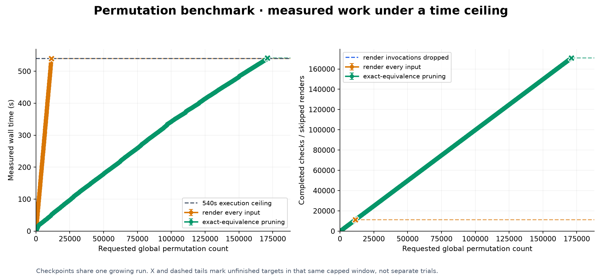
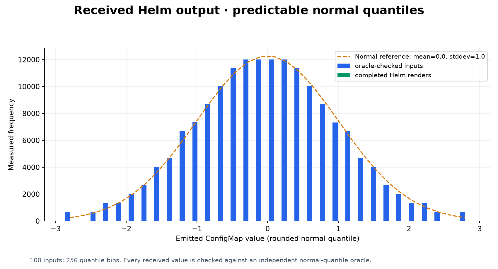
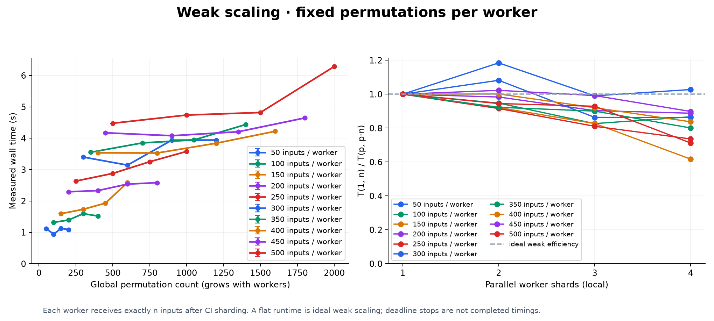

# Benchmarking

[Documentation](../README.md) · [Project](../../README.md)

Run saved suites with 1–4 local GNU Parallel shards:

~~~sh
brew bundle # macOS; Debian/Ubuntu: sudo apt-get install parallel
for shards in 1 2 3 4; do
  bash scripts/benchmark-shards.sh --shards "$shards" examples/generated-workload
done
~~~

The [wrapper](../../scripts/benchmark-shards.sh) launches `helm hypothesis run` with one
worker per shard and caching disabled. Logs and reports go to
`reports/local-shards/`. Pass additional run options after `--`.

Generate a chart with predictable, rounded normal-distribution outputs:

~~~sh
bash scripts/project-python.sh -m scripts.generate_benchmark_chart \
  --output .cache/benchmark-chart \
  --input-complexity 100 --mean 0 --stddev 1 --output-bins 256
~~~

Run the [plotting benchmark](../../scripts/benchmark_helm.py):

~~~sh
bash scripts/project-python.sh -m scripts.benchmark_helm \
  --chart .cache/benchmark-chart --step 50 --time-limit 3m \
  --shards 1,2,3,4 --shard none --output reports/benchmark
~~~

Checkpoints increase by **50, 100, 150, …** inputs. Each trajectory or scaling run
has a three-minute execution budget; the complete study takes longer. Outputs are
checked against an independent oracle, and exact-equivalent renders are skipped.
Use each script's `--help` for options.

The figures below use local Python workers and the [standard chart](../../examples/benchmark).
In one recorded run, pruning completed **49,733 checks with 256 renders**, compared
with **3,535 checks** without pruning. [Raw measurements](results.json)
and [CSV](results.csv) include the host and run details.

Progressive checkpoints share one execution. Dashed tails mark unfinished targets
at the deadline.

**Strong scaling** keeps total work fixed. **Weak scaling** keeps work per worker fixed.

## Bug discovery by permutation strength

Compare pairs, triples, and higher-order coverage against known chart faults:

~~~sh
bash scripts/project-python.sh -m scripts.generate_benchmark_chart \
  --output .cache/faulty-chart --input-complexity 8 \
  --bug-percent 5 --bug-orders 2,3,4,5,6 --bug-seed 2026
bash scripts/project-python.sh -m scripts.benchmark_discovery \
  --chart .cache/faulty-chart --max-strength 6 --output reports/discovery
~~~

`--bug-percent` selects that percentage of path-subset/value-pattern assignments at
each order, rounded down. The seed fixes their random placement; `benchmark.json`
records exact counts. Trigger overlap means this is not the percentage of complete
configurations that fail. `--max-bugs` bounds fixture size.

The x-axis is `--permutations` interaction strength. The chart, its 256 possible
configurations, and its injected faults stay fixed. Runs use the application's
planner and real Helm renders, with automatic enumeration and inferred groups
disabled to isolate strength. [Raw results](bug-density/results.json) retain the
first failing case for each fault. These discovery rates describe the seeded fixture.

The recorded 5% fixture contains 261 faults: pairs found 136, triples found 208,
and strength five found all 261.

The separate [Sparsity and Stochasticity study](sparsity/README.md) measures distribution
coverage as the number of cases falls.
