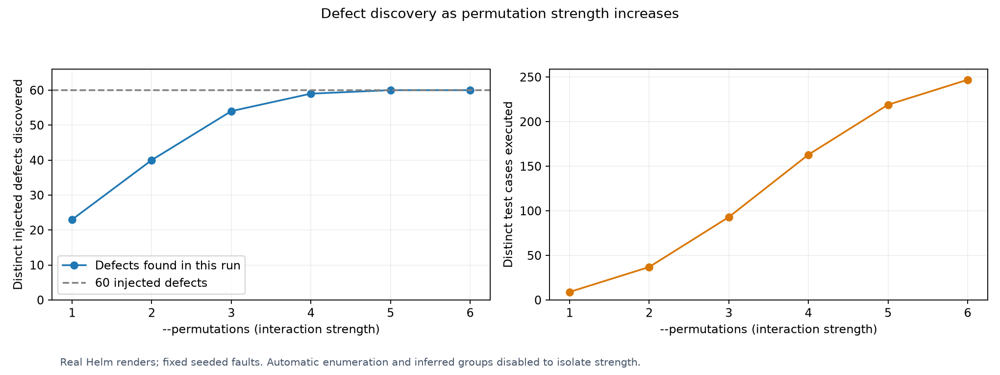
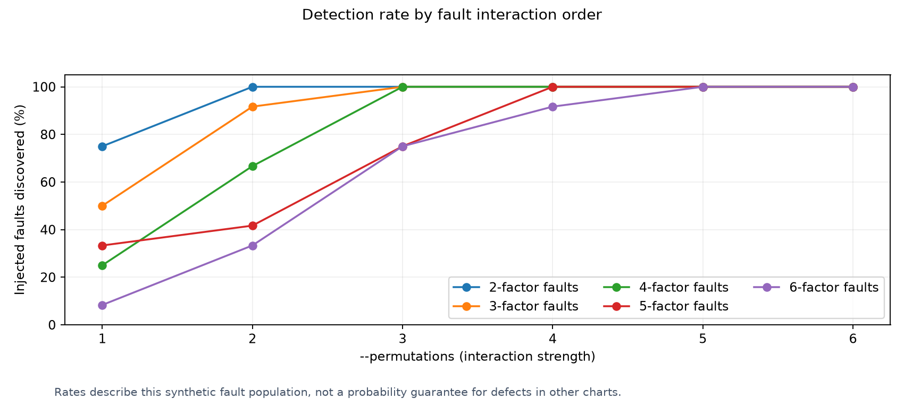

# Bug discovery by interaction strength

[Benchmarking](../README.md)

This fixed fixture contains 60 injected faults. The planner varies interaction strength from one to six, with automatic enumeration and inferred exhaustive groups disabled to isolate strength. Every selected input is rendered with Helm 4.

| Strength | Inputs tested / planned | Faults found / total | Missed faults | Seconds | Status |
| ---: | ---: | ---: | ---: | ---: | --- |
| 1 | 9 / 9 | 23 / 60 | 37 | 0.46 | passed |
| 2 | 37 / 37 | 40 / 60 | 20 | 1.81 | passed |
| 3 | 93 / 93 | 54 / 60 | 6 | 4.74 | passed |
| 4 | 163 / 163 | 59 / 60 | 1 | 8.16 | passed |
| 5 | 219 / 219 | 60 / 60 | 0 | 10.85 | passed |
| 6 | 247 / 247 | 60 / 60 | 0 | 12.31 | passed |

[JSON ledger](results.json) · [CSV table](results.csv) · [Chart fixture](chart)

These are distinct injected faults; several input assignments can trigger the same fault. Rates describe this seeded fixture, not expected bug recall for an arbitrary chart.
