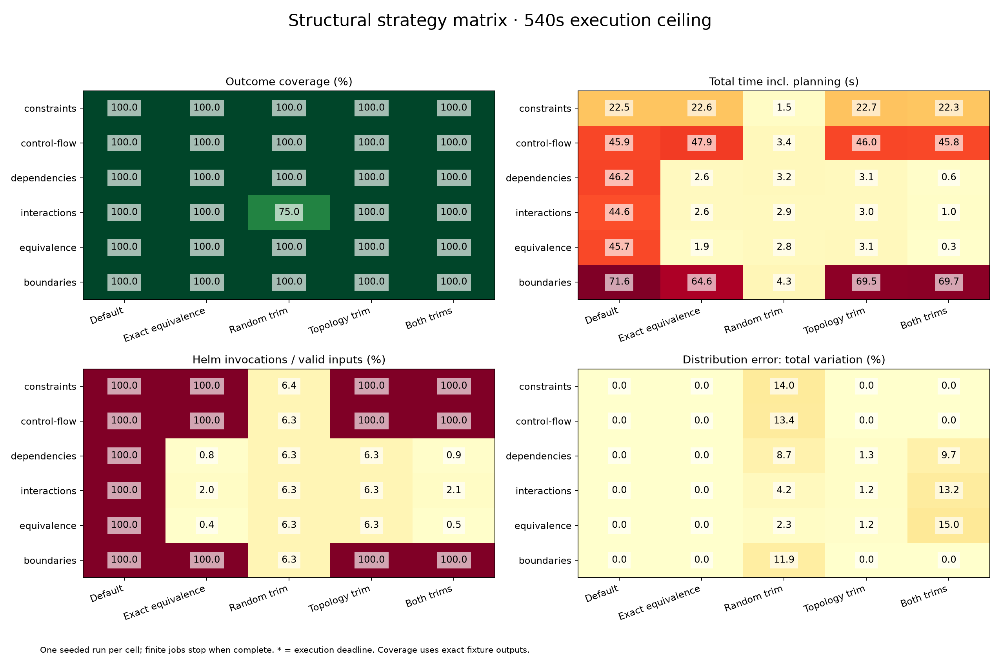

# Structural strategy matrix

[Benchmarking](../README.md)

Helm `v4.3.0+gbec5b06`; 540s execution ceiling per run; trim level 2; seed 2026.

Default, exact-equivalence pruning, random trimming, topology trimming, and both trims use the same complete valid input domain within each case. Planning and analysis are timed separately and excluded from the execution ceiling. Fresh caches; sequential runs.

Each trim column uses the stated level; combined enables both at that level. Exact-equivalence pruning is enabled only in its own column.

Cells show **outcome coverage / total seconds / Helm invocations**.

| Structure | Default | Exact equivalence | Random trim | Topology trim | Both trims |
|---|---|---|---|---|---|
| constraints | 100% / 22.5s / 512 | 100% / 22.6s / 512 | 100% / 1.5s / 33 | 100% / 22.7s / 512 | 100% / 22.3s / 512 |
| control-flow | 100% / 45.9s / 1024 | 100% / 47.9s / 1024 | 100% / 3.4s / 65 | 100% / 46.0s / 1024 | 100% / 45.8s / 1024 |
| dependencies | 100% / 46.2s / 1024 | 100% / 2.6s / 8 | 100% / 3.2s / 65 | 100% / 3.1s / 65 | 100% / 0.6s / 9 |
| interactions | 100% / 44.6s / 1024 | 100% / 2.6s / 20 | 75% / 2.9s / 65 | 100% / 3.0s / 65 | 100% / 1.0s / 21 |
| equivalence | 100% / 45.7s / 1024 | 100% / 1.9s / 4 | 100% / 2.8s / 65 | 100% / 3.1s / 65 | 100% / 0.3s / 5 |
| boundaries | 100% / 71.6s / 1536 | 100% / 64.6s / 1536 | 100% / 4.3s / 97 | 100% / 69.5s / 1536 | 100% / 69.7s / 1536 |

[Raw measurements](results.json) · [CSV](results.csv)

Constraints use coupled Boolean inputs; control flow includes an input-dependent loop; dependencies share a Service/Ingress port; interactions expose a four-way rare branch; equivalence varies output-irrelevant fields; boundaries cross an integer threshold.

The current compiler conservatively retains cases it cannot classify. A topology fallback is a measured limitation, not a failed benchmark. Topology sampling favors diversity and need not preserve outcome frequencies. These are fixture outcomes, not bug-discovery guarantees or population-wide confidence intervals.
