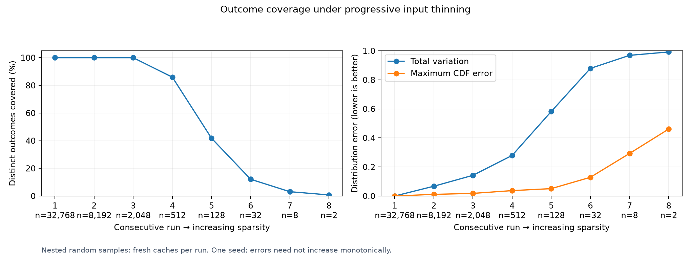
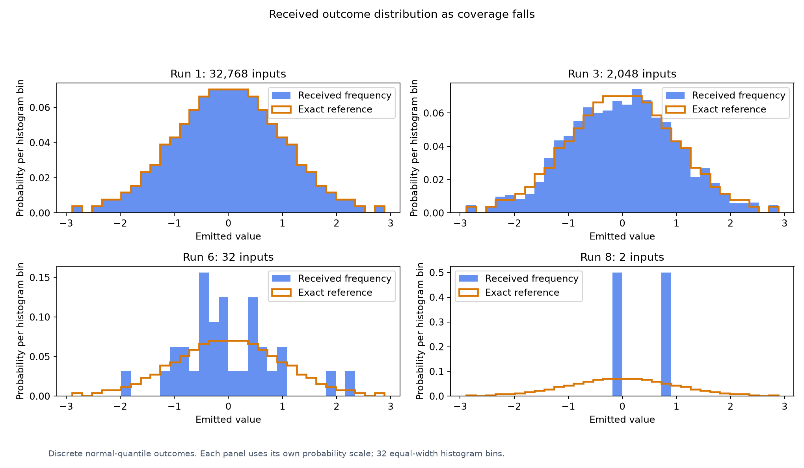

# Sparsity and Stochasticity

[Benchmarking](../README.md)

This study varies case count, not `--permutations` interaction strength. It measures
outcome coverage and distribution error; see the main benchmark for bug discovery.

~~~sh
bash scripts/project-python.sh -m scripts.benchmark_sparsity \
  --count 32768 --retain 0.25 --levels 8 --output reports/sparsity
~~~

Each run uses a nested random subset, fresh caches, and a three-minute budget.
Received frequencies are compared with the chart's exact finite distribution.
This is one seeded trajectory; distribution errors can fluctuate.
[Raw results](results.json) retain counts and run details.

