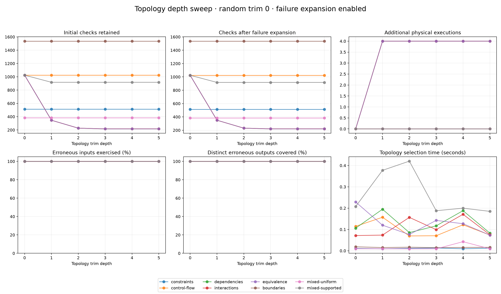

# Topology trim depth

[Benchmarking](../README.md)

Only topology trim depth varies. Random trimming stays at zero and failure expansion stays enabled.

Fixed settings: 10 inputs, four normal-quantile outputs, 5% erroneous valid inputs (rounded down), fault seed 1729, selection seed 2026, topology seed 2026. Mixed charts contain 12 components with shared sampled input wiring.



Each cell below is **checks; erroneous inputs found / total (missed percentage)** after expansion.

| Structure | Depth 0 | Depth 1 | Depth 2 | Depth 3 | Depth 4 | Depth 5 |
|---|---|---|---|---|---|---|
| constraints | 512; 25/25 (0.0% missed) | 512; 25/25 (0.0% missed) | 512; 25/25 (0.0% missed) | 512; 25/25 (0.0% missed) | 512; 25/25 (0.0% missed) | 512; 25/25 (0.0% missed) |
| control-flow | 1024; 51/51 (0.0% missed) | 1024; 51/51 (0.0% missed) | 1024; 51/51 (0.0% missed) | 1024; 51/51 (0.0% missed) | 1024; 51/51 (0.0% missed) | 1024; 51/51 (0.0% missed) |
| dependencies | 1024; 51/51 (0.0% missed) | 350; 51/51 (0.0% missed) | 231; 51/51 (0.0% missed) | 220; 51/51 (0.0% missed) | 220; 51/51 (0.0% missed) | 220; 51/51 (0.0% missed) |
| interactions | 1024; 51/51 (0.0% missed) | 350; 51/51 (0.0% missed) | 231; 51/51 (0.0% missed) | 221; 51/51 (0.0% missed) | 221; 51/51 (0.0% missed) | 221; 51/51 (0.0% missed) |
| equivalence | 1024; 51/51 (0.0% missed) | 350; 51/51 (0.0% missed) | 231; 51/51 (0.0% missed) | 220; 51/51 (0.0% missed) | 220; 51/51 (0.0% missed) | 220; 51/51 (0.0% missed) |
| boundaries | 1536; 76/76 (0.0% missed) | 1536; 76/76 (0.0% missed) | 1536; 76/76 (0.0% missed) | 1536; 76/76 (0.0% missed) | 1536; 76/76 (0.0% missed) | 1536; 76/76 (0.0% missed) |
| mixed-uniform | 384; 19/19 (0.0% missed) | 384; 19/19 (0.0% missed) | 384; 19/19 (0.0% missed) | 384; 19/19 (0.0% missed) | 384; 19/19 (0.0% missed) | 384; 19/19 (0.0% missed) |
| mixed-supported | 1024; 51/51 (0.0% missed) | 917; 51/51 (0.0% missed) | 917; 51/51 (0.0% missed) | 917; 51/51 (0.0% missed) | 917; 51/51 (0.0% missed) | 917; 51/51 (0.0% missed) |

## Mixed fixtures

Topology types are categorical, so weights describe their relative frequency rather than a normal distribution over arbitrarily ordered names. Requested probabilities and realized counts are both recorded. Types and wiring use a separate fixed seed. Components can share inputs; numeric boundary inputs are reserved so Boolean roles retain their declared types.

| Fixture | Realized component counts |
|---|---|
| mixed-uniform | constraints: 2, control-flow: 1, dependencies: 0, interactions: 5, equivalence: 3, boundaries: 1 |
| mixed-supported | constraints: 0, control-flow: 0, dependencies: 3, interactions: 5, equivalence: 4, boundaries: 0 |

Uniform mixes sample all six types. Supported mixes weight dependencies, interactions and equivalence equally. Unsupported constructs can cause the conservative compiler to retain every input, including inputs belonging to otherwise supported components.

## Measurement

Helm `v4.3.0+gbec5b06`. A fresh complete population is rendered and independently checked for each fixture. All depths replay initial observations from that same population; extra failure-expansion inputs are physically rendered again for each depth. No failures are inferred from unexecuted inputs. These are matched coverage measurements, not independent end-to-end runtime comparisons.

Reference rendering and all added renders share a 540s execution ceiling per fixture. Planning and plotting are excluded. The time panel measures topology selection only; it excludes expansion grouping and rendering. Partial runs retain statistics without publishing a complete plot.

A single fixed fault/topology seed isolates depth sensitivity; it cannot establish an optimal default across real charts. Repeated seeds are needed before changing the provisional `--filter` depth of 2.

[Raw observations](results.json) · [CSV](results.csv)

```sh
hypothesis-helm-benchmark topology-depth --time-limit 9m --output reports/topology-depth
```
