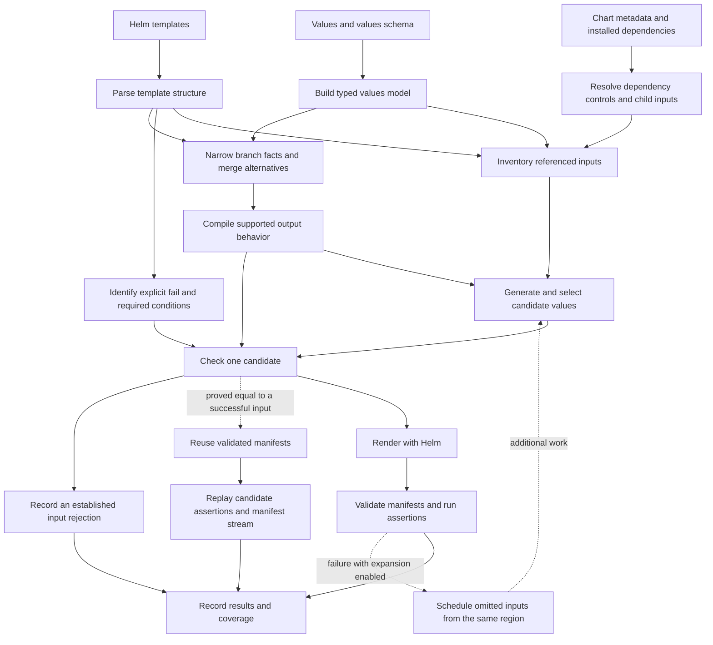

# Compiler

<!-- toc:start -->
**Table of contents**

- [Flow](#flow)
- [Guide](#guide)
- [Code map](#code-map)
- [Measured output sensitivity](#measured-output-sensitivity)
<!-- toc:end -->

[Documentation](../README.md) · [Architecture](../architecture/README.md) · [Project](../../README.md)

The compiler identifies the values a chart uses, the conditions that change its
output, and the relationships between them. Test planning uses this information
to choose inputs. Helm renders those inputs, and validators check the manifests.

A **pass** is an analysis or transformation with a particular job, such as finding
input references or grouping inputs by their predicted output. The implementation
shares syntax trees and a typed values model across these passes. Commands invoke
the passes they need; this is not a fixed pipeline that runs every pass on every chart.

## Flow

The arrows show how information reaches planning and execution. Dashed arrows
show optional reuse or feedback from a running test.

The rejection route has its own Helm verification policy. It does not turn a
template rejection into a passing test. Reuse requires the separate
exact-equivalence contract. Unsupported analysis keeps the relevant candidate
eligible for execution; it cannot establish a successful result.[\[1\]](selection.md)

## Guide

| Page | What it explains |
| --- | --- |
| [Syntax trees and values model](syntax-trees.md) | Parsed templates, field types, and representations for discovery and proof. |
| [Decisions, panel by panel](decisions.md) | Matched diagrams showing why branches are visited, inputs retained, or work skipped. |
| [Analysis passes](analysis.md) | Input inventory, dependencies, rejection conditions, maximum output complexity, and sampling profiles. |
| [Branch knowledge lattice](lattice.md) | Possible values, branch narrowing, merging and conservative handling of unknown operations. |
| [Selection and execution passes](selection.md) | Trimming, equality proofs, rejection filtering, and failure expansion. |
| [Export passes](exports.md) | Input inventories, topology graphs, minimal values, and their verification records. |
| [Exact-equivalence contract](../safe-pruning.md) | Supported Helm operations, equality bounds, assumptions, and proof evidence. |

Audit consumes analysis results without running the property-test suite. Test and
scan use those results to plan execution; export commands also use them to produce
artifacts. The [input guide](../inputs/README.md) describes the corresponding CLI
options and report fields.

## Code map

| Location | Responsibility |
| --- | --- |
| [`compiler/asts/`](../../pkg/hypothesis_helm/compiler/asts) | Tokens, template nodes, rejection expressions, and dependency records. |
| [`compiler/passes/`](../../pkg/hypothesis_helm/compiler/passes) | Analyses, selection policies, and exports described in this guide. |
| [`schemas/model.py`](../../pkg/hypothesis_helm/schemas/model.py) | Shared schema-derived values tree and attrs/cattrs conversion. |
| [`charts/templates.py`](../../pkg/hypothesis_helm/charts/templates.py) | Scope-aware reference discovery using the action tree. |
| [`charts/planning.py`](../../pkg/hypothesis_helm/charts/planning.py) | Finite candidate planning and selection orchestration. |
| [`charts/candidates.py`](../../pkg/hypothesis_helm/charts/candidates.py) | Candidate checks and verified witnesses. |

These modules analyze Helm; they do not implement its full rendering language.
Each result states its supported scope and any unresolved behavior.

## Measured output sensitivity

[Mutation sensitivity](sensitivity.md) measures individual changes, pairwise interactions and cumulative output displacement
with Helm. This is an optional runtime diagnostic; it does not weaken the compiler equivalence requirements for pruning.
