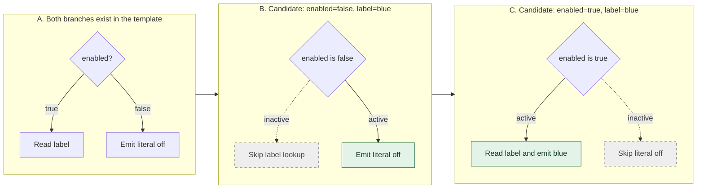
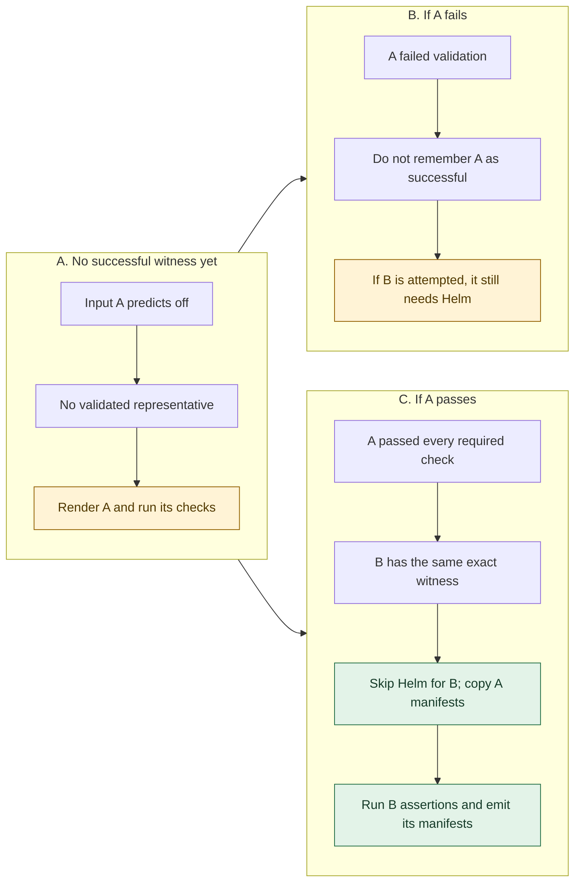
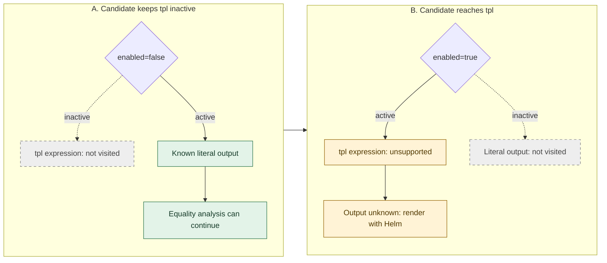
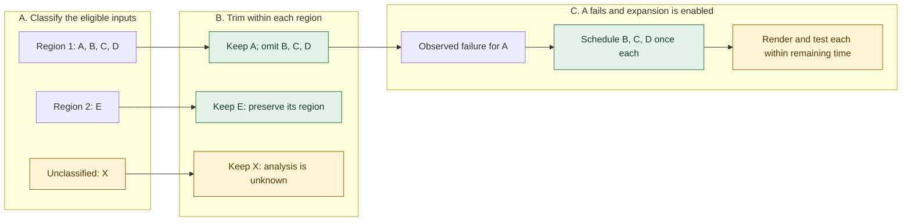
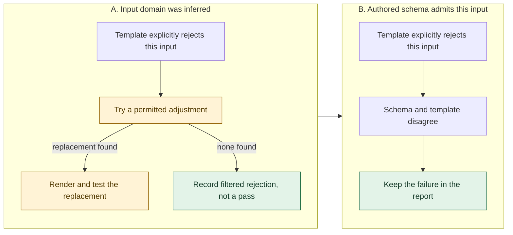
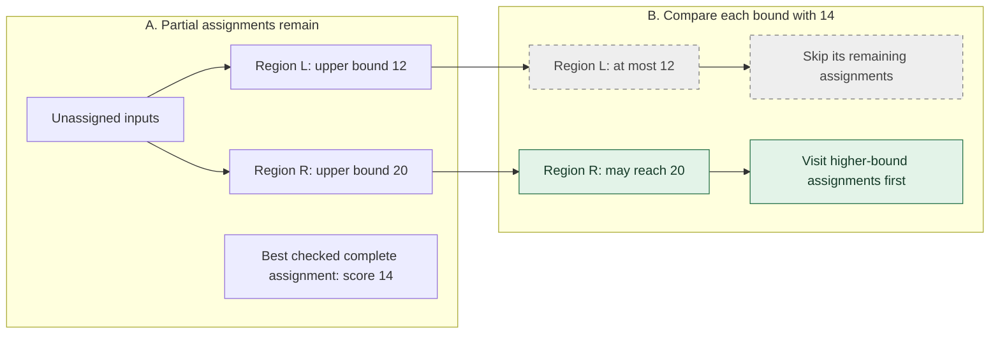

# Compiler decisions, panel by panel

<!-- toc:start -->
**Table of contents**

- [Which branch does the compiler visit?](#which-branch-does-the-compiler-visit)
- [When may an equal output skip Helm?](#when-may-an-equal-output-skip-helm)
- [Why does an unsupported branch sometimes still permit analysis?](#why-does-an-unsupported-branch-sometimes-still-permit-analysis)
- [Why keep some region members and restore others later?](#why-keep-some-region-members-and-restore-others-later)
- [Why can the same template rejection have different outcomes?](#why-can-the-same-template-rejection-have-different-outcomes)
- [Why can the maximum-complexity search drop a whole subtree?](#why-can-the-maximum-complexity-search-drop-a-whole-subtree)
<!-- toc:end -->

[Compiler](README.md) · [Analysis passes](analysis.md) · [Selection passes](selection.md)

Each row of panels follows one decision. Green marks an executed or retained
route, gray marks a skipped route, and amber marks work that still needs Helm.
The labels carry the same meaning without color. These are explanatory diagrams,
not measured benchmark results.

## Which branch does the compiler visit?

Consider a ConfigMap whose `data.label` is the supplied `label` when `enabled` is
true, and the literal `off` otherwise. Its schema allows a Boolean `enabled` and
the labels `blue` and `green`. The rest of the manifest is fixed.

The compiler walks only the active branch **for this candidate**. The other
branch remains part of the chart and can be visited by a later candidate.

In panel B, changing `label` cannot change this template's output because that
lookup never executes. The candidate still contains `label`, and schema
validation still checks it. In panel C, `label` contributes to the output witness.
This is candidate specialization, not a permanent deletion of a values path.
See [output compilation stages](syntax-trees.md#output-compilation-stages).

## When may an equal output skip Helm?

Use two inputs from the same false branch: A has `label=blue`, B has `label=green`.
Both predict `off`. Assume the complete chart and schema satisfy the
[equivalence contract](../safe-pruning.md), and all other output and render context
are identical. Equality alone is insufficient: a successful witness must exist.

Panel C establishes distance bounds `[0, 0]` against A. Without that successful
match, the bounds remain `[0, 1]` and Helm runs. A candidate with `enabled=true`
has a different branch signature; this witness cannot justify its reuse.
Custom assertions on B still run and can fail.

## Why does an unsupported branch sometimes still permit analysis?

Now suppose the true branch uses `tpl`, which the output-equivalence evaluator
does not interpret. An ordinary unsupported expression in an inactive branch
need not prevent analysis of the active one. Reaching it does.

This rule does not extend to every unsupported construct. Named definitions and
`block` can affect parsing across templates, so they disable the current proof
contract even when apparently nested in an inactive branch. Dependency charts are
also outside that contract. An unknown analysis result is never a passing test.

## Why keep some region members and restore others later?

Topology trimming selects tests before their outcomes are known. Suppose four
eligible inputs share a supported output-and-branch region, another input belongs
to a second region, and one input cannot be classified. One topology trim step
keeps one of the four, the second region's sole member, and the unknown input.
The chosen member depends on the seed; A is the illustrative choice here.

Panel B makes no claim that the omitted cases passed. Panel C also makes no claim
that they will fail; their membership only explains why testing expands there.
If A passes, this expansion policy does not restore B, C, and D. A timeout can
leave restored cases unfinished. See [topology trimming](selection.md#topology-trimming)
and [failure expansion](selection.md#failure-expansion).

## Why can the same template rejection have different outcomes?

Suppose a chart explicitly rejects an input that disables a required component.
The treatment depends on the authored contract, not just the error message.
The following panels start from a supported rejection prediction whose required
native verification agrees.

An adjustment cannot overwrite the selected path or violate the original schema.
If Helm contradicts a prediction, that requirement's filtering is disabled.
See [rejection-guided generation](selection.md#rejection-guided-generation) for
the two-witness policy and the stricter dependency-chart rule.

## Why can the maximum-complexity search drop a whole subtree?

The search assigns allowed values incrementally. A **partial assignment** leaves
some fields undecided. Its upper bound must cover every valid completion, so it
can be deliberately loose. The scores below illustrate the comparison; they are
not measurements from a particular chart.

Nothing under L can improve 14, so dropping it preserves the maximum being sought.
R's bound of 20 does not establish that an assignment actually reaches 20; the
search must check feasible completions. A bound equal to 14 can also be dropped
when finding one maximum, rather than all maximizing assignments.

This pruning saves **analysis work**. It does not remove chart tests merely
because their outputs are smaller. The [complexity pass](analysis.md#maximum-output-complexity)
must finish within its supported model to report an established maximum.
