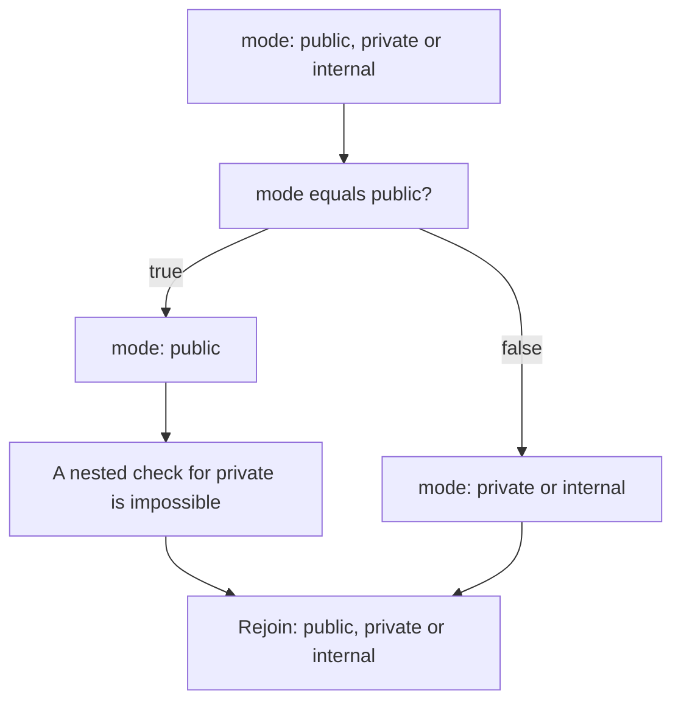

# Branch knowledge lattice

[Compiler](README.md) · [Analysis passes](analysis.md) · [Exact-equivalence contract](../safe-pruning.md)

The compiler tracks which values remain possible at each supported branch. A condition narrows that set inside its branches.
When the branches rejoin, the compiler combines their possibilities so a fact from one branch cannot accidentally apply to the other.

## Representation and operations

[`asts/lattice.py`](../../pkg/hypothesis_helm/compiler/asts/lattice.py) represents each field as a finite set of strings or Booleans,
or an explicit unknown value. An empty set means no configuration can reach that branch.
The ordering is set inclusion: fewer possible values means more precise knowledge.

| Operation | Meaning | Result for possible mode values |
| --- | --- | --- |
| Meet | Apply simultaneous constraints by intersection | `{public, private}` intersect `{public}` gives `{public}` |
| Join | Merge alternatives by union | `{public}` union `{private, internal}` gives all three |
| Top | No useful restriction | Unknown values remain eligible |
| Bottom | Contradictory requirements | An unreachable branch can be removed |

[`immutables.Map`](https://github.com/MagicStack/immutables) stores the field environments and shares unchanged entries between branches.
It is a runtime dependency. The Helm-specific lattice and transfer rules live in this project.
We construct only the states needed while walking the template, rather than allocating every subset in a lattice diagram.

## Supported deductions

The pass accepts Boolean literals, direct Boolean values conditions, `not .Values.flag`,
and `eq`/`ne` comparisons between one direct values path and one string or Boolean literal.
String literals with escape sequences, numeric comparisons, compound predicates and pipelines remain outside this proof contract.

Initial finite sets come from required schema paths with `enum`, `const` or Boolean types.
Every enclosing object must also be explicitly required and typed as an object. A supplied default does not make a value constant.
Optional paths and referenced schemas remain unknown. A successful equality branch can establish a singleton even when its entry domain is unknown.
Incompatible types cannot establish that a branch is unreachable: evaluating the predicate may itself fail in Helm.

The environment tracks each field independently. Joining branches deliberately forgets correlations between fields, which can reduce precision
but does not justify removing additional cases. This is a local forward analysis, with no loop fixed-point or interprocedural helper analysis.

## Unknown operations

Opaque expressions, helper calls, `set`, loops and scope-changing blocks keep their original IR and clear accumulated facts.
They could mutate values or change the evaluation context. The compiler does not carry an earlier constant through such an operation.
Reachable unsupported code still prevents an equality certificate. A supported contradiction can remove an unreachable branch containing opaque code,
subject to the existing restrictions on parse-global definitions and the requirement for a successful Helm representative.

## Evidence and validation

The exact-equivalence report includes `pruning.branch_analysis`, indexed by template filename. Each decision records the original line,
condition, known possible values, reachable alternatives and the action taken. Audit maximum-output analysis exposes the same decisions under
`complexity.branch_analysis`. Neither record establishes Kubernetes schema validity or successful execution by itself.

Property-based tests check join and meet laws, including unknown and unreachable states. Differential tests enumerate a finite chart with
string and Boolean branches, compare every compiled output with Helm, and check that removed branches do not erase live dependencies from the
maximum-output search. These tests support the implementation; it is not formally verified.
