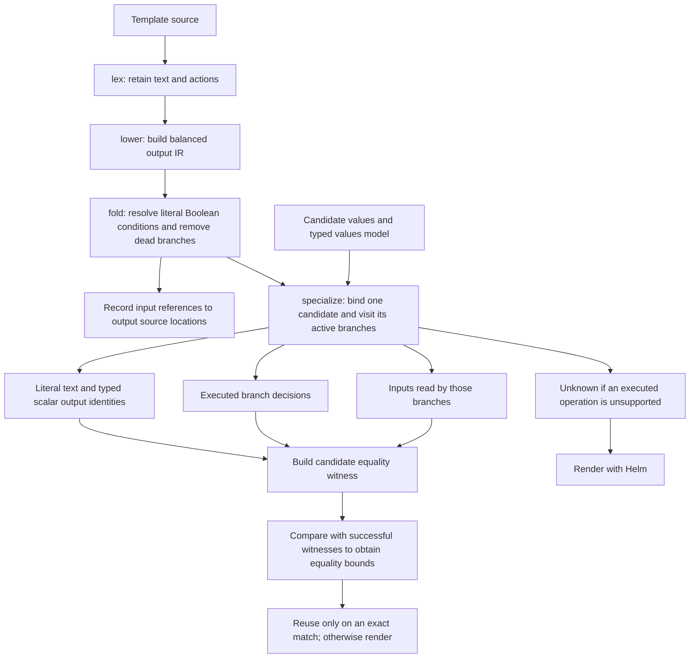

# Syntax trees and values model

[Compiler](README.md) · [Analysis passes](analysis.md) · [Selection passes](selection.md)

An **abstract syntax tree (AST)** records how statements nest inside a template.
An `if` node has a true branch and an alternative branch; walking its children
reaches the statements controlled by that condition. Source line numbers connect
findings back to the chart.

A named helper is a reusable template declared with `define`, often in
`templates/_helpers.tpl`. When a resource template calls it with a statically
named `include`, the analysis records a call edge from the caller to that helper.
Two resource templates can call the same helper, so their separate syntax trees
form a graph with a shared destination rather than one larger tree. Dynamic names
and ambiguous definitions remain unresolved.

The analysis also retains where an expression occurred. A requirement discovered
inside a helper can therefore point to `templates/_helpers.tpl` and its line
number, while the call relationship explains which resource template reaches it.
The filename and line identify chart source, not a line in the rendered manifest.

## Shared lexer, different representations

[`lexing.py`](../../pkg/hypothesis_helm/compiler/asts/lexing.py) separates literal
text from template actions while respecting quoted delimiters, comments, and Go
whitespace trimming. Two consumers use that token stream:

| Representation | Preserves | Used for |
| --- | --- | --- |
| `Action` | Action text, tokens, source lines, and branches. | Scope-aware values discovery. |
| `Node` | Literal output, expressions, branches, and unsupported blocks. | Output analysis and rejection evaluation. |

These types live in [`actions.py`](../../pkg/hypothesis_helm/compiler/asts/actions.py)
and [`templates.py`](../../pkg/hypothesis_helm/compiler/asts/templates.py), respectively.

The action tree omits literal output. It can help locate a value without proving
what Helm would print. Output analysis needs the text-preserving representation,
called an **intermediate representation (IR)**. A node marked **opaque** contains
an operation that the output evaluator cannot interpret.

The rejection evaluator in
[`contracts.py`](../../pkg/hypothesis_helm/compiler/asts/contracts.py) parses
expressions and follows supported, statically named helper calls. Its supported
operations differ from those admitted for output-equivalence proofs. Understanding
a `fail` condition does not establish the complete output of its template.

## Output compilation stages

These are logical stages, not seven independent Python pass modules. `fold`
handles literal conditions; `specialize` combines candidate-specific branch
selection, output identities, and live input tracking.

**Constant propagation** resolves a condition whose value is already known.
**Dead branch elimination** removes the branch that cannot execute. Literal
`true` and `false` can be resolved before choosing inputs; a values-dependent
condition is resolved separately for each candidate. Defaults are not constants
across the whole test space.

**Unused input elimination** leaves inputs out of an equality witness when the
active template path never reads them. It does not delete them from the candidate
or bypass schema validation. A **partition** records which branches executed.
**Symbolic output** records literal text and typed scalar identities without
attempting to reproduce every Helm formatting rule.

The **influence matrix** links values paths to template source locations, marking
condition reads and direct scalar output. It is a partial dependency map, not a
mapping to Kubernetes manifest field paths, and cannot authorize pruning by itself.
The [equivalence contract](../safe-pruning.md#compiler-stages) specifies the bounds
and the supported language subset.

## Shared values model

[`ValuesModel`](../../pkg/hypothesis_helm/schemas/model.py) builds a tree from the
schema. Each node has a values path, constraints, and a type. Object nodes can
produce dynamic attrs classes; cattrs converts between these records and values
documents while preserving missing entries separately from explicit nulls.

Passes use references to this model to describe the same field consistently.
An unresolved reference remains unresolved rather than acquiring an invented
type. The model supports generation and analysis; schema validation still checks
complete candidates and relationships between fields.
