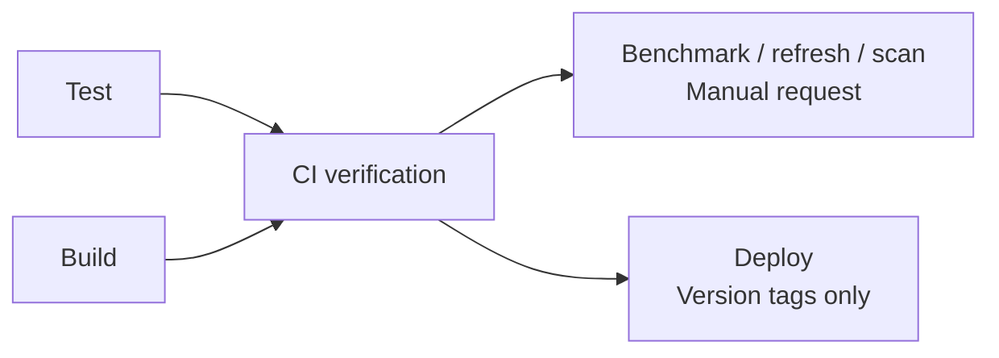

# Development

<!-- toc:start -->
**Table of contents**

- [Environment](#environment)
- [Checks](#checks)
  - [Shell checks](#shell-checks)
  - [Project checks](#project-checks)
- [Plugin verification](#plugin-verification)
- [GitHub CI](#github-ci)
- [Manual repository scans](#manual-repository-scans)
- [Documentation contents](#documentation-contents)
- [Publishing to PyPI](#publishing-to-pypi)
- [Pre-commit hook](#pre-commit-hook)
- [Package organization](#package-organization)
- [Shared environment settings](#shared-environment-settings)
- [Repository map](#repository-map)
<!-- toc:end -->

This document is for contributors modifying the framework. End-user chart testing
is entirely through [Helm commands](usage.md).

For upstream upgrades, use the [dependency maintenance inventory](dependencies.md). It covers both Go modules, Python packages,
generated compiler/schema data, CI tools and remote-worker dependencies, including the files that must change together.

## Environment

The project follows Astrivant's Python 3.13, Poetry and package-local test layout.
`.python-version` selects the interpreter and `poetry.toml` keeps the virtualenv
inside the checkout. Preserve an older environment elsewhere before recreating it
when upgrading from Python 3.10.

```sh
bash scripts/setup-dev.sh
bash scripts/setup-dev.sh --check
# Also rebuild the ignored Kubernetes schema cache and input catalog:
bash scripts/setup-dev.sh --schemas
```

The setup script supports macOS with Homebrew and Debian/Ubuntu Linux with apt. It installs Bash, Git, Git LFS, GNU Parallel and ShellCheck;
uses a pinned uv bootstrap to provision Python 3.13 and Poetry 2.1.3 locally; and installs checksum-verified Go 1.25.0 and Helm 4.3.0
under `.cache/dev-tools/`. Python linting, formatting, typing and testing dependencies come from the Poetry lock.
It creates `.venv` only when absent, installs the benchmarking extra and pre-commit hooks, and registers the Helm plugin.
It prints the PATH command to use in your current shell. Other Linux distributions need their OS packages installed first.
Shell scripts require Bash 4.4 or newer for NUL-delimited `mapfile`. On macOS, setup installs Homebrew Bash and exposes it
under `.cache/dev-tools/bin`; the GitHub Action also prepares Homebrew Bash on macOS runners.

Ordinary chart testing needs Python and Helm. Go is required only for rebuilding source-derived catalogs and compiler facts; GNU Parallel
also supports optional Kubesec scanning. Kubesec itself is optional and is installed by the CI integrations when enabled.
Generated [schema caches](../schemas/README.md) are ignored by Git and can be restored from CI cache or rebuilt at any time.

`scripts/project-run.sh` uses this checkout's installed commands even when another
virtual environment is active. Pytest is a runtime dependency because Helm runs
generated suites inside the plugin environment; linting tools remain development
dependencies. The Poetry lock pins contributor/CI dependencies. Plugin installation
resolves the package's runtime constraints.

Register application CLIs in `[tool.poetry.scripts]` in `pyproject.toml` and invoke
the installed binaries. Use `bash scripts/project-run.sh COMMAND` for commands in
the checkout environment; avoid Python module-launcher wrappers.

## Checks

### Shell checks

Use four spaces for each shell indentation level. In YAML, these spaces are added
after the YAML block's indentation. Write control flow on separate lines and
keep interpolated CI inputs in `env`, then reference quoted shell variables.
Use `pushd` and `popd` for temporary directory changes. New shell functions follow
the description and typed-argument comments in [setup-dev.sh](../scripts/setup-dev.sh).
Use `mapfile` to read shell input: `mapfile -t` for lines and `mapfile -d '' -t` for NUL-delimited paths.
Iterate over the resulting quoted array instead of using a `while read` loop. For live streams, use `mapfile -n 1`
and process that record immediately; do not buffer the entire scan before forwarding diagnostics or manifests.

Pre-commit formats maintained `.sh` files and shell blocks in GitHub workflows,
composite actions, and the GitLab/CircleCI examples. ShellCheck checks both forms;
diagnostics for embedded code point to its YAML filename and line number.
The formatter preserves surrounding YAML, comments and heredoc contents. Python
and PowerShell steps are excluded from shell checks.

```sh
# Check embedded scripts without changing files:
bash scripts/project-run.sh hypothesis-helm-ci-shell
# Format embedded scripts and report remaining ShellCheck findings:
bash scripts/project-run.sh hypothesis-helm-ci-shell --write
# Run all shell hooks against maintained files:
bash scripts/project-run.sh pre-commit run shfmt --all-files
bash scripts/project-run.sh pre-commit run shellcheck --all-files
bash scripts/project-run.sh pre-commit run ci-shell --all-files
```

`scripts/check.sh`, including its CI and refresh callers, runs the same checks
without rewriting files. `scripts/setup-dev.sh` installs ShellCheck; Poetry
installs the pinned shfmt formatter.

### Project checks

Raw benchmark datasets, compressed artifacts and scan logs are stored with Git LFS.
After installing Git LFS, download them before running checks or a full refresh:

```sh
git lfs install --local
git lfs pull
```

Raw-data publication is currently paused. The published benchmark remains tracked,
and new raw measurements are ignored by [`.gitignore`](../.gitignore). The
`lfs-snapshot` pre-commit check rejects staged changes to existing LFS files; use
`git restore --staged -- <paths>` to unstage them while keeping your local results.
Markdown, plots, PDFs and chart schemas can still be committed normally. After
regenerating plots, their new raw measurements remain local until explicitly published.

To deliberately publish another snapshot, add the chosen ignored files with
`git add -f -- <paths>`, then use `SKIP=lfs-snapshot git commit`. Other pre-commit
checks still run, and the LFS pre-push hook uploads the new content. Keep that
upload hook enabled so pushed pointers remain downloadable.

The LFS patterns remain in [`.gitattributes`](../.gitattributes) so the existing
snapshot can still be downloaded. Pausing updates does not remove LFS data already
present in unpushed commits.
LFS tracking does not remove large blobs from earlier commits; that requires a
separate history migration.

```sh
bash scripts/check.sh
poetry build
```

The validation command runs Ruff lint/format, strict mypy, pydocstyle, pydoclint,
the generated CLI reference check, and the package's pytest suite. Source and test docstrings follow Astrivant's
Google-style convention. No type-checking exclusions weaken the source checks.

After changing CLI arguments, regenerate the [CLI reference](cli/README.md):

```sh
bash scripts/project-run.sh cog -r docs/cli/README.md
```

Unit and integration tests live under [`pkg/hypothesis_helm/tests`](../pkg/hypothesis_helm/tests), grouped by the behavior they verify:

| Directory | What it tests |
| --- | --- |
| `compiler/` | Template parsing, value origins, helper contracts, destination constraints, and analysis limits. |
| `generation/` | Typed values, field settings, finite domains, and interaction coverage. |
| `filtering/` | Sampling, calibration, filtering, and input prioritization. |
| `execution/` | Workers, traversal, caching, sharding, time limits, and shutdown. |
| `charts/` | Chart discovery, repository scans, saved suites, and minimal-values exports. |
| `findings/` | Finding codes, severity thresholds, suppressions, and fail-fast behavior. |
| `reporting/` | Aggregation, diagnostics, links, provenance, and diagrams. |
| `schemas/` | Source-derived catalogs, Kubernetes and CRD schemas, and YAML parsers. |
| `integrations/` | CI workflows, Kubesec, installers, release tooling, and remote shards. |
| `benchmarking/` | Synthetic fixtures, measurements, plots, and study publication. |
| `refresh/` | Refresh orchestration, distributed runs, and resuming interrupted work. |
| `package/` | Public exports, shared exceptions, and environment configuration. |

Run one category by passing its directory to pytest:

```sh
bash scripts/project-run.sh pytest -n auto pkg/hypothesis_helm/tests/compiler
```

The full test command still discovers every category. Shared chart fixtures stay in `tests/fixtures/`,
and `tests/conftest.py` applies the same environment isolation throughout the suite. Helm must be
available for render tests; the neighboring Astrivant audit skips when absent.
`ASTRIVANT_CHART=<path>` opts into the full whole-chart Astrivant integration gate.
Fixture schemas deliberately containing documentation gaps are not processed by
a Helm README/schema generator.

## Plugin verification

```sh
PYTHON=python3.13 helm plugin install .
helm hypothesis test examples/workload --max-examples 5
helm hypothesis generate examples/workload --output /tmp/generated-workload
helm hypothesis run /tmp/generated-workload
```

## GitHub CI

Open the [CI pipeline](https://github.com/astrivant/hypothesis-helm/actions/workflows/ci.yml) for all project jobs,
logs and artifacts. The [entry workflow](../.github/workflows/ci.yml) groups jobs into reusable stages in the same run.
Expand a stage to inspect its parallel jobs, shards and logs.



| Stage | Work inside it | Dependencies |
| --- | --- | --- |
| [Test](../.github/workflows/stage-test.yml) | Lint, two Go jobs, eight Python shards, chart/Kubesec shards, coverage and benchmark smoke tests. | Starts immediately; independent jobs run concurrently. |
| [Build](../.github/workflows/stage-build.yml) | Versioned wheel/source distributions and installed Helm commands. Tags also check catalog consistency. | Starts alongside Test. |
| CI verification | Required status that rejects failed, cancelled or skipped Test/Build stages. | Both stages must pass. |
| [Benchmark / refresh / scan](../.github/workflows/stage-measure.yml) | Requested main or PR refresh, Bitnami scan and/or Prometheus scan. | Verification, then each workload's own preparation and aggregation. |
| [Deploy](../.github/workflows/stage-deploy.yml) | Publish verified distributions using the `pypi` environment. | Verification and a pushed version tag; never waits for optional measurements. |

Grouping adds no Test-to-Build dependency. Studies retain their parallel matrix, error surface has eight runners,
stress has six, and each repository scan has eighty. Selected repository scans and studies can run concurrently;
only report commits share an ordering to avoid competing pushes. Available runners still limit actual concurrency.
The reusable workflows accept calls from `ci.yml`; they have no independent push or PR triggers.

The [coverage badge action](https://github.com/marketplace/actions/coverage-badge) publishes combined Python statement coverage,
excluding tests and bundled assets. Go code and independently launched subprocesses are not measured by this badge.
Download the `python-coverage` artifact for the HTML report. The badge publisher and manual graph publisher receive repository write permission;
PRs and tags do not update the badge. The action creates `gh-pages` on its first run; the README uses its raw SVG URL,
so enabling GitHub Pages is unnecessary. No extra token is required, but repository rules must allow the job to write `gh-pages`.
Only the badge job uses `checkout@v5`: its credential format is compatible with the badge action's embedded `checkout@v3`.
Upgrading that job to checkout v6 or later also requires updating the badge action's checkout, to avoid duplicate authorization headers.
Benchmark publication and PyPI publishing have separate conditions; neither runs automatically on a PR update.
To refresh benchmarks directly on `main`, leave `pull-request` empty:

```sh
gh workflow run ci.yml --ref main -f refresh=true
```

In the Actions UI, choose **CI → Run workflow**, select `main`, enable `refresh`, and leave the PR number blank.
The workflow verifies the studies and commits final publications back to the measured branch. It rejects publication if
`main` changes during the run; restart on the new head in that case. Main runs do not post the PR-only benchmark status.

Protected `main` requires the repository secret `BENCHMARK_PUBLISH_TOKEN`: a dedicated token with repository contents
write permission, owned by an administrator or another actor allowed to bypass the branch's required reviews and checks.
The existing protection excludes administrators; ordinary `GITHUB_TOKEN` write permission does not grant that bypass.
Configure the secret with `gh secret set BENCHMARK_PUBLISH_TOKEN --repo astrivant/hypothesis-helm`.
The workflow checks that the secret exists before starting measurements and uses it only for the final main publication
checkout. Its push starts normal CI. PR publication continues to use `GITHUB_TOKEN` and explicitly dispatches CI.
No branch protection settings are changed by the workflow.

Just before merging, start the benchmark run on your PR's current head branch:

```sh
gh workflow run ci.yml --ref my-pr-branch -f refresh=true -f pull-request=123
```

In the Actions UI, choose **CI → Run workflow**, select the PR branch, enable `refresh`, and enter its PR number.
The PR must be open, ready for review, target the default branch and belong to this repository. Fork contributors must first
have a maintainer create a branch here. A PR number on `main`, tags, closed PRs, and stale heads are rejected.
Other branches require a PR number.

The studies run in parallel, then the workflow verifies their graphs, checksums and documentation links. It commits only final
Markdown, PNG, SVG and PDF publications under `studies/`, `docs/benchmarking/` and the root README. Raw data remains in the
downloadable run artifacts. The local `hypothesis-helm-refresh` command still includes Bitnami and Prometheus scans;
the manual benchmark refresh stops after study publication.

For PR runs, the required **PR benchmark results** status is attached to the graph commit, and CI is explicitly dispatched on that commit.
If the generated publications are unchanged, no empty commit is created. **CI verification** must also pass before merging.
Any later source commit requires a new manual benchmark run. A head or base change during benchmarking rejects publication
instead of pushing stale graphs. Graph commits can dismiss earlier approvals under the existing review policy, so approve the final commit.

[`.github/settings.yml`](../.github/settings.yml) declares both required checks with strict branch protection. The repository's
Settings app must apply that file; editing it locally does not change GitHub's live protection. Administrators retain the existing bypass policy.

The shared [project setup action](../.github/actions/setup-project/action.yml) installs the same tools for checks, builds and benchmarks.
Every pull request update runs all configured pre-commit hooks against all files and tests the PR's head commit.
All jobs use standard `ubuntu-latest` runners, with 4 CPUs and 16 GB RAM for this public repository.
Runner execution is free for public repositories; artifact and cache storage have separate allowances.
See [GitHub's standard runner specifications](https://docs.github.com/en/actions/reference/runners/github-hosted-runners).
Python tests use eight shards, each using all available CPUs. Scale work through job matrices; runner labels cannot be overridden by variables.
GitHub Team defaults to 60 concurrent standard jobs across the organization, so excess shards wait for capacity.
See [GitHub's concurrency and storage limits](https://docs.github.com/en/actions/reference/limits).
JUnit results, distributions, and smoke outputs are retained as artifacts for 30 days, including after failures.
The versioned binary cache is enabled by default; disable it with the manual `binary-cache` input
or the repository variable `HH_BINARY_CACHE=false`. The workflow passes the resolved setting into the setup action.
Newer PR commits cancel obsolete checks; manual refreshes and tag releases are allowed to finish.
Generated-suite execution uses the plugin's
interpreter, with unrelated pytest configuration and auto-loaded plugins disabled.
The saved suite's own code and conftest remain editable.

Publishing and remote repository-setting changes are not automated by local checks.

## Manual repository scans

Start scans manually, selecting `main` or a PR head branch in the Actions UI or with `--ref`:

```sh
gh workflow run ci.yml --ref main -f bitnami-scan=true
gh workflow run ci.yml --ref main -f prometheus-scan=true
gh workflow run ci.yml --ref my-pr-branch -f prometheus-scan=true
```

Select either option, or both in one dispatch. Both selected scans run independently; their report commits publish sequentially.

Use the PR's head branch name, not its number. The selected branch must contain the scan workflow.
Scans never start automatically on PR events or ordinary pushes. They may run alongside a manually requested PR refresh.
Eighty `ubuntu-latest` runners (4 vCPU / 16 GiB each for this public repository) use the same pinned submodule
for each selected repository. Prometheus uses HTTPS checkout without an SSH key.
Each owns a distinct segment of every chart's values paths, with four local workers, `--filter`, seed 0 and ten examples per path.
Testing allows five minutes per chart and five hours per shard; unfinished work stays visible in the report.

One aggregation job verifies all eighty reports, including empty partitions, before publishing Markdown, PDF and figures
under `docs/reports/bitnami/` or `docs/reports/prometheus/`. On `main`, it updates the README links and commits only final reports and those links.
On PR branches, it retains the final reports as downloadable Actions artifacts without committing them.
Chart findings can be published; missing or incompatible shard evidence blocks publication. Raw measurements remain in Actions
artifacts for 30 days. The push is never forced: concurrent changes or branch protections can reject it, leaving artifacts available.
The job's `GITHUB_TOKEN` needs permission to push to `main`; it does not bypass branch protections.

## Documentation contents

Run `hypothesis-helm-docs` from the checkout root after editing headings. It updates linked tables of contents in maintained
Markdown pages; `hypothesis-helm-docs --check` verifies them without writing. Pre-commit updates the Markdown files in a commit,
and project checks verify the full documentation set. Regenerated study and scan reports include contents automatically.
Guides include all heading levels. Scan reports list sections and charts, leaving individual error entries out of their contents.
Archived run snapshots and third-party sources are excluded to preserve recorded checksums and upstream files.

## Publishing to PyPI

Create the GitHub environment `pypi`. Supply `PYPI_API_TOKEN` as an organization secret with access granted to this repository,
or as a repository or environment secret.
The publishing job uses this environment and follows its configured protection rules.
An environment secret overrides a repository secret, which overrides an organization secret with the same name.
If PyPI rejects a nonempty token with HTTP 403, check for an outdated override before replacing the organization token.
The token must be issued by PyPI, authorize this project, and include its complete `pypi-` prefix.
Tag the commit you want to release:

```sh
git tag v1.3.4
git push origin v1.3.4
```

Only a pushed version tag enables the publishing job in the [CI pipeline](../.github/workflows/ci.yml).
Branch pushes, pull requests, and publishing a GitHub release do not upload to PyPI.
The tag sets the release version. CI updates Poetry's version in its temporary checkout before building and publishing;
you do not need a separate version-bump commit. Branch builds use the version declared in `pyproject.toml`.
Prerelease names normalize to Python's version format:

| Git tag | Built package version |
| --- | --- |
| `v1.3.0-alpha` | `1.3.0a0` |
| `v1.3.0-alpha.1` | `1.3.0a1` |
| `v1.3.0-beta.2` | `1.3.0b2` |
| `v1.3.0-rc.1` | `1.3.0rc1` |
| `v1.3.0` | `1.3.0` |

Canonical tags such as `v1.3.0rc1` also work. An omitted prerelease number means zero.
Prerelease and final versions remain distinct. The separately published benchmarking package keeps its own version.

Poetry embeds that version in the wheel and source distribution. CI names the artifact
`python-distributions-<version>`; the publishing job checks the version again and uploads that exact artifact
with `poetry publish`. Full CI must pass before publication.
The token is available only to the publishing step, using [Poetry's token configuration](https://python-poetry.org/docs/repositories/#configuring-credentials).
No `.pypirc` is needed: Poetry uses its own configuration and the token environment variable above.

## Pre-commit hook

The repository publishes `helm-hypothesis` in `.pre-commit-hooks.yaml`. It runs
`helm hypothesis test` with `language: system`, so Helm and the Hypothesis Helm
plugin must already be installed. Set `args` to the chart directory; filenames
are not passed to the command, and execution is serial.

For a neighboring checkout such as Astrivant, install the plugin from that
checkout and use a local hook (no remote revision or committed plugin changes
are required):

```sh
# From the Astrivant repository:
helm plugin install ../hypothesis-helm
# After changing Python code in the plugin checkout:
helm plugin update hypothesis
pre-commit run helm-hypothesis --all-files
```

```yaml
- repo: local
  hooks:
    - id: helm-hypothesis
      name: Test Astrivant Helm values with Hypothesis
      entry: helm hypothesis test
      language: system
      args: [helm/astrivant, --max-examples, '10', --seed, '0']
      files: ^(helm/astrivant/|helm/vendor/|\.pre-commit-config\.yaml$)
      pass_filenames: false
      require_serial: true
```

Pre-commit local hooks declare the manifest fields in the consuming checkout. Chart or vendored dependency changes trigger the hook.
A failing property blocks the commit; the generated suite and results are saved
under `.cache/hypothesis-helm/runs`. Ten examples per property keeps the default
sampling budget modest. Use branch analysis and broader testing to assess coverage.

## Package organization

Every maintained Python module declares `__all__` explicitly. Export functions, classes, type aliases, and constants owned by that module,
plus intentional re-exports from another project module. Keep standard-library and third-party imports, loggers, generic type variables,
and internal execution state out of the list. The shared `env` dictionary is an explicit public configuration interface.
Import dependencies directly from their own packages.

An organizing package can use `__all__ = ()`; it does not need to eagerly import all its submodules. The root `hypothesis_helm` API stays lazy
so importing it does not initialize the testing engine. Refresh recipe scripts also have empty exports because they are executable steps,
not library interfaces. Tests check export ownership and representative wildcard imports.

`__all__` controls `from module import *`, not access permissions. Explicit imports and attribute access still follow Python's usual rules.
Use short comments near decisions that need context: why a branch remains unresolved, what a cache entry proves, which process owns cleanup,
or how a measurement stays comparable. Avoid comments that merely repeat the next statement; update them with the behavior they explain.

The package root contains the CLI, lightweight environment helpers (`env`, `refresh_env`, `set_env`), and the lazy chart API
(`Chart`, `check_chart`, `coalesce`, and `generate_tests`). Related implementation modules live together:

| Subpackage | Responsibility |
| --- | --- |
| `charts/` | Template discovery, YAML handling, property generation, and chart rendering. |
| `schemas/` | Shared value models and paths, with [configuration, generation, and Kubernetes validation subpackages](architecture/README.md#schema-package-layout). |
| `execution/` | Suite coordination, with `planning/`, `workers/`, `runtime/` and `state/` groups. See the [execution layout](architecture/README.md#execution-package-layout). |
| `reporting/` | [Console output, saved evidence, reports, coverage statistics, and documentation helpers](architecture/README.md#reporting-package-layout). |
| `integrations/` | CI provider configuration, shard detection, and the GitHub Action adapter. |
| `tests/` | Package-local unit and integration tests. |

Generated suites import runtime helpers from `hypothesis_helm.charts.suites.runtime`.
Regenerate previously saved suites with `helm hypothesis generate` after upgrading
from the flat module layout, or update that import in a manually maintained suite.
Helm commands and the public package exports retain their existing names. Result
cache fingerprints cover implementation modules recursively across all subpackages.

## Shared environment settings

Package code reads environment variables from one process-local dictionary:

```python
from hypothesis_helm import env, refresh_env, set_env

ignored = env.get("HYPOTHESIS_HELM_IGNORED_RULES", "[]")
refresh_env()  # Pick up changes made directly to os.environ by the caller or another library.
previous = set_env("HYPOTHESIS_HELM_IGNORED_RULES", "[]")
try:
    ...
finally:
    set_env("HYPOTHESIS_HELM_IGNORED_RULES", previous)
```

[`environment.py`](../pkg/hypothesis_helm/environment.py) owns the dictionary and the only direct environment reads and writes.
`refresh_env()` updates that same object, including removing deleted variables, so imported references remain valid.
CLI entry points refresh before starting work. Library callers should refresh after changing `os.environ` themselves,
before starting worker threads; refreshing several settings is not an atomic configuration change for concurrent readers.

Use `set_env(name, value)` for application-owned changes, or `None` to remove a variable. It updates both the dictionary and
`os.environ`, so external libraries and child processes see the setting too. Temporary chart scopes and CLI overrides restore both
on exit. The process owner copies the shared dictionary when no explicit child environment is supplied; a provided mapping,
including an empty one, takes precedence. Each worker process has its own snapshot, rather than shared memory between processes.

The catalog and optional benchmarking package use this same environment API. Tests that change the process environment explicitly
refresh the snapshot, and test teardown restores it to prevent settings leaking between cases.

Resolved input policies, including CRD schemas, are passed to workers through a private, temporary JSON file.
Only its absolute path enters the subprocess environment, avoiding Linux's per-string execution limit.
The command retains this snapshot until work completes and removes it during cleanup; a missing file fails rather than disabling validation.
Caches and saved evidence use policy contents, not the temporary filename.

## Repository map

Project folders and Python modules under `pkg/` use underscores, as in
`pkg/hypothesis_helm`. Published distribution names and CLI commands keep their existing names.

| Location | Responsibility |
| --- | --- |
| [`pkg/hypothesis_helm/`](../pkg/hypothesis_helm) | CLI and public API; implementation grouped under charts, schemas, execution, reporting, and integrations. |
| [`pkg/hypothesis_helm/tests/`](../pkg/hypothesis_helm/tests) | Unit tests and real Helm integration tests. |
| [`pkg/hypothesis_helm_benchmarking/`](../pkg/hypothesis_helm_benchmarking) | Independently packaged benchmark commands, studies, and refresh automation. |
| [`pkg/hypothesis_helm_catalog/`](../pkg/hypothesis_helm_catalog) | Shipped input-domain catalog and its rebuild command. |
| [`examples/`](../examples) | Small charts and a checked-in generated workload suite. |
| [`scripts/`](../scripts) | Project command runner, validation command and Helm plugin hooks. |
| [`action.yml`](../action.yml) | GitHub Action with automatic CI sharding and artifact uploads. |
| [`plugin.yaml`](../plugin.yaml) | Installable Helm plugin manifest. |
| [`.github/workflows/`](../.github/workflows/) | One CI workflow containing checks, chart validation, package verification, benchmarks, refresh and publication. |
| [`.github/settings.yml`](../.github/settings.yml) | Declarative repository settings. |
| [`docs/`](.) | Development setup, CLI behavior and testing limitations. |
