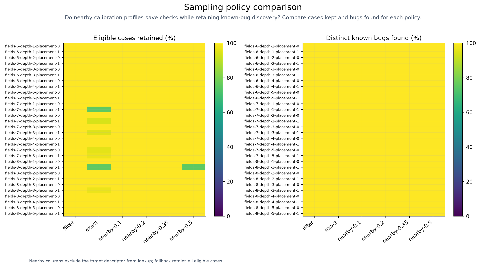
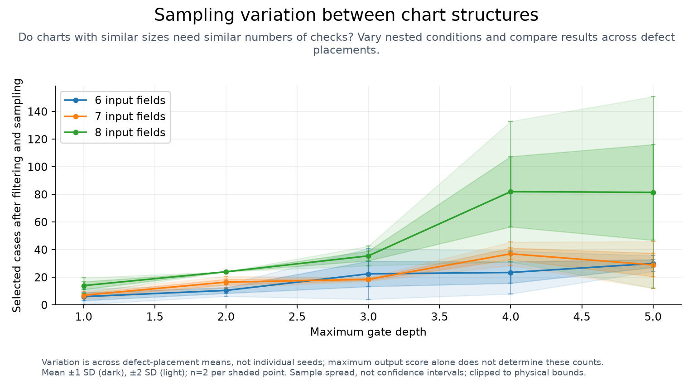

# Sampling evidence matrix

<!-- toc:start -->
**Table of contents**

- [Sampling evidence matrix](#sampling-evidence-matrix)
<!-- toc:end -->

[Calibration](README.md)

Nearby matching enabled: **False**; selected maximum relative coordinate change: **0**.
The threshold is chosen from the same calibration study, not independent validation.

Each nearby check removes every exact match for the target profile. Unknown or out-of-range targets keep ordinary filtering.
Protected output regions are preserved. These results do not establish bug recall for random sampling alone.

| Case | Strategy | Match | Selected / eligible | Mean known bugs found | Seeds meeting bug and field targets |
| --- | --- | --- | ---: | ---: | ---: |
| fields-6-depth-1-placement-0-breadth-1-output-depth-0 | filter | ordinary | 8.0 / 8 | 3.0 / 3 (100.0%) | 100 / 100 |
| fields-6-depth-1-placement-0-breadth-1-output-depth-0 | exact | exact | 8.0 / 8 | 3.0 / 3 (100.0%) | 100 / 100 |
| fields-6-depth-1-placement-0-breadth-1-output-depth-0 | nearby-0.1 | outside measured matching radius | 8.0 / 8 | 3.0 / 3 (100.0%) | 100 / 100 |
| fields-6-depth-1-placement-0-breadth-1-output-depth-0 | nearby-0.2 | outside measured matching radius | 8.0 / 8 | 3.0 / 3 (100.0%) | 100 / 100 |
| fields-6-depth-1-placement-0-breadth-1-output-depth-0 | nearby-0.35 | outside measured matching radius | 8.0 / 8 | 3.0 / 3 (100.0%) | 100 / 100 |
| fields-6-depth-1-placement-0-breadth-1-output-depth-0 | nearby-0.5 | nearby | 8.0 / 8 | 3.0 / 3 (100.0%) | 100 / 100 |
| fields-6-depth-1-placement-0-breadth-1-output-depth-1 | filter | ordinary | 8.0 / 8 | 3.0 / 3 (100.0%) | 100 / 100 |
| fields-6-depth-1-placement-0-breadth-1-output-depth-1 | exact | exact | 8.0 / 8 | 3.0 / 3 (100.0%) | 100 / 100 |
| fields-6-depth-1-placement-0-breadth-1-output-depth-1 | nearby-0.1 | outside measured matching radius | 8.0 / 8 | 3.0 / 3 (100.0%) | 100 / 100 |
| fields-6-depth-1-placement-0-breadth-1-output-depth-1 | nearby-0.2 | outside measured matching radius | 8.0 / 8 | 3.0 / 3 (100.0%) | 100 / 100 |
| fields-6-depth-1-placement-0-breadth-1-output-depth-1 | nearby-0.35 | nearby | 8.0 / 8 | 3.0 / 3 (100.0%) | 100 / 100 |
| fields-6-depth-1-placement-0-breadth-1-output-depth-1 | nearby-0.5 | nearby | 8.0 / 8 | 3.0 / 3 (100.0%) | 100 / 100 |
| fields-6-depth-1-placement-0-breadth-1-output-depth-2 | filter | ordinary | 8.0 / 8 | 3.0 / 3 (100.0%) | 100 / 100 |
| fields-6-depth-1-placement-0-breadth-1-output-depth-2 | exact | exact | 8.0 / 8 | 3.0 / 3 (100.0%) | 100 / 100 |
| fields-6-depth-1-placement-0-breadth-1-output-depth-2 | nearby-0.1 | nearby | 8.0 / 8 | 3.0 / 3 (100.0%) | 100 / 100 |
| fields-6-depth-1-placement-0-breadth-1-output-depth-2 | nearby-0.2 | nearby | 8.0 / 8 | 3.0 / 3 (100.0%) | 100 / 100 |
| fields-6-depth-1-placement-0-breadth-1-output-depth-2 | nearby-0.35 | nearby | 8.0 / 8 | 3.0 / 3 (100.0%) | 100 / 100 |
| fields-6-depth-1-placement-0-breadth-1-output-depth-2 | nearby-0.5 | nearby | 8.0 / 8 | 3.0 / 3 (100.0%) | 100 / 100 |
| fields-6-depth-1-placement-0-breadth-4-output-depth-0 | filter | ordinary | 8.0 / 8 | 3.0 / 3 (100.0%) | 100 / 100 |
| fields-6-depth-1-placement-0-breadth-4-output-depth-0 | exact | exact | 8.0 / 8 | 3.0 / 3 (100.0%) | 100 / 100 |
| fields-6-depth-1-placement-0-breadth-4-output-depth-0 | nearby-0.1 | nearby | 8.0 / 8 | 3.0 / 3 (100.0%) | 100 / 100 |
| fields-6-depth-1-placement-0-breadth-4-output-depth-0 | nearby-0.2 | nearby | 8.0 / 8 | 3.0 / 3 (100.0%) | 100 / 100 |
| fields-6-depth-1-placement-0-breadth-4-output-depth-0 | nearby-0.35 | nearby | 8.0 / 8 | 3.0 / 3 (100.0%) | 100 / 100 |
| fields-6-depth-1-placement-0-breadth-4-output-depth-0 | nearby-0.5 | nearby | 8.0 / 8 | 3.0 / 3 (100.0%) | 100 / 100 |
| fields-6-depth-1-placement-0-breadth-4-output-depth-1 | filter | ordinary | 8.0 / 8 | 3.0 / 3 (100.0%) | 100 / 100 |
| fields-6-depth-1-placement-0-breadth-4-output-depth-1 | exact | exact | 8.0 / 8 | 3.0 / 3 (100.0%) | 100 / 100 |
| fields-6-depth-1-placement-0-breadth-4-output-depth-1 | nearby-0.1 | nearby | 8.0 / 8 | 3.0 / 3 (100.0%) | 100 / 100 |
| fields-6-depth-1-placement-0-breadth-4-output-depth-1 | nearby-0.2 | nearby | 8.0 / 8 | 3.0 / 3 (100.0%) | 100 / 100 |
| fields-6-depth-1-placement-0-breadth-4-output-depth-1 | nearby-0.35 | nearby | 8.0 / 8 | 3.0 / 3 (100.0%) | 100 / 100 |
| fields-6-depth-1-placement-0-breadth-4-output-depth-1 | nearby-0.5 | nearby | 8.0 / 8 | 3.0 / 3 (100.0%) | 100 / 100 |
| fields-6-depth-1-placement-0-breadth-4-output-depth-2 | filter | ordinary | 8.0 / 8 | 3.0 / 3 (100.0%) | 100 / 100 |
| fields-6-depth-1-placement-0-breadth-4-output-depth-2 | exact | exact | 8.0 / 8 | 3.0 / 3 (100.0%) | 100 / 100 |
| fields-6-depth-1-placement-0-breadth-4-output-depth-2 | nearby-0.1 | outside measured matching radius | 8.0 / 8 | 3.0 / 3 (100.0%) | 100 / 100 |
| fields-6-depth-1-placement-0-breadth-4-output-depth-2 | nearby-0.2 | outside measured matching radius | 8.0 / 8 | 3.0 / 3 (100.0%) | 100 / 100 |
| fields-6-depth-1-placement-0-breadth-4-output-depth-2 | nearby-0.35 | nearby | 8.0 / 8 | 3.0 / 3 (100.0%) | 100 / 100 |
| fields-6-depth-1-placement-0-breadth-4-output-depth-2 | nearby-0.5 | nearby | 8.0 / 8 | 3.0 / 3 (100.0%) | 100 / 100 |
| fields-6-depth-1-placement-0-breadth-8-output-depth-0 | filter | ordinary | 8.0 / 8 | 3.0 / 3 (100.0%) | 100 / 100 |
| fields-6-depth-1-placement-0-breadth-8-output-depth-0 | exact | exact | 8.0 / 8 | 3.0 / 3 (100.0%) | 100 / 100 |
| fields-6-depth-1-placement-0-breadth-8-output-depth-0 | nearby-0.1 | nearby | 8.0 / 8 | 3.0 / 3 (100.0%) | 100 / 100 |
| fields-6-depth-1-placement-0-breadth-8-output-depth-0 | nearby-0.2 | nearby | 8.0 / 8 | 3.0 / 3 (100.0%) | 100 / 100 |
| fields-6-depth-1-placement-0-breadth-8-output-depth-0 | nearby-0.35 | nearby | 8.0 / 8 | 3.0 / 3 (100.0%) | 100 / 100 |
| fields-6-depth-1-placement-0-breadth-8-output-depth-0 | nearby-0.5 | nearby | 8.0 / 8 | 3.0 / 3 (100.0%) | 100 / 100 |
| fields-6-depth-1-placement-0-breadth-8-output-depth-1 | filter | ordinary | 8.0 / 8 | 3.0 / 3 (100.0%) | 100 / 100 |
| fields-6-depth-1-placement-0-breadth-8-output-depth-1 | exact | exact | 8.0 / 8 | 3.0 / 3 (100.0%) | 100 / 100 |
| fields-6-depth-1-placement-0-breadth-8-output-depth-1 | nearby-0.1 | outside measured matching radius | 8.0 / 8 | 3.0 / 3 (100.0%) | 100 / 100 |
| fields-6-depth-1-placement-0-breadth-8-output-depth-1 | nearby-0.2 | outside measured matching radius | 8.0 / 8 | 3.0 / 3 (100.0%) | 100 / 100 |
| fields-6-depth-1-placement-0-breadth-8-output-depth-1 | nearby-0.35 | nearby | 8.0 / 8 | 3.0 / 3 (100.0%) | 100 / 100 |
| fields-6-depth-1-placement-0-breadth-8-output-depth-1 | nearby-0.5 | nearby | 8.0 / 8 | 3.0 / 3 (100.0%) | 100 / 100 |
| fields-6-depth-1-placement-0-breadth-8-output-depth-2 | filter | ordinary | 8.0 / 8 | 3.0 / 3 (100.0%) | 100 / 100 |
| fields-6-depth-1-placement-0-breadth-8-output-depth-2 | exact | exact | 8.0 / 8 | 3.0 / 3 (100.0%) | 100 / 100 |
| fields-6-depth-1-placement-0-breadth-8-output-depth-2 | nearby-0.1 | outside measured matching radius | 8.0 / 8 | 3.0 / 3 (100.0%) | 100 / 100 |
| fields-6-depth-1-placement-0-breadth-8-output-depth-2 | nearby-0.2 | outside measured matching radius | 8.0 / 8 | 3.0 / 3 (100.0%) | 100 / 100 |
| fields-6-depth-1-placement-0-breadth-8-output-depth-2 | nearby-0.35 | nearby | 8.0 / 8 | 3.0 / 3 (100.0%) | 100 / 100 |
| fields-6-depth-1-placement-0-breadth-8-output-depth-2 | nearby-0.5 | nearby | 8.0 / 8 | 3.0 / 3 (100.0%) | 100 / 100 |
| fields-6-depth-1-placement-1-breadth-1-output-depth-0 | filter | ordinary | 4.0 / 4 | 3.0 / 3 (100.0%) | 100 / 100 |
| fields-6-depth-1-placement-1-breadth-1-output-depth-0 | exact | exact | 4.0 / 4 | 3.0 / 3 (100.0%) | 100 / 100 |
| fields-6-depth-1-placement-1-breadth-1-output-depth-0 | nearby-0.1 | outside measured matching radius | 4.0 / 4 | 3.0 / 3 (100.0%) | 100 / 100 |
| fields-6-depth-1-placement-1-breadth-1-output-depth-0 | nearby-0.2 | outside measured matching radius | 4.0 / 4 | 3.0 / 3 (100.0%) | 100 / 100 |
| fields-6-depth-1-placement-1-breadth-1-output-depth-0 | nearby-0.35 | outside measured matching radius | 4.0 / 4 | 3.0 / 3 (100.0%) | 100 / 100 |
| fields-6-depth-1-placement-1-breadth-1-output-depth-0 | nearby-0.5 | nearby | 4.0 / 4 | 3.0 / 3 (100.0%) | 100 / 100 |
| fields-6-depth-1-placement-1-breadth-1-output-depth-1 | filter | ordinary | 4.0 / 4 | 3.0 / 3 (100.0%) | 100 / 100 |
| fields-6-depth-1-placement-1-breadth-1-output-depth-1 | exact | exact | 4.0 / 4 | 3.0 / 3 (100.0%) | 100 / 100 |
| fields-6-depth-1-placement-1-breadth-1-output-depth-1 | nearby-0.1 | outside measured matching radius | 4.0 / 4 | 3.0 / 3 (100.0%) | 100 / 100 |
| fields-6-depth-1-placement-1-breadth-1-output-depth-1 | nearby-0.2 | outside measured matching radius | 4.0 / 4 | 3.0 / 3 (100.0%) | 100 / 100 |
| fields-6-depth-1-placement-1-breadth-1-output-depth-1 | nearby-0.35 | nearby | 4.0 / 4 | 3.0 / 3 (100.0%) | 100 / 100 |
| fields-6-depth-1-placement-1-breadth-1-output-depth-1 | nearby-0.5 | nearby | 4.0 / 4 | 3.0 / 3 (100.0%) | 100 / 100 |
| fields-6-depth-1-placement-1-breadth-1-output-depth-2 | filter | ordinary | 4.0 / 4 | 3.0 / 3 (100.0%) | 100 / 100 |
| fields-6-depth-1-placement-1-breadth-1-output-depth-2 | exact | exact | 4.0 / 4 | 3.0 / 3 (100.0%) | 100 / 100 |
| fields-6-depth-1-placement-1-breadth-1-output-depth-2 | nearby-0.1 | nearby | 4.0 / 4 | 3.0 / 3 (100.0%) | 100 / 100 |
| fields-6-depth-1-placement-1-breadth-1-output-depth-2 | nearby-0.2 | nearby | 4.0 / 4 | 3.0 / 3 (100.0%) | 100 / 100 |
| fields-6-depth-1-placement-1-breadth-1-output-depth-2 | nearby-0.35 | nearby | 4.0 / 4 | 3.0 / 3 (100.0%) | 100 / 100 |
| fields-6-depth-1-placement-1-breadth-1-output-depth-2 | nearby-0.5 | nearby | 4.0 / 4 | 3.0 / 3 (100.0%) | 100 / 100 |
| fields-6-depth-1-placement-1-breadth-4-output-depth-0 | filter | ordinary | 4.0 / 4 | 3.0 / 3 (100.0%) | 100 / 100 |
| fields-6-depth-1-placement-1-breadth-4-output-depth-0 | exact | exact | 4.0 / 4 | 3.0 / 3 (100.0%) | 100 / 100 |
| fields-6-depth-1-placement-1-breadth-4-output-depth-0 | nearby-0.1 | nearby | 4.0 / 4 | 3.0 / 3 (100.0%) | 100 / 100 |
| fields-6-depth-1-placement-1-breadth-4-output-depth-0 | nearby-0.2 | nearby | 4.0 / 4 | 3.0 / 3 (100.0%) | 100 / 100 |
| fields-6-depth-1-placement-1-breadth-4-output-depth-0 | nearby-0.35 | nearby | 4.0 / 4 | 3.0 / 3 (100.0%) | 100 / 100 |
| fields-6-depth-1-placement-1-breadth-4-output-depth-0 | nearby-0.5 | nearby | 4.0 / 4 | 3.0 / 3 (100.0%) | 100 / 100 |
| fields-6-depth-1-placement-1-breadth-4-output-depth-1 | filter | ordinary | 4.0 / 4 | 3.0 / 3 (100.0%) | 100 / 100 |
| fields-6-depth-1-placement-1-breadth-4-output-depth-1 | exact | exact | 4.0 / 4 | 3.0 / 3 (100.0%) | 100 / 100 |
| fields-6-depth-1-placement-1-breadth-4-output-depth-1 | nearby-0.1 | nearby | 4.0 / 4 | 3.0 / 3 (100.0%) | 100 / 100 |
| fields-6-depth-1-placement-1-breadth-4-output-depth-1 | nearby-0.2 | nearby | 4.0 / 4 | 3.0 / 3 (100.0%) | 100 / 100 |
| fields-6-depth-1-placement-1-breadth-4-output-depth-1 | nearby-0.35 | nearby | 4.0 / 4 | 3.0 / 3 (100.0%) | 100 / 100 |
| fields-6-depth-1-placement-1-breadth-4-output-depth-1 | nearby-0.5 | nearby | 4.0 / 4 | 3.0 / 3 (100.0%) | 100 / 100 |
| fields-6-depth-1-placement-1-breadth-4-output-depth-2 | filter | ordinary | 4.0 / 4 | 3.0 / 3 (100.0%) | 100 / 100 |
| fields-6-depth-1-placement-1-breadth-4-output-depth-2 | exact | exact | 4.0 / 4 | 3.0 / 3 (100.0%) | 100 / 100 |
| fields-6-depth-1-placement-1-breadth-4-output-depth-2 | nearby-0.1 | outside measured matching radius | 4.0 / 4 | 3.0 / 3 (100.0%) | 100 / 100 |
| fields-6-depth-1-placement-1-breadth-4-output-depth-2 | nearby-0.2 | outside measured matching radius | 4.0 / 4 | 3.0 / 3 (100.0%) | 100 / 100 |
| fields-6-depth-1-placement-1-breadth-4-output-depth-2 | nearby-0.35 | nearby | 4.0 / 4 | 3.0 / 3 (100.0%) | 100 / 100 |
| fields-6-depth-1-placement-1-breadth-4-output-depth-2 | nearby-0.5 | nearby | 4.0 / 4 | 3.0 / 3 (100.0%) | 100 / 100 |
| fields-6-depth-1-placement-1-breadth-8-output-depth-0 | filter | ordinary | 4.0 / 4 | 3.0 / 3 (100.0%) | 100 / 100 |
| fields-6-depth-1-placement-1-breadth-8-output-depth-0 | exact | exact | 4.0 / 4 | 3.0 / 3 (100.0%) | 100 / 100 |
| fields-6-depth-1-placement-1-breadth-8-output-depth-0 | nearby-0.1 | nearby | 4.0 / 4 | 3.0 / 3 (100.0%) | 100 / 100 |
| fields-6-depth-1-placement-1-breadth-8-output-depth-0 | nearby-0.2 | nearby | 4.0 / 4 | 3.0 / 3 (100.0%) | 100 / 100 |
| fields-6-depth-1-placement-1-breadth-8-output-depth-0 | nearby-0.35 | nearby | 4.0 / 4 | 3.0 / 3 (100.0%) | 100 / 100 |
| fields-6-depth-1-placement-1-breadth-8-output-depth-0 | nearby-0.5 | nearby | 4.0 / 4 | 3.0 / 3 (100.0%) | 100 / 100 |
| fields-6-depth-1-placement-1-breadth-8-output-depth-1 | filter | ordinary | 4.0 / 4 | 3.0 / 3 (100.0%) | 100 / 100 |
| fields-6-depth-1-placement-1-breadth-8-output-depth-1 | exact | exact | 4.0 / 4 | 3.0 / 3 (100.0%) | 100 / 100 |
| fields-6-depth-1-placement-1-breadth-8-output-depth-1 | nearby-0.1 | outside measured matching radius | 4.0 / 4 | 3.0 / 3 (100.0%) | 100 / 100 |
| fields-6-depth-1-placement-1-breadth-8-output-depth-1 | nearby-0.2 | outside measured matching radius | 4.0 / 4 | 3.0 / 3 (100.0%) | 100 / 100 |
| fields-6-depth-1-placement-1-breadth-8-output-depth-1 | nearby-0.35 | nearby | 4.0 / 4 | 3.0 / 3 (100.0%) | 100 / 100 |
| fields-6-depth-1-placement-1-breadth-8-output-depth-1 | nearby-0.5 | nearby | 4.0 / 4 | 3.0 / 3 (100.0%) | 100 / 100 |
| fields-6-depth-1-placement-1-breadth-8-output-depth-2 | filter | ordinary | 4.0 / 4 | 3.0 / 3 (100.0%) | 100 / 100 |
| fields-6-depth-1-placement-1-breadth-8-output-depth-2 | exact | exact | 4.0 / 4 | 3.0 / 3 (100.0%) | 100 / 100 |
| fields-6-depth-1-placement-1-breadth-8-output-depth-2 | nearby-0.1 | outside measured matching radius | 4.0 / 4 | 3.0 / 3 (100.0%) | 100 / 100 |
| fields-6-depth-1-placement-1-breadth-8-output-depth-2 | nearby-0.2 | outside measured matching radius | 4.0 / 4 | 3.0 / 3 (100.0%) | 100 / 100 |
| fields-6-depth-1-placement-1-breadth-8-output-depth-2 | nearby-0.35 | nearby | 4.0 / 4 | 3.0 / 3 (100.0%) | 100 / 100 |
| fields-6-depth-1-placement-1-breadth-8-output-depth-2 | nearby-0.5 | nearby | 4.0 / 4 | 3.0 / 3 (100.0%) | 100 / 100 |
| fields-6-depth-3-placement-0-breadth-1-output-depth-0 | filter | ordinary | 29.0 / 29 | 3.0 / 3 (100.0%) | 100 / 100 |
| fields-6-depth-3-placement-0-breadth-1-output-depth-0 | exact | exact | 29.0 / 29 | 3.0 / 3 (100.0%) | 100 / 100 |
| fields-6-depth-3-placement-0-breadth-1-output-depth-0 | nearby-0.1 | outside measured matching radius | 29.0 / 29 | 3.0 / 3 (100.0%) | 100 / 100 |
| fields-6-depth-3-placement-0-breadth-1-output-depth-0 | nearby-0.2 | outside measured matching radius | 29.0 / 29 | 3.0 / 3 (100.0%) | 100 / 100 |
| fields-6-depth-3-placement-0-breadth-1-output-depth-0 | nearby-0.35 | outside measured matching radius | 29.0 / 29 | 3.0 / 3 (100.0%) | 100 / 100 |
| fields-6-depth-3-placement-0-breadth-1-output-depth-0 | nearby-0.5 | nearby | 29.0 / 29 | 3.0 / 3 (100.0%) | 100 / 100 |
| fields-6-depth-3-placement-0-breadth-1-output-depth-1 | filter | ordinary | 29.0 / 29 | 3.0 / 3 (100.0%) | 100 / 100 |
| fields-6-depth-3-placement-0-breadth-1-output-depth-1 | exact | exact | 29.0 / 29 | 3.0 / 3 (100.0%) | 100 / 100 |
| fields-6-depth-3-placement-0-breadth-1-output-depth-1 | nearby-0.1 | outside measured matching radius | 29.0 / 29 | 3.0 / 3 (100.0%) | 100 / 100 |
| fields-6-depth-3-placement-0-breadth-1-output-depth-1 | nearby-0.2 | outside measured matching radius | 29.0 / 29 | 3.0 / 3 (100.0%) | 100 / 100 |
| fields-6-depth-3-placement-0-breadth-1-output-depth-1 | nearby-0.35 | nearby | 29.0 / 29 | 3.0 / 3 (100.0%) | 100 / 100 |
| fields-6-depth-3-placement-0-breadth-1-output-depth-1 | nearby-0.5 | nearby | 29.0 / 29 | 3.0 / 3 (100.0%) | 100 / 100 |
| fields-6-depth-3-placement-0-breadth-1-output-depth-2 | filter | ordinary | 29.0 / 29 | 3.0 / 3 (100.0%) | 100 / 100 |
| fields-6-depth-3-placement-0-breadth-1-output-depth-2 | exact | exact | 29.0 / 29 | 3.0 / 3 (100.0%) | 100 / 100 |
| fields-6-depth-3-placement-0-breadth-1-output-depth-2 | nearby-0.1 | nearby | 29.0 / 29 | 3.0 / 3 (100.0%) | 100 / 100 |
| fields-6-depth-3-placement-0-breadth-1-output-depth-2 | nearby-0.2 | nearby | 29.0 / 29 | 3.0 / 3 (100.0%) | 100 / 100 |
| fields-6-depth-3-placement-0-breadth-1-output-depth-2 | nearby-0.35 | nearby | 29.0 / 29 | 3.0 / 3 (100.0%) | 100 / 100 |
| fields-6-depth-3-placement-0-breadth-1-output-depth-2 | nearby-0.5 | nearby | 29.0 / 29 | 3.0 / 3 (100.0%) | 100 / 100 |
| fields-6-depth-3-placement-0-breadth-4-output-depth-0 | filter | ordinary | 29.0 / 29 | 3.0 / 3 (100.0%) | 100 / 100 |
| fields-6-depth-3-placement-0-breadth-4-output-depth-0 | exact | exact | 29.0 / 29 | 3.0 / 3 (100.0%) | 100 / 100 |
| fields-6-depth-3-placement-0-breadth-4-output-depth-0 | nearby-0.1 | nearby | 29.0 / 29 | 3.0 / 3 (100.0%) | 100 / 100 |
| fields-6-depth-3-placement-0-breadth-4-output-depth-0 | nearby-0.2 | nearby | 29.0 / 29 | 3.0 / 3 (100.0%) | 100 / 100 |
| fields-6-depth-3-placement-0-breadth-4-output-depth-0 | nearby-0.35 | nearby | 29.0 / 29 | 3.0 / 3 (100.0%) | 100 / 100 |
| fields-6-depth-3-placement-0-breadth-4-output-depth-0 | nearby-0.5 | nearby | 29.0 / 29 | 3.0 / 3 (100.0%) | 100 / 100 |
| fields-6-depth-3-placement-0-breadth-4-output-depth-1 | filter | ordinary | 29.0 / 29 | 3.0 / 3 (100.0%) | 100 / 100 |
| fields-6-depth-3-placement-0-breadth-4-output-depth-1 | exact | exact | 29.0 / 29 | 3.0 / 3 (100.0%) | 100 / 100 |
| fields-6-depth-3-placement-0-breadth-4-output-depth-1 | nearby-0.1 | nearby | 29.0 / 29 | 3.0 / 3 (100.0%) | 100 / 100 |
| fields-6-depth-3-placement-0-breadth-4-output-depth-1 | nearby-0.2 | nearby | 29.0 / 29 | 3.0 / 3 (100.0%) | 100 / 100 |
| fields-6-depth-3-placement-0-breadth-4-output-depth-1 | nearby-0.35 | nearby | 29.0 / 29 | 3.0 / 3 (100.0%) | 100 / 100 |
| fields-6-depth-3-placement-0-breadth-4-output-depth-1 | nearby-0.5 | nearby | 29.0 / 29 | 3.0 / 3 (100.0%) | 100 / 100 |
| fields-6-depth-3-placement-0-breadth-4-output-depth-2 | filter | ordinary | 29.0 / 29 | 3.0 / 3 (100.0%) | 100 / 100 |
| fields-6-depth-3-placement-0-breadth-4-output-depth-2 | exact | exact | 29.0 / 29 | 3.0 / 3 (100.0%) | 100 / 100 |
| fields-6-depth-3-placement-0-breadth-4-output-depth-2 | nearby-0.1 | outside measured matching radius | 29.0 / 29 | 3.0 / 3 (100.0%) | 100 / 100 |
| fields-6-depth-3-placement-0-breadth-4-output-depth-2 | nearby-0.2 | outside measured matching radius | 29.0 / 29 | 3.0 / 3 (100.0%) | 100 / 100 |
| fields-6-depth-3-placement-0-breadth-4-output-depth-2 | nearby-0.35 | nearby | 29.0 / 29 | 3.0 / 3 (100.0%) | 100 / 100 |
| fields-6-depth-3-placement-0-breadth-4-output-depth-2 | nearby-0.5 | nearby | 29.0 / 29 | 3.0 / 3 (100.0%) | 100 / 100 |
| fields-6-depth-3-placement-0-breadth-8-output-depth-0 | filter | ordinary | 29.0 / 29 | 3.0 / 3 (100.0%) | 100 / 100 |
| fields-6-depth-3-placement-0-breadth-8-output-depth-0 | exact | exact | 29.0 / 29 | 3.0 / 3 (100.0%) | 100 / 100 |
| fields-6-depth-3-placement-0-breadth-8-output-depth-0 | nearby-0.1 | nearby | 29.0 / 29 | 3.0 / 3 (100.0%) | 100 / 100 |
| fields-6-depth-3-placement-0-breadth-8-output-depth-0 | nearby-0.2 | nearby | 29.0 / 29 | 3.0 / 3 (100.0%) | 100 / 100 |
| fields-6-depth-3-placement-0-breadth-8-output-depth-0 | nearby-0.35 | nearby | 29.0 / 29 | 3.0 / 3 (100.0%) | 100 / 100 |
| fields-6-depth-3-placement-0-breadth-8-output-depth-0 | nearby-0.5 | nearby | 29.0 / 29 | 3.0 / 3 (100.0%) | 100 / 100 |
| fields-6-depth-3-placement-0-breadth-8-output-depth-1 | filter | ordinary | 29.0 / 29 | 3.0 / 3 (100.0%) | 100 / 100 |
| fields-6-depth-3-placement-0-breadth-8-output-depth-1 | exact | exact | 29.0 / 29 | 3.0 / 3 (100.0%) | 100 / 100 |
| fields-6-depth-3-placement-0-breadth-8-output-depth-1 | nearby-0.1 | outside measured matching radius | 29.0 / 29 | 3.0 / 3 (100.0%) | 100 / 100 |
| fields-6-depth-3-placement-0-breadth-8-output-depth-1 | nearby-0.2 | outside measured matching radius | 29.0 / 29 | 3.0 / 3 (100.0%) | 100 / 100 |
| fields-6-depth-3-placement-0-breadth-8-output-depth-1 | nearby-0.35 | nearby | 29.0 / 29 | 3.0 / 3 (100.0%) | 100 / 100 |
| fields-6-depth-3-placement-0-breadth-8-output-depth-1 | nearby-0.5 | nearby | 29.0 / 29 | 3.0 / 3 (100.0%) | 100 / 100 |
| fields-6-depth-3-placement-0-breadth-8-output-depth-2 | filter | ordinary | 29.0 / 29 | 3.0 / 3 (100.0%) | 100 / 100 |
| fields-6-depth-3-placement-0-breadth-8-output-depth-2 | exact | exact | 29.0 / 29 | 3.0 / 3 (100.0%) | 100 / 100 |
| fields-6-depth-3-placement-0-breadth-8-output-depth-2 | nearby-0.1 | outside measured matching radius | 29.0 / 29 | 3.0 / 3 (100.0%) | 100 / 100 |
| fields-6-depth-3-placement-0-breadth-8-output-depth-2 | nearby-0.2 | outside measured matching radius | 29.0 / 29 | 3.0 / 3 (100.0%) | 100 / 100 |
| fields-6-depth-3-placement-0-breadth-8-output-depth-2 | nearby-0.35 | nearby | 29.0 / 29 | 3.0 / 3 (100.0%) | 100 / 100 |
| fields-6-depth-3-placement-0-breadth-8-output-depth-2 | nearby-0.5 | nearby | 29.0 / 29 | 3.0 / 3 (100.0%) | 100 / 100 |
| fields-6-depth-3-placement-1-breadth-1-output-depth-0 | filter | ordinary | 16.0 / 16 | 3.0 / 3 (100.0%) | 100 / 100 |
| fields-6-depth-3-placement-1-breadth-1-output-depth-0 | exact | exact | 16.0 / 16 | 3.0 / 3 (100.0%) | 100 / 100 |
| fields-6-depth-3-placement-1-breadth-1-output-depth-0 | nearby-0.1 | outside measured matching radius | 16.0 / 16 | 3.0 / 3 (100.0%) | 100 / 100 |
| fields-6-depth-3-placement-1-breadth-1-output-depth-0 | nearby-0.2 | outside measured matching radius | 16.0 / 16 | 3.0 / 3 (100.0%) | 100 / 100 |
| fields-6-depth-3-placement-1-breadth-1-output-depth-0 | nearby-0.35 | outside measured matching radius | 16.0 / 16 | 3.0 / 3 (100.0%) | 100 / 100 |
| fields-6-depth-3-placement-1-breadth-1-output-depth-0 | nearby-0.5 | nearby | 16.0 / 16 | 3.0 / 3 (100.0%) | 100 / 100 |
| fields-6-depth-3-placement-1-breadth-1-output-depth-1 | filter | ordinary | 16.0 / 16 | 3.0 / 3 (100.0%) | 100 / 100 |
| fields-6-depth-3-placement-1-breadth-1-output-depth-1 | exact | exact | 16.0 / 16 | 3.0 / 3 (100.0%) | 100 / 100 |
| fields-6-depth-3-placement-1-breadth-1-output-depth-1 | nearby-0.1 | outside measured matching radius | 16.0 / 16 | 3.0 / 3 (100.0%) | 100 / 100 |
| fields-6-depth-3-placement-1-breadth-1-output-depth-1 | nearby-0.2 | outside measured matching radius | 16.0 / 16 | 3.0 / 3 (100.0%) | 100 / 100 |
| fields-6-depth-3-placement-1-breadth-1-output-depth-1 | nearby-0.35 | nearby | 16.0 / 16 | 3.0 / 3 (100.0%) | 100 / 100 |
| fields-6-depth-3-placement-1-breadth-1-output-depth-1 | nearby-0.5 | nearby | 16.0 / 16 | 3.0 / 3 (100.0%) | 100 / 100 |
| fields-6-depth-3-placement-1-breadth-1-output-depth-2 | filter | ordinary | 16.0 / 16 | 3.0 / 3 (100.0%) | 100 / 100 |
| fields-6-depth-3-placement-1-breadth-1-output-depth-2 | exact | exact | 16.0 / 16 | 3.0 / 3 (100.0%) | 100 / 100 |
| fields-6-depth-3-placement-1-breadth-1-output-depth-2 | nearby-0.1 | nearby | 16.0 / 16 | 3.0 / 3 (100.0%) | 100 / 100 |
| fields-6-depth-3-placement-1-breadth-1-output-depth-2 | nearby-0.2 | nearby | 16.0 / 16 | 3.0 / 3 (100.0%) | 100 / 100 |
| fields-6-depth-3-placement-1-breadth-1-output-depth-2 | nearby-0.35 | nearby | 16.0 / 16 | 3.0 / 3 (100.0%) | 100 / 100 |
| fields-6-depth-3-placement-1-breadth-1-output-depth-2 | nearby-0.5 | nearby | 16.0 / 16 | 3.0 / 3 (100.0%) | 100 / 100 |
| fields-6-depth-3-placement-1-breadth-4-output-depth-0 | filter | ordinary | 16.0 / 16 | 3.0 / 3 (100.0%) | 100 / 100 |
| fields-6-depth-3-placement-1-breadth-4-output-depth-0 | exact | exact | 16.0 / 16 | 3.0 / 3 (100.0%) | 100 / 100 |
| fields-6-depth-3-placement-1-breadth-4-output-depth-0 | nearby-0.1 | nearby | 16.0 / 16 | 3.0 / 3 (100.0%) | 100 / 100 |
| fields-6-depth-3-placement-1-breadth-4-output-depth-0 | nearby-0.2 | nearby | 16.0 / 16 | 3.0 / 3 (100.0%) | 100 / 100 |
| fields-6-depth-3-placement-1-breadth-4-output-depth-0 | nearby-0.35 | nearby | 16.0 / 16 | 3.0 / 3 (100.0%) | 100 / 100 |
| fields-6-depth-3-placement-1-breadth-4-output-depth-0 | nearby-0.5 | nearby | 16.0 / 16 | 3.0 / 3 (100.0%) | 100 / 100 |
| fields-6-depth-3-placement-1-breadth-4-output-depth-1 | filter | ordinary | 16.0 / 16 | 3.0 / 3 (100.0%) | 100 / 100 |
| fields-6-depth-3-placement-1-breadth-4-output-depth-1 | exact | exact | 16.0 / 16 | 3.0 / 3 (100.0%) | 100 / 100 |
| fields-6-depth-3-placement-1-breadth-4-output-depth-1 | nearby-0.1 | nearby | 16.0 / 16 | 3.0 / 3 (100.0%) | 100 / 100 |
| fields-6-depth-3-placement-1-breadth-4-output-depth-1 | nearby-0.2 | nearby | 16.0 / 16 | 3.0 / 3 (100.0%) | 100 / 100 |
| fields-6-depth-3-placement-1-breadth-4-output-depth-1 | nearby-0.35 | nearby | 16.0 / 16 | 3.0 / 3 (100.0%) | 100 / 100 |
| fields-6-depth-3-placement-1-breadth-4-output-depth-1 | nearby-0.5 | nearby | 16.0 / 16 | 3.0 / 3 (100.0%) | 100 / 100 |
| fields-6-depth-3-placement-1-breadth-4-output-depth-2 | filter | ordinary | 16.0 / 16 | 3.0 / 3 (100.0%) | 100 / 100 |
| fields-6-depth-3-placement-1-breadth-4-output-depth-2 | exact | exact | 16.0 / 16 | 3.0 / 3 (100.0%) | 100 / 100 |
| fields-6-depth-3-placement-1-breadth-4-output-depth-2 | nearby-0.1 | outside measured matching radius | 16.0 / 16 | 3.0 / 3 (100.0%) | 100 / 100 |
| fields-6-depth-3-placement-1-breadth-4-output-depth-2 | nearby-0.2 | outside measured matching radius | 16.0 / 16 | 3.0 / 3 (100.0%) | 100 / 100 |
| fields-6-depth-3-placement-1-breadth-4-output-depth-2 | nearby-0.35 | nearby | 16.0 / 16 | 3.0 / 3 (100.0%) | 100 / 100 |
| fields-6-depth-3-placement-1-breadth-4-output-depth-2 | nearby-0.5 | nearby | 16.0 / 16 | 3.0 / 3 (100.0%) | 100 / 100 |
| fields-6-depth-3-placement-1-breadth-8-output-depth-0 | filter | ordinary | 16.0 / 16 | 3.0 / 3 (100.0%) | 100 / 100 |
| fields-6-depth-3-placement-1-breadth-8-output-depth-0 | exact | exact | 16.0 / 16 | 3.0 / 3 (100.0%) | 100 / 100 |
| fields-6-depth-3-placement-1-breadth-8-output-depth-0 | nearby-0.1 | nearby | 16.0 / 16 | 3.0 / 3 (100.0%) | 100 / 100 |
| fields-6-depth-3-placement-1-breadth-8-output-depth-0 | nearby-0.2 | nearby | 16.0 / 16 | 3.0 / 3 (100.0%) | 100 / 100 |
| fields-6-depth-3-placement-1-breadth-8-output-depth-0 | nearby-0.35 | nearby | 16.0 / 16 | 3.0 / 3 (100.0%) | 100 / 100 |
| fields-6-depth-3-placement-1-breadth-8-output-depth-0 | nearby-0.5 | nearby | 16.0 / 16 | 3.0 / 3 (100.0%) | 100 / 100 |
| fields-6-depth-3-placement-1-breadth-8-output-depth-1 | filter | ordinary | 16.0 / 16 | 3.0 / 3 (100.0%) | 100 / 100 |
| fields-6-depth-3-placement-1-breadth-8-output-depth-1 | exact | exact | 16.0 / 16 | 3.0 / 3 (100.0%) | 100 / 100 |
| fields-6-depth-3-placement-1-breadth-8-output-depth-1 | nearby-0.1 | outside measured matching radius | 16.0 / 16 | 3.0 / 3 (100.0%) | 100 / 100 |
| fields-6-depth-3-placement-1-breadth-8-output-depth-1 | nearby-0.2 | outside measured matching radius | 16.0 / 16 | 3.0 / 3 (100.0%) | 100 / 100 |
| fields-6-depth-3-placement-1-breadth-8-output-depth-1 | nearby-0.35 | nearby | 16.0 / 16 | 3.0 / 3 (100.0%) | 100 / 100 |
| fields-6-depth-3-placement-1-breadth-8-output-depth-1 | nearby-0.5 | nearby | 16.0 / 16 | 3.0 / 3 (100.0%) | 100 / 100 |
| fields-6-depth-3-placement-1-breadth-8-output-depth-2 | filter | ordinary | 16.0 / 16 | 3.0 / 3 (100.0%) | 100 / 100 |
| fields-6-depth-3-placement-1-breadth-8-output-depth-2 | exact | exact | 16.0 / 16 | 3.0 / 3 (100.0%) | 100 / 100 |
| fields-6-depth-3-placement-1-breadth-8-output-depth-2 | nearby-0.1 | outside measured matching radius | 16.0 / 16 | 3.0 / 3 (100.0%) | 100 / 100 |
| fields-6-depth-3-placement-1-breadth-8-output-depth-2 | nearby-0.2 | outside measured matching radius | 16.0 / 16 | 3.0 / 3 (100.0%) | 100 / 100 |
| fields-6-depth-3-placement-1-breadth-8-output-depth-2 | nearby-0.35 | nearby | 16.0 / 16 | 3.0 / 3 (100.0%) | 100 / 100 |
| fields-6-depth-3-placement-1-breadth-8-output-depth-2 | nearby-0.5 | nearby | 16.0 / 16 | 3.0 / 3 (100.0%) | 100 / 100 |
| fields-6-depth-5-placement-0-breadth-1-output-depth-0 | filter | ordinary | 32.0 / 32 | 3.0 / 3 (100.0%) | 100 / 100 |
| fields-6-depth-5-placement-0-breadth-1-output-depth-0 | exact | exact | 32.0 / 32 | 3.0 / 3 (100.0%) | 100 / 100 |
| fields-6-depth-5-placement-0-breadth-1-output-depth-0 | nearby-0.1 | outside measured matching radius | 32.0 / 32 | 3.0 / 3 (100.0%) | 100 / 100 |
| fields-6-depth-5-placement-0-breadth-1-output-depth-0 | nearby-0.2 | nearby | 32.0 / 32 | 3.0 / 3 (100.0%) | 100 / 100 |
| fields-6-depth-5-placement-0-breadth-1-output-depth-0 | nearby-0.35 | nearby | 32.0 / 32 | 3.0 / 3 (100.0%) | 100 / 100 |
| fields-6-depth-5-placement-0-breadth-1-output-depth-0 | nearby-0.5 | nearby | 32.0 / 32 | 3.0 / 3 (100.0%) | 100 / 100 |
| fields-6-depth-5-placement-0-breadth-1-output-depth-1 | filter | ordinary | 32.0 / 32 | 3.0 / 3 (100.0%) | 100 / 100 |
| fields-6-depth-5-placement-0-breadth-1-output-depth-1 | exact | exact | 32.0 / 32 | 3.0 / 3 (100.0%) | 100 / 100 |
| fields-6-depth-5-placement-0-breadth-1-output-depth-1 | nearby-0.1 | outside measured matching radius | 32.0 / 32 | 3.0 / 3 (100.0%) | 100 / 100 |
| fields-6-depth-5-placement-0-breadth-1-output-depth-1 | nearby-0.2 | nearby | 32.0 / 32 | 3.0 / 3 (100.0%) | 100 / 100 |
| fields-6-depth-5-placement-0-breadth-1-output-depth-1 | nearby-0.35 | nearby | 32.0 / 32 | 3.0 / 3 (100.0%) | 100 / 100 |
| fields-6-depth-5-placement-0-breadth-1-output-depth-1 | nearby-0.5 | nearby | 32.0 / 32 | 3.0 / 3 (100.0%) | 100 / 100 |
| fields-6-depth-5-placement-0-breadth-1-output-depth-2 | filter | ordinary | 32.0 / 32 | 3.0 / 3 (100.0%) | 100 / 100 |
| fields-6-depth-5-placement-0-breadth-1-output-depth-2 | exact | exact | 32.0 / 32 | 3.0 / 3 (100.0%) | 100 / 100 |
| fields-6-depth-5-placement-0-breadth-1-output-depth-2 | nearby-0.1 | nearby | 32.0 / 32 | 3.0 / 3 (100.0%) | 100 / 100 |
| fields-6-depth-5-placement-0-breadth-1-output-depth-2 | nearby-0.2 | nearby | 32.0 / 32 | 3.0 / 3 (100.0%) | 100 / 100 |
| fields-6-depth-5-placement-0-breadth-1-output-depth-2 | nearby-0.35 | nearby | 32.0 / 32 | 3.0 / 3 (100.0%) | 100 / 100 |
| fields-6-depth-5-placement-0-breadth-1-output-depth-2 | nearby-0.5 | nearby | 32.0 / 32 | 3.0 / 3 (100.0%) | 100 / 100 |
| fields-6-depth-5-placement-0-breadth-4-output-depth-0 | filter | ordinary | 32.0 / 32 | 3.0 / 3 (100.0%) | 100 / 100 |
| fields-6-depth-5-placement-0-breadth-4-output-depth-0 | exact | exact | 32.0 / 32 | 3.0 / 3 (100.0%) | 100 / 100 |
| fields-6-depth-5-placement-0-breadth-4-output-depth-0 | nearby-0.1 | nearby | 32.0 / 32 | 3.0 / 3 (100.0%) | 100 / 100 |
| fields-6-depth-5-placement-0-breadth-4-output-depth-0 | nearby-0.2 | nearby | 32.0 / 32 | 3.0 / 3 (100.0%) | 100 / 100 |
| fields-6-depth-5-placement-0-breadth-4-output-depth-0 | nearby-0.35 | nearby | 32.0 / 32 | 3.0 / 3 (100.0%) | 100 / 100 |
| fields-6-depth-5-placement-0-breadth-4-output-depth-0 | nearby-0.5 | nearby | 32.0 / 32 | 3.0 / 3 (100.0%) | 100 / 100 |
| fields-6-depth-5-placement-0-breadth-4-output-depth-1 | filter | ordinary | 32.0 / 32 | 3.0 / 3 (100.0%) | 100 / 100 |
| fields-6-depth-5-placement-0-breadth-4-output-depth-1 | exact | exact | 32.0 / 32 | 3.0 / 3 (100.0%) | 100 / 100 |
| fields-6-depth-5-placement-0-breadth-4-output-depth-1 | nearby-0.1 | nearby | 32.0 / 32 | 3.0 / 3 (100.0%) | 100 / 100 |
| fields-6-depth-5-placement-0-breadth-4-output-depth-1 | nearby-0.2 | nearby | 32.0 / 32 | 3.0 / 3 (100.0%) | 100 / 100 |
| fields-6-depth-5-placement-0-breadth-4-output-depth-1 | nearby-0.35 | nearby | 32.0 / 32 | 3.0 / 3 (100.0%) | 100 / 100 |
| fields-6-depth-5-placement-0-breadth-4-output-depth-1 | nearby-0.5 | nearby | 32.0 / 32 | 3.0 / 3 (100.0%) | 100 / 100 |
| fields-6-depth-5-placement-0-breadth-4-output-depth-2 | filter | ordinary | 32.0 / 32 | 3.0 / 3 (100.0%) | 100 / 100 |
| fields-6-depth-5-placement-0-breadth-4-output-depth-2 | exact | exact | 32.0 / 32 | 3.0 / 3 (100.0%) | 100 / 100 |
| fields-6-depth-5-placement-0-breadth-4-output-depth-2 | nearby-0.1 | outside measured matching radius | 32.0 / 32 | 3.0 / 3 (100.0%) | 100 / 100 |
| fields-6-depth-5-placement-0-breadth-4-output-depth-2 | nearby-0.2 | nearby | 32.0 / 32 | 3.0 / 3 (100.0%) | 100 / 100 |
| fields-6-depth-5-placement-0-breadth-4-output-depth-2 | nearby-0.35 | nearby | 32.0 / 32 | 3.0 / 3 (100.0%) | 100 / 100 |
| fields-6-depth-5-placement-0-breadth-4-output-depth-2 | nearby-0.5 | nearby | 32.0 / 32 | 3.0 / 3 (100.0%) | 100 / 100 |
| fields-6-depth-5-placement-0-breadth-8-output-depth-0 | filter | ordinary | 32.0 / 32 | 3.0 / 3 (100.0%) | 100 / 100 |
| fields-6-depth-5-placement-0-breadth-8-output-depth-0 | exact | exact | 32.0 / 32 | 3.0 / 3 (100.0%) | 100 / 100 |
| fields-6-depth-5-placement-0-breadth-8-output-depth-0 | nearby-0.1 | nearby | 32.0 / 32 | 3.0 / 3 (100.0%) | 100 / 100 |
| fields-6-depth-5-placement-0-breadth-8-output-depth-0 | nearby-0.2 | nearby | 32.0 / 32 | 3.0 / 3 (100.0%) | 100 / 100 |
| fields-6-depth-5-placement-0-breadth-8-output-depth-0 | nearby-0.35 | nearby | 32.0 / 32 | 3.0 / 3 (100.0%) | 100 / 100 |
| fields-6-depth-5-placement-0-breadth-8-output-depth-0 | nearby-0.5 | nearby | 32.0 / 32 | 3.0 / 3 (100.0%) | 100 / 100 |
| fields-6-depth-5-placement-0-breadth-8-output-depth-1 | filter | ordinary | 32.0 / 32 | 3.0 / 3 (100.0%) | 100 / 100 |
| fields-6-depth-5-placement-0-breadth-8-output-depth-1 | exact | exact | 32.0 / 32 | 3.0 / 3 (100.0%) | 100 / 100 |
| fields-6-depth-5-placement-0-breadth-8-output-depth-1 | nearby-0.1 | outside measured matching radius | 32.0 / 32 | 3.0 / 3 (100.0%) | 100 / 100 |
| fields-6-depth-5-placement-0-breadth-8-output-depth-1 | nearby-0.2 | nearby | 32.0 / 32 | 3.0 / 3 (100.0%) | 100 / 100 |
| fields-6-depth-5-placement-0-breadth-8-output-depth-1 | nearby-0.35 | nearby | 32.0 / 32 | 3.0 / 3 (100.0%) | 100 / 100 |
| fields-6-depth-5-placement-0-breadth-8-output-depth-1 | nearby-0.5 | nearby | 32.0 / 32 | 3.0 / 3 (100.0%) | 100 / 100 |
| fields-6-depth-5-placement-0-breadth-8-output-depth-2 | filter | ordinary | 32.0 / 32 | 3.0 / 3 (100.0%) | 100 / 100 |
| fields-6-depth-5-placement-0-breadth-8-output-depth-2 | exact | exact | 32.0 / 32 | 3.0 / 3 (100.0%) | 100 / 100 |
| fields-6-depth-5-placement-0-breadth-8-output-depth-2 | nearby-0.1 | outside measured matching radius | 32.0 / 32 | 3.0 / 3 (100.0%) | 100 / 100 |
| fields-6-depth-5-placement-0-breadth-8-output-depth-2 | nearby-0.2 | nearby | 32.0 / 32 | 3.0 / 3 (100.0%) | 100 / 100 |
| fields-6-depth-5-placement-0-breadth-8-output-depth-2 | nearby-0.35 | nearby | 32.0 / 32 | 3.0 / 3 (100.0%) | 100 / 100 |
| fields-6-depth-5-placement-0-breadth-8-output-depth-2 | nearby-0.5 | nearby | 32.0 / 32 | 3.0 / 3 (100.0%) | 100 / 100 |
| fields-6-depth-5-placement-1-breadth-1-output-depth-0 | filter | ordinary | 28.0 / 28 | 3.0 / 3 (100.0%) | 100 / 100 |
| fields-6-depth-5-placement-1-breadth-1-output-depth-0 | exact | exact | 28.0 / 28 | 3.0 / 3 (100.0%) | 100 / 100 |
| fields-6-depth-5-placement-1-breadth-1-output-depth-0 | nearby-0.1 | outside measured matching radius | 28.0 / 28 | 3.0 / 3 (100.0%) | 100 / 100 |
| fields-6-depth-5-placement-1-breadth-1-output-depth-0 | nearby-0.2 | nearby | 28.0 / 28 | 3.0 / 3 (100.0%) | 100 / 100 |
| fields-6-depth-5-placement-1-breadth-1-output-depth-0 | nearby-0.35 | nearby | 28.0 / 28 | 3.0 / 3 (100.0%) | 100 / 100 |
| fields-6-depth-5-placement-1-breadth-1-output-depth-0 | nearby-0.5 | nearby | 28.0 / 28 | 3.0 / 3 (100.0%) | 100 / 100 |
| fields-6-depth-5-placement-1-breadth-1-output-depth-1 | filter | ordinary | 28.0 / 28 | 3.0 / 3 (100.0%) | 100 / 100 |
| fields-6-depth-5-placement-1-breadth-1-output-depth-1 | exact | exact | 28.0 / 28 | 3.0 / 3 (100.0%) | 100 / 100 |
| fields-6-depth-5-placement-1-breadth-1-output-depth-1 | nearby-0.1 | outside measured matching radius | 28.0 / 28 | 3.0 / 3 (100.0%) | 100 / 100 |
| fields-6-depth-5-placement-1-breadth-1-output-depth-1 | nearby-0.2 | nearby | 28.0 / 28 | 3.0 / 3 (100.0%) | 100 / 100 |
| fields-6-depth-5-placement-1-breadth-1-output-depth-1 | nearby-0.35 | nearby | 28.0 / 28 | 3.0 / 3 (100.0%) | 100 / 100 |
| fields-6-depth-5-placement-1-breadth-1-output-depth-1 | nearby-0.5 | nearby | 28.0 / 28 | 3.0 / 3 (100.0%) | 100 / 100 |
| fields-6-depth-5-placement-1-breadth-1-output-depth-2 | filter | ordinary | 28.0 / 28 | 3.0 / 3 (100.0%) | 100 / 100 |
| fields-6-depth-5-placement-1-breadth-1-output-depth-2 | exact | exact | 28.0 / 28 | 3.0 / 3 (100.0%) | 100 / 100 |
| fields-6-depth-5-placement-1-breadth-1-output-depth-2 | nearby-0.1 | nearby | 28.0 / 28 | 3.0 / 3 (100.0%) | 100 / 100 |
| fields-6-depth-5-placement-1-breadth-1-output-depth-2 | nearby-0.2 | nearby | 28.0 / 28 | 3.0 / 3 (100.0%) | 100 / 100 |
| fields-6-depth-5-placement-1-breadth-1-output-depth-2 | nearby-0.35 | nearby | 28.0 / 28 | 3.0 / 3 (100.0%) | 100 / 100 |
| fields-6-depth-5-placement-1-breadth-1-output-depth-2 | nearby-0.5 | nearby | 28.0 / 28 | 3.0 / 3 (100.0%) | 100 / 100 |
| fields-6-depth-5-placement-1-breadth-4-output-depth-0 | filter | ordinary | 28.0 / 28 | 3.0 / 3 (100.0%) | 100 / 100 |
| fields-6-depth-5-placement-1-breadth-4-output-depth-0 | exact | exact | 28.0 / 28 | 3.0 / 3 (100.0%) | 100 / 100 |
| fields-6-depth-5-placement-1-breadth-4-output-depth-0 | nearby-0.1 | nearby | 28.0 / 28 | 3.0 / 3 (100.0%) | 100 / 100 |
| fields-6-depth-5-placement-1-breadth-4-output-depth-0 | nearby-0.2 | nearby | 28.0 / 28 | 3.0 / 3 (100.0%) | 100 / 100 |
| fields-6-depth-5-placement-1-breadth-4-output-depth-0 | nearby-0.35 | nearby | 28.0 / 28 | 3.0 / 3 (100.0%) | 100 / 100 |
| fields-6-depth-5-placement-1-breadth-4-output-depth-0 | nearby-0.5 | nearby | 28.0 / 28 | 3.0 / 3 (100.0%) | 100 / 100 |
| fields-6-depth-5-placement-1-breadth-4-output-depth-1 | filter | ordinary | 28.0 / 28 | 3.0 / 3 (100.0%) | 100 / 100 |
| fields-6-depth-5-placement-1-breadth-4-output-depth-1 | exact | exact | 28.0 / 28 | 3.0 / 3 (100.0%) | 100 / 100 |
| fields-6-depth-5-placement-1-breadth-4-output-depth-1 | nearby-0.1 | nearby | 28.0 / 28 | 3.0 / 3 (100.0%) | 100 / 100 |
| fields-6-depth-5-placement-1-breadth-4-output-depth-1 | nearby-0.2 | nearby | 28.0 / 28 | 3.0 / 3 (100.0%) | 100 / 100 |
| fields-6-depth-5-placement-1-breadth-4-output-depth-1 | nearby-0.35 | nearby | 28.0 / 28 | 3.0 / 3 (100.0%) | 100 / 100 |
| fields-6-depth-5-placement-1-breadth-4-output-depth-1 | nearby-0.5 | nearby | 28.0 / 28 | 3.0 / 3 (100.0%) | 100 / 100 |
| fields-6-depth-5-placement-1-breadth-4-output-depth-2 | filter | ordinary | 28.0 / 28 | 3.0 / 3 (100.0%) | 100 / 100 |
| fields-6-depth-5-placement-1-breadth-4-output-depth-2 | exact | exact | 28.0 / 28 | 3.0 / 3 (100.0%) | 100 / 100 |
| fields-6-depth-5-placement-1-breadth-4-output-depth-2 | nearby-0.1 | outside measured matching radius | 28.0 / 28 | 3.0 / 3 (100.0%) | 100 / 100 |
| fields-6-depth-5-placement-1-breadth-4-output-depth-2 | nearby-0.2 | nearby | 28.0 / 28 | 3.0 / 3 (100.0%) | 100 / 100 |
| fields-6-depth-5-placement-1-breadth-4-output-depth-2 | nearby-0.35 | nearby | 28.0 / 28 | 3.0 / 3 (100.0%) | 100 / 100 |
| fields-6-depth-5-placement-1-breadth-4-output-depth-2 | nearby-0.5 | nearby | 28.0 / 28 | 3.0 / 3 (100.0%) | 100 / 100 |
| fields-6-depth-5-placement-1-breadth-8-output-depth-0 | filter | ordinary | 28.0 / 28 | 3.0 / 3 (100.0%) | 100 / 100 |
| fields-6-depth-5-placement-1-breadth-8-output-depth-0 | exact | exact | 28.0 / 28 | 3.0 / 3 (100.0%) | 100 / 100 |
| fields-6-depth-5-placement-1-breadth-8-output-depth-0 | nearby-0.1 | nearby | 28.0 / 28 | 3.0 / 3 (100.0%) | 100 / 100 |
| fields-6-depth-5-placement-1-breadth-8-output-depth-0 | nearby-0.2 | nearby | 28.0 / 28 | 3.0 / 3 (100.0%) | 100 / 100 |
| fields-6-depth-5-placement-1-breadth-8-output-depth-0 | nearby-0.35 | nearby | 28.0 / 28 | 3.0 / 3 (100.0%) | 100 / 100 |
| fields-6-depth-5-placement-1-breadth-8-output-depth-0 | nearby-0.5 | nearby | 28.0 / 28 | 3.0 / 3 (100.0%) | 100 / 100 |
| fields-6-depth-5-placement-1-breadth-8-output-depth-1 | filter | ordinary | 28.0 / 28 | 3.0 / 3 (100.0%) | 100 / 100 |
| fields-6-depth-5-placement-1-breadth-8-output-depth-1 | exact | exact | 28.0 / 28 | 3.0 / 3 (100.0%) | 100 / 100 |
| fields-6-depth-5-placement-1-breadth-8-output-depth-1 | nearby-0.1 | outside measured matching radius | 28.0 / 28 | 3.0 / 3 (100.0%) | 100 / 100 |
| fields-6-depth-5-placement-1-breadth-8-output-depth-1 | nearby-0.2 | nearby | 28.0 / 28 | 3.0 / 3 (100.0%) | 100 / 100 |
| fields-6-depth-5-placement-1-breadth-8-output-depth-1 | nearby-0.35 | nearby | 28.0 / 28 | 3.0 / 3 (100.0%) | 100 / 100 |
| fields-6-depth-5-placement-1-breadth-8-output-depth-1 | nearby-0.5 | nearby | 28.0 / 28 | 3.0 / 3 (100.0%) | 100 / 100 |
| fields-6-depth-5-placement-1-breadth-8-output-depth-2 | filter | ordinary | 28.0 / 28 | 3.0 / 3 (100.0%) | 100 / 100 |
| fields-6-depth-5-placement-1-breadth-8-output-depth-2 | exact | exact | 28.0 / 28 | 3.0 / 3 (100.0%) | 100 / 100 |
| fields-6-depth-5-placement-1-breadth-8-output-depth-2 | nearby-0.1 | outside measured matching radius | 28.0 / 28 | 3.0 / 3 (100.0%) | 100 / 100 |
| fields-6-depth-5-placement-1-breadth-8-output-depth-2 | nearby-0.2 | nearby | 28.0 / 28 | 3.0 / 3 (100.0%) | 100 / 100 |
| fields-6-depth-5-placement-1-breadth-8-output-depth-2 | nearby-0.35 | nearby | 28.0 / 28 | 3.0 / 3 (100.0%) | 100 / 100 |
| fields-6-depth-5-placement-1-breadth-8-output-depth-2 | nearby-0.5 | nearby | 28.0 / 28 | 3.0 / 3 (100.0%) | 100 / 100 |

[CSV](matrix.csv) · [JSON and matching decision](matrix.json)
