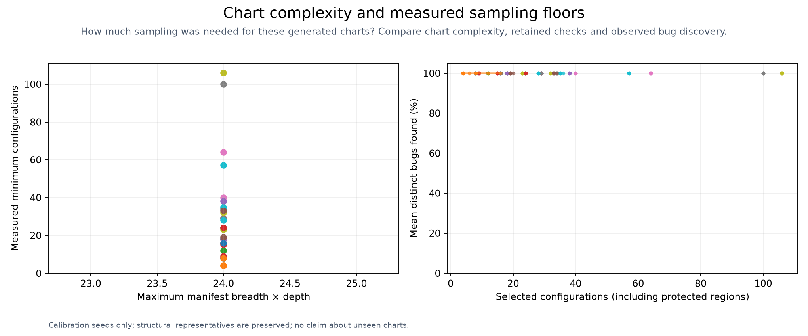

# Aggressive sampling calibration

Generated-chart calibration only. No held-out validation or arbitrary-chart recall guarantee.

Every input was rendered with Helm and compared with an independent defect-trigger oracle.
Floors include protected symbolic regions. Field coverage counts changed paths separately from configurations.
Measured maximum output scores: **24**. Other scores are outside this calibration's range.
[Comparison matrix and graphs](MATRIX.md) · [Proof obligations and tests](../../docs/adaptive-filtering/TESTS.md)

| Case | Max complexity | Gate depth | Fields | Eligible | Protected | Case floor | Field floor | Seeds reaching 96% bug recall |
| --- | ---: | ---: | ---: | ---: | ---: | ---: | ---: | ---: |
| fields-6-depth-1-placement-0 | 24 | 1 | 6 | 8 | 8 | 8 | 4 | 100/100 |
| fields-6-depth-1-placement-1 | 24 | 1 | 6 | 4 | 4 | 4 | 3 | 100/100 |
| fields-6-depth-2-placement-0 | 24 | 2 | 6 | 12 | 12 | 12 | 4 | 100/100 |
| fields-6-depth-2-placement-1 | 24 | 2 | 6 | 9 | 9 | 9 | 4 | 100/100 |
| fields-6-depth-3-placement-0 | 24 | 3 | 6 | 29 | 29 | 29 | 6 | 100/100 |
| fields-6-depth-3-placement-1 | 24 | 3 | 6 | 16 | 16 | 16 | 5 | 100/100 |
| fields-6-depth-4-placement-0 | 24 | 4 | 6 | 18 | 18 | 18 | 5 | 100/100 |
| fields-6-depth-4-placement-1 | 24 | 4 | 6 | 29 | 29 | 29 | 6 | 100/100 |
| fields-6-depth-5-placement-0 | 24 | 5 | 6 | 32 | 32 | 32 | 6 | 100/100 |
| fields-6-depth-5-placement-1 | 24 | 5 | 6 | 28 | 28 | 28 | 6 | 100/100 |
| fields-7-depth-1-placement-0 | 24 | 1 | 7 | 8 | 8 | 8 | 4 | 100/100 |
| fields-7-depth-1-placement-1 | 24 | 1 | 7 | 8 | 4 | 4 | 3 | 100/100 |
| fields-7-depth-2-placement-0 | 24 | 2 | 7 | 18 | 18 | 18 | 6 | 100/100 |
| fields-7-depth-2-placement-1 | 24 | 2 | 7 | 16 | 15 | 15 | 6 | 100/100 |
| fields-7-depth-3-placement-0 | 24 | 3 | 7 | 18 | 18 | 18 | 6 | 100/100 |
| fields-7-depth-3-placement-1 | 24 | 3 | 7 | 20 | 19 | 19 | 6 | 100/100 |
| fields-7-depth-4-placement-0 | 24 | 4 | 7 | 40 | 40 | 40 | 7 | 100/100 |
| fields-7-depth-4-placement-1 | 24 | 4 | 7 | 34 | 34 | 34 | 7 | 100/100 |
| fields-7-depth-5-placement-0 | 24 | 5 | 7 | 24 | 23 | 23 | 6 | 100/100 |
| fields-7-depth-5-placement-1 | 24 | 5 | 7 | 36 | 35 | 35 | 7 | 100/100 |
| fields-8-depth-1-placement-0 | 24 | 1 | 8 | 16 | 16 | 16 | 5 | 100/100 |
| fields-8-depth-1-placement-1 | 24 | 1 | 8 | 16 | 8 | 8 | 4 | 100/100 |
| fields-8-depth-2-placement-0 | 24 | 2 | 8 | 24 | 24 | 24 | 6 | 100/100 |
| fields-8-depth-2-placement-1 | 24 | 2 | 8 | 24 | 24 | 24 | 6 | 100/100 |
| fields-8-depth-3-placement-0 | 24 | 3 | 8 | 38 | 38 | 38 | 7 | 100/100 |
| fields-8-depth-3-placement-1 | 24 | 3 | 8 | 34 | 33 | 33 | 7 | 100/100 |
| fields-8-depth-4-placement-0 | 24 | 4 | 8 | 64 | 64 | 64 | 8 | 100/100 |
| fields-8-depth-4-placement-1 | 24 | 4 | 8 | 100 | 100 | 100 | 8 | 100/100 |
| fields-8-depth-5-placement-0 | 24 | 5 | 8 | 106 | 106 | 106 | 8 | 100/100 |
| fields-8-depth-5-placement-1 | 24 | 5 | 8 | 57 | 57 | 57 | 8 | 100/100 |

Complete recall here can follow from preserving every symbolic output region. It does not validate random sampling alone.

[Calibration JSON](calibration.json) · [Measurements](results.csv)
