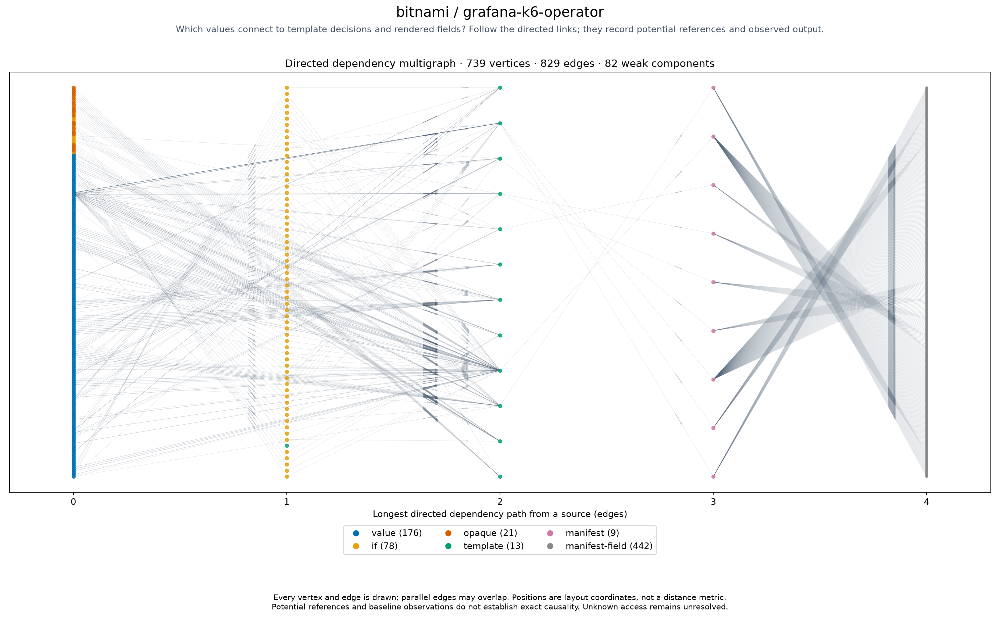

# bitnami/grafana-k6-operator

<!-- toc:start -->
**Table of contents**

- [bitnami/grafana-k6-operator](#bitnamigrafana-k6-operator)
<!-- toc:end -->

[All chart topologies](../../README.md)

Status: **rendered**. Source: `third_party/bitnami-charts/bitnami/grafana-k6-operator`.
Potential references are not proof of exact input-to-output causality.
Baseline-unavailable graphs contain static evidence only.

[Vector graph](topology.svg) · [Graph JSON](graph.json.gz) · [DOT](graph.dot.gz) · [Coordinates](positions.csv.gz) · [Invariants](metrics.json)
