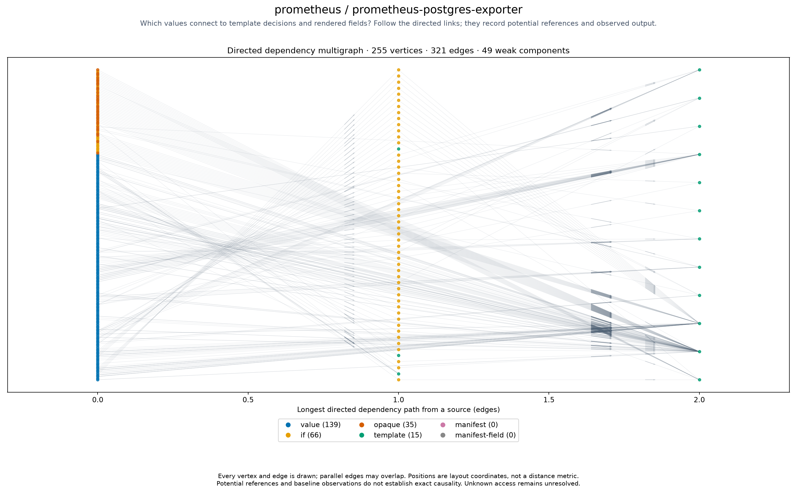

# prometheus/prometheus-postgres-exporter

<!-- toc:start -->
**Table of contents**

- [prometheus/prometheus-postgres-exporter](#prometheusprometheus-postgres-exporter)
<!-- toc:end -->

[All chart topologies](../../README.md)

Status: **static-only**. Source: `third_party/prometheus-community-helm-charts/charts/prometheus-postgres-exporter`.
Potential references are not proof of exact input-to-output causality.
Baseline-unavailable graphs contain static evidence only.

[Vector graph](topology.svg) · [Graph JSON](graph.json.gz) · [DOT](graph.dot.gz) · [Coordinates](positions.csv.gz) · [Invariants](metrics.json)
