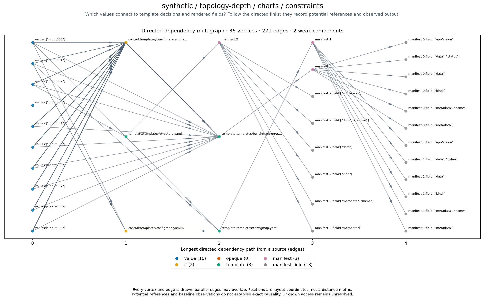

# synthetic/topology-depth/charts/constraints

<!-- toc:start -->
**Table of contents**

- [synthetic/topology-depth/charts/constraints](#synthetictopology-depthchartsconstraints)
<!-- toc:end -->

[All chart topologies](../../../../README.md)

Status: **rendered**. Source: `.cache/benchmark-refresh-1789311940/outputs/topology-depth/charts/constraints`.
Potential references are not proof of exact input-to-output causality.
Baseline-unavailable graphs contain static evidence only.

[Vector graph](topology.svg) · [Graph JSON](graph.json.gz) · [DOT](graph.dot.gz) · [Coordinates](positions.csv.gz) · [Invariants](metrics.json)
