# Quadratic versus quartic

<!-- toc:start -->
**Table of contents**

- [Comparisons](#comparisons)
<!-- toc:end -->

Both models train on the same cells, excluding 25% of settings and the last repeat. Corners remain in training.
Outlined cells are held out in both setting and repeat. All observed panels show the reserved repeat.
Scores compare unmodified predictions: lower RMSE is better. A quartic is not assumed to improve prediction.
A full quartic needs 15 identifiable coefficients and more than 15 training cells, including at least five settings per axis.
Unavailable fits remain blank. No extra measurements are inferred, and existing quadratic and symbolic results are unchanged.

[Splits, coefficients and scores](results.json)

| Surface / method / response | Model | Held-out cells RMSE | Held-out repeat RMSE | Both held out RMSE |
| --- | --- | ---: | ---: | ---: |
| clustering / combined / total_seconds | quadratic | 0.07151 | 0.1491 | 0.1184 |
| clustering / combined / total_seconds | quartic: factor settings cannot identify all 15 degree-4 coefficients | - | - | - |
| clustering / combined / errors_missed | quadratic | 0.436 | 0.752 | 1.033 |
| clustering / combined / errors_missed | quartic: factor settings cannot identify all 15 degree-4 coefficients | - | - | - |
| clustering / default / total_seconds | quadratic | 1.65 | 3.113 | 2.154 |
| clustering / default / total_seconds | quartic: factor settings cannot identify all 15 degree-4 coefficients | - | - | - |
| clustering / default / errors_missed | quadratic | 0 | 0 | 0 |
| clustering / default / errors_missed | quartic: factor settings cannot identify all 15 degree-4 coefficients | - | - | - |
| clustering / exact-equivalence / total_seconds | quadratic | 0.3414 | 0.3358 | 0.4272 |
| clustering / exact-equivalence / total_seconds | quartic: factor settings cannot identify all 15 degree-4 coefficients | - | - | - |
| clustering / exact-equivalence / errors_missed | quadratic | 0 | 0 | 0 |
| clustering / exact-equivalence / errors_missed | quartic: factor settings cannot identify all 15 degree-4 coefficients | - | - | - |
| clustering / filter / total_seconds | quadratic | 4.306 | 3.412 | 4.028 |
| clustering / filter / total_seconds | quartic: factor settings cannot identify all 15 degree-4 coefficients | - | - | - |
| clustering / filter / errors_missed | quadratic | 11.2 | 7.572 | 7.689 |
| clustering / filter / errors_missed | quartic: factor settings cannot identify all 15 degree-4 coefficients | - | - | - |
| clustering / filter-adaptive / total_seconds | quadratic | 3.515 | 2.808 | 2.697 |
| clustering / filter-adaptive / total_seconds | quartic: factor settings cannot identify all 15 degree-4 coefficients | - | - | - |
| clustering / filter-adaptive / errors_missed | quadratic | 11.2 | 7.572 | 7.689 |
| clustering / filter-adaptive / errors_missed | quartic: factor settings cannot identify all 15 degree-4 coefficients | - | - | - |
| clustering / random / total_seconds | quadratic | 0.1435 | 0.2415 | 0.1784 |
| clustering / random / total_seconds | quartic: factor settings cannot identify all 15 degree-4 coefficients | - | - | - |
| clustering / random / errors_missed | quadratic | 1.005 | 1.21 | 1.732 |
| clustering / random / errors_missed | quartic: factor settings cannot identify all 15 degree-4 coefficients | - | - | - |
| clustering / sample-random / total_seconds | quadratic | 1.435 | 2.326 | 1.378 |
| clustering / sample-random / total_seconds | quartic: factor settings cannot identify all 15 degree-4 coefficients | - | - | - |
| clustering / sample-random / errors_missed | quadratic | 2.329 | 3.062 | 1.891 |
| clustering / sample-random / errors_missed | quartic: factor settings cannot identify all 15 degree-4 coefficients | - | - | - |
| clustering / topology / total_seconds | quadratic | 0.3474 | 0.2675 | 0.1633 |
| clustering / topology / total_seconds | quartic: factor settings cannot identify all 15 degree-4 coefficients | - | - | - |
| clustering / topology / errors_missed | quadratic | 0.6106 | 1.031 | 1.003 |
| clustering / topology / errors_missed | quartic: factor settings cannot identify all 15 degree-4 coefficients | - | - | - |

## Comparisons

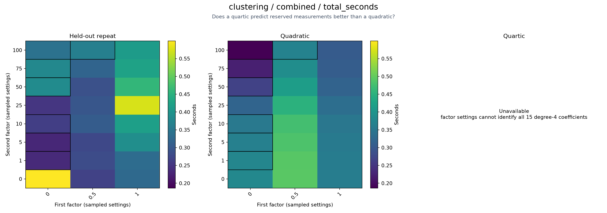

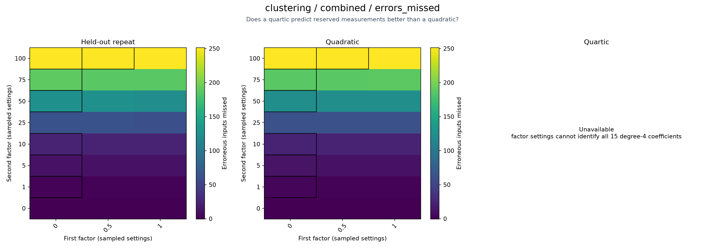

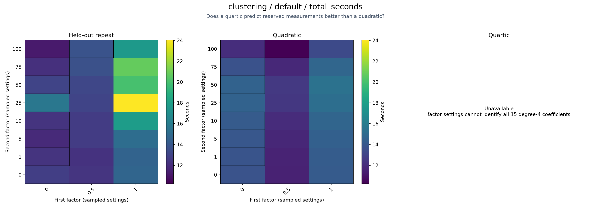

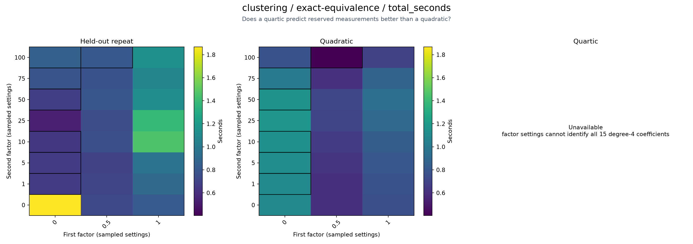

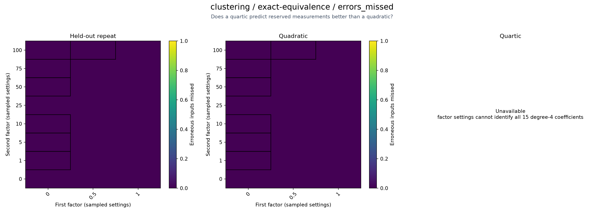

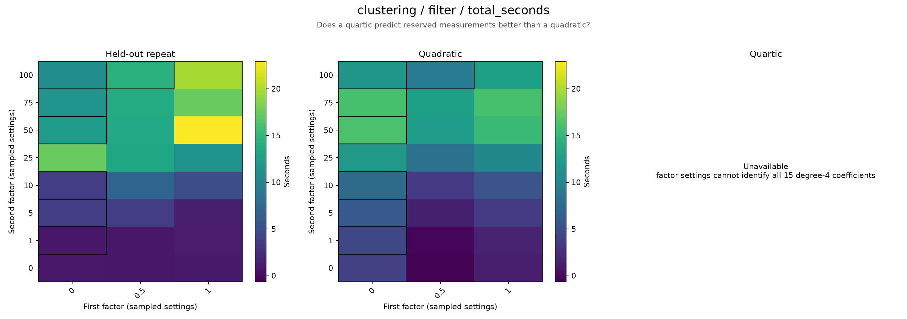

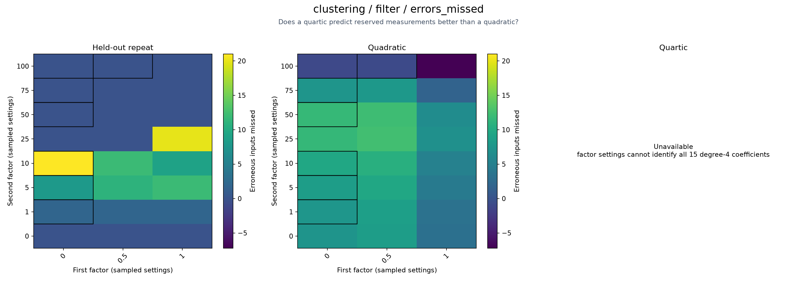

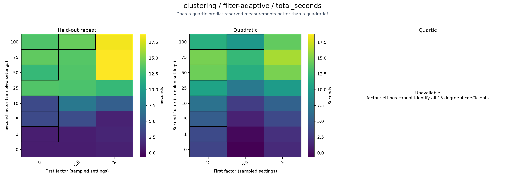

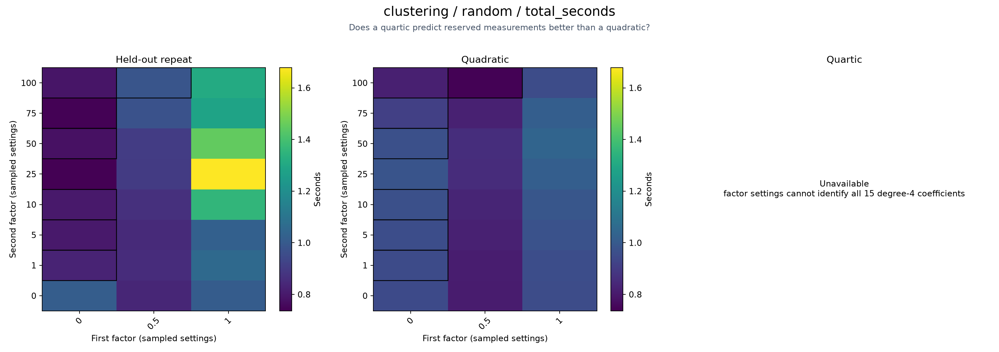

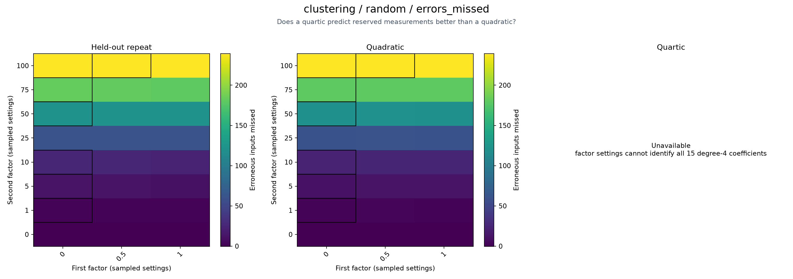

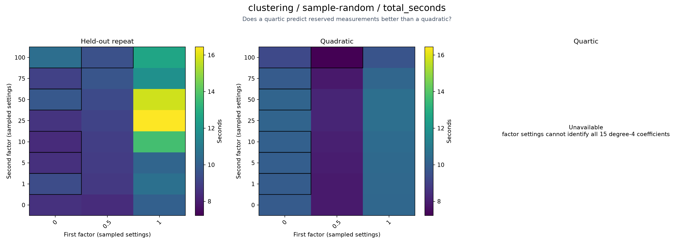

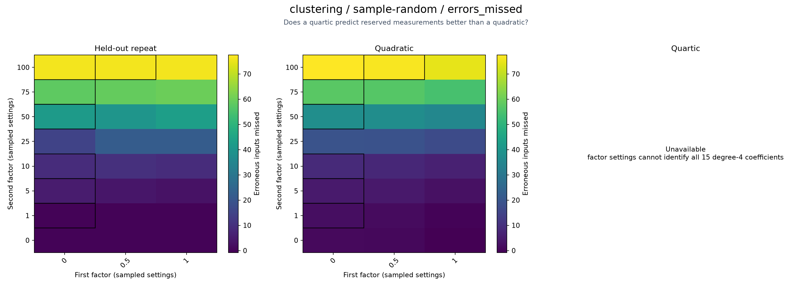

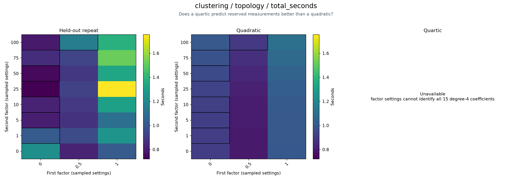

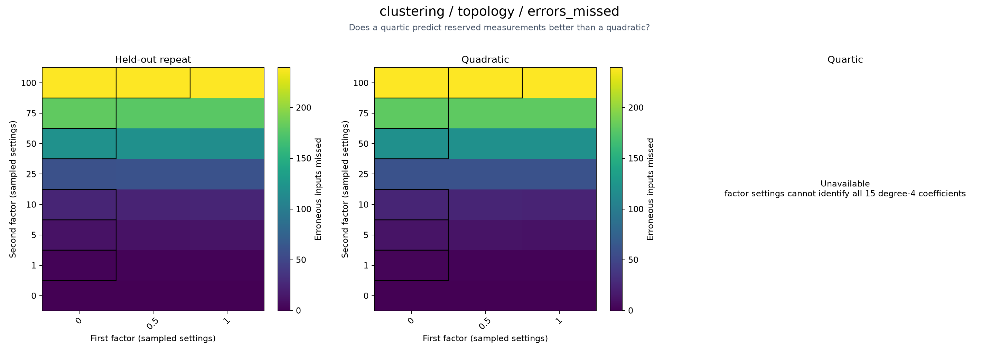

