# Fitted response surfaces

<!-- toc:start -->
**Table of contents**

- [clustering: default, Total runtime (seconds)](#clustering-default-total-runtime-seconds)
- [clustering: default, Erroneous inputs missed](#clustering-default-erroneous-inputs-missed)
- [clustering: exact-equivalence, Total runtime (seconds)](#clustering-exact-equivalence-total-runtime-seconds)
- [clustering: exact-equivalence, Erroneous inputs missed](#clustering-exact-equivalence-erroneous-inputs-missed)
- [clustering: random, Total runtime (seconds)](#clustering-random-total-runtime-seconds)
- [clustering: random, Erroneous inputs missed](#clustering-random-erroneous-inputs-missed)
- [clustering: topology, Total runtime (seconds)](#clustering-topology-total-runtime-seconds)
- [clustering: topology, Erroneous inputs missed](#clustering-topology-erroneous-inputs-missed)
- [clustering: combined, Total runtime (seconds)](#clustering-combined-total-runtime-seconds)
- [clustering: combined, Erroneous inputs missed](#clustering-combined-erroneous-inputs-missed)
- [clustering: filter, Total runtime (seconds)](#clustering-filter-total-runtime-seconds)
- [clustering: filter, Erroneous inputs missed](#clustering-filter-erroneous-inputs-missed)
- [clustering: filter-aggressive, Total runtime (seconds)](#clustering-filter-aggressive-total-runtime-seconds)
- [clustering: filter-aggressive, Erroneous inputs missed](#clustering-filter-aggressive-erroneous-inputs-missed)
- [clustering: sample-random, Total runtime (seconds)](#clustering-sample-random-total-runtime-seconds)
- [clustering: sample-random, Erroneous inputs missed](#clustering-sample-random-erroneous-inputs-missed)
<!-- toc:end -->

[Measurements](README.md) · [Model definition](../../docs/benchmarking/response-surface.md)

Quadratics fitted to collected cell means, separately for each method and response. Coefficients are not theoretical predictions.
Only cells with every requested repeat completed enter the fit. Missing or timed-out cells remain blank.
A fit requires a complete rectangular grid and more than six identifiable cells; otherwise its reason is recorded below.
Mean ±1 sample SD labels describe seed variation, not confidence intervals. Residuals are observed minus fitted cell means.
Continuous predictions between discrete settings describe the model, not additional Helm measurements.
Negative predictions remain visible; neither nonnegative runtime nor bounded error counts are enforced by this polynomial.
RMSE and R² measure agreement with the training cells, not performance on unseen charts. No global worst-case claim is made.

[Coefficients, bounds and diagnostics](quadratic-fits.json)

## clustering: default, Total runtime (seconds)

RMSE: 1.137; R²: 0.740; cells: 24.

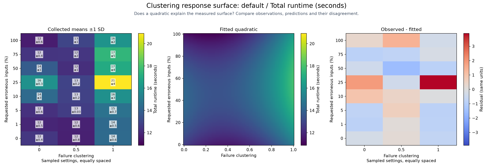

## clustering: default, Erroneous inputs missed

RMSE: 0; R²: N/A (constant observations); cells: 24.

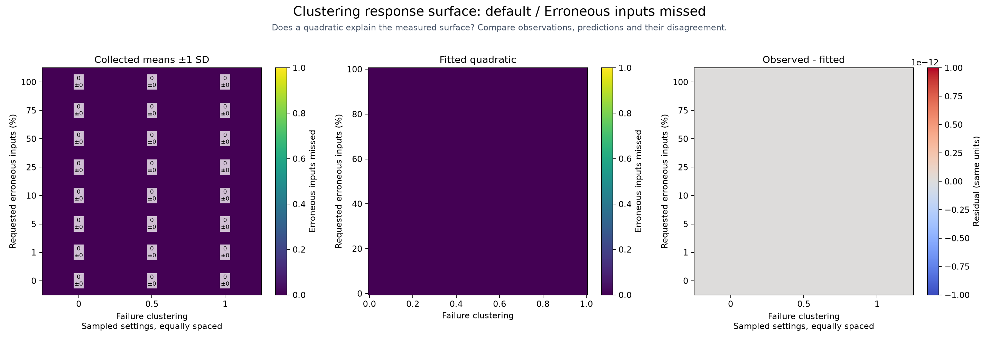

## clustering: exact-equivalence, Total runtime (seconds)

RMSE: 0.1295; R²: 0.461; cells: 24.

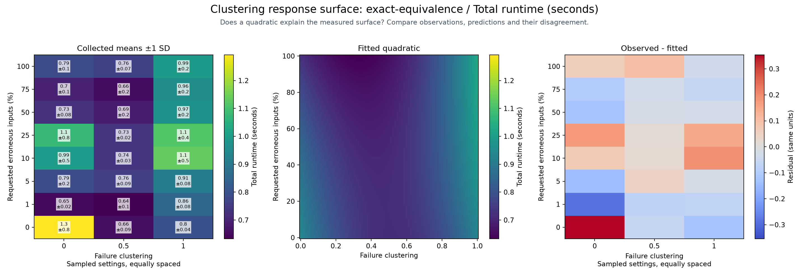

## clustering: exact-equivalence, Erroneous inputs missed

RMSE: 0; R²: N/A (constant observations); cells: 24.

## clustering: random, Total runtime (seconds)

RMSE: 0.06593; R²: 0.809; cells: 24.

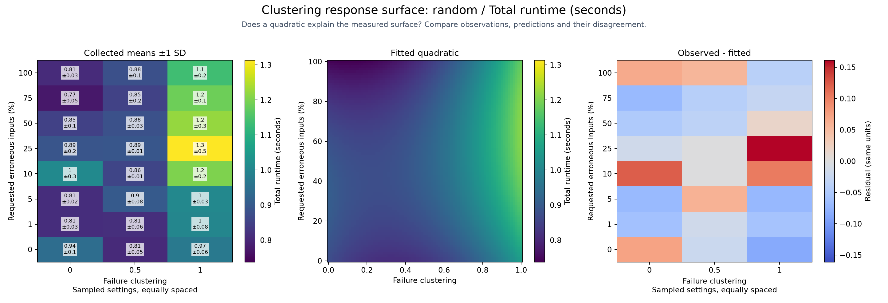

## clustering: random, Erroneous inputs missed

RMSE: 0.4529; R²: 1.000; cells: 24.

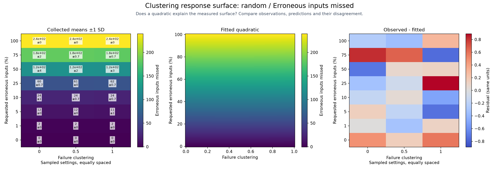

## clustering: topology, Total runtime (seconds)

RMSE: 0.09636; R²: 0.679; cells: 24.

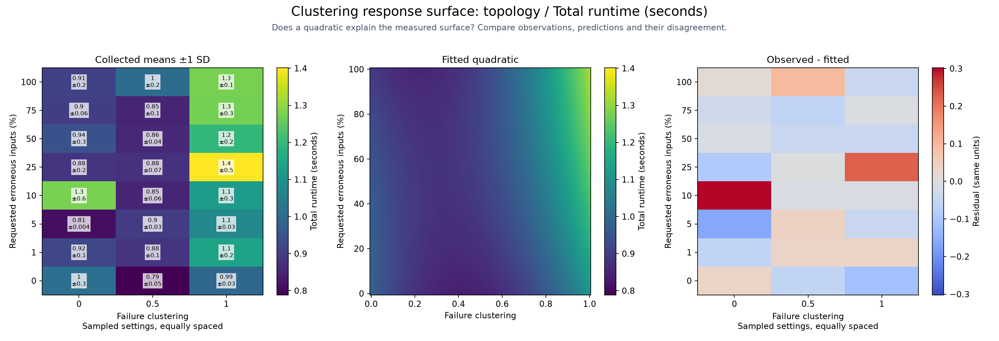

## clustering: topology, Erroneous inputs missed

RMSE: 0.5846; R²: 1.000; cells: 24.

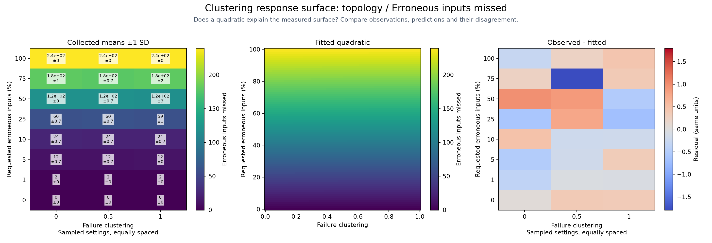

## clustering: combined, Total runtime (seconds)

RMSE: 0.1262; R²: 0.045; cells: 24.

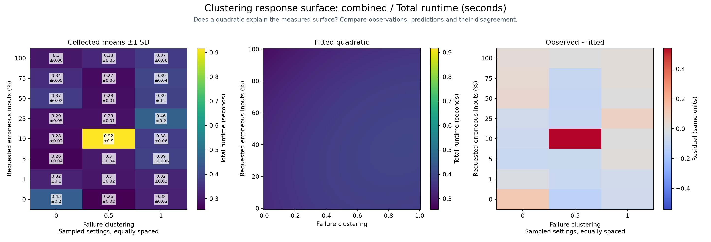

## clustering: combined, Erroneous inputs missed

RMSE: 0.3792; R²: 1.000; cells: 24.

## clustering: filter, Total runtime (seconds)

RMSE: 1.983; R²: 0.898; cells: 24.

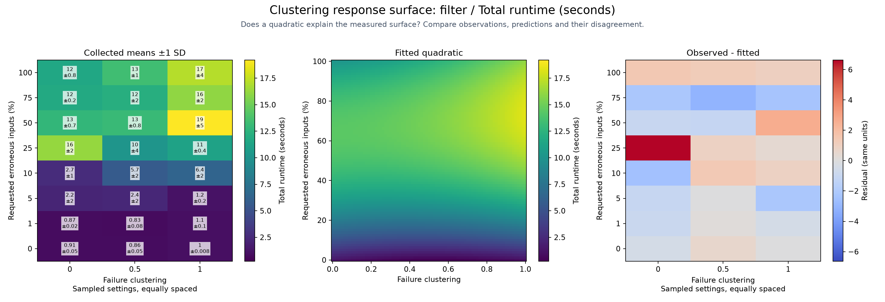

## clustering: filter, Erroneous inputs missed

RMSE: 5.99; R²: 0.289; cells: 24.

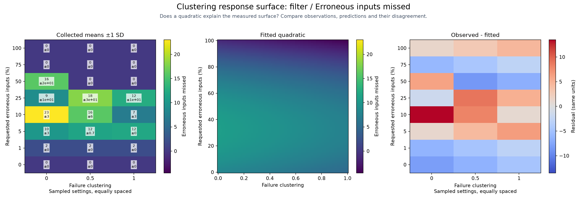

## clustering: filter-aggressive, Total runtime (seconds)

RMSE: 1.464; R²: 0.940; cells: 24.

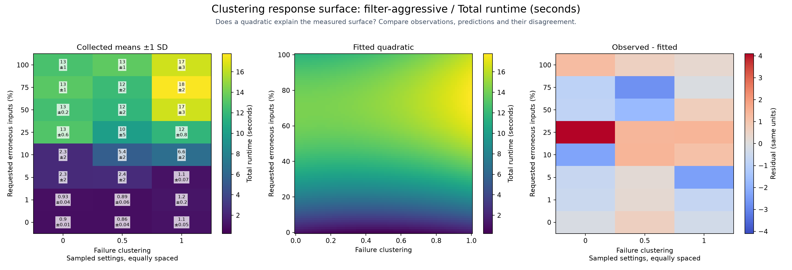

## clustering: filter-aggressive, Erroneous inputs missed

RMSE: 5.99; R²: 0.289; cells: 24.

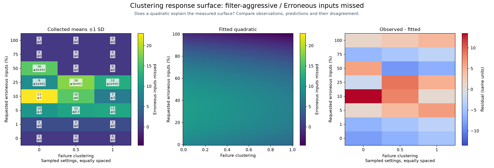

## clustering: sample-random, Total runtime (seconds)

RMSE: 0.7048; R²: 0.773; cells: 24.

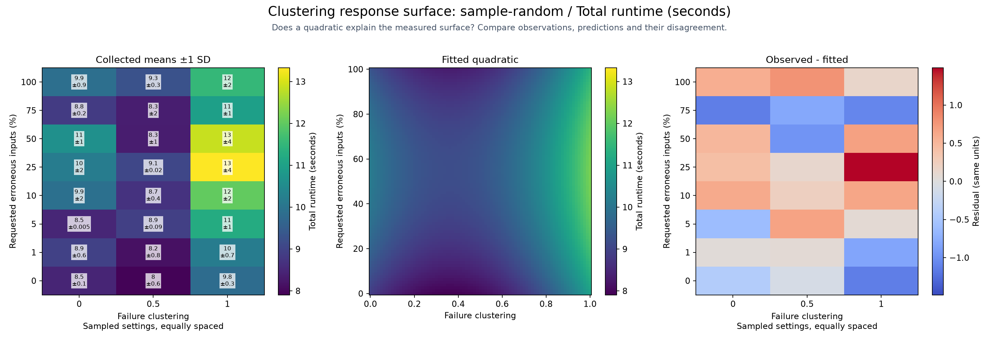

## clustering: sample-random, Erroneous inputs missed

RMSE: 0.7812; R²: 0.999; cells: 24.

