# Symbolic response surfaces

<!-- toc:start -->
**Table of contents**

- [clustering / combined / total_seconds](#clustering--combined--total_seconds)
- [clustering / combined / errors_missed](#clustering--combined--errors_missed)
- [clustering / default / total_seconds](#clustering--default--total_seconds)
- [clustering / default / errors_missed](#clustering--default--errors_missed)
- [clustering / exact-equivalence / total_seconds](#clustering--exact-equivalence--total_seconds)
- [clustering / exact-equivalence / errors_missed](#clustering--exact-equivalence--errors_missed)
- [clustering / filter / total_seconds](#clustering--filter--total_seconds)
- [clustering / filter / errors_missed](#clustering--filter--errors_missed)
- [clustering / filter-adaptive / total_seconds](#clustering--filter-adaptive--total_seconds)
- [clustering / filter-adaptive / errors_missed](#clustering--filter-adaptive--errors_missed)
- [clustering / random / total_seconds](#clustering--random--total_seconds)
- [clustering / random / errors_missed](#clustering--random--errors_missed)
- [clustering / sample-random / total_seconds](#clustering--sample-random--total_seconds)
- [clustering / sample-random / errors_missed](#clustering--sample-random--errors_missed)
- [clustering / topology / total_seconds](#clustering--topology--total_seconds)
- [clustering / topology / errors_missed](#clustering--topology--errors_missed)
<!-- toc:end -->

Each model was trained without the last repeat and without 25% of factor cells. The four corners remain in training.
Predictions below were frozen before scoring. These are empirical equations, not pruning proofs or recall guarantees.
The observed panel uses the reserved repeat; both models use identical training data and held-out groups.
Cells: unseen settings on training seeds. Seeds: unseen repeat at training settings. Joint: unseen settings and repeat.
Repeated seeds refer to chart traversal/error placement; only one equation-search seed was used in this experiment.
Only the last source repeat is reserved, so these results do not establish generalization across many unseen seeds.
Colours share a scale within each figure; predictions are not clipped to physical bounds. Cells are equally spaced.
Outlined cells were withheld from training; all observed values come from the reserved repeat.

[Raw equations, training splits, predictions and provenance](results.json)
Search limits: 20 iterations, 15.0 seconds per search, expression complexity 20; seed 2026, serial execution.
Search timeout excludes initialization and can affect reproducibility. Operators: +, -, *, /, square, exp.
[PySR](https://github.com/astroautomata/PySR) supplies the equation search; holdouts are not used to tune it.

| Surface | Model | Unseen cells RMSE | Unseen seed RMSE | Joint holdout RMSE |
| --- | --- | ---: | ---: | ---: |
| clustering / combined / total_seconds | quadratic | 0.07151 | 0.1491 | 0.1184 |
| clustering / combined / total_seconds | symbolic | 0.04316 | 0.3094 | 0.06607 |
| clustering / combined / errors_missed | quadratic | 0.436 | 0.752 | 1.033 |
| clustering / combined / errors_missed | symbolic | 0.3838 | 0.743 | 1.008 |
| clustering / default / total_seconds | quadratic | 1.65 | 3.113 | 2.154 |
| clustering / default / total_seconds | symbolic | 1.344 | 3.131 | 1.894 |
| clustering / default / errors_missed | quadratic | 0 | 0 | 0 |
| clustering / default / errors_missed | symbolic | 0 | 0 | 0 |
| clustering / exact-equivalence / total_seconds | quadratic | 0.3414 | 0.3358 | 0.4272 |
| clustering / exact-equivalence / total_seconds | symbolic | 0.289 | 0.3646 | 0.3593 |
| clustering / exact-equivalence / errors_missed | quadratic | 0 | 0 | 0 |
| clustering / exact-equivalence / errors_missed | symbolic | 0 | 0 | 0 |
| clustering / filter / total_seconds | quadratic | 4.306 | 3.412 | 4.028 |
| clustering / filter / total_seconds | symbolic | 4.15 | 3.289 | 4.708 |
| clustering / filter / errors_missed | quadratic | 11.2 | 7.572 | 7.689 |
| clustering / filter / errors_missed | symbolic | 15.56 | 9.048 | 6.322 |
| clustering / filter-adaptive / total_seconds | quadratic | 3.515 | 2.808 | 2.697 |
| clustering / filter-adaptive / total_seconds | symbolic | 3.158 | 2.49 | 2.135 |
| clustering / filter-adaptive / errors_missed | quadratic | 11.2 | 7.572 | 7.689 |
| clustering / filter-adaptive / errors_missed | symbolic | 15.56 | 9.048 | 6.322 |
| clustering / random / total_seconds | quadratic | 0.1435 | 0.2415 | 0.1784 |
| clustering / random / total_seconds | symbolic | 0.1571 | 0.2623 | 0.1759 |
| clustering / random / errors_missed | quadratic | 1.005 | 1.21 | 1.732 |
| clustering / random / errors_missed | symbolic | 0.9326 | 1.429 | 1.948 |
| clustering / sample-random / total_seconds | quadratic | 1.435 | 2.326 | 1.378 |
| clustering / sample-random / total_seconds | symbolic | 1.418 | 2.423 | 1.319 |
| clustering / sample-random / errors_missed | quadratic | 2.329 | 3.062 | 1.891 |
| clustering / sample-random / errors_missed | symbolic | 2.222 | 2.976 | 1.105 |
| clustering / topology / total_seconds | quadratic | 0.3474 | 0.2675 | 0.1633 |
| clustering / topology / total_seconds | symbolic | 0.3604 | 0.2717 | 0.1704 |
| clustering / topology / errors_missed | quadratic | 0.6106 | 1.031 | 1.003 |
| clustering / topology / errors_missed | symbolic | 1.307 | 1.277 | 1.499 |

## clustering / combined / total_seconds

Selected PySR equation (response in original units):

```text
0.30871471306803494 + 0.00021301038830130253/(u + v + 0.7867732743706707)**2
```

Input bounds (xmin, xmax, ymin, ymax): `[0.0, 1.0, 0.0, 100.0]`.
`u = 2*(x-xmin)/(xmax-xmin)-1`; `v = 2*(y-ymin)/(ymax-ymin)-1`.

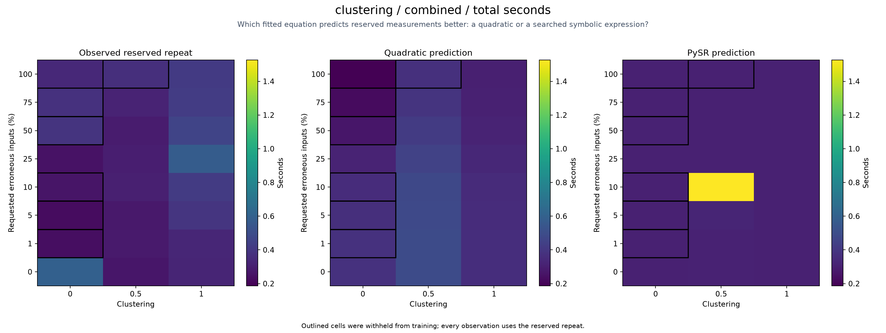

## clustering / combined / errors_missed

Selected PySR equation (response in original units):

```text
125.65311141875472*v - (-v**2 - 124.2727524629085)
```

Input bounds (xmin, xmax, ymin, ymax): `[0.0, 1.0, 0.0, 100.0]`.
`u = 2*(x-xmin)/(xmax-xmin)-1`; `v = 2*(y-ymin)/(ymax-ymin)-1`.

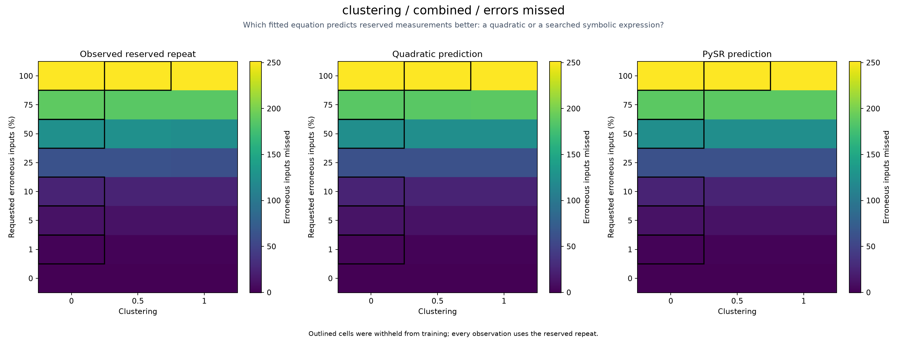

## clustering / default / total_seconds

Selected PySR equation (response in original units):

```text
u**2 - v**8*(u - 1*0.12504377932661534)**8 + (u**2 + 0.1711762319461417)**4 + 11.948980846455902
```

Input bounds (xmin, xmax, ymin, ymax): `[0.0, 1.0, 0.0, 100.0]`.
`u = 2*(x-xmin)/(xmax-xmin)-1`; `v = 2*(y-ymin)/(ymax-ymin)-1`.

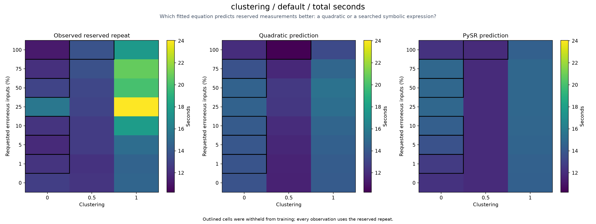

## clustering / default / errors_missed

Selected PySR equation (response in original units):

```text
1.50226035520009e-179
```

Input bounds (xmin, xmax, ymin, ymax): `[0.0, 1.0, 0.0, 100.0]`.
`u = 2*(x-xmin)/(xmax-xmin)-1`; `v = 2*(y-ymin)/(ymax-ymin)-1`.

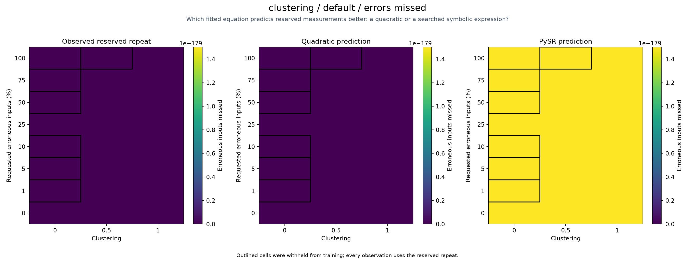

## clustering / exact-equivalence / total_seconds

Selected PySR equation (response in original units):

```text
exp(-0.43536536070028614/(u*(-u**2 + (0.00590785164060188 - exp(v*(u - 1*(-0.0006127099158210042))))**2) + exp(u)))
```

Input bounds (xmin, xmax, ymin, ymax): `[0.0, 1.0, 0.0, 100.0]`.
`u = 2*(x-xmin)/(xmax-xmin)-1`; `v = 2*(y-ymin)/(ymax-ymin)-1`.

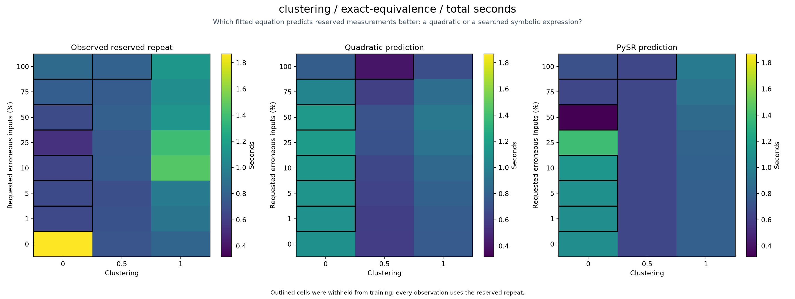

## clustering / exact-equivalence / errors_missed

Selected PySR equation (response in original units):

```text
1.50226035520009e-179
```

Input bounds (xmin, xmax, ymin, ymax): `[0.0, 1.0, 0.0, 100.0]`.
`u = 2*(x-xmin)/(xmax-xmin)-1`; `v = 2*(y-ymin)/(ymax-ymin)-1`.

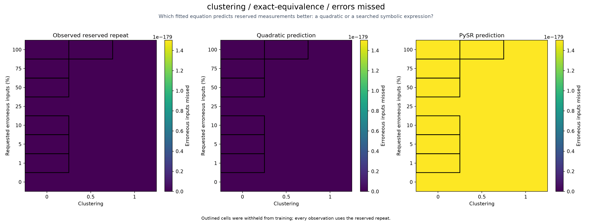

## clustering / filter / total_seconds

Selected PySR equation (response in original units):

```text
exp(u**2 + v + 0.596141880840596) - 0.8131181276410188 + 10.986004403368662/exp((exp(v**2) - 0.8646564803028596)**2)
```

Input bounds (xmin, xmax, ymin, ymax): `[0.0, 1.0, 0.0, 100.0]`.
`u = 2*(x-xmin)/(xmax-xmin)-1`; `v = 2*(y-ymin)/(ymax-ymin)-1`.

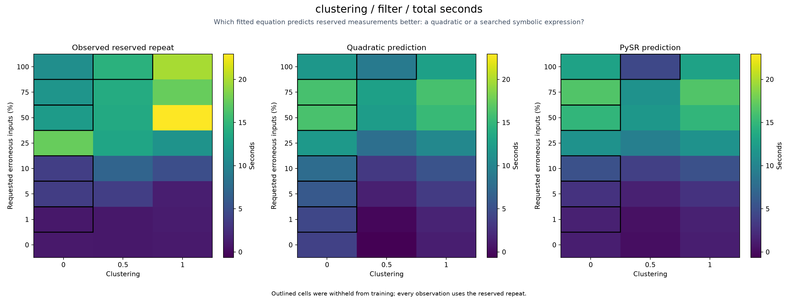

## clustering / filter / errors_missed

Selected PySR equation (response in original units):

```text
(-1.855310616051609*u**2 + exp((1.343607161709089 - v**2)*(-v - v + 0.628697398412391)) - 0.3118280072327957)**2
```

Input bounds (xmin, xmax, ymin, ymax): `[0.0, 1.0, 0.0, 100.0]`.
`u = 2*(x-xmin)/(xmax-xmin)-1`; `v = 2*(y-ymin)/(ymax-ymin)-1`.

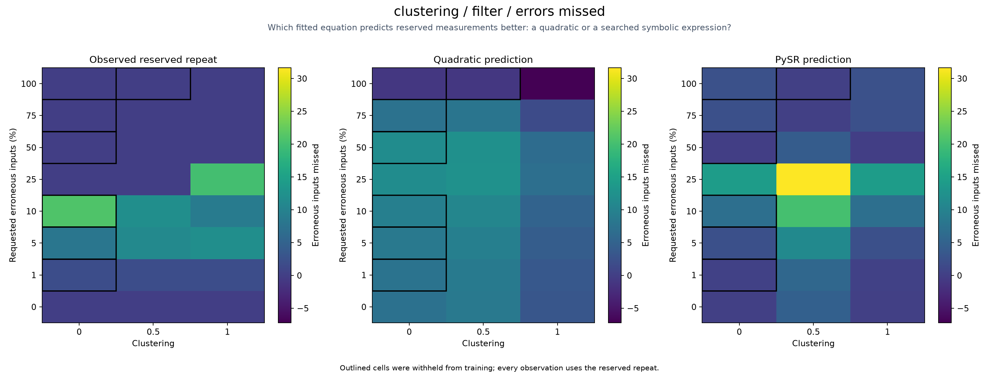

## clustering / filter-adaptive / total_seconds

Selected PySR equation (response in original units):

```text
u*(u + u) + v*(0.7954946749456213 - v)/0.14344021753856825 + 12.954458225663988
```

Input bounds (xmin, xmax, ymin, ymax): `[0.0, 1.0, 0.0, 100.0]`.
`u = 2*(x-xmin)/(xmax-xmin)-1`; `v = 2*(y-ymin)/(ymax-ymin)-1`.

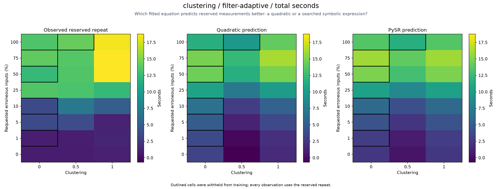

## clustering / filter-adaptive / errors_missed

Selected PySR equation (response in original units):

```text
(-1.855310616051609*u**2 + exp((1.343607161709089 - v**2)*(-v - v + 0.628697398412391)) - 0.3118280072327957)**2
```

Input bounds (xmin, xmax, ymin, ymax): `[0.0, 1.0, 0.0, 100.0]`.
`u = 2*(x-xmin)/(xmax-xmin)-1`; `v = 2*(y-ymin)/(ymax-ymin)-1`.

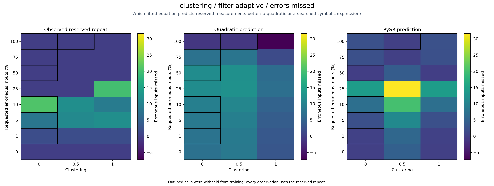

## clustering / random / total_seconds

Selected PySR equation (response in original units):

```text
u**2*0.13761486109879914 - 1*(-0.8304415896683275)
```

Input bounds (xmin, xmax, ymin, ymax): `[0.0, 1.0, 0.0, 100.0]`.
`u = 2*(x-xmin)/(xmax-xmin)-1`; `v = 2*(y-ymin)/(ymax-ymin)-1`.

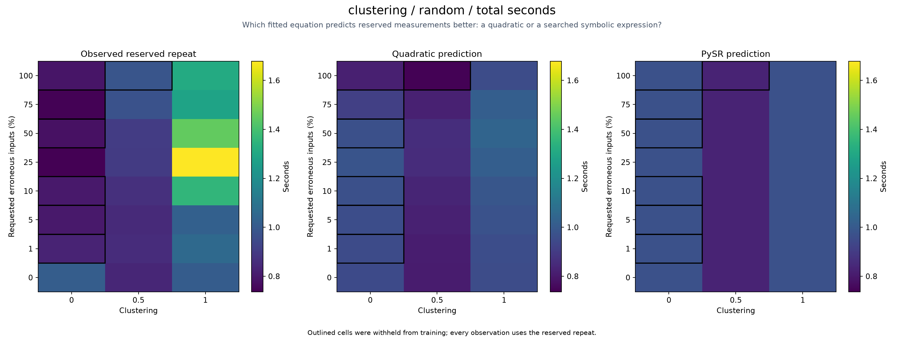

## clustering / random / errors_missed

Selected PySR equation (response in original units):

```text
v*119.64276798932138 + 119.81941047605933
```

Input bounds (xmin, xmax, ymin, ymax): `[0.0, 1.0, 0.0, 100.0]`.
`u = 2*(x-xmin)/(xmax-xmin)-1`; `v = 2*(y-ymin)/(ymax-ymin)-1`.

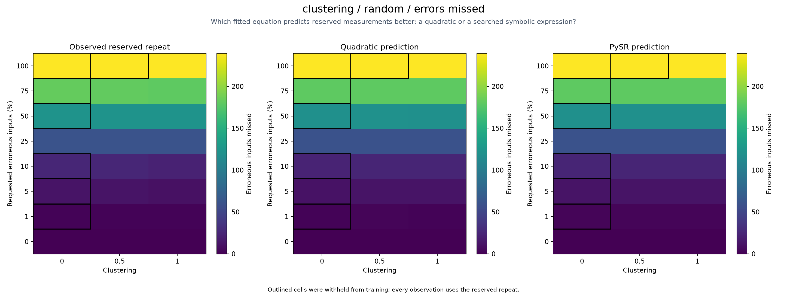

## clustering / sample-random / total_seconds

Selected PySR equation (response in original units):

```text
(u**2 + 3.700420250285227)*2.163117122332316
```

Input bounds (xmin, xmax, ymin, ymax): `[0.0, 1.0, 0.0, 100.0]`.
`u = 2*(x-xmin)/(xmax-xmin)-1`; `v = 2*(y-ymin)/(ymax-ymin)-1`.

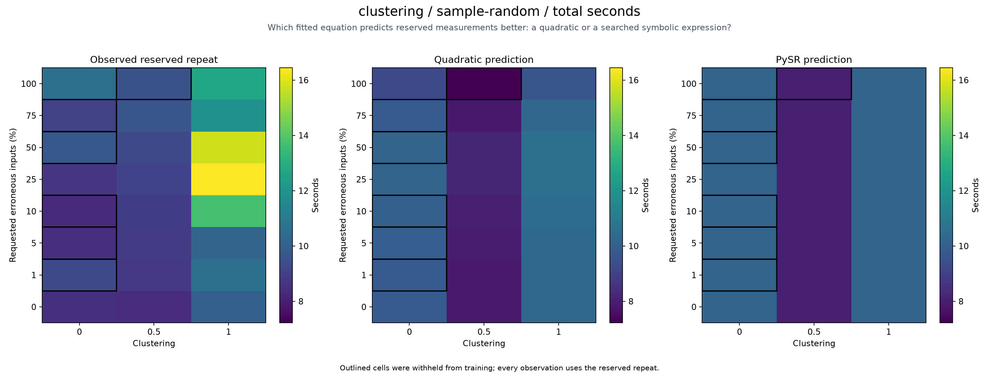

## clustering / sample-random / errors_missed

Selected PySR equation (response in original units):

```text
-u + v*37.84361457626302 - (-u*v*(v + v) + u) + 37.74975045466249
```

Input bounds (xmin, xmax, ymin, ymax): `[0.0, 1.0, 0.0, 100.0]`.
`u = 2*(x-xmin)/(xmax-xmin)-1`; `v = 2*(y-ymin)/(ymax-ymin)-1`.

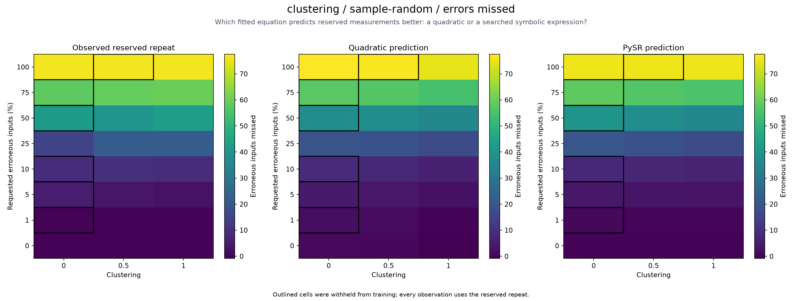

## clustering / topology / total_seconds

Selected PySR equation (response in original units):

```text
exp(((u/(v*0.7498678988358839 - 3.2314897599534507) - 1*0.05779082681241964)**2 - 1*0.11281420801876411)*1.695202091550348)
```

Input bounds (xmin, xmax, ymin, ymax): `[0.0, 1.0, 0.0, 100.0]`.
`u = 2*(x-xmin)/(xmax-xmin)-1`; `v = 2*(y-ymin)/(ymax-ymin)-1`.

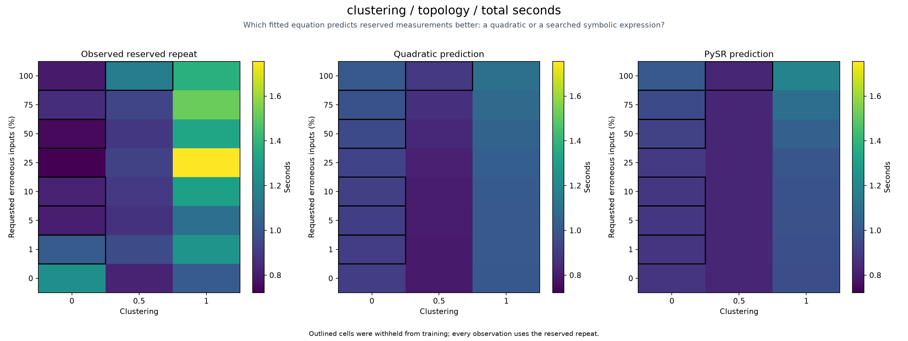

## clustering / topology / errors_missed

Selected PySR equation (response in original units):

```text
(v + 0.9970365012567629)/0.008318872870782652 - 0.7303014306630642/(v + v - (u - 1.6913205339503479) - 1*2.296324315893167)
```

Input bounds (xmin, xmax, ymin, ymax): `[0.0, 1.0, 0.0, 100.0]`.
`u = 2*(x-xmin)/(xmax-xmin)-1`; `v = 2*(y-ymin)/(ymax-ymin)-1`.

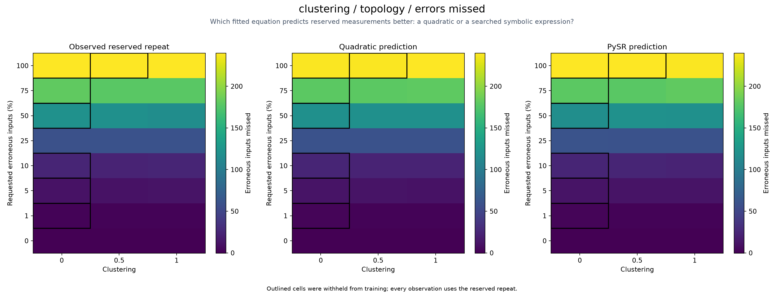

