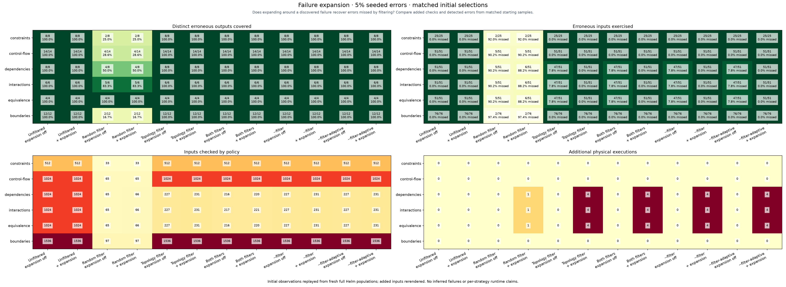

# Failure expansion

<!-- toc:start -->
**Table of contents**

- [Failure expansion](#failure-expansion)
<!-- toc:end -->

[Benchmarking](../../docs/benchmarking/README.md)

Topology trimming previously exercised 47 of 51 erroneous inputs in three cases. The remaining four each produced the same complete manifests as a retained failing input. The 51 erroneous inputs occupied 43 singleton regions and four two-input regions. All distinct erroneous outputs were already covered.

`--expand-failures` is opt-in: after an observed failure, execute omitted members of that symbolic region within the existing time limit. This measures the extent of a failure and permits additional checks; it need not discover a new failure class. Region membership does not label an unexecuted input as a failure.

```sh
helm hypothesis test ./chart --permutations 2 --trim-topology 2 \
  --trim-random 2 --expand-failures --time-limit 9m
```

Expansion continues the initial selection after failures and schedules each omitted input at most once. The default CLI still stops at its first failure. Unsupported regions cannot be expanded automatically. An entirely missed failure region cannot trigger expansion.



Cells below show **erroneous inputs found before → after expansion (extra executions)**. The figure also shows the exact percentage missed.

| Structure | Untrimmed | Random | Topology | Both trims | --filter | --filter-aggressive |
|---|---|---|---|---|---|---|
| constraints | 25/25 (0.0% missed) → 25/25 (0.0% missed) (+0) | 2/25 (92.0% missed) → 2/25 (92.0% missed) (+0) | 25/25 (0.0% missed) → 25/25 (0.0% missed) (+0) | 25/25 (0.0% missed) → 25/25 (0.0% missed) (+0) | 25/25 (0.0% missed) → 25/25 (0.0% missed) (+0) | 25/25 (0.0% missed) → 25/25 (0.0% missed) (+0) |
| control-flow | 51/51 (0.0% missed) → 51/51 (0.0% missed) (+0) | 5/51 (90.2% missed) → 5/51 (90.2% missed) (+0) | 51/51 (0.0% missed) → 51/51 (0.0% missed) (+0) | 51/51 (0.0% missed) → 51/51 (0.0% missed) (+0) | 51/51 (0.0% missed) → 51/51 (0.0% missed) (+0) | 51/51 (0.0% missed) → 51/51 (0.0% missed) (+0) |
| dependencies | 51/51 (0.0% missed) → 51/51 (0.0% missed) (+0) | 5/51 (90.2% missed) → 6/51 (88.2% missed) (+1) | 47/51 (7.8% missed) → 51/51 (0.0% missed) (+4) | 47/51 (7.8% missed) → 51/51 (0.0% missed) (+4) | 47/51 (7.8% missed) → 51/51 (0.0% missed) (+4) | 47/51 (7.8% missed) → 51/51 (0.0% missed) (+4) |
| interactions | 51/51 (0.0% missed) → 51/51 (0.0% missed) (+0) | 5/51 (90.2% missed) → 6/51 (88.2% missed) (+1) | 47/51 (7.8% missed) → 51/51 (0.0% missed) (+4) | 47/51 (7.8% missed) → 51/51 (0.0% missed) (+4) | 47/51 (7.8% missed) → 51/51 (0.0% missed) (+4) | 47/51 (7.8% missed) → 51/51 (0.0% missed) (+4) |
| equivalence | 51/51 (0.0% missed) → 51/51 (0.0% missed) (+0) | 5/51 (90.2% missed) → 6/51 (88.2% missed) (+1) | 47/51 (7.8% missed) → 51/51 (0.0% missed) (+4) | 47/51 (7.8% missed) → 51/51 (0.0% missed) (+4) | 47/51 (7.8% missed) → 51/51 (0.0% missed) (+4) | 47/51 (7.8% missed) → 51/51 (0.0% missed) (+4) |
| boundaries | 76/76 (0.0% missed) → 76/76 (0.0% missed) (+0) | 2/76 (97.4% missed) → 2/76 (97.4% missed) (+0) | 76/76 (0.0% missed) → 76/76 (0.0% missed) (+0) | 76/76 (0.0% missed) → 76/76 (0.0% missed) (+0) | 76/76 (0.0% missed) → 76/76 (0.0% missed) (+0) | 76/76 (0.0% missed) → 76/76 (0.0% missed) (+0) |

**Distinct erroneous outputs covered, before → after:**

| Structure | Untrimmed | Random | Topology | Both trims | --filter | --filter-aggressive |
|---|---|---|---|---|---|---|
| constraints | 8/8 → 8/8 | 2/8 → 2/8 | 8/8 → 8/8 | 8/8 → 8/8 | 8/8 → 8/8 | 8/8 → 8/8 |
| control-flow | 14/14 → 14/14 | 4/14 → 4/14 | 14/14 → 14/14 | 14/14 → 14/14 | 14/14 → 14/14 | 14/14 → 14/14 |
| dependencies | 8/8 → 8/8 | 4/8 → 4/8 | 8/8 → 8/8 | 8/8 → 8/8 | 8/8 → 8/8 | 8/8 → 8/8 |
| interactions | 6/6 → 6/6 | 5/6 → 5/6 | 6/6 → 6/6 | 6/6 → 6/6 | 6/6 → 6/6 | 6/6 → 6/6 |
| equivalence | 4/4 → 4/4 | 4/4 → 4/4 | 4/4 → 4/4 | 4/4 → 4/4 | 4/4 → 4/4 | 4/4 → 4/4 |
| boundaries | 12/12 → 12/12 | 2/12 → 2/12 | 12/12 → 12/12 | 12/12 → 12/12 | 12/12 → 12/12 | 12/12 → 12/12 |

Helm `v4.3.0+gbec5b06`; 5% erroneous valid inputs (rounded down), error seed 1729, selection seed 2026, trim level 2. The same placement is reused across matching domains.

Each category has a fresh complete Helm reference checked against the independent manifest/error oracle. Policies replay the same initial observations and only consult a case's observed failure when it is reached. Added inputs are physically rendered again for each enabled policy. Ground truth is used for scoring, not scheduling.

Reference execution plus all added renders share a 540s ceiling per category. Planning and analysis are excluded. Policy check counts are not independent full-run timing measurements. The synthetic assertion rejects the error ConfigMap's incorrect status; ordinary Helm rendering alone accepts that YAML.

[Raw references and execution records](results.json) · [CSV](results.csv)

```sh
hypothesis-helm-benchmark expansion \
  --input-complexity 10 --error-percent 5 --error-seed 1729 \
  --seed 2026 --trim-level 2 --time-limit 9m --output reports/expansion
```


`--filter` and `--filter-aggressive` use topology level 2 and enable failure expansion. Aggressive sampling recomputes chart complexity, protects structural regions and applies the packaged calibration. An unmatched or unsupported chart keeps the ordinary filtered selection; 70% retention is not forced. Expansion-off columns are controlled ablations of these presets.

**Aggressive sampling decisions.** Counts below exclude the always-retained default configuration and precede failure expansion. Case and field floors apply only to matched calibrations.

| Fixture | Match | Retained / eligible | Case floor | Field floor | Fallback reason |
| --- | --- | ---: | ---: | ---: | --- |
| constraints | unmatched | 511 / 511 | 1 | 0 | schema validation is outside the shared proof contract |
| control-flow | unmatched | 1023 / 1023 | 1 | 0 | opaque template construct at line 9 |
| dependencies | unmatched | 226 / 226 | 1 | 0 | chart complexity or topology is outside the measured calibration profiles |
| interactions | unmatched | 226 / 226 | 1 | 0 | chart complexity or topology is outside the measured calibration profiles |
| equivalence | unmatched | 226 / 226 | 1 | 0 | chart complexity or topology is outside the measured calibration profiles |
| boundaries | unmatched | 1535 / 1535 | 1 | 0 | default coalescing or scalar types are outside the proof contract |
