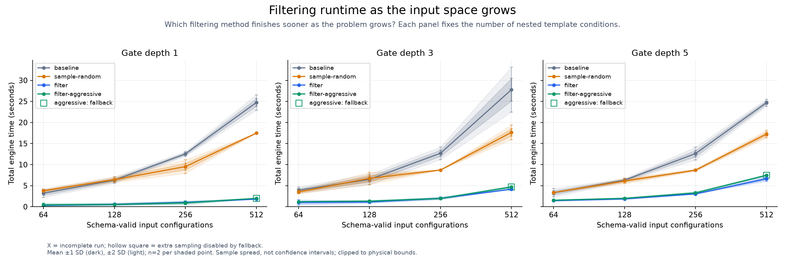
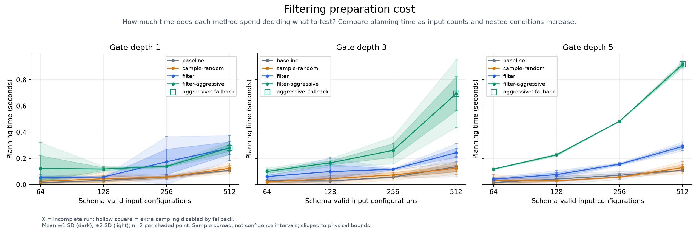
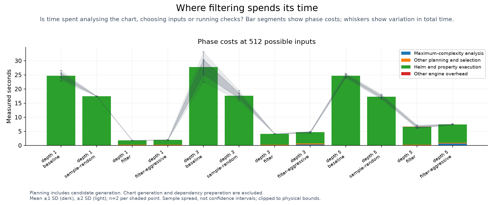

# Filtering load test

<!-- toc:start -->
**Table of contents**

- [Filtering load test](#filtering-load-test)
<!-- toc:end -->

[Theory and conditions](../../docs/adaptive-filtering/README.md#computational-cost)

A gate is a template `if` condition. Depth counts nested conditions required to reach the innermost branch.

2 paired repeats per chart and method; execution ceiling 540 seconds per run.
Dark bands show mean ±1 sample SD; light bands show ±2 SD across paired repeats, not confidence intervals. Method order is seeded and shuffled for each repeat.
Input count is the full Boolean domain (2^fields), not the interaction-strength flag; strength stays at two.
The small finite domains are fully enumerated before filtering.
Gate depth changes branch rarity, fan-in and equivalent-output regions.

The engine runs real Helm checks with no shared outcome cache. Each invocation creates its own render-hash cache.
OS and Helm executable caches can remain warm. Chart generation, CLI startup and dependency preparation are excluded.
Planning and analysis are included in total engine time. The execution ceiling does not cap planning.

`sample-random` retains 70% subject to its normal 128-case floor. `filter` uses topology depth two and failure expansion.
`filter-adaptive` adds its measured floors; unmatched charts keep ordinary filtering. All methods use the same traversal seed.
The chart's injected markers change topology but are not asserted as lint failures in this successful-render load test.
Failure expansion is enabled for both filter presets; workloads with actual failing properties may expand toward the full plan.

| Fields | Depth | Repeat | Method | Selected | Completed | Total s | Planning s | Complexity s | Execution s | Status |
| ---: | ---: | ---: | --- | ---: | ---: | ---: | ---: | ---: | ---: | --- |
| 6 | 1 | 0 | baseline | 64 | 64 | 2.861 | 0.013 | 0.000 | 2.841 | passed |
| 6 | 1 | 0 | sample-random | 64 | 64 | 3.937 | 0.036 | 0.000 | 3.889 | passed |
| 6 | 1 | 0 | filter-adaptive | 5 | 5 | 0.277 | 0.052 | 0.016 | 0.210 | passed |
| 6 | 1 | 0 | filter | 5 | 5 | 0.261 | 0.061 | 0.000 | 0.193 | passed |
| 6 | 1 | 1 | baseline | 64 | 64 | 3.544 | 0.014 | 0.000 | 3.525 | passed |
| 6 | 1 | 1 | sample-random | 64 | 64 | 3.660 | 0.013 | 0.000 | 3.640 | passed |
| 6 | 1 | 1 | filter | 5 | 5 | 0.387 | 0.046 | 0.000 | 0.331 | passed |
| 6 | 1 | 1 | filter-adaptive | 5 | 5 | 0.596 | 0.192 | 0.024 | 0.395 | passed |
| 6 | 3 | 0 | baseline | 64 | 64 | 4.190 | 0.043 | 0.000 | 4.139 | passed |
| 6 | 3 | 0 | filter | 17 | 17 | 1.256 | 0.054 | 0.000 | 1.194 | passed |
| 6 | 3 | 0 | filter-adaptive | 17 | 17 | 1.234 | 0.110 | 0.053 | 1.118 | passed |
| 6 | 3 | 0 | sample-random | 64 | 64 | 3.664 | 0.018 | 0.000 | 3.639 | passed |
| 6 | 3 | 1 | filter-adaptive | 17 | 17 | 1.164 | 0.091 | 0.049 | 1.066 | passed |
| 6 | 3 | 1 | baseline | 64 | 64 | 3.657 | 0.016 | 0.000 | 3.634 | passed |
| 6 | 3 | 1 | sample-random | 64 | 64 | 3.338 | 0.022 | 0.000 | 3.308 | passed |
| 6 | 3 | 1 | filter | 17 | 17 | 0.804 | 0.068 | 0.000 | 0.730 | passed |
| 6 | 5 | 0 | filter | 29 | 29 | 1.525 | 0.036 | 0.000 | 1.480 | passed |
| 6 | 5 | 0 | sample-random | 64 | 64 | 3.414 | 0.049 | 0.000 | 3.359 | passed |
| 6 | 5 | 0 | filter-adaptive | 29 | 29 | 1.481 | 0.120 | 0.077 | 1.354 | passed |
| 6 | 5 | 0 | baseline | 64 | 64 | 3.659 | 0.015 | 0.000 | 3.637 | passed |
| 6 | 5 | 1 | filter | 29 | 29 | 1.396 | 0.047 | 0.000 | 1.343 | passed |
| 6 | 5 | 1 | filter-adaptive | 29 | 29 | 1.593 | 0.116 | 0.077 | 1.443 | passed |
| 6 | 5 | 1 | sample-random | 64 | 64 | 3.333 | 0.015 | 0.000 | 3.310 | passed |
| 6 | 5 | 1 | baseline | 64 | 64 | 2.957 | 0.015 | 0.000 | 2.935 | passed |
| 7 | 1 | 0 | filter | 9 | 9 | 0.470 | 0.056 | 0.000 | 0.407 | passed |
| 7 | 1 | 0 | filter-adaptive | 7 | 7 | 0.626 | 0.126 | 0.022 | 0.491 | passed |
| 7 | 1 | 0 | sample-random | 128 | 128 | 6.200 | 0.063 | 0.000 | 6.131 | passed |
| 7 | 1 | 0 | baseline | 128 | 128 | 6.040 | 0.028 | 0.000 | 6.006 | passed |
| 7 | 1 | 1 | filter-adaptive | 7 | 7 | 0.460 | 0.111 | 0.018 | 0.343 | passed |
| 7 | 1 | 1 | sample-random | 128 | 128 | 6.660 | 0.026 | 0.000 | 6.626 | passed |
| 7 | 1 | 1 | filter | 9 | 9 | 0.680 | 0.059 | 0.000 | 0.613 | passed |
| 7 | 1 | 1 | baseline | 128 | 128 | 6.576 | 0.034 | 0.000 | 6.534 | passed |
| 7 | 3 | 0 | filter-adaptive | 20 | 20 | 1.408 | 0.154 | 0.081 | 1.239 | passed |
| 7 | 3 | 0 | filter | 21 | 21 | 1.223 | 0.137 | 0.000 | 1.076 | passed |
| 7 | 3 | 0 | baseline | 128 | 128 | 6.921 | 0.027 | 0.000 | 6.888 | passed |
| 7 | 3 | 0 | sample-random | 128 | 128 | 7.235 | 0.028 | 0.000 | 7.201 | passed |
| 7 | 3 | 1 | baseline | 128 | 128 | 6.045 | 0.027 | 0.000 | 6.010 | passed |
| 7 | 3 | 1 | filter | 21 | 21 | 1.022 | 0.062 | 0.000 | 0.953 | passed |
| 7 | 3 | 1 | filter-adaptive | 20 | 20 | 1.229 | 0.176 | 0.073 | 1.045 | passed |
| 7 | 3 | 1 | sample-random | 128 | 128 | 6.221 | 0.062 | 0.000 | 6.152 | passed |
| 7 | 5 | 0 | filter-adaptive | 36 | 36 | 1.928 | 0.230 | 0.164 | 1.691 | passed |
| 7 | 5 | 0 | baseline | 128 | 128 | 6.165 | 0.056 | 0.000 | 6.102 | passed |
| 7 | 5 | 0 | filter | 37 | 37 | 1.805 | 0.087 | 0.000 | 1.710 | passed |
| 7 | 5 | 0 | sample-random | 128 | 128 | 5.880 | 0.027 | 0.000 | 5.846 | passed |
| 7 | 5 | 1 | sample-random | 128 | 128 | 6.343 | 0.030 | 0.000 | 6.305 | passed |
| 7 | 5 | 1 | filter | 37 | 37 | 1.924 | 0.065 | 0.000 | 1.850 | passed |
| 7 | 5 | 1 | filter-adaptive | 36 | 36 | 2.055 | 0.223 | 0.158 | 1.821 | passed |
| 7 | 5 | 1 | baseline | 128 | 128 | 6.442 | 0.027 | 0.000 | 6.406 | passed |
| 8 | 1 | 0 | sample-random | 180 | 180 | 10.090 | 0.052 | 0.000 | 10.029 | passed |
| 8 | 1 | 0 | filter-adaptive | 13 | 13 | 1.078 | 0.143 | 0.032 | 0.917 | passed |
| 8 | 1 | 0 | filter | 17 | 17 | 1.134 | 0.242 | 0.000 | 0.886 | passed |
| 8 | 1 | 0 | baseline | 256 | 256 | 12.742 | 0.051 | 0.000 | 12.684 | passed |
| 8 | 1 | 1 | sample-random | 180 | 180 | 8.950 | 0.061 | 0.000 | 8.879 | passed |
| 8 | 1 | 1 | filter | 17 | 17 | 0.942 | 0.106 | 0.000 | 0.827 | passed |
| 8 | 1 | 1 | baseline | 256 | 256 | 12.334 | 0.065 | 0.000 | 12.258 | passed |
| 8 | 1 | 1 | filter-adaptive | 13 | 13 | 0.755 | 0.136 | 0.023 | 0.613 | passed |
| 8 | 3 | 0 | baseline | 256 | 256 | 13.217 | 0.055 | 0.000 | 13.155 | passed |
| 8 | 3 | 0 | filter-adaptive | 34 | 34 | 2.043 | 0.224 | 0.092 | 1.811 | passed |
| 8 | 3 | 0 | sample-random | 180 | 180 | 8.731 | 0.060 | 0.000 | 8.664 | passed |
| 8 | 3 | 0 | filter | 35 | 35 | 2.118 | 0.114 | 0.000 | 1.995 | passed |
| 8 | 3 | 1 | filter | 35 | 35 | 1.887 | 0.120 | 0.000 | 1.758 | passed |
| 8 | 3 | 1 | filter-adaptive | 34 | 34 | 1.896 | 0.298 | 0.080 | 1.587 | passed |
| 8 | 3 | 1 | sample-random | 180 | 180 | 8.703 | 0.087 | 0.000 | 8.608 | passed |
| 8 | 3 | 1 | baseline | 256 | 256 | 12.156 | 0.059 | 0.000 | 12.090 | passed |
| 8 | 5 | 0 | sample-random | 180 | 180 | 8.786 | 0.056 | 0.000 | 8.722 | passed |
| 8 | 5 | 0 | filter | 58 | 58 | 3.023 | 0.152 | 0.000 | 2.862 | passed |
| 8 | 5 | 0 | baseline | 256 | 256 | 12.080 | 0.082 | 0.000 | 11.991 | passed |
| 8 | 5 | 0 | filter-adaptive | 58 | 58 | 3.389 | 0.484 | 0.297 | 2.897 | passed |
| 8 | 5 | 1 | filter-adaptive | 58 | 58 | 3.187 | 0.483 | 0.314 | 2.696 | passed |
| 8 | 5 | 1 | sample-random | 180 | 180 | 8.585 | 0.057 | 0.000 | 8.520 | passed |
| 8 | 5 | 1 | filter | 58 | 58 | 3.033 | 0.160 | 0.000 | 2.863 | passed |
| 8 | 5 | 1 | baseline | 256 | 256 | 13.154 | 0.060 | 0.000 | 13.082 | passed |
| 9 | 1 | 0 | baseline | 512 | 512 | 24.095 | 0.107 | 0.000 | 23.981 | passed |
| 9 | 1 | 0 | filter | 33 | 33 | 1.793 | 0.245 | 0.000 | 1.540 | passed |
| 9 | 1 | 0 | sample-random | 359 | 359 | 17.497 | 0.109 | 0.000 | 17.382 | passed |
| 9 | 1 | 0 | filter-adaptive | 33 | 33 | 2.014 | 0.298 | 0.051 | 1.698 | passed |
| 9 | 1 | 1 | baseline | 512 | 512 | 25.394 | 0.111 | 0.000 | 25.277 | passed |
| 9 | 1 | 1 | sample-random | 359 | 359 | 17.458 | 0.138 | 0.000 | 17.314 | passed |
| 9 | 1 | 1 | filter | 33 | 33 | 1.821 | 0.313 | 0.000 | 1.501 | passed |
| 9 | 1 | 1 | filter-adaptive | 33 | 33 | 1.969 | 0.261 | 0.024 | 1.701 | passed |
| 9 | 3 | 0 | sample-random | 359 | 359 | 17.037 | 0.107 | 0.000 | 16.920 | passed |
| 9 | 3 | 0 | filter | 75 | 75 | 4.153 | 0.268 | 0.000 | 3.876 | passed |
| 9 | 3 | 0 | baseline | 512 | 512 | 29.675 | 0.108 | 0.000 | 29.560 | passed |
| 9 | 3 | 0 | filter-adaptive | 75 | 75 | 4.792 | 0.784 | 0.426 | 3.997 | passed |
| 9 | 3 | 1 | baseline | 512 | 512 | 25.903 | 0.163 | 0.000 | 25.733 | passed |
| 9 | 3 | 1 | filter | 75 | 75 | 4.147 | 0.218 | 0.000 | 3.920 | passed |
| 9 | 3 | 1 | filter-adaptive | 75 | 75 | 4.571 | 0.602 | 0.298 | 3.960 | passed |
| 9 | 3 | 1 | sample-random | 359 | 359 | 18.267 | 0.141 | 0.000 | 18.119 | passed |
| 9 | 5 | 0 | filter | 127 | 127 | 6.428 | 0.302 | 0.000 | 6.082 | passed |
| 9 | 5 | 0 | sample-random | 359 | 359 | 17.564 | 0.113 | 0.000 | 17.445 | passed |
| 9 | 5 | 0 | baseline | 512 | 512 | 24.411 | 0.109 | 0.000 | 24.295 | passed |
| 9 | 5 | 0 | filter-adaptive | 127 | 127 | 7.413 | 0.908 | 0.662 | 6.497 | passed |
| 9 | 5 | 1 | filter-adaptive | 127 | 127 | 7.544 | 0.927 | 0.680 | 6.601 | passed |
| 9 | 5 | 1 | baseline | 512 | 512 | 24.999 | 0.109 | 0.000 | 24.879 | passed |
| 9 | 5 | 1 | sample-random | 359 | 359 | 16.927 | 0.146 | 0.000 | 16.774 | passed |
| 9 | 5 | 1 | filter | 127 | 127 | 6.870 | 0.279 | 0.000 | 6.583 | passed |

[Raw timings and fallback decisions](results.csv) · [Full measurements](results.json) · [Chart recipes](cases/)
