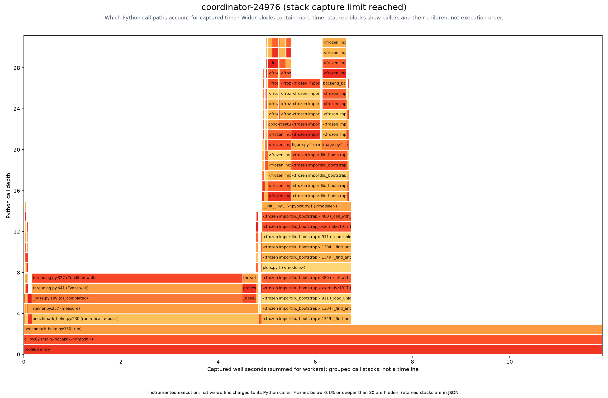

# Flame graphs

[Benchmarking](../../benchmarks/README.md#flame-graphs-across-worker-cores)

These captures come from a scaling smoke test with four cases and worker settings of one and two.
They illustrate the profiler; they are not measurements from the Bitnami or Prometheus scans.
Five worker processes were captured across the scaling invocations, along with their coordinator.

Wider boxes mean more time in a function and its children. Stacked boxes show who called whom.
The combined graph adds worker time across processes, including overlapping execution.
Helm subprocess waits appear under their Python callers; Helm's internal functions are not shown.

## Combined workers


[Open zoomable SVG](workers-combined.svg)

## Coordinator



[Open zoomable SVG](coordinator-24976.svg)

## Individual workers and captures

[Worker 25005](worker-25005.svg) · [Worker 25040](worker-25040.svg) · [Worker 25041](worker-25041.svg) ·
[Worker 25073](worker-25073.svg) · [Worker 25074](worker-25074.svg)

All six captures completed, but the profiler reached its recording limits: 2,722,562 events were
charged to retained ancestors instead of recorded as separate detail. Profiling also adds overhead.
Use these plots to inspect call structure, rather than compare uninstrumented benchmark timings.

[Capture index](index.json) · [Raw captures](captures.tar.gz) · [Artifact checksums](sha256.json)

To redraw the saved captures from the repository root:

```sh
mkdir -p benchmarks/runs/flamegraph-captures
tar -xzf studies/flamegraphs/captures.tar.gz -C benchmarks/runs/flamegraph-captures
hypothesis-helm-benchmark flamegraph benchmarks/runs/flamegraph-captures \
  --output benchmarks/runs/flamegraphs
```
