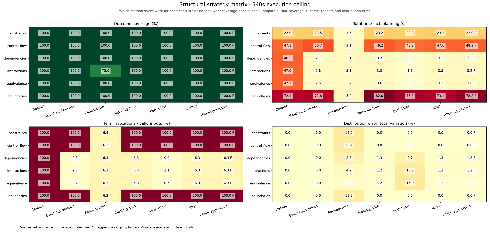

# Structural strategy matrix

[Benchmarking](../../benchmarks/README.md)

Helm `v4.3.0+gbec5b06`; 540s execution ceiling per run; trim level 2; seed 2026.

All strategy columns use the same complete valid input domain within each case. Planning and analysis are timed separately and excluded from the execution ceiling. Fresh caches; sequential runs.

Each trim column uses the stated level; combined enables both at that level. Exact-equivalence pruning is enabled only in its own column.

Cells show **outcome coverage / total seconds / Helm invocations**.

| Structure | Default | Exact equivalence | Random trim | Topology trim | Both trims | --filter | --filter-aggressive |
|---|---|---|---|---|---|---|---|
| constraints | 100% / 22.9s / 512 | 100% / 23.5s / 512 | 100% / 1.6s / 33 | 100% / 23.2s / 512 | 100% / 22.8s / 512 | 100% / 23.3s / 512 | 100% / 23.0s / 512 |
| control-flow | 100% / 47.1s / 1024 | 100% / 50.7s / 1024 | 100% / 3.1s / 65 | 100% / 49.2s / 1024 | 100% / 46.3s / 1024 | 100% / 47.6s / 1024 | 100% / 48.3s / 1024 |
| dependencies | 100% / 48.3s / 1024 | 100% / 2.7s / 8 | 100% / 3.1s / 65 | 100% / 3.2s / 65 | 100% / 0.6s / 9 | 100% / 3.3s / 65 | 100% / 3.3s / 65 |
| interactions | 100% / 47.6s / 1024 | 100% / 2.8s / 20 | 75% / 3.1s / 65 | 100% / 3.0s / 65 | 100% / 1.1s / 21 | 100% / 3.5s / 65 | 100% / 3.2s / 65 |
| equivalence | 100% / 47.7s / 1024 | 100% / 2.5s / 4 | 100% / 3.4s / 65 | 100% / 3.6s / 65 | 100% / 0.3s / 5 | 100% / 3.2s / 65 | 100% / 3.6s / 65 |
| boundaries | 100% / 72.1s / 1536 | 100% / 72.8s / 1536 | 100% / 5.0s / 97 | 100% / 82.0s / 1536 | 100% / 75.3s / 1536 | 100% / 73.1s / 1536 | 100% / 78.8s / 1536 |

[Raw measurements](results.json) · [CSV](results.csv)

Constraints use coupled Boolean inputs; control flow includes an input-dependent loop; dependencies share a Service/Ingress port; interactions expose a four-way rare branch; equivalence varies output-irrelevant fields; boundaries cross an integer threshold.

The current compiler conservatively retains cases it cannot classify. A topology fallback is a measured limitation, not a failed benchmark. Topology sampling favors diversity and need not preserve outcome frequencies. These are fixture outcomes, not bug-discovery guarantees or population-wide confidence intervals.

`--filter` and `--filter-aggressive` use topology level 2 and enable failure expansion. Aggressive sampling recomputes chart complexity, protects structural regions and applies the packaged calibration. An unmatched or unsupported chart keeps the ordinary filtered selection; 70% retention is not forced. Expansion-off columns are controlled ablations of these presets.

**Aggressive sampling decisions.** Counts below exclude the always-retained default configuration and precede failure expansion. Case and field floors apply only to matched calibrations.

| Fixture | Match | Retained / eligible | Case floor | Field floor | Fallback reason |
| --- | --- | ---: | ---: | ---: | --- |
| constraints | unmatched | 511 / 511 | 1 | 0 | schema validation is outside the shared proof contract |
| control-flow | unmatched | 1023 / 1023 | 1 | 0 | opaque template construct at line 9 |
| dependencies | unmatched | 64 / 64 | 1 | 0 | chart complexity or topology is outside the measured calibration profiles |
| interactions | unmatched | 64 / 64 | 1 | 0 | chart complexity or topology is outside the measured calibration profiles |
| equivalence | unmatched | 64 / 64 | 1 | 0 | chart complexity or topology is outside the measured calibration profiles |
| boundaries | unmatched | 1535 / 1535 | 1 | 0 | default coalescing or scalar types are outside the proof contract |
