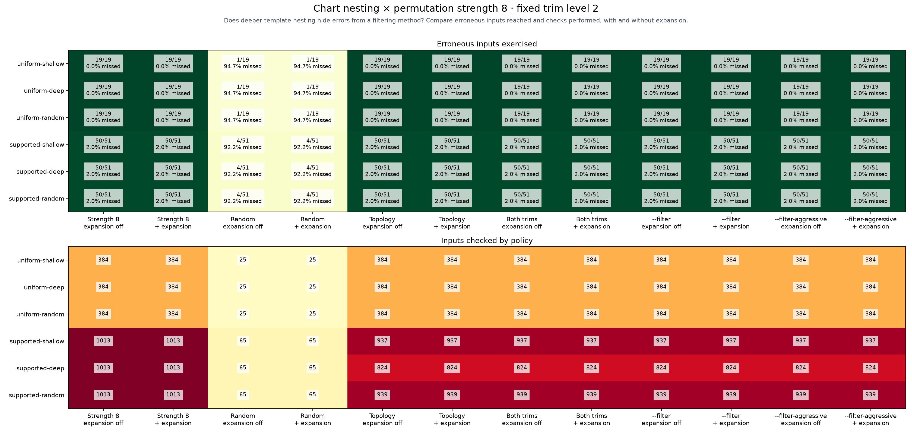
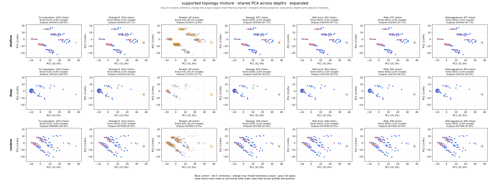
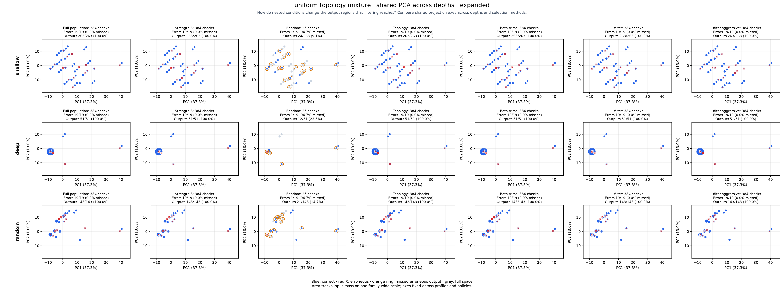

# Chart nesting and output-space PCA

[Benchmarking](../../benchmarks/README.md)

**8 is permutation interaction strength, not component count.** This study holds
`--permutations 8` fixed and varies additional Boolean gate depth:
shallow (1), deep (5), and a seeded uniform mix of depths 1–5.
Each chart has 12 topology components and 10 inputs. Component types, original wiring,
gate ordering, valid input domain and fault placements stay fixed within each family.
Gate paths use a separate seeded stream; deeper profiles take longer prefixes
of the same ordering. Structural bodies may already contain branches:
the reported depth counts the **added outer gates**.
Input constraints remain global even when a component's resources are gated off.

Trimming stays at level 2; the matrix compares random trimming, topology trimming,
both together, the filter presets, and each with failure expansion off/on. Errors occupy 5% of valid
assignments (rounded down), fault seed 1729; topology and selection seed 2026.
Automatic exhaustive promotion and inferred groups are disabled so strength eight
is actually exercised. Complete populations are rendered separately for ground truth.
Expansion only revisits omitted members of that strength-eight plan.
Strength eight describes the unfiltered plan; trimming can remove that coverage.



## Shared PCA frames

Each family has **one PCA fit pooled across all three complete depth profiles**.
Its coordinates, axis limits and marker-size scale stay fixed before/after filtering
and across shallow/deep/random rows. Axes are comparable within a family,
not between families.
Full-population panels show the chart's output geometry; strength-eight panels show
what the planner samples before filtering. The added error ConfigMap is
included in the features.
PCA can overlap distinct outputs and discards variance; labels report retained variance.







## Recorded fixture depths

| Fixture | Component gate depths | Planned inputs / full population |
|---|---|---|
| uniform-shallow | 1, 1, 1, 1, 1, 1, 1, 1, 1, 1, 1, 1 | 384/384 |
| uniform-deep | 5, 5, 5, 5, 5, 5, 5, 5, 5, 5, 5, 5 | 384/384 |
| uniform-random | 1, 3, 1, 2, 3, 5, 1, 1, 3, 2, 4, 1 | 384/384 |
| supported-shallow | 1, 1, 1, 1, 1, 1, 1, 1, 1, 1, 1, 1 | 1013/1024 |
| supported-deep | 5, 5, 5, 5, 5, 5, 5, 5, 5, 5, 5, 5 | 1013/1024 |
| supported-random | 1, 3, 1, 2, 3, 5, 1, 1, 3, 2, 4, 1 | 1013/1024 |


Helm `v4.3.0+gbec5b06`. Every reference render is checked against an independent
manifest and fault oracle. Policies replay their selected reference observations;
added expansion inputs are physically rendered again. Reference plus all added
renders share a 540s ceiling per fixture,
excluding planning/PCA.
These are matched coverage comparisons, not independent end-to-end timings.
Exact output coverage, input recall, additional renders and remaining work are in the CSV.
One fixed seed does not establish a universal best topology or filtering setting.

[Raw observations and pooled PCA bases](results.json) · [CSV](results.csv)

```sh
hypothesis-helm-benchmark nesting --permutations 8 \
  --time-limit 9m --output reports/nesting
```

`--filter` and `--filter-aggressive` use topology level 2 and enable failure expansion. Aggressive sampling recomputes chart complexity, protects structural regions and applies the packaged calibration. An unmatched or unsupported chart keeps the ordinary filtered selection; 70% retention is not forced. Expansion-off columns are controlled ablations of these presets.

**Aggressive sampling decisions.** Counts below exclude the always-retained default configuration and precede failure expansion. Case and field floors apply only to matched calibrations.

| Fixture | Match | Retained / eligible | Case floor | Field floor | Fallback reason |
| --- | --- | ---: | ---: | ---: | --- |
| uniform-shallow | unmatched | 383 / 383 | 1 | 0 | schema validation is outside the shared proof contract |
| uniform-deep | unmatched | 383 / 383 | 1 | 0 | schema validation is outside the shared proof contract |
| uniform-random | unmatched | 383 / 383 | 1 | 0 | schema validation is outside the shared proof contract |
| supported-shallow | unmatched | 936 / 936 | 1 | 0 | chart complexity or topology is outside the measured calibration profiles |
| supported-deep | unmatched | 823 / 823 | 1 | 0 | chart complexity or topology is outside the measured calibration profiles |
| supported-random | unmatched | 938 / 938 | 1 | 0 | chart complexity or topology is outside the measured calibration profiles |
