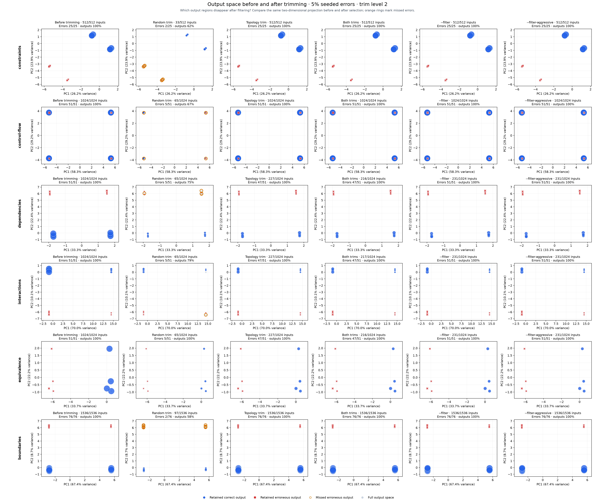

# Output-space PCA

[Benchmarking](../../benchmarks/README.md)

Real Helm `v4.3.0+gbec5b06` renders. Errors occupy 5% of valid input assignments per category, rounded down; error seed 1729, selection seed 2026, trim level 2.

Faults emit an incorrect status in an added ConfigMap. They are present before topology analysis. This is a synthetic error projection, not five percent of distinct software defects or arbitrary corruptions of Kubernetes fields.



**Errors found / all erroneous inputs (percentage missed)**. Several erroneous inputs can produce the same output. Percentages are exact miss rates within this seeded fixture.

| Structure | Before trimming | Random trim | Topology trim | Both trims | --filter | --filter-aggressive |
|---|---:|---:|---:|---:|---:|---:|
| [constraints](constraints.png) | 25/25 (0.0% missed) | 2/25 (92.0% missed) | 25/25 (0.0% missed) | 25/25 (0.0% missed) | 25/25 (0.0% missed) | 25/25 (0.0% missed) |
| [control-flow](control-flow.png) | 51/51 (0.0% missed) | 5/51 (90.2% missed) | 51/51 (0.0% missed) | 51/51 (0.0% missed) | 51/51 (0.0% missed) | 51/51 (0.0% missed) |
| [dependencies](dependencies.png) | 51/51 (0.0% missed) | 5/51 (90.2% missed) | 47/51 (7.8% missed) | 47/51 (7.8% missed) | 51/51 (0.0% missed) | 51/51 (0.0% missed) |
| [interactions](interactions.png) | 51/51 (0.0% missed) | 5/51 (90.2% missed) | 47/51 (7.8% missed) | 47/51 (7.8% missed) | 51/51 (0.0% missed) | 51/51 (0.0% missed) |
| [equivalence](equivalence.png) | 51/51 (0.0% missed) | 5/51 (90.2% missed) | 47/51 (7.8% missed) | 47/51 (7.8% missed) | 51/51 (0.0% missed) | 51/51 (0.0% missed) |
| [boundaries](boundaries.png) | 76/76 (0.0% missed) | 2/76 (97.4% missed) | 76/76 (0.0% missed) | 76/76 (0.0% missed) | 76/76 (0.0% missed) | 76/76 (0.0% missed) |

PCA is fitted once per category to every valid input's output, including repeated outputs. Resource presence, numeric leaves and typed categorical leaves become standardized features; numeric strings remain categorical. Constant features are removed. Both axes and marker-size scale stay fixed after trimming. Axes are not comparable across categories.

Marker area tracks retained input mass (with a visibility floor). Orange rings mark erroneous output classes entirely missed. PCA can overlap distinct manifests and discards variance: read the displayed variance percentages and exact output coverage alongside it. Error-case recall is distinct from output coverage. Conservative compiler fallback may retain the whole domain.

The complete population is rendered once, with a nine-minute ceiling per category, and checked against an independent manifest/error oracle. Production selectors choose subsets of those observations; these are not separate execution-time measurements. Incomplete references are saved with remaining-work statistics and are not plotted as full populations. One seeded experiment is not a confidence interval.

[Raw observations, inputs and PCA bases](results.json) · [CSV statistics](results.csv)

```sh
hypothesis-helm-benchmark pca \
  --input-complexity 10 --error-percent 5 --error-seed 1729 \
  --seed 2026 --trim-level 2 --time-limit 9m --output reports/pca
```

Use `--plot-only --output reports/pca` to redraw recorded observations.


`--filter` and `--filter-aggressive` use topology level 2 and enable failure expansion. Aggressive sampling recomputes chart complexity, protects structural regions and applies the packaged calibration. An unmatched or unsupported chart keeps the ordinary filtered selection; 70% retention is not forced. Expansion-off columns are controlled ablations of these presets.

**Aggressive sampling decisions.** Counts below exclude the always-retained default configuration and precede failure expansion. Case and field floors apply only to matched calibrations.

| Fixture | Match | Retained / eligible | Case floor | Field floor | Fallback reason |
| --- | --- | ---: | ---: | ---: | --- |
| constraints | unmatched | 511 / 511 | 1 | 0 | schema validation is outside the shared proof contract |
| control-flow | unmatched | 1023 / 1023 | 1 | 0 | opaque template construct at line 9 |
| dependencies | unmatched | 226 / 226 | 1 | 0 | chart complexity or topology is outside the measured calibration profiles |
| interactions | unmatched | 226 / 226 | 1 | 0 | chart complexity or topology is outside the measured calibration profiles |
| equivalence | unmatched | 226 / 226 | 1 | 0 | chart complexity or topology is outside the measured calibration profiles |
| boundaries | unmatched | 1535 / 1535 | 1 | 0 | default coalescing or scalar types are outside the proof contract |

Preset PCA columns include failure expansion, replaying each visited input's actual Helm result.
