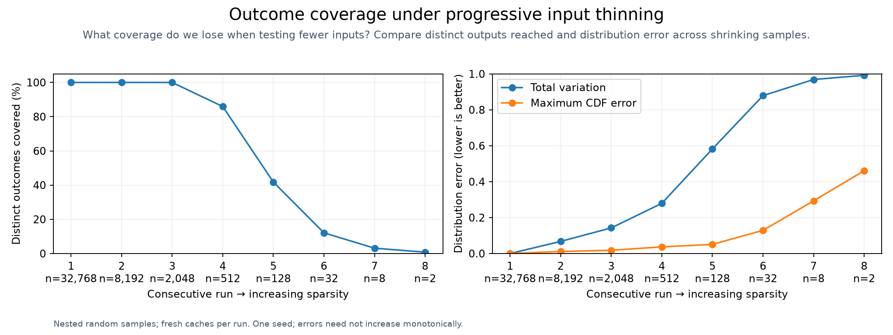
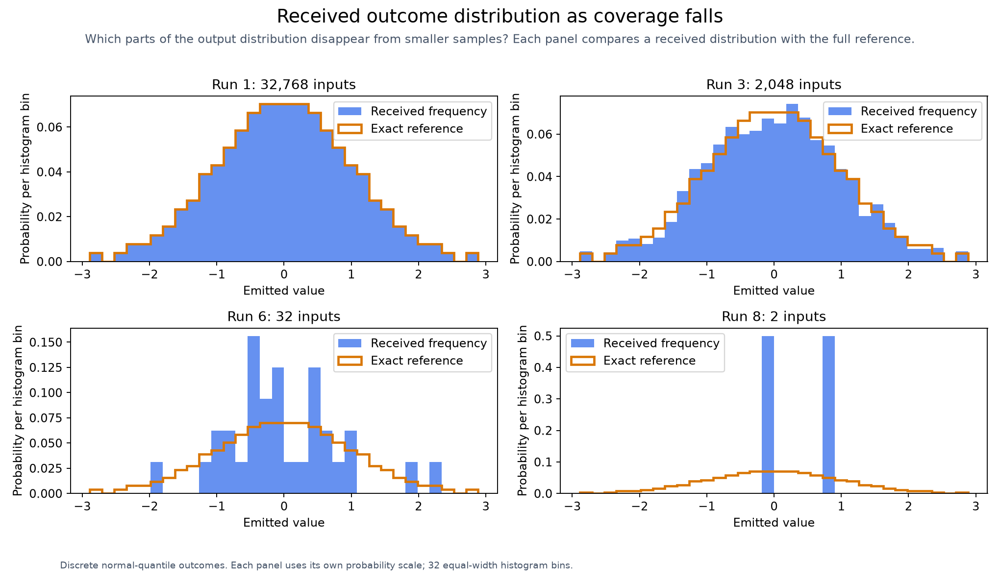

# Sparsity and Stochasticity

[Benchmarking](../../benchmarks/README.md)

This study varies case count, not `--permutations` interaction strength. It measures
outcome coverage and distribution error; see the main benchmark for bug discovery.

~~~sh
hypothesis-helm-benchmark sparsity \
  --chart studies/performance/standard-chart --count 32768 --retain 0.25 --levels 8 \
  --time-limit 9m --output benchmarks/runs/sparsity
~~~

Each run uses a nested random subset, fresh caches, and a nine-minute budget.
Received frequencies are compared with the chart's exact finite distribution.
This is one seeded trajectory; distribution errors can fluctuate.
[Raw results](results.json) retain counts and run details.

The application exposes this tradeoff through `--trim-random N` (default `0`): each step
retains 25% of non-default planned cases, rounded upward. See [trimming](../../docs/execution/README.md#optional-trimming).
This fixture's distribution coverage does not establish a generally safe trim
level for bug discovery; rare faults can be lost when cases are omitted.

## Fresh measurements

| Stage | Inputs checked / assigned | Helm renders | Scalar coverage | Total variation | Maximum CDF error | Seconds |
| ---: | ---: | ---: | ---: | ---: | ---: | ---: |
| 1 | 32,768 / 32,768 | 256 | 100.00% | 0.00000 | 0.00000 | 117.01 |
| 2 | 8,192 / 8,192 | 256 | 100.00% | 0.06726 | 0.01123 | 38.75 |
| 3 | 2,048 / 2,048 | 256 | 100.00% | 0.14258 | 0.01807 | 20.65 |
| 4 | 512 / 512 | 220 | 85.94% | 0.27930 | 0.03711 | 13.01 |
| 5 | 128 / 128 | 107 | 41.80% | 0.58203 | 0.05078 | 6.29 |
| 6 | 32 / 32 | 31 | 12.11% | 0.87891 | 0.12891 | 2.05 |
| 7 | 8 / 8 | 8 | 3.12% | 0.96875 | 0.29297 | 0.51 |
| 8 | 2 / 2 | 2 | 0.78% | 0.99219 | 0.46094 | 0.20 |

[CSV measurements](results.csv)
