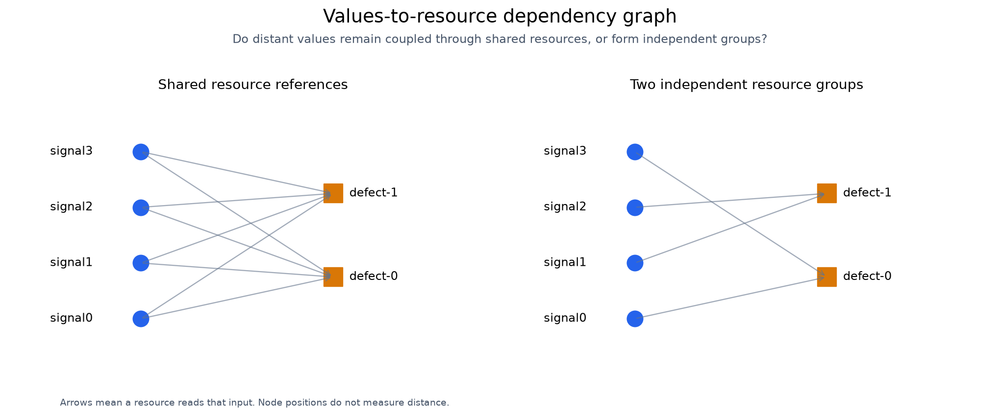
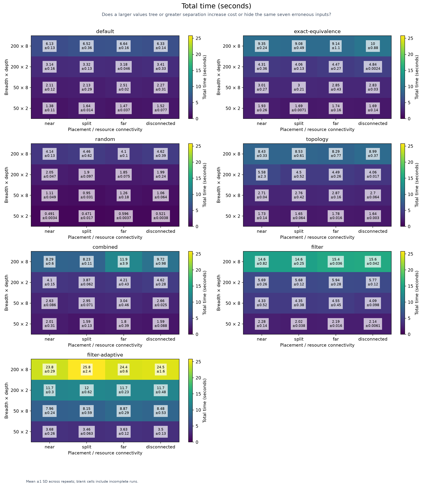
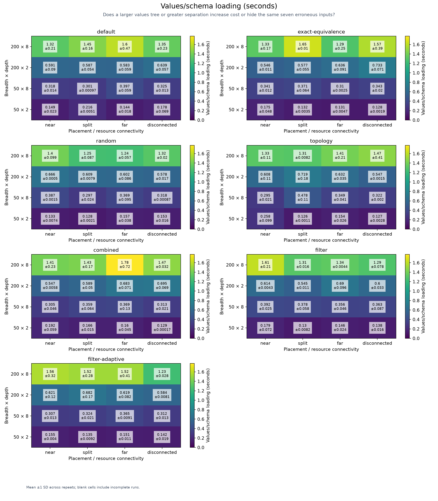
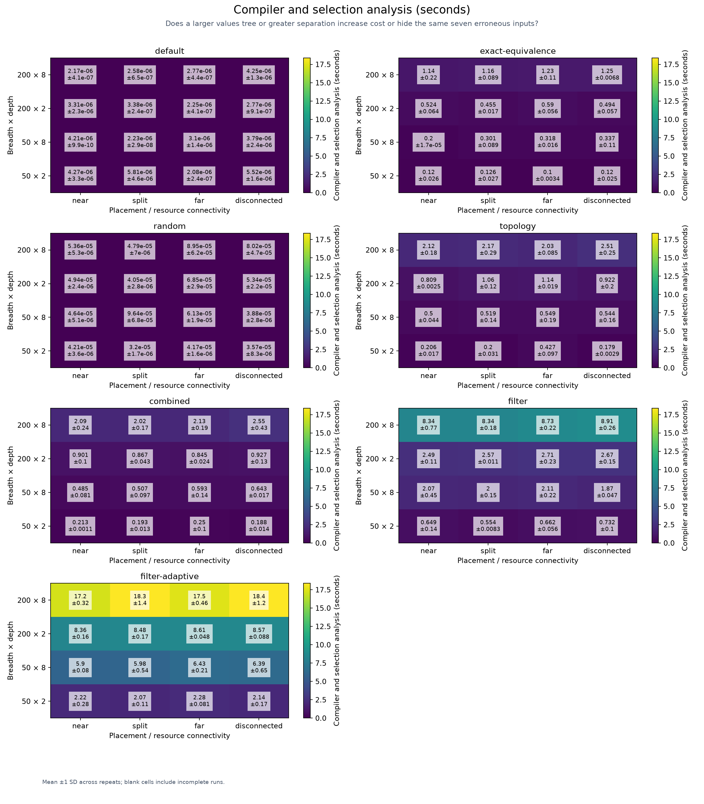
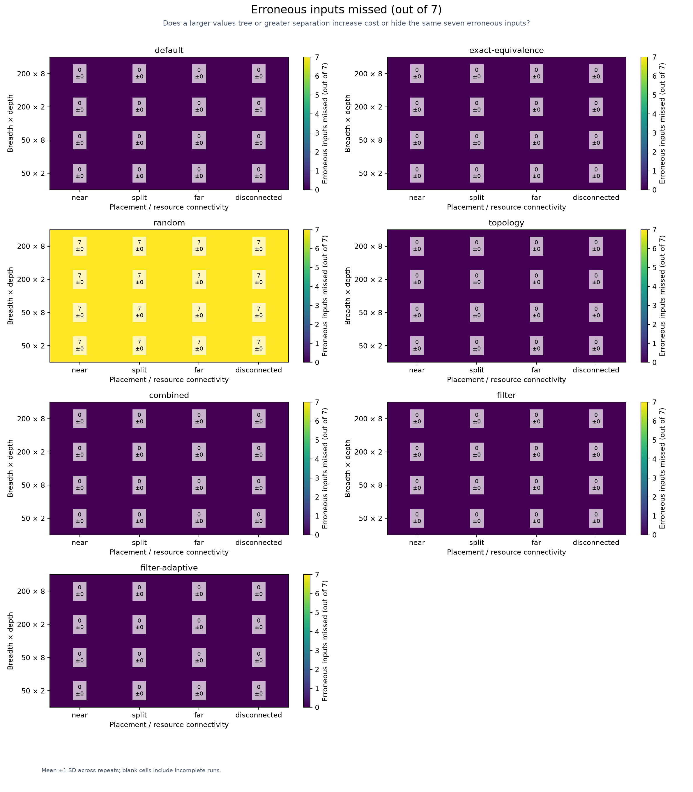

# Structural sparsity: large charts with separated relevant fields

<!-- toc:start -->
**Table of contents**

- [Structural sparsity: large charts with separated relevant fields](#structural-sparsity-large-charts-with-separated-relevant-fields)
<!-- toc:end -->

Can filtering avoid irrelevant structure without missing interactions between distant values?

Every case has four variable Boolean fields, 16 valid assignments, two pairwise defects and seven erroneous assignments.
All other leaves are constrained to false. The study isolates structural size, not an exponentially growing variable domain.
Breadth counts root branches; depth counts intermediate maps in each branch. Every branch ends in four Boolean leaves.
The tree has 1 + breadth × (depth + 5) nodes. Relevant-node density is 4 divided by this count.
Within each size, every placement has the same values-tree shape, node count, input domain and fault conditions.

Near puts all four signals in one branch; split uses two branches; far uses four branches.
Distance counts edges on the shortest path through the values tree, including its root. It is not layout spacing.
Different-branch leaves are 2 × (depth + 2) edges apart; same-branch leaves are two edges apart.
Shared resource projections connect the inputs even when their values paths are far apart.
Disconnected uses the far placement but each defect resource references only its own input pair, yielding two independent
components in the input-to-resource graph. The values tree stays connected. Fault triggers stay the same.

Discovery measures Chart.load (values/schema loading); compiler analysis is measured separately.
Total time includes loading, planning, analysis and execution. Fixture generation and the oracle are excluded.
Each method starts fresh; OS caches may remain warm. Method order is shuffled reproducibly for every repeat.
Filter presets use production selection and failure expansion. Adaptive floors may keep all cases in this small fixed domain.
Each render is checked against an independent oracle. Error counts refer to erroneous inputs, not unique defects.
Cells show mean ±1 sample standard deviation across repeats, not confidence intervals. Blank cells include incomplete runs.
Execution timeouts are per method and do not bound planning. Timed-out observations remain in the raw ledger.

[Measurements](results.json) · [CSV](results.csv) · [Replayable chart recipes](cases)

