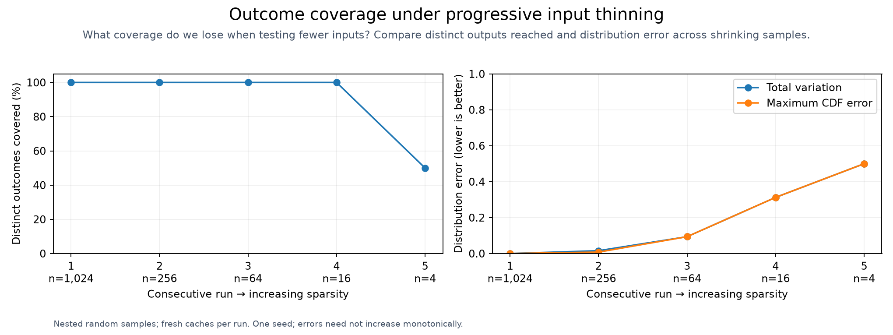
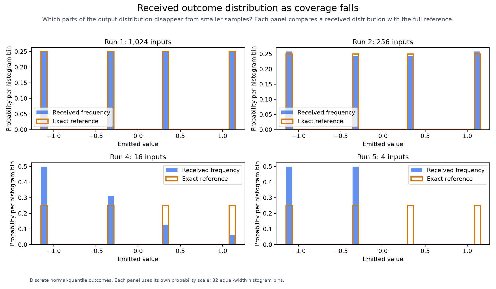

# Sparsity across structural outcomes

[Benchmarking](../../benchmarks/README.md)

Each stage uses a smaller nested random subset of the same input prefix, fresh caches, and a nine-minute ceiling. Case count varies; interaction strength does not. Scalar and categorical outcome distributions are checked against independent finite references.

| Stage | Inputs checked / assigned | Helm renders | Scalar coverage | Total variation | Maximum CDF error | Seconds |
| ---: | ---: | ---: | ---: | ---: | ---: | ---: |
| 1 | 1,024 / 1,024 | 72 | 100.00% | 0.00000 | 0.00000 | 6.76 |
| 2 | 256 / 256 | 59 | 100.00% | 0.01562 | 0.00781 | 3.92 |
| 3 | 64 / 64 | 29 | 100.00% | 0.09375 | 0.09375 | 1.59 |
| 4 | 16 / 16 | 11 | 100.00% | 0.31250 | 0.31250 | 0.54 |
| 5 | 4 / 4 | 3 | 50.00% | 0.50000 | 0.50000 | 0.18 |

| Stage | Categorical topology coverage | Categorical total variation |
| ---: | ---: | ---: |
| 1 | 100.00% | 0.00000 |
| 2 | 100.00% | 0.05469 |
| 3 | 85.71% | 0.10938 |
| 4 | 57.14% | 0.17188 |
| 5 | 14.29% | 0.50000 |

[Raw JSON](results.json) · [CSV measurements](results.csv)

One seeded trajectory is shown. Errors need not increase monotonically; categorical outcomes have no CDF ordering. High distribution coverage does not establish a generally safe trimming level for bug discovery. Rare faults can be lost.

See [trimming controls](../../docs/execution/README.md#optional-trimming) and [refresh commands](../../benchmarks/refresh/README.md).
